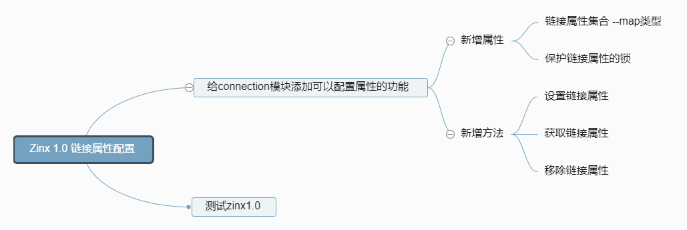

# 连接属性设置
[[TOC]]

## 实验介绍

本节我们将实现 zinx 最终的功能，链接属性配置。



## 准备工作

我们先在命令行中执行如下代码：

```bash
wget https://labfile.oss.aliyuncs.com/courses/1639/src09.zip && unzip src09.zip
export GOPATH=/home/project
```

执行后我们的项目目录如下：


现在当我们在使用链接处理的时候，希望和链接绑定一些用户的数据，或者参数。那么我们现在可以把当前链接设定一些传递参数的接口或者方法。

## 给链接添加链接配置接口

> zinx/ziface/iconnection.go

我们需要在 IConnection 接口中添加三个方法，分别对应我们开篇图片中对应的三个功能：

```go
    //设置链接属性
    SetProperty(key string, value interface{})
    //获取链接属性
    GetProperty(key string)(interface{}, error)
    //移除链接属性
    RemoveProperty(key string)
```

这里增添了 3 个方法`SetProperty()`,`GetProperty()`,`RemoveProperty()`.那么 property 是什么类型的呢，我么接下来看看 Connection 的定义。

## 链接属性方法实现

> zinx/znet/connction.go

这里，我们需要定义 property 的类型，其实是很容易想到的，他应该是一个集合类型，因为链接属性应该是唯一的。同时，我们为了保护链接属性的并发安全性能，还需要对其加上一个锁，所以，修正后的代码如下：

```go
// 这里我们引入了锁操作，所以在 import 部分里我们还需要将 "sync" 引入进来
// 和之前一样，//... 表示剩余代码不需要修改。
type Connection struct {
    //当前Conn属于哪个Server
    TcpServer ziface.IServer
    //当前连接的socket TCP套接字
    Conn *net.TCPConn
    //当前连接的ID 也可以称作为SessionID，ID全局唯一
    ConnID uint32
    //当前连接的关闭状态
    isClosed bool
    //消息管理MsgId和对应处理方法的消息管理模块
    MsgHandler ziface.IMsgHandle
    //告知该链接已经退出/停止的channel
    ExitBuffChan chan bool
    //无缓冲管道，用于读、写两个goroutine之间的消息通信
    msgChan chan []byte
    //有关冲管道，用于读、写两个goroutine之间的消息通信
    msgBuffChan chan []byte
    // ================================
    //链接属性
    property     map[string]interface{}
    //保护链接属性修改的锁
    propertyLock sync.RWMutex
    // ================================
}
//创建连接的方法
func NewConntion(server ziface.IServer, conn *net.TCPConn, connID uint32, msgHandler ziface.IMsgHandle) *Connection {
    //初始化Conn属性
    c := &Connection{
        TcpServer:    server,
        Conn:         conn,
        ConnID:       connID,
        isClosed:     false,
        MsgHandler:   msgHandler,
        ExitBuffChan: make(chan bool, 1),
        msgChan:      make(chan []byte),
        msgBuffChan:  make(chan []byte, utils.GlobalObject.MaxMsgChanLen),
        property:     make(map[string]interface{}), //对链接属性map初始化
    }
    //将新创建的Conn添加到链接管理中
    c.TcpServer.GetConnMgr().Add(c)
    return c
}
// ...
//设置链接属性
func (c *Connection) SetProperty(key string, value interface{}) {
    c.propertyLock.Lock()
    defer c.propertyLock.Unlock()
    c.property[key] = value
}
//获取链接属性
func (c *Connection) GetProperty(key string) (interface{}, error) {
    c.propertyLock.RLock()
    defer c.propertyLock.RUnlock()
    if value, ok := c.property[key]; ok  {
        return value, nil
    } else {
        return nil, errors.New("no property found")
    }
}
//移除链接属性
func (c *Connection) RemoveProperty(key string) {
    c.propertyLock.Lock()
    defer c.propertyLock.Unlock()
    delete(c.property, key)
}
```

## 测试

到这里，我们 zinx 框架的全部功能就完成了。现在我们来测试一下链接属性的设置与提取是否可用:

Server.go:

```go
package main
import (
    "fmt"
    "zinx/ziface"
    "zinx/znet"
)
//ping test 自定义路由
type PingRouter struct {
    znet.BaseRouter
}
//Ping Handle
func (this *PingRouter) Handle(request ziface.IRequest) {
    fmt.Println("Call PingRouter Handle")
    //先读取客户端的数据，再回写ping...ping...ping
    fmt.Println("recv from client : msgId=", request.GetMsgID(), ", data=", string(request.GetData()))
    err := request.GetConnection().SendBuffMsg(0, []byte("ping...ping...ping"))
    if err != nil {
        fmt.Println(err)
    }
}
type HelloZinxRouter struct {
    znet.BaseRouter
}
//HelloZinxRouter Handle
func (this *HelloZinxRouter) Handle(request ziface.IRequest) {
    fmt.Println("Call HelloZinxRouter Handle")
    //先读取客户端的数据，再回写ping...ping...ping
    fmt.Println("recv from client : msgId=", request.GetMsgID(), ", data=", string(request.GetData()))
    err := request.GetConnection().SendBuffMsg(1, []byte("Hello Zinx Router V0.10"))
    if err != nil {
        fmt.Println(err)
    }
}
//创建连接的时候执行
func DoConnectionBegin(conn ziface.IConnection) {
    fmt.Println("DoConnecionBegin is Called ... ")
    //=============设置两个链接属性，在连接创建之后===========
    fmt.Println("Set conn Name, Home done!")
    conn.SetProperty("Name", "Aceld")
    conn.SetProperty("Home", "https://www.lanqiao.cn/courses/1639/")
    //===================================================
    err := conn.SendMsg(2, []byte("DoConnection BEGIN..."))
    if err != nil {
        fmt.Println(err)
    }
}
//连接断开的时候执行
func DoConnectionLost(conn ziface.IConnection) {
    //============在连接销毁之前，查询conn的Name，Home属性=====
    if name, err:= conn.GetProperty("Name"); err == nil {
        fmt.Println("Conn Property Name = ", name)
    }
    if home, err := conn.GetProperty("Home"); err == nil {
        fmt.Println("Conn Property Home = ", home)
    }
    //===================================================
    fmt.Println("DoConneciotnLost is Called ... ")
}
func main() {
    //创建一个server句柄
    s := znet.NewServer()
    //注册链接hook回调函数
    s.SetOnConnStart(DoConnectionBegin)
    s.SetOnConnStop(DoConnectionLost)
    //配置路由
    s.AddRouter(0, &PingRouter{})
    s.AddRouter(1, &HelloZinxRouter{})
    //开启服务
    s.Serve()
}
```

这里主要看`DoConnectionBegin()`和`DoConnectionLost()`两个函数的实现， 利用在两个 Hook 函数中，设置链接属性和提取链接属性。链接创建之后给当前链接绑定两个属性"Name","Home", 那么我们在随时可以通过`conn.GetProperty()`方法得到链接已经设置的属性。

我们的 Client.go 不需要修改。

在两个命令行窗口分别执行服务端和客户端进行测试（一定不要忘了打开新的命令行窗口后要先执行 `export GOPATH=/home/project`）：


当我们终止客户端链接，那么服务端在断开链接之前，已经读取到了 conn 的两个属性 Name 和 Home。说明我们的代码达到了预期效果，可以对链接属性进行控制了。

## 实验总结

好了，以上 Zinx 的框架的核心功能我们已经完成了。希望大家通过这一套框架从 0 到 1 实现的过程中能够有所收获。zinx 框架作为一个服务器框架，我们现在完全实现之后不妨尝试一下使用 zinx 做一些有趣的事情，比如实现一个在线匹配系统，游戏里的世界聊天等等功能。