# ChitCha论坛
[[TOC]]

## 实验介绍

上一个实验展示了一个非常简单的 Go Web 应用，但是因为该应用只是一个 Hello World 程序，所以它实际上并没有什么用处。在本章中，我们将会构建一个简单的网上论坛 Web 应用，这个应用同样非常基础，但是却有用得多：它允许用户登录到论坛里面，然后在论坛上发布新帖子，又或者回复其他用户发表的帖子。

虽然本节介绍的内容无法让你一下子就学会如何编写一个非常成熟的 Web 应用，但这些内容将教会你如何组织和开发一个 Web 应用。在学习完这一节之后，你将进一步地了解到使用 Go 进行 Web 应用开发的相关方法。

如果你觉得本节介绍的内容难度较大，又或者你觉得本节展示的大量代码看起来让人觉得胆战心惊，那也不必过于担心：本节之后的几个实验中将对本节介绍的内容做进一步的解释，在阅读完本章并继续阅读后续章节时，你将会对本节介绍的内容有更加深入的了解。

注：本节只是从宏观的角度展示 Go Web 应用的样子，具体深入技术将在后续详细介绍。

#### 知识点

- 使用 Go 进行 Web 编程的方法
- 设计一个典型的 Go Web 应用
- 编写一个完整的 Go Web 应用
- 了解 Go Web 应用的各个组成部分

## 课程准备

在终端中依次输入以下命令：

```bash
# 下载课程源代码
wget https://labfile.oss.aliyuncs.com/courses/2692/Chapter_2_Go_ChitChat.tar.gz
# 创建存放目标源代码的目录
mkdir -p $GOPATH/src/github.com/sausheong/gwp/
# 解压到指定目录
tar -xzf Chapter_2_Go_ChitChat.tar.gz -C $GOPATH/src/github.com/sausheong/gwp/
# 查看目标文件夹
ls $GOPATH/src/github.com/sausheong/gwp/
```

成功时可以在终端看到如下输出:

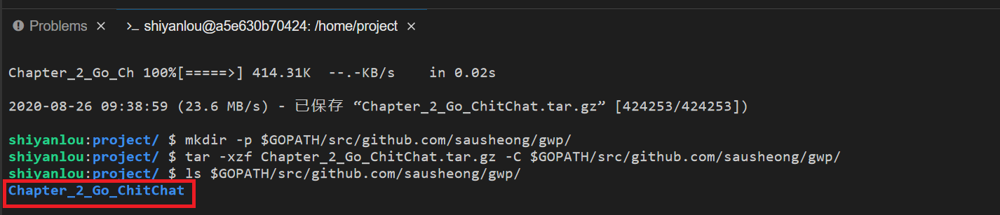

然后我们下载依赖关系包

```bash
# 下载依赖关系包
wget -q https://labfile.oss.aliyuncs.com/courses/2692/pq.tar.gz
# 创建存放依赖包的目录
mkdir -p $GOPATH/src/github.com/lib/
# 解压到指定目录
tar -xzf pq.tar.gz -C $GOPATH/src/github.com/lib/
# 查看目标文件夹
ls $GOPATH/src/github.com/lib
```

这时我们可以在终端看到：

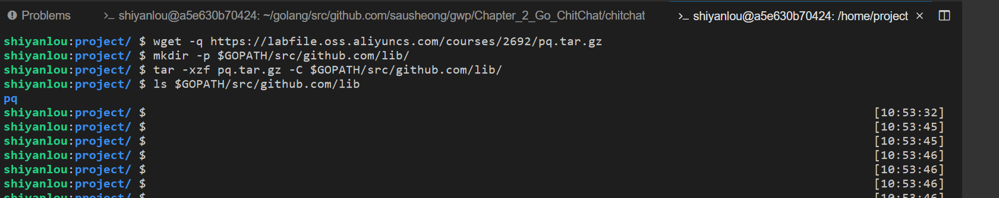

我们现在把 `GO111MODULE` 设为 `auto`。

```bash
go env -w GO111MODULE=auto
```

最后我们需要切换 WebIDE 的工作路径，点击导航栏的 `File`→`Open Workspace...`


将路径切换到 `/`，并按照路径 `/home/shiyanlou/golang/src/github.com/sausheong/gwp/Chapter_2_Go_ChitChat/chitchat` 依此点击文件夹，并点击 `Open`。

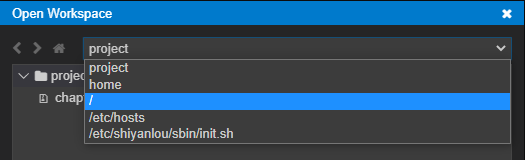

可以看到新的工作目录：

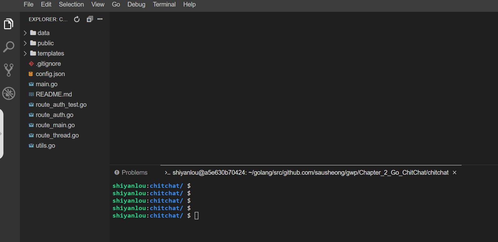

## 应用设计

从本质上来说，网上论坛就相当于一个任何人都可以通过发帖来进行对话的公告板，公告板上面可以包含已注册用户以及未注册的匿名用户。论坛上的对话称为**帖子**（thread），一个帖子通常包含了作者想要讨论的一个主题，而其他用户则可以通过回复这个帖子来参与对话。比较复杂的论坛一般都会按层级进行划分，在这些论坛里面，可能会有多个讨论特定类型主题的子论坛存在。大多数论坛都会由一个或多个拥有特殊权限的用户进行管理，这些拥有特殊权限的用户被称为**版主**（moderator）。

在本节中，我们将会开发一个名为 ChitChat 的简易网上论坛。为了让这个例子保持简单，我们只会为 ChitChat 实现网上论坛的关键特性：在这个论坛里面，用户可以注册账号，并在登录之后发表新帖子又或者回复已有的帖子；未注册用户可以查看帖子，但是无法发表帖子或是回复帖子。现在，让我们首先来思考一下如何设计 ChitChat 这个应用。

正如上一节所说，Web 应用的一般工作流程是客户端向服务器发送请求，然后服务器对客户端进行响应（如下图所示），ChitChat 应用的设计也遵循这一流程。

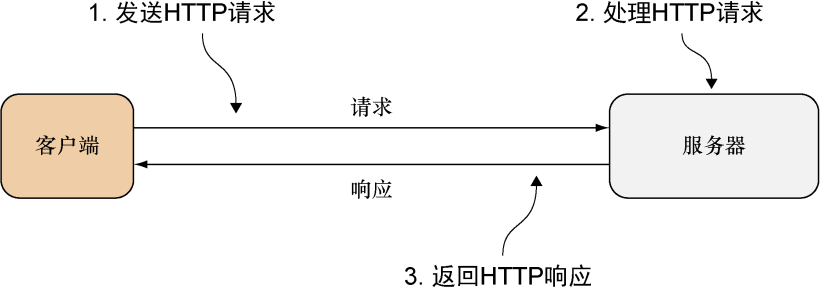

ChitChat 的应用逻辑会被编码到服务器里面。服务器会向客户端提供 HTML 页面，并通过页面的超链接向客户端表明请求的格式以及被请求的数据，而客户端则会在发送请求时向服务器提供相应的数据，如图所示：

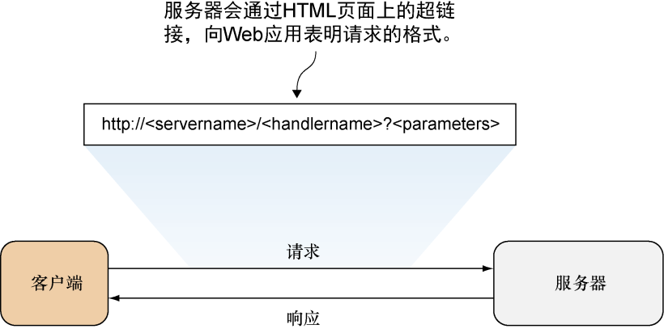

请求的格式通常是由应用自行决定的，比如，ChitChat 的请求使用的是以下格式：`http://<服务器名><处理器名>?<参数>`。

服务器名（server name）是 ChitChat 服务器的名字，而处理器名（handler name）则是被调用的处理器的名字。处理器的名字是按层级进行划分的：位于名字最开头是被调用模块的名字，而之后跟着的则是被调用子模块的名字，以此类推，位于处理器名字最末尾的则是子模块中负责处理请求的处理器。比如，对 `/thread/read` 这个处理器名字来说， `thread` 是被调用的模块，而 `read` 则是这个模块中负责读取帖子内容的处理器。

该应用的参数（parameter）会以 URL 查询的形式传递给处理器，而处理器则会根据这些参数对请求进行处理。比如说，假设客户端要向处理器传递帖子的唯一 ID，那么它可以将 URL 的参数部分设置成 `id=123`，其中 `123` 就是帖子的唯一 ID。

如果 `chitchat` 就是 ChitChat 服务器的名字，那么根据上面介绍的 URL 格式规则，客户端发送给 ChitChat 服务器的 URL 可能会是这样的：`http://chitchat/thread/read?id=123`。

当请求到达服务器时，多路复用器（multiplexer）会对请求进行检查，并将请求重定向至正确的处理器进行处理。处理器在接收到多路复用器转发的请求之后，会从请求中取出相应的信息，并根据这些信息对请求进行处理。在请求处理完毕之后，处理器会将所得的数据传递给模板引擎，而模板引擎则会根据这些数据生成将要返回给客户端的 HTML，整个过程如图所示:

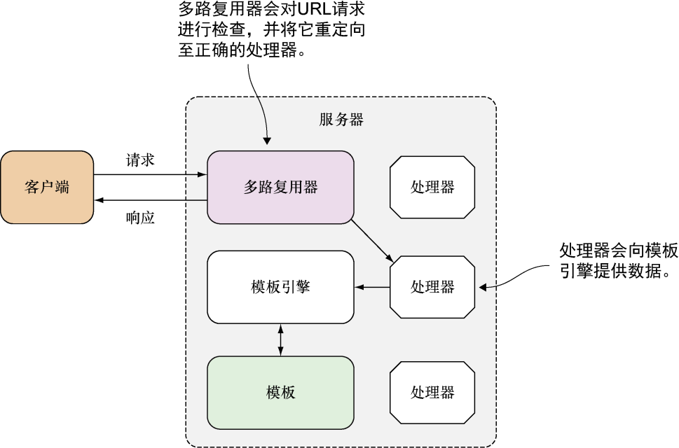

## 数据模型

绝大多数应用都需要以某种方式与数据打交道。对 ChitChat 来说，它的数据将被存储到关系式数据库 PostgreSQL 里面，并通过 SQL 与之交互。

ChitChat 的数据模型非常简单，只包含 4 种数据结构，它们分别是：

- User——表示论坛的用户信息；
- Session——表示论坛用户当前的登录会话；
- Thread——表示论坛里面的帖子，每一个帖子都记录了多个论坛用户之间的对话；
- Post——表示用户在帖子里面添加的回复。

以上这 4 种数据结构都会被映射到关系数据库里面，下图展示了这 4 种数据结构是如何与数据库交互的。

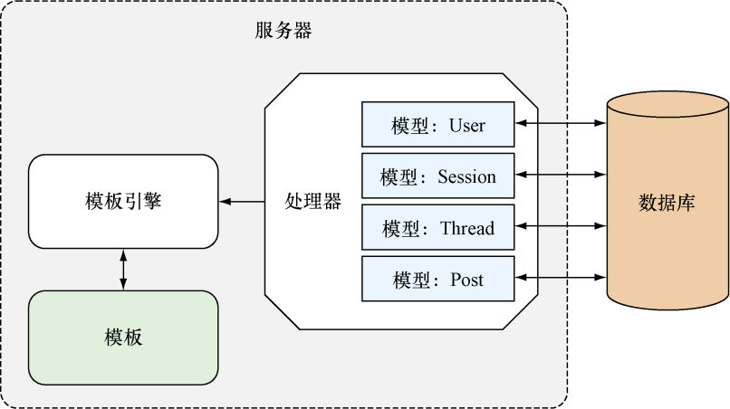

ChitChat 论坛允许用户在登录之后发布新帖子或者回复已有的帖子，未登录的用户可以阅读帖子，但是不能发布新帖子或者回复帖子。为了对应用进行简化，ChitChat 论坛没有设置版主这一职位，因此用户在发布新帖子或者添加新回复的时候不需要经过审核。

## 请求的接收与处理

请求的接收和处理是所有 Web 应用的核心。正如之前所说，Web 应用的工作流程如下。

1. 客户端将请求发送到服务器的一个 URL 上；
2. 服务器的多路复用器将接收到的请求重定向到正确的处理器，然后由该处理器对请求进行处理；
3. 处理器处理请求并执行必要的动作；
4. 处理器调用模板引擎，生成相应的 HTML 并将其返回给客户端。

让我们先从最基本的根 URL（/）来考虑 Web 应用是如何处理请求的：当我们在浏览器上输入地址 `http://localhost` 的时候，浏览器访问的就是应用的根 URL。在接下来的几个小节里面，我们将会看到 ChitChat 是如何处理发送至根 URL 的请求的，以及它又是如何通过动态地生成 HTML 来对请求进行响应的。

### 多路复用器

因为编译后的二进制 Go 应用总是以 `main` 函数作为执行的起点，所以我们在对 Go 应用进行介绍的时候也总是从包含 `main` 函数的主源码文件（main source code file）开始。ChitChat 应用的主源码文件为 `main.go`，如下代码清单展示了它的一个简化版本（main.go 文件中的 main 函数，函数中的代码经过简化）。

```go
package main

import (
  "net/http"
)

func main() {
  mux := http.NewServeMux()
  files := http.FileServer(http.Dir("/public"))
  mux.Handle("/static/", http.StripPrefix("/static/", files))

  mux.HandleFunc("/", index)

  server := &http.Server{
    Addr: "0.0.0.0:8080",
    Handler: mux,
  }
  server.ListenAndServe()
}
```

`main.go` 中首先创建了一个多路复用器，然后通过一些代码将接收到的请求重定向到处理器。`net/http` 标准库提供了一个默认的多路复用器，这个多路复用器可以通过调用 `NewServeMux` 函数来创建：

```go
mux := http.NewServeMux()
```

为了将发送至根 URL 的请求重定向到处理器，程序使用了 `HandleFunc` 函数：

```go
mux.HandleFunc("/", index)
```

`HandleFunc` 函数接受一个 URL 和一个处理器的名字作为参数，并将针对给定 URL 的请求转发至指定的处理器进行处理，因此对上述调用来说，当有针对根 URL 的请求到达时，该请求就会被重定向到名为 `index` 的处理器函数。此外，因为所有处理器都接受一个 `ResponseWriter` 和一个指向 `Request` 结构的指针作为参数，并且所有请求参数都可以通过访问 `Request` 结构得到，所以程序并不需要向处理器显式地传入任何请求参数。

### 服务静态文件

除负责将请求重定向到相应的处理器之外，多路复用器还需要为静态文件提供服务。为了做到这一点，程序使用 `FileServer` 函数创建了一个能够为指定目录中的静态文件服务的处理器，并将这个处理器传递给了多路复用器的 `Handle` 函数。除此之外，程序还使用 `StripPrefix` 函数去移除请求 URL 中的指定前缀：

```go
files := http.FileServer(http.Dir("/public"))
mux.Handle("/static/", http.StripPrefix("/static/", files))
```

当服务器接收到一个以 `/static/` 开头的 URL 请求时，以上两行代码会移除 URL 中的 `/static/` 字符串，然后在 `public` 目录中查找被请求的文件。比如说，当服务器接收到一个针对文件 `http://localhost/static/css/bootstrap.min.css` 的请求时，它将会在 `public` 目录中查找以下文件：

```bash
<application root>/css/bootstrap.min.css
```

当服务器成功地找到这个文件之后，会把它返回给客户端。

### 创建处理器函数

正如之前的小节所说，ChitChat 应用会通过 `HandleFunc` 函数把请求重定向到处理器函数。如下代码所示，处理器函数实际上就是一个接受 `ResponseWriter` 和 `Request` 指针作为参数的 Go 函数：

```go
func index(w http.ResponseWriter, r *http.Request) {
  files := []string{"templates/layout.html",
                    "templates/navbar.html",
                    "templates/index.html",}
  templates := template.Must(template.ParseFiles(files...))
  if threads, err := data.Threads(); err == nil {
    templates.ExecuteTemplate(w, "layout", threads)
  }
}
```

`index` 函数负责生成 HTML 并将其写入 `ResponseWriter` 中。因为这个处理器函数会用到 `html/template` 标准库中的 `Template` 结构，所以包含这个函数的文件需要在文件的开头导入 `html/template` 库。之后的小节将对生成 HTML 的方法做进一步的介绍。

除了前面提到过的负责处理根 URL 请求的 `index` 处理器函数，`main.go` 文件实际上还包含很多其他的处理器函数，如下代码所示:

```go
// ChitChat 应用的 main.go 源文件
package main

import (
  "net/http"
)

func main() {

  mux := http.NewServeMux()
  files := http.FileServer(http.Dir(config.Static))
  mux.Handle("/static/", http.StripPrefix("/static/", files))

  mux.HandleFunc("/", index)
  mux.HandleFunc("/err", err)

    // defined in route_auth.go
  mux.HandleFunc("/login", login)
  mux.HandleFunc("/logout", logout)
  mux.HandleFunc("/signup", signup)
  mux.HandleFunc("/signup_account", signupAccount)
  mux.HandleFunc("/authenticate", authenticate)

    // defined in route_thread.go
  mux.HandleFunc("/thread/new", newThread)
  mux.HandleFunc("/thread/create", createThread)
  mux.HandleFunc("/thread/post", postThread)
  mux.HandleFunc("/thread/read", readThread)

    // starting up the server
  server := &http.Server{
    Addr:　　　　　 "0.0.0.0:8080",
    Handler:　　　　mux,
  }
  server.ListenAndServe()
}
```

`main` 函数中使用的这些处理器函数并没有在 `main.go` 文件中定义，它们的定义在其他文件里面，具体请参考 ChitChat 项目的完整源码。

为了在一个文件里面引用另一个文件中定义的函数，诸如 PHP、Ruby 和 Python 这样的语言要求用户编写代码去包含（include）被引用函数所在的文件，而另一些语言则要求用户在编译程序时使用特殊的链接（link）命令。

但是对 Go 语言来说，用户只需要把位于相同目录下的所有文件都设置成同一个包，那么这些文件就会与包中的其他文件分享彼此的定义。又或者，用户也可以把文件放到其他独立的包里面，然后通过导入（import）这些包来使用它们。比如，ChitChat 论坛就把连接数据库的代码放到了独立的包里面，我们很快就会看到这一点。

### 使用 cookie 进行访问控制

跟其他很多 Web 应用一样，ChitChat 既拥有任何人都可以访问的公开页面，也拥有用户在登录账号之后才能看见的私人页面。

当一个用户成功登录以后，服务器必须在后续的请求中标示出这是一个已登录的用户。为了做到这一点，服务器会在响应的首部中写入一个 cookie，而客户端在接收这个 cookie 之后则会把它存储到浏览器里面。以下代码展示了 `authenticate` 处理器函数的实现代码，这个函数定义在 `route_auth.go` 文件中，它的作用就是对用户的身份进行验证，并在验证成功之后向客户端返回一个 cookie。

```go
// route_auth.go 文件中的 authenticate 处理器函数
// Authenticate the user given the email and password
func authenticate(w http.ResponseWriter, r *http.Request) {
  r.ParseForm()
  user, _ := data.UserByEmail(r.PostFormValue("email"))
  if user.Password == data.Encrypt(r.PostFormValue("password")) {
    session := user.CreateSession()
    cookie := http.Cookie{
      Name: "_cookie",
      Value: session.Uuid,
      HttpOnly: true,
    }
    http.SetCookie(w, &cookie)
    http.Redirect(w, r, "/", 302)
  } else {
    http.Redirect(w, r, "/login", 302)
  }
}
```

注意，上述代码中的 `authenticate` 函数使用了两个我们尚未介绍过的函数，一个是 `data.Encrypt`，而另一个则是 `data.UserbyEmail`。因为本节关注的是 ChitChat 论坛的访问控制机制而不是数据处理方法，所以本节将不会对这两个函数的实现细节进行解释，但这两个函数的名字已经很好地说明了它们各自的作用：

- `data.UserByEmail` 函数通过给定的电子邮件地址获取与之对应的 `User` 结构;
- `data.Encrypt` 函数则用于加密给定的字符串。

稍后将会对 `data` 包作更详细的介绍，但是在此之前，让我们回到对访问控制机制的讨论上来。

在验证用户身份的时候，程序必须先确保用户是真实存在的，并且提交给处理器的密码在加密之后跟存储在数据库里面的已加密用户密码完全一致。在核实了用户的身份之后，程序会使用 `User` 结构的 `CreateSession` 方法创建一个 `Session` 结构，该结构的定义如下：

```go
type Session struct {
  Id　　　　int
  Uuid　　　string
  Email　　 string
  UserId　　int
  CreatedAt time.Time
}
```

`Session` 结构中的 `Email` 字段用于存储用户的电子邮件地址，而 `UserId` 字段则用于记录用户表中存储用户信息的行的 ID。`Uuid` 字段存储的是一个随机生成的唯一 ID，这个 ID 是实现会话机制的核心，服务器会通过 cookie 把这个 ID 存储到浏览器里面，并把 `Session` 结构中记录的各项信息存储到数据库中。

在创建了 `Session` 结构之后，程序又创建了 `Cookie` 结构：

```go
cookie := http.Cookie{
  Name:　　　"_cookie",
  Value:　　 session.Uuid,
  HttpOnly:　true,
}
```

cookie 的名字是随意设置的，而 cookie 的值则是将要被存储到浏览器里面的唯一 ID。因为程序没有给 cookie 设置过期时间，所以这个 cookie 就成了一个会话 cookie，它将在浏览器关闭时自动被移除。此外，程序将 `HttpOnly` 字段的值设置成了 `true`，这意味着这个 cookie 只能通过 HTTP 或者 HTTPS 访问，但是却无法通过 JavaScript 等非 HTTP API 进行访问。

在设置好 cookie 之后，程序使用以下这行代码，将它添加到了响应的首部里面：

```go
http.SetCookie(writer, &cookie)
```

在将 cookie 存储到浏览器里面之后，程序接下来要做的就是在处理器函数里面检查当前访问的用户是否已经登录。为此，我们需要创建一个名为 `session` 的工具（utility）函数，并在各个处理器函数里面复用它。以下代码展示了 `util.go` 文件里的 `session` 函数的实现代码。再提醒一下，虽然程序把工具函数的定义都放在了 `util.go` 文件里面，但是因为 `util.go` 文件也隶属于 `main` 包，所以这个文件里面定义的所有工具函数都可以直接在整个 `main` 包里面调用，而不必像 `data.Encrypt` 函数那样需要先引入包然后再调用。

```go
// util.go 文件中的 session 工具函数
func session(w http.ResponseWriter, r *http.Request)(sess data.Session, err error){
  cookie, err := r.Cookie("_cookie") // 从请求中取出 cookie
  if err == nil {
    sess = data.Session{Uuid: cookie.Value}
    if ok, _ := sess.Check(); !ok {
        err = errors.New("Invalid session")
    }
  }
  return
}
```

为了从请求中取出 cookie，session 函数使用了以下代码：

```go
cookie, err := r.Cookie("_cookie")
```

如果 cookie 不存在，那么很明显用户并未登录；相反，如果 cookie 存在，那么 `session` 函数将继续进行第二项检查——访问数据库并核实会话的唯一 ID 是否存在。第二项检查是通过 `data.Session` 函数完成的，这个函数会从 cookie 中取出会话并调用后者的 `Check` 方法：

```go
sess = data.Session{Uuid: cookie.Value}
if ok, _ := sess.Check(); !ok {
  err = errors.New("Invalid session")
}
```

在拥有了检查和识别已登录用户和未登录用户的能力之后，让我们来回顾一下之前展示的 index 处理器函数。

```go
// index 处理器函数
func index(w http.ResponseWriter, r *http.Request) {
  threads, err := data.Threads(); if err == nil {
    _, err := session(w, r) // 使用 session 函数
    public_tmpl_files := []string{"templates/layout.html",
                                "templates/public.navbar.html",
                                "templates/index.html"}
    private_tmpl_files := []string{"templates/layout.html",
                                "templates/private.navbar.html",
                                "templates/index.html"}
    var templates *template.Template
    if err != nil {
      templates = template.Must(template.ParseFiles(public_tmpl_files...))
    } else {
      templates = template.Must(template.ParseFiles(private_tmpl_files...))
    }
    templates.ExecuteTemplate(w, "layout", threads)
  }
}
```

通过调用 `session` 函数可以取得一个存储了用户信息的 `Session` 结构，不过因为 `index` 函数目前并不需要这些信息，所以它使用空白标识符（blank identifier）（_）忽略了这一结构。`index` 函数真正感兴趣的是 `err` 变量，程序会根据这个变量的值来判断用户是否已经登录，然后以此来选择是使用 `public` 导航条还是使用 `private` 导航条。

好的，关于 ChitChat 应用处理请求的方法就介绍到这里了。接下来会继续讨论如何为客户端生成 HTML，并完整地叙述之前没有说完的部分。

## 使用模板生成 HTML 响应

`index` 处理器函数里面的大部分代码都是用来为客户端生成 HTML 的。首先，函数把每个需要用到的模板文件都放到了 Go 切片里面（这里展示的是私有页面的模板文件，公开页面的模板文件也是以同样方式进行组织的）：

```go
private_tmpl_files := []string{"templates/layout.html",
                              "templates/private.navbar.html",
                              "templates/index.html"}
```

跟 Mustache 和 CTemplate 等其他模板引擎一样，切片指定的这 3 个 HTML 文件都包含了特定的嵌入命令，这些命令被称为动作（action），动作在 HTML 文件里面会被 
```
{{
``` 
符号和 
```
}}
``` 
符号包围。

接着，程序会调用 `ParseFiles` 函数对这些模板文件进行语法分析，并创建出相应的模板。为了捕捉语法分析过程中可能会产生的错误，程序使用了 `Must` 函数去包围 `ParseFiles` 函数的执行结果，这样当 `ParseFiles` 返回错误的时候，`Must` 函数就会向用户返回相应的错误报告：

```go
templates := template.Must(template.ParseFiles(private_tmpl_files...))
```

好的，关于模板文件的介绍已经足够多了，现在是时候来看看它们的庐山真面目了。

ChitChat 论坛的每个模板文件都定义了一个模板，这种做法并不是强制的，用户也可以在一个模板文件里面定义多个模板，但模板文件和模板一一对应的做法可以给开发带来方便，我们在之后就会看到这一点。以下代码展示了 layout.html 模板文件的源代码，源代码中使用了 `define` 动作，这个动作通过文件开头的 
```
{{ define "layout" }}
```
和文件末尾的 
```
{{ end }}
```
 ，把被包围的文本块定义成了 layout 模板的一部分。

```html
<!--layout.html 模板文件-->
{{ define "layout" }}

<!DOCTYPE html>
<html lang="en">
  <head>
    <meta charset="utf-8" />
    <meta http-equiv="X-UA-Compatible" content="IE=9" />
    <meta name="viewport" content="width=device-width, initial-scale=1" />
    <title>ChitChat</title>
    <link href="/static/css/bootstrap.min.css" rel="stylesheet" />
    <link href="/static/css/font-awesome.min.css" rel="stylesheet" />
  </head>
  <body>
    {{ template "navbar" . }}

    <div class="container">{{ template "content" . }}</div>
    <!-- /container -->

    <script src="/static/js/jquery-2.1.1.min.js"></script>
    <script src="/static/js/bootstrap.min.js"></script>
  </body>
</html>

{{ end }}
```

除了 `define` 动作之外，layout.html 模板文件里面还包含了两个用于引用其他模板文件的 `template` 动作。跟在被引用模板名字之后的点（`.`）代表了传递给被引用模板的数据，比如 
```
{{ template "navbar" . }}
``` 
语句除了会在语句出现的位置引入 navbar 模板之外，还会将传递给 `layout` 模板的数据传递给 `navbar` 模板。

以下代码展示了 public.navbar.html 模板文件中的 `navbar` 模板，除了定义模板自身的 `define` 动作之外，这个模板没有包含其他动作（严格来说，模板也可以不包含任何动作）。

```html
<!--public.navbar.html 模板文件-->
{{ define "navbar" }}

<div class="navbar navbar-default navbar-static-top" role="navigation">
  <div class="container">
    <div class="navbar-header">
      <button
        type="button"
        class="navbar-toggle collapsed"
        　　　
        data-toggle="collapse"
        data-target=".navbar-collapse"
      >
        <span class="sr-only">Toggle navigation</span>
        <span class="icon-bar"></span>
        <span class="icon-bar"></span>
        <span class="icon-bar"></span>
      </button>
      <a class="navbar-brand" href="/">
        <i class="fa fa-comments-o"></i>
        ChitChat
      </a>
    </div>
    <div class="navbar-collapse collapse">
      <ul class="nav navbar-nav">
        <li><a href="/">Home</a></li>
      </ul>
      <ul class="nav navbar-nav navbar-right">
        <li><a href="/login">Login</a></li>
      </ul>
    </div>
  </div>
</div>

{{ end }}
```

最后，让我们来看看定义在 index.html 模板文件中的 `content` 模板。注意，尽管之前展示的两个模板都与模板文件拥有相同的名字，但实际上模板和模板文件分别拥有不同的名字也是可行的。

```html
<!--index.html 模板文件-->
{{ define "content" }}

<p class="lead"><a href="/thread/new">Start a thread</a> or join one below!</p>

{{ range . }}
<div class="panel panel-default">
  <div class="panel-heading">
    <span class="lead"> <i class="fa fa-comment-o"></i> {{ .Topic }}</span>
  </div>
  <div class="panel-body">
    Started by {{ .User.Name }} - {{ .CreatedAtDate }} - {{ .NumReplies }}
    　posts.
    <div class="pull-right">
      <a href="/thread/read?id={{.Uuid }}">Read more</a>
    </div>
  </div>
</div>
{{ end }} {{ end }}
```

index.html 文件里面的代码非常有趣，特别值得一提的是文件里面包含了几个以点号（`.`）开头的动作，比如 
```
{{ .User.Name }}
``` 
和 
```
{{ .CreatedAtDate }}
```
，这些动作的作用和之前展示过的 index 处理器函数有关：

```go
threads, err := data.Threads(); if err == nil {
  templates.ExecuteTemplate(writer, "layout", threads) }
```

在以下这行代码中：

```go
templates.ExecuteTemplate(writer, "layout", threads)
```

程序通过调用 `ExecuteTemplate` 函数，执行已经经过语法分析的 `layout` 模板。执行模板意味着把模板文件中的内容和来自其他渠道的数据进行合并，然后生成最终的 HTML 内容，具体过程如图所示：

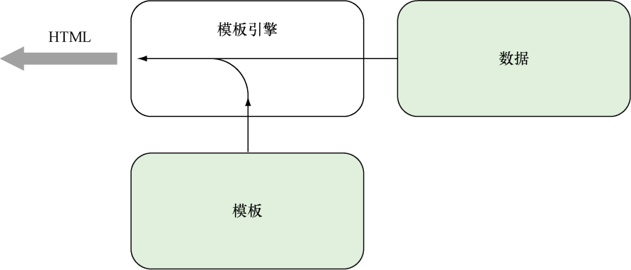

程序之所以对 `layout` 模板而不是 `navbar` 模板或者 `content` 模板进行处理，是因为 `layout` 模板已经引用了其他两个模板，所以执行 `layout` 模板就会导致其他两个模板也被执行，由此产生出预期的 HTML。但是，如果程序只执行 `navbar` 模板或者 `content` 模板，那么程序最终只会产生出预期的 HTML 的一部分。

现在，你应该已经明白了，点号（`.`）代表的就是传入到模板里面的数据（实际上还不仅如此，接下来的小节会对这方面做进一步的说明）。下图展示了程序根据模板生成的 ChitChat 论坛的样子。

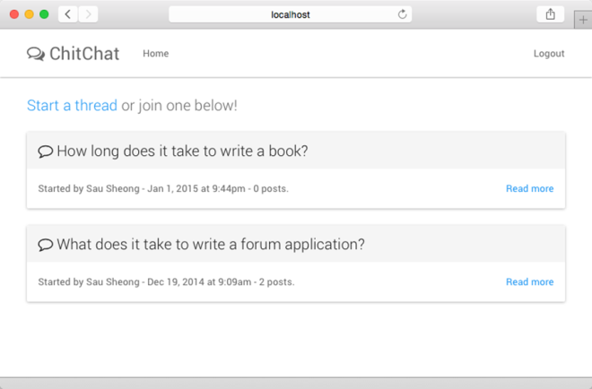

### 整理代码

因为生成 HTML 的代码会被重复执行很多次，所以我们决定对这些代码进行一些整理，并将它们移到 `generateHTML` 函数里面。

```go
// generateHTML 函数
func generateHTML(w http.ResponseWriter, data interface{}, fn ...string) {
  var files []string
  for _, file := range fn {
    files = append(files, fmt.Sprintf("templates/%s.html", file))
  }
  templates := template.Must(template.ParseFiles(files...))
  templates.ExecuteTemplate(writer, "layout", data)
}
```

`generateHTML` 函数接受一个 `ResponseWriter`、一些数据以及一系列模板文件作为参数，然后对给定的模板文件进行语法分析。data 参数的类型为空接口类型（empty interface type），这意味着该参数可以接受任何类型的值作为输入。刚开始接触 Go 语言的人可能会觉得奇怪——Go 不是静态编程语言吗，它为什么能够使用没有类型限制的参数？

但实际上，Go 程序可以通过接口（interface）机制，巧妙地绕过静态编程语言的限制，并借此获得接受多种不同类型输入的能力。Go 语言中的接口由一系列方法构成，并且每个接口就是一种类型。一个空接口就是一个空集合，这意味着任何类型都可以成为一个空接口，也就是说任何类型的值都可以传递给函数作为参数。

`generateHTML` 函数的最后一个参数以 3 个点（`...`）开头，它表示 `generateHTML` 函数是一个可变参数函数（variadic function），这意味着这个函数可以在最后的可变参数中接受零个或任意多个值作为参数。`generateHTML` 函数对可变参数的支持使我们可以同时将任意多个模板文件传递给该函数。在 Go 语言里面，可变参数必须是可变参数函数的最后一个参数。

在实现了 `generateHTML` 函数之后，让我们回过头来，继续对 index 处理器函数进行整理。以下代码展示了经过整理之后的 index 处理器函数，现在它看上去更整洁了。

```go
func index(writer http.ResponseWriter, request *http.Request) {
  threads, err := data.Threads(); if err == nil {
    _, err := session(writer, request)
    if err != nil {
      generateHTML(writer, threads, "layout", "public.navbar", "index")
    } else {
    generateHTML(writer, threads, "layout", "private.navbar", "index")
    }
  }
}
```

在这一节中，我们学习了很多关于模板的基础知识，之后将对模板做更详细的介绍。但是在此之前，让我们先来了解一下 ChitChat 应用使用的数据源（data source），并借此了解一下 ChitChat 应用的数据是如何与模板一同生成最终的 HTML 的。

## 数据库

[www.postgresql.org/download](http://www.postgresql.org/download) 为各种不同版本的 Linux 和 FreeBSD 都提供了预编译的二进制安装包，用户只需要下载其中一个安装包，然后根据指示进行安装就可以了。比如说，可以通过执行以下命令安装 Postgres：

```bash
sudo apt-get update
sudo apt-get install postgresql postgresql-contrib
```

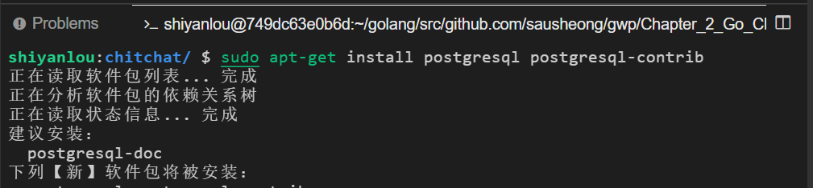

这条命令除了会安装 postgres 包之外，还会安装附加的工具包，并在安装完毕之后启动 PostgreSQL 数据库系统。

在默认情况下，Postgres 会创建一个名为 postgres 的用户，并将其用于连接服务器。为了操作方便，你也可以使用自己的名字创建一个 Postgres 账号。要做到这一点，首先需要登入 Postgres 账号：

```bash
sudo su postgres
```

启动数据库服务：

```bash
service postgresql start
```

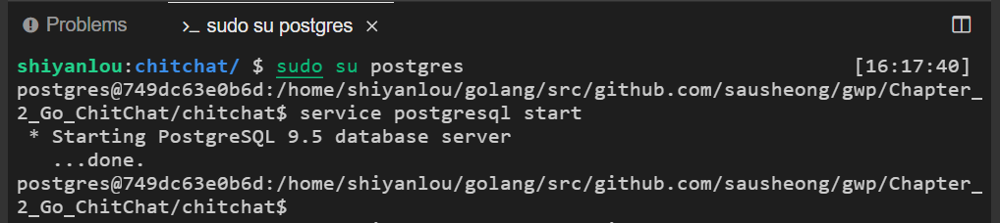

接着使用 createuser 命令创建一个 PostgreSQL 账号：

```bash
createuser –interactive
```

最后，还需要使用 createdb 命令创建以你的账号名字命名的数据库，这里我们使用 `shiyanlou` 来作为我们的名字：

```bash
createdb shiyanlou
```

### 连接数据库

本节前面在展示 ChitChat 应用的设计方案时，曾经提到过 ChitChat 应用包含了 4 种数据结构。虽然把这 4 种数据结构放到主源码文件里面也是可以的，但更好的办法是把所有与数据相关的代码都放到另一个包里面——ChitChat 应用的 `data` 包也因此应运而生。

为了创建 `data` 包，我们首先需要创建一个名为 `data` 的子目录，并创建一个用于保存所有帖子相关代码的 thread.go 文件（在之后的小节里面，我们还会创建一个用于保存所有用户相关代码的 user.go 文件）。在此之后，每当程序需要用到 `data` 包的时候（比如处理器需要访问数据库的时候），程序都需要通过 `import` 语句导入这个包：

```go
import (
  "github.com/sausheong/gwp/Chapter_2_Go_ChitChat/chitchat/data"
)
```

下面代码展示了定义在 thread.go 文件里面的 `Thread` 结构，这个结构存储了与帖子有关的各种信息：

```go
// thread.go 文件中的 Thread 结构
package data

import(
  "time"
)
type Thread struct {
  Id　　　　int
  Uuid　　　string
  Topic　　 string
  UserId　　int
  CreatedAt time.Time
}
```

正如上述代码中第二行代码所示，文件的包名现在是 `data` 而不再是 `main` 了，这个包就是前面小节中我们曾经见到过的 `data` 包。`data` 包除了包含与数据库交互的结构和代码，还包含了一些与数据处理密切相关的函数。隶属于其他包的程序在引用 `data` 包中定义的函数、结构或者其他东西时，必须在被引用元素的名字前面显式地加上 `data` 这个包名。比如说，引用 `Thread` 结构就需要使用 `data.Thread` 这个名字，而不能仅仅使用 `Thread` 这个名字。

`Thread` 结构应该与创建关系数据库表 threads 时使用的数据定义语言（Data Definition Language，DDL）保持一致。因为 `threads` 表目前尚未存在，所以我们必须创建这个表以及容纳该表的数据库。创建 `chitchat` 数据库的工作可以通过执行以下命令来完成：

```bash
createdb chitchat
```

在创建数据库之后，我们就可以通过下列代码展示的 `setup.sql` 文件为 ChitChat 论坛创建相应的数据库表了，我们打开 date 目录就可以看到 `setup.sql`文件。

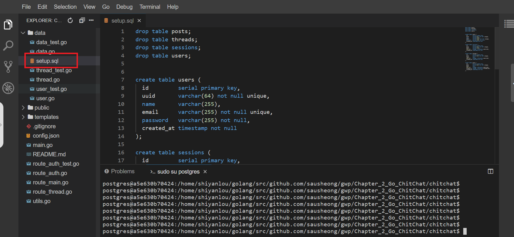

```sql
/*用于在 PostgreSQL 里面创建数据库表的 setup.sql 文件*/
create table users (
  id　　　　 serial primary key,
  uuid　　　 varchar(64) not null unique,
  name　　　 varchar(255),
  email　　　varchar(255) not null unique,
  password　 varchar(255) not null,
  created_at timestamp not null
);

create table sessions (
  id　　　　 serial primary key,
  uuid　　　 varchar(64) not null unique,
  email　　　varchar(255),
  user_id　　integer references users(id),
  created_at timestamp not null
);

create table threads (
  id　　　　 serial primary key,
  uuid　　　 varchar(64) not null unique,
  topic　　　text,
  user_id　　integer references users(id),
  created_at timestamp not null
);

create table posts (
  id　　　　 serial primary key,
  uuid　　　 varchar(64) not null unique,
  body　　　 text,
  user_id　　integer references users(id),
  thread_id　integer references threads(id),
  created_at timestamp not null
);
```

运行这个脚本需要用到 psql 工具，正如上一节所说，这个工具通常会随着 PostgreSQL 一同安装，所以你只需要在终端里面执行以下命令就可以了：

```bash
# 切换到data目录下
cd data
# 执行sql命令
psql -U postgres -d chitchat -f ./setup.sql
```

可以看到如下显示：

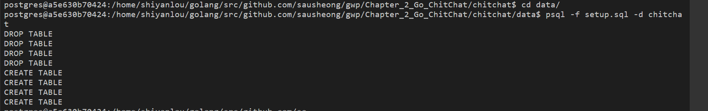

如果一切正常，那么以上命令将在 `chitchat` 数据库中创建出相应的表。在拥有了表之后，程序就必须考虑如何与数据库进行连接以及如何对表进行操作了。为此，程序创建了一个名为 `Db` 的全局变量，这个全局变量是一个指针，指向的是代表数据库连接池的 `sql.DB`，而后续的代码则会使用这个 `Db` 变量来执行数据库查询操作。以下代码展示了 `Db` 变量在 data.go 文件中的定义，此外还展示了一个用于在 Web 应用启动时对 `Db` 变量进行初始化的 `init` 函数。

```go
// data.go文件中的 Db 全局变量以及 init 函数
Var Db *sql.DB

func init() {
  var err error
  Db, err = sql.Open("postgres", "dbname=chitchat sslmode=disable")
  if err != nil {
    log.Fatal(err)
  }
  return
}
```

现在程序已经拥有了结构、表以及一个指向数据库连接池的指针，接下来要考虑的是如何连接（connect）Thread 结构和 threads 表。幸运的是，要做到这一点并不困难：跟 ChitChat 应用的其他部分一样，我们只需要创建能够在结构和数据库之间互动的函数就可以了。例如，为了从数据库里面取出所有帖子并将其返回给 `index` 处理器函数，我们可以使用 thread.go 文件中定义的 `Threads` 函数，以下代码给出了这个函数的定义：

```go
// thread.go 文件中定义的 Threads 函数
func Threads() (threads []Thread, err error){
  rows, err := Db.Query("SELECT id, uuid, topic, user_id, created_at FROM
  threads ORDER BY created_at DESC")
  if err != nil {
    return
  }
  for rows.Next() {
    th := Thread{}
    if err = rows.Scan(&th.Id, &th.Uuid, &th.Topic, &th.UserId,
      &th.CreatedAt); err != nil {
      return
    }
    threads = append(threads, th)
  }
  rows.Close()
  return
}
```

简单来讲，`Threads` 函数执行了以下工作：

1. 通过数据库连接池与数据库进行连接；
2. 向数据库发送一个 SQL 查询，这个查询将返回一个或多个行作为结果；
3. 遍历行，为每个行分别创建一个 `Thread` 结构，首先使用这个结构去存储行中记录的帖子数据，然后将存储了帖子数据的 `Thread` 结构追加到传入的 `threads` 切片里面；
4. 重复执行步骤 3，直到查询返回的所有行都被遍历完毕为止。

关于数据库操作的细节将在后续做进一步的介绍。

在了解了如何将数据库表存储的帖子数据提取到 `Thread` 结构里面之后，我们接下来要考虑的就是如何在模板里面展示 `Thread` 结构存储的数据了。在以下代码展示的 index.html 模板文件，有这样一段代码：

```html
{{ range . }}
<div class="panel panel-default">
  <div class="panel-heading">
    <span class="lead"> <i class="fa fa-comment-o"></i> {{ .Topic }}</span>
  </div>
  <div class="panel-body">
    Started by {{ .User.Name }} - {{ .CreatedAtDate }} - {{ .NumReplies }}
    　posts.
    <div class="pull-right">
      <a href="/thread/read?id={{.Uuid }}">Read more</a>
    </div>
  </div>
</div>
{{ end }}
```

正如之前所说，模板动作中的点号（`.`）代表传入模板的数据，它们会和模板一起生成最终的结果，而 
```
{{ range . }}
``` 
中的 `.` 号代表的是程序在稍早之前通过 `Threads` 函数取得的 `threads` 变量，也就是一个由 `Thread` 结构组成的切片。

`range` 动作假设传入的数据要么是一个由结构组成的切片，要么是一个由结构组成的数组，这个动作会遍历传入的每个结构，而用户则可以通过字段名访问结构里面的字段，比如，动作 
```
{{ .Topic }}
```
 访问的是 `Thread` 结构的 `Topic` 字段。注意，在访问字段时必须在字段名的前面加上点号，并且字段名的首字母必须大写。

用户除可以在字段名的前面加上点号来访问结构中的字段以外，还可以通过相同的方法调用一种名为方法（method）的特殊函数。比如，在上面展示的代码中，
```
{{ .User.Name }}
```
、
```
{{ .CreatedAtDate }}
``` 
和 
```
{{ .NumReplies }}
```
这些动作的作用就是调用结构中的同名方法，而不是访问结构中的字段。

方法是隶属于特定类型的函数，指针、接口以及包括结构在内的所有具名类型都可以拥有自己的方法。比如说，通过将函数与指向 `Thread` 结构的指针进行绑定，可以创建出一个针对 `Thread` 结构的方法，而传入方法里面的 `Thread` 结构则称为接收者（receiver）：方法可以访问接收者，也可以修改接收者。

```go
// thread.go 文件中的 NumReplies 方法
func (thread *Thread) NumReplies() (count int) {
  rows, err := Db.Query("SELECT count(*) FROM posts where thread_id = $1",
    thread.Id)
  if err != nil {
    return
  }
  for rows.Next() {
    if err = rows.Scan(&count); err != nil {
      return
    }
  }
  rows.Close()
  return
}
```

`NumReplies` 方法首先打开一个指向数据库的连接，接着通过执行一条 SQL 查询来取得帖子的数量，并使用传入方法里面的 `count` 参数来记录这个值。最后，`NumReplies` 方法返回帖子的数量作为方法的执行结果，而模板引擎则使用这个值去代替模板文件中出现的 
```
{{ .NumReplies }}
``` 
动作。

通过为 `User`、`Session`、`Thread` 和 `Post` 这 4 种数据结构创建相应的函数和方法，ChitChat 最终在处理器函数和数据库之间构建起了一个数据层，以此来避免处理器函数直接对数据库进行访问，图 2-8 展示了这个数据层和数据库以及处理器函数之间的关系。虽然有很多库都可以达到同样的效果，但亲自构建数据层能够帮助我们学习如何对数据库进行基本的访问，并借此了解到实现这种访问并不困难，只需要用到一些简单直接的代码，这一点是非常有益的。

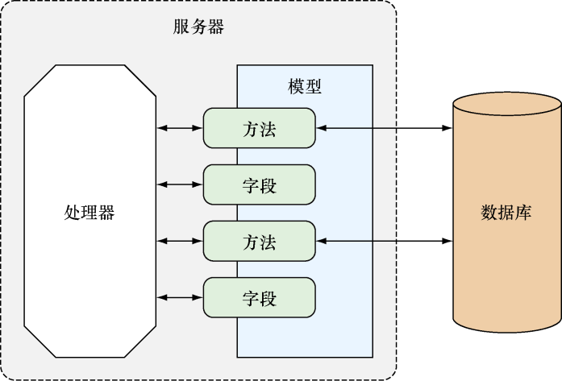

## 启动服务器

最后，让我们来看一下 ChitChat 应用是如何启动服务器并将多路复用器与服务器进行绑定的。执行这一工作的代码是在 main.go 文件里面定义的：

```go
server := &http.Server{
  Addr:　　 "0.0.0.0:8080",
  Handler:　mux,
}
server.ListenAndServe()
```

这段代码非常简单，它所做的就是创建一个 `Server` 结构，然后在这个结构上调用 `ListenAndServe` 方法，这样服务器就能够启动了。

现在，我们可以通过执行以下命令来编译并运行 ChitChat 应用：

```bash
# 退出 postgres 用户
exit
# 构建 Chitchat
go build
```

会出现以下显示：

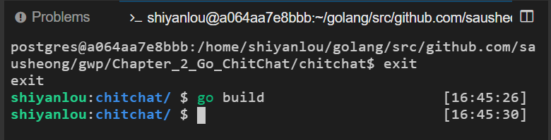

这个命令会在当前目录以及$GOPATH/bin 目录中创建一个名为 chitchat 的二进制可执行文件，它就是 ChitChat 应用的服务器。接着，我们可以通过执行以下命令来启动这个服务器：

```bash
./chitchat
```

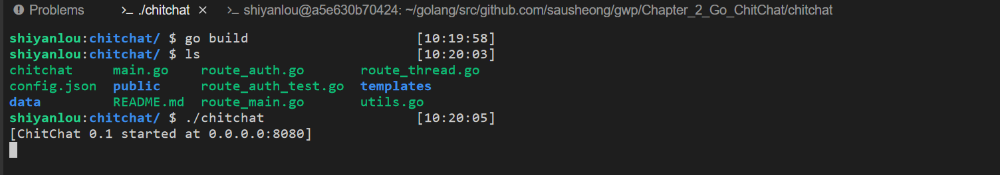

现在 Chitchat 会在端口 8080 启动 Web 服务器。

在你自己的电脑上，用浏览器访问 `http://localhost:8080` 可以看到该页面。

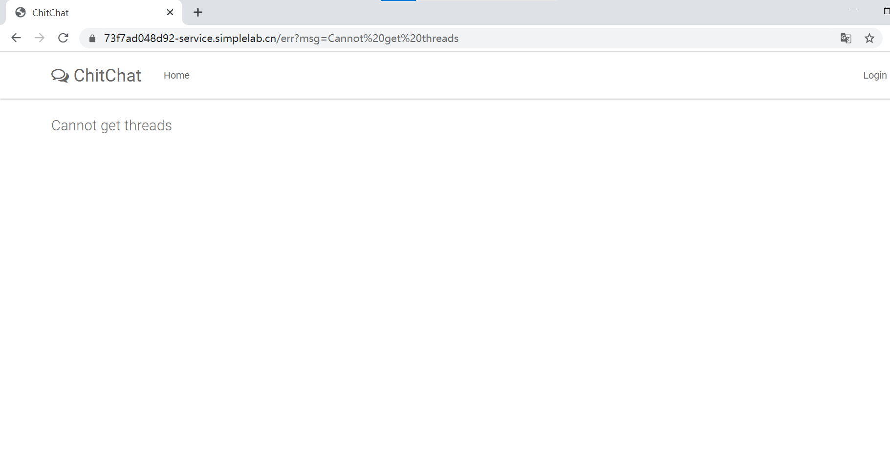


## Web 应用运作流程回顾

在实验的各节中，我们对一个 Go Web 应用的不同组成部分进行了初步的了解和观察。下图对整个应用的工作流程进行了介绍，其中包括：

1. 客户端向服务器发送请求；
2. 多路复用器接收到请求，并将其重定向到正确的处理器；
3. 处理器对请求进行处理；
4. 在需要访问数据库的情况下，处理器会使用一个或多个数据结构，这些数据结构都是根据数据库中的数据建模而来的；
5. 当处理器调用与数据结构有关的函数或者方法时，这些数据结构背后的模型会与数据库进行连接，并执行相应的操作；
6. 当请求处理完毕时，处理器会调用模板引擎，有时候还会向模板引擎传递一些通过模型获取到的数据；
7. 模板引擎会对模板文件进行语法分析并创建相应的模板，而这些模板又会与处理器传递的数据一起合并生成最终的 HTML；
8. 生成的 HTML 会作为响应的一部分回传至客户端。

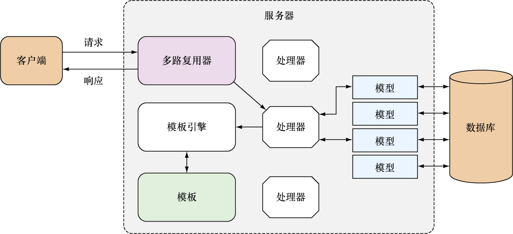

主要的步骤大概就是这些。在接下来，我们会更加深入地学习这一工作流程，并进一步了解该流程涉及的各个组件。

## 实验总结

- 请求的接收和处理是所有 Web 应用的核心。
- 多路复用器会将 HTTP 请求重定向到正确的处理器进行处理，针对静态文件的请求也是如此。
- 处理器函数是一种接受 `ResponseWriter` 和 `Requeest` 指针作为参数的 Go 函数。
- cookie 可以用作一种访问控制机制。
- 对模板文件以及数据进行语法分析会产生相应的 HTML，这些 HTML 会被用作返回给浏览器的响应数据。
- 通过使用 sql 包以及相应的 SQL 语句，用户可以将数据持久地存储在关系数据库中。