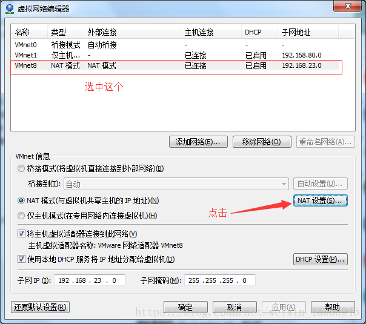
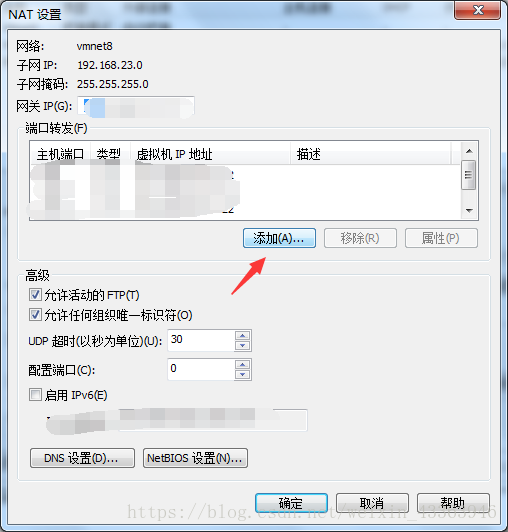
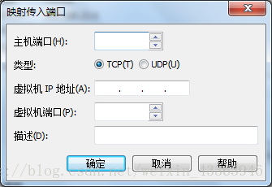

# 虚拟机安装-IP配置说明
[[TOC]]

## 1. 软件下载

URL: https://www.vmware.com/cn/products/workstation-pro/workstation-pro-evaluation.html
建议: 使用14/15版本
最好找项目经理要一个[虚拟机](https://so.csdn.net/so/search?q=虚拟机&spm=1001.2101.3001.7020).
安装步骤: 一路下一步 注意路径 最好不要放到C盘中


## 2 网卡说明

说明: 当打开当前电脑里边的网卡的配置,如果出现VMware 的2块网卡,则说明虚拟机安装成功.
如果网卡没有展现 则需要**重置网卡配置/** **卸载之后重新安装**.

1. 打开网卡
   
   

   2.显示网卡信息.
   只要有2块网卡 表示正常

   

2. 检查IP地址是否有效


## 3 打开虚拟机镜像

### 3.1 Linux镜像的位置


### 3.2 解压文件

将zip压包 复制到本地磁盘路径, 不要有中文空格.
说明: 将zip文件 解压之后,双击运行 xxxx.vmx的后缀,图中展现的文件是运行之后的目录情况,刚解压之后可能只有几项.
不管文件中有多少个 只需要打开VMX的后缀文件即可.


### 3.3 打开之后的效果


### 3.4 修改虚拟机网卡IP地址

说明: 为了保证和课堂的进度/配置一致 则全国同学准备相同的IP.方法调试.
1.点击编辑按钮----->虚拟网络编辑器


2.修改net8的网络配置
修改完成之后,点击应用和确定,当点击完成确定时,虚拟机会卸载之前的网络配置,之后重新安装新的网卡.并且设定指定的IP地址.


3. 修改DHCP配置(可以不做)
   设定DHCP目的是为了 防止IP地址自动的切换.

   

### 3.5 如果IP配置出问题则重置网卡

说明: 如果上述的操作都执行了,但是网卡丢失(偶然遇到).如果缺少了vmware的网卡.则需要重置


### 3.6 VT-X报错

说明: 虚拟机如果需要执行,需要计算机的**主板开启**相对应的配置.如果不开启,则不允许执行虚拟化操作.
方式:
重启计算机之后点击 F1/F2/F8/ESC 需要自己百度 找到自己的笔记本型号.开启vt-x
配置: VT-X配置信息 一般在CPU的设置中. 将禁用改为启用即可.
计算机: 算力 一般都会有保留, 调试CPU中的配置 可以解禁!! 这样的方式 会损耗硬件的寿命


开机重启之后,找到CPU设置,将选中项打开就可以了


### 3.7 登陆系统

用户名和密码 root/root
注意事项: 密码的输入是隐藏的. 输入root之后,回车即可.


### 3.8 Linux系统 IP检查

命令: ip addr 或者 ifconfig
IP地址: 全国统一的 192.168.126.129


### 3.9 重置Linux IP

异常情况说明: 有个别Linux系统 开机之后,不能正常的显示IP地址 出现FFFFFFF…
执行下列指令之后,检查系统的IP地址 不出意外 一定会出现192.168.126.129
命令:

```java
service NetworkManager stop 
chkconfig  NetworkManager  off    永久关闭 Manager网卡
service  network restart		  重启network网卡
```

### 3.10 检查windows和LinuxIP是否畅通

如果测试通过,则表示 上述的配置一切正常!!!


## 4 远程链接工具下载

### 4.1 网址

URL: https://mobaxterm.mobatek.net/download.html


### 4.2 创建远程链接


### 4.3 远程链接测试

双机链接之后,如图展现即可,如果链接超时 检查window ping linux IP是否正常


## 5.关于虚拟机网络模式说明

### 5.1 桥接模式

特点:
1.需要物理设备的支持.
2.启动虚拟机相当于 将主机直接连到交换机中.
3.弊端 局域网中的所有的设备都可以访问虚拟机.


### 5.2 NAT模式

特点:
1.将本机当作交换机.
2.Linux系统只有本机可以访问,其他设备不能访问.
3.NAT模式不需要 其它物理设备的支持


## 6. 连接局域网内另外一台电脑的虚拟机

局域网下想访问其他主机需要在vmware上打开--->[编辑]--->[虚拟机网络编辑器]



接下来会弹出这个窗口 ，点击添加



主机端口设置一个大于8888小于65535的数

虚拟机Ip地址填写你要连虚拟机的Ip

虚拟机端口为默认的22(PS:想填多少填多少,后面可以支持用其他电脑的eclips连接同一局域网的HDFS集群并可以操作)

点击确定！



到这里vm就修改完毕了，然后在用别的电脑连的时候填写此电脑的Ip地址，注意**不是虚拟机的地址**，**端口就填上步设置的主机端口**，然后就可以连接到你设置的虚拟机Ip对应的虚拟机了。