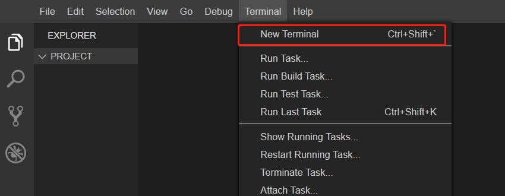
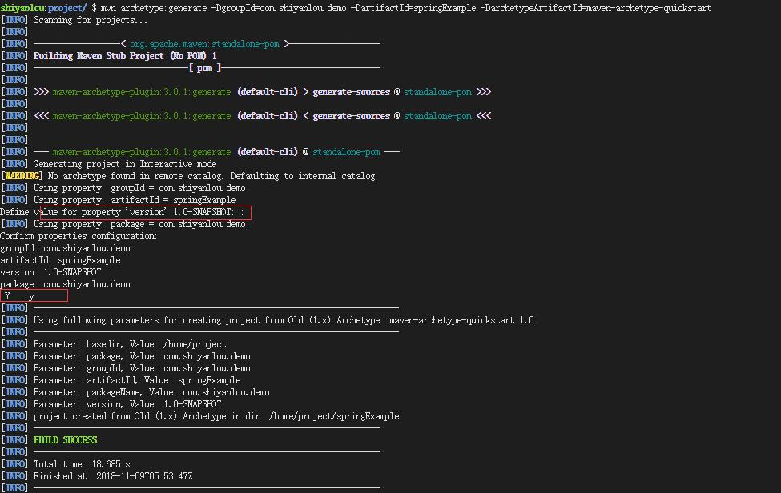
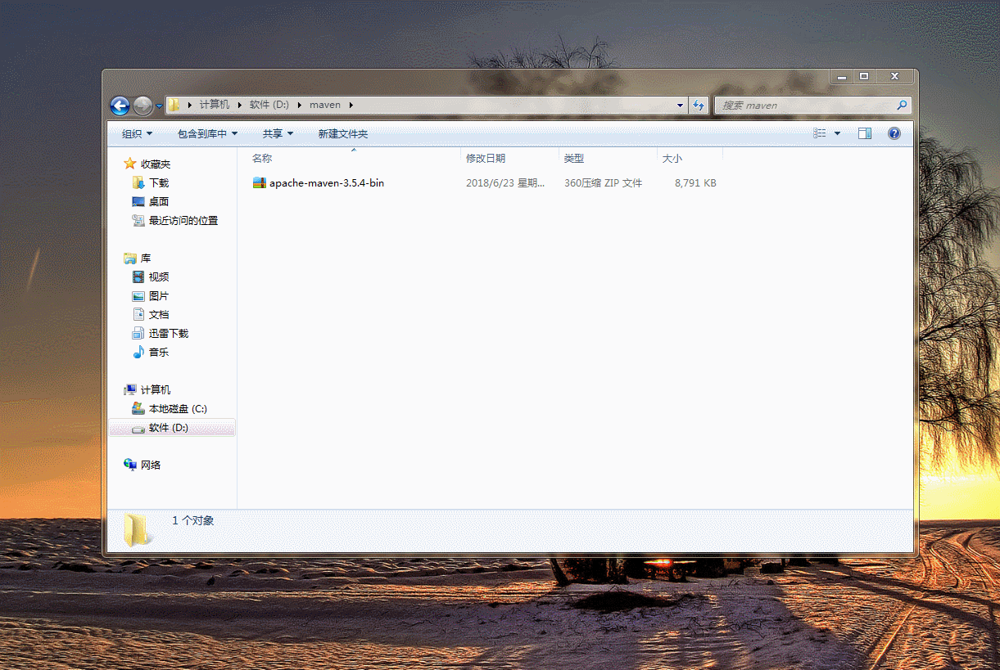
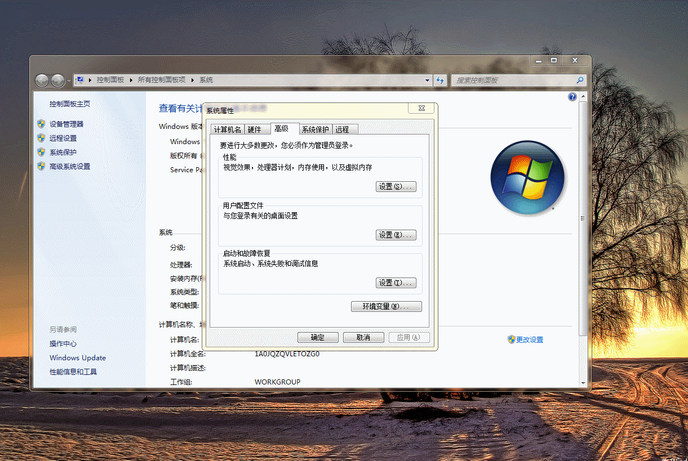
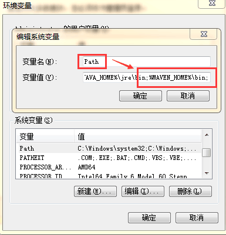
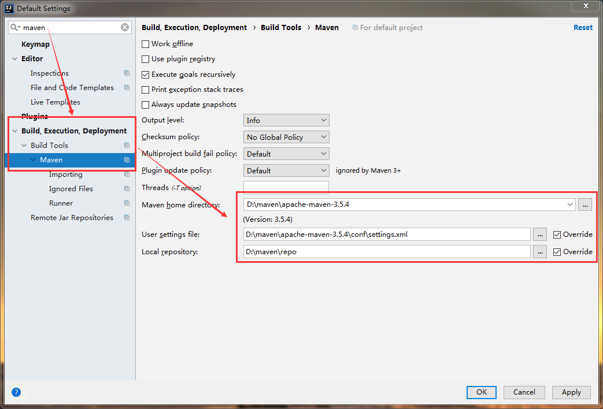

# Maven入门基础
[[TOC]]

## Maven介绍

### 企业级架构图


![[外链图片转存失败,源站可能有防盗链机制,建议将图片保存下来直接上传(img-ATZaMbDK-1622610960611)(RackMultipart20210602-4-1ptwrts_html_d87ca031d7f14d51.png)]](https://img-blog.csdnimg.cn/20210602131627874.png?x-oss-process=image/watermark,type_ZmFuZ3poZW5naGVpdGk,shadow_10,text_aHR0cHM6Ly9ibG9nLmNzZG4ubmV0L3UwMTI5MzI4NzY=,size_16,color_FFFFFF,t_70)

下面我们来描述一个经典的业务请求过程：前端html页面发起ajax请求（http://localhost:8080/factoryController/findAll），访问SpringMVC框架的Controller控制层，SpringMVC框架解析请求，找到要调用的某个Controller，找到其中的findAll方法，同时把请求提交的参数封装到java对象中。之后Controller层把请求传递给Spring框架的Service业务层，Service层在把请求传递给Mybatis框架的Mapper持久层，Mapper访问MySQL数据库进行数据库表的查询，查询结果返回给Mapper层，Mapper再返回给Service层，Service再返回给Controller层。Controller把java数据转换为json字符串，返回给ajax调用，ajax进行回调并把json字符串转换为js对象，再在页面中就可以通过js/vue解析js对象，最终把数据展现到html页面中。

- 开发工具：前端采用HBuilderX，而后端采用idea
- 项目管理：前端采用npm、webpack，而后端采用Maven、SpringBoot
- web中间件：前端采用NodeJS，而后端采用Tomcat

### 什么是Maven

Maven 是专门用于构建和管理Java相关项目的工具。

> Maven 提供了开发人员构建一个完整的生命周期框架。开发团队可以自动完成项目的基础工具建设，Maven 使用标准的目录结构和默认构建生命周期。

> 在多个开发团队环境时，Maven 可以设置按标准在非常短的时间里完成配置工作。由于大部分项目的设置都很简单，并且可重复使用，Maven 让开发人员的工作更轻松，同时能够创建报表，检查、构建和测试自动化设置。
>
> Maven 提供了开发人员的方式来管理：
>
> - Builds
> - Documentation
> - Reporting
> - Dependencies
> - SCMs
> - Releases
> - Distribution
> - mailing list
>
> 概括地说，Maven 简化和标准化项目建设过程，处理编译，分配，文档，团队协作和其他任务的无缝连接。Maven 增加可重用性并负责建立相关的任务。

Maven是意第绪语，依地语（犹太人使用的国际语），表示专家的意思。

#### 用处一:相同的项目结构

使用Maven管理的Java 项目都有着相同的项目结构

1. 有一个pom.xml 用于维护当前项目都用了哪些jar包
2. 所有的java代码都放在 src/main/java 下面
3.  所有的测试代码都放在src/test/java 下面

#### 用处二:统一维护jar包

比如说有3个Java 项目，这些项目都不是maven风格。那么这3个项目，就会各自维护一套jar包。 而其中有些jar包是相同的。

而maven风格的项目，首先把所有的jar包都放在"仓库“ 里，然后哪个项目需要用到这个jar包，只需要给出jar包的名称和版本号就行了。 这样**jar包就实现了共享**.

关于Maven，可以简单的理解为是一个管理项目中所需要使用的jar包的工具！

> jar包是将一系列的类、接口等相关文件压缩打包后形成的文件，表现为扩展名为.jar的文件。

全新的设计体系：创先河的发明pom模型，引入了“仓库”、“依赖”、“坐标”和“命令”。

![[外链图片转存失败,源站可能有防盗链机制,建议将图片保存下来直接上传(img-iUCkZOYO-1622610960633)(RackMultipart20210602-4-1ptwrts_html_dbbe040f008533d0.png)]](https://img-blog.csdnimg.cn/20210602131734443.png?x-oss-process=image/watermark,type_ZmFuZ3poZW5naGVpdGk,shadow_10,text_aHR0cHM6Ly9ibG9nLmNzZG4ubmV0L3UwMTI5MzI4NzY=,size_16,color_FFFFFF,t_70)

### Maven生命周期


1. 默认生命周期:

   `package`打包成jar到项目目录;

   `deploy`发布jar包到远程仓库--私服;

   `install`打包成jar包发送到本地仓库,，给其他本地引用提供依赖.

   说明: 将开发完成的项目打包部署 将项目形成xxx.jar包文件.
   作用:
   1.如果开发的是工具API/框架打成jar包. 之后其他的用户通过依赖关系可以使用该jar包.
   2.可以将项目打成jar包直接部署,用户可以通过网址直接访问.

   存储位置:

   1. target目录下 会有jar包文件
   
      

   ```

   2. 根据maven坐标,会在本地仓库中生成jar包.

   ```

   

   `test`使用合适的单元测试框架运行测试。这些测试代码不会被打包或部署。

   `compile` 编译

   `run` 运行

   每个周期中运行一个命令时，在这个周期里的其他在该命令之前的phase步骤都会执行。如：执行install会自动执行compile（编译java变成了class），test（运行所有单元测试类），package（把整个项目零碎的class文件打包为jar包），最终把成品jar发布到本地仓库中。但执行install并不会自动执行clean。

   **注：这些maven命令可以直接在dos窗口中执行的，但需要配置系统变量MAVEN_HOME，但实际开发中我们常和开发IDE环境集成使用，而很少直接dos使用mvn命令，此处就不做介绍了。**

   

2. 清理生命周期:`clean`

3. `site `站点文档


### 项目发布命令

说明: 未来项目的发布环境都是Linux系统(纯dos命令)
命令: java -jar xxxxx.jar 回车


关闭命令: ctrl + c
关于启动报错说明: 如果执行上述操作报错,第一时间检查JDK环境变量配置是否正确


### 标准工程结构

Maven提倡一个口号：约定优于配置！

约定优于配置（convention over configuration），也称作按约定编程，是一种软件设计范式，旨在减少软件开发人员需做决定的数量，获得简单的好处，而又不失灵活性。

项目代码放main下，测试代码放test下，源代码文件放java下，资源文件放resources下。项目代码管理结构清晰，分工明确，各归其位，便于管理，最终便于程序的自动化。Maven命令能一键执行其核心要点就依赖于此。Maven如此，Spring/SpringBoot亦如此。

![[外链图片转存失败,源站可能有防盗链机制,建议将图片保存下来直接上传(img-jMId9Wma-1622610960671)(RackMultipart20210602-4-1ptwrts_html_6a2d9d4ae9aebf5e.png)]](https://img-blog.csdnimg.cn/20210602132543434.png?x-oss-process=image/watermark,type_ZmFuZ3poZW5naGVpdGk,shadow_10,text_aHR0cHM6Ly9ibG9nLmNzZG4ubmV0L3UwMTI5MzI4NzY=,size_16,color_FFFFFF,t_70)

注意：Maven的个别骨架archetype并不会完整创建上述目录，而且每个骨架创建的也稍有不同，bug不断，没有关系，我们自己手动创建补齐即可。

### pom.xml

在Maven项目中，在根目录下就存在pom.xml文件，在这个文件中可以通过代码来添加项目中所需要的jar包文件的“依赖（dependency）”，则开发工具可以自动从“仓库服务器”中下载对应的jar包文件，下载的jar包文件会出现在“本地仓库”中！

关于“仓库服务器”和“本地仓库”都可以通过文件进行配置，这个配置文件可以从 http://doc.canglaoshi.org/config/maven.aliyun.com.zip 下载，得到maven.aliyun.com.zip文件后将其解压缩（解压到任何位置均可），得到settings.xml文件，然后，将其放在C:\Users\[系统用户名]\.m2文件夹中，该位置可以通过Idea的设置中查看到：将settings.xml文件放到以上指定的位置即可：由于Idea中默认会从这个位置读取配置，所以，只需要将文件放在这个位置即可生效（不需要重启Idea）。

#### XML文件

XML文件的表现是扩展名为.xml的文件！

XML的主要作用是：组织数据，使得程序可以从中解析出所需要的数据！

假设现在需要表示某个学生的数据，包括他的姓名Tom，年龄21，电话号13800138000，如果没有任何规则，表示为Tom2113800138000是非常不合适的！如果仅仅只是通过普通的文字去组织是不够的，例如：

```xml
姓名：Tom 
年龄：21 
电话号码：13800138000
```

则程序不便于解析以上内容，因为，如果尝试解析时，可以使用冒号作为属性名称与值的分隔标准，但是，如果属性名称中间就包含冒号，或值部分包含冒号，或换行不正确，都会导致解析出问题。

为了解决以上问题，应该将属性名称使用特殊的符号进行标记！在XML中，是使用一对尖括号<>将属性名称框住的，并且，在值的2侧都添加这样的标记，在结束标记的小括号之后还会添加/与起始标记区分开来，例如：

```xml
<姓名>Tom</姓名> 
<年龄>21</年龄>
<电话号码>13800138000</电话号码>
```

在以上代码中，每个由<>框住部分，和例如Tom的值部分，甚至</>类似的结束到下一个的开始之间的部分，都称之为“节点”，则以上代码中存在11个节点！其中，使用<>框住的部分称之为“元素节点”，而没有被框住的部分称之为“文本节点”，所以，以上代码中有6个元素节点，有5个文本节点。其中，“元素节点”也被称之为“标签”，由<>框住的称之为“起始元素节点”或“起始标签”，而</>则称之为“结束元素节点”或“结束标签”。

同时，每个XML文件**必须在第1行**添加声明，声明的代码是固定的：

```xml
<?xml version="1.0" encoding="UTF-8"?>
```

紧随其后，即可添加各个节点，但是，每个XML文件**必须有且仅有1个根节点**，例如：

> 根节点：不被包含在其它节点内部的元素标签。

```xml
<?xml version="1.0" encoding="UTF-8"?> 
<学生信息> </学生信息>
```

如果写成以下格式就是错误的：

```xml
<?xml version="1.0" encoding="UTF-8"?> 
<学生信息> 
</学生信息>
<学生信息>
</学生信息>
```

所以，如果需要表示多个学生信息，大概格式如下：

```xml
<?xml version="1.0" encoding="UTF-8"?> 
<学生信息> 
    <学生>
        <姓名>Tom</姓名>
        <年龄>21</年龄> 
        <电话号码>13800138000</电话号码> 
    </学生> 
    <学生>
         <姓名>David</姓名> 
         <年龄>23</年龄>
         <电话号码>13800138001</电话号码>
    </学生>
</学生信息>
```

提示：XML文件的内容应该按照以上方式进行排版，当然，如果缩进不正确，或各节点之间没有添加空白（空格、换行等），也不影响正常使用！在XML文件中，每个“起始元素节点”还可以配置属性，例如：

```xml
<学生 id="1">
</学生>
```

以上代码中，id就是<学生>节点的属性，等于号右侧的"1"就是该属性的值！

> 提示：在XML中，所有属性的值都必须使用一对双引号框住。

并且，同一个标签可以添加若干个（0~n个）属性，各属性的配置之间使用1个空格（其实，只需要有空白即可）进行分隔即可，例如：

```xml
<学生 id="1" no ="202001001">
</学生>
```

其实，使用属性，或使用起始元素标签和结束元素标签中间添加文本节点，都是用于配置属性的，例如：

```xml
<学生 xx="1">
</学生>
```

和

```xml
<学生>
    <id>1</id>
</学生>
```

以上2种写法都是用于配置“学生”的“id”属性的！在具体使用时，可以灵活决定！通常，如果需要配置的属性比较多，推荐使用以上的第2种做法，或某些属性的值可能特别长，也推荐使用以上的第2种做法！总的来说，应该尽量保证每个节点的内容相对简短！

另外，如果某个元素节点没有子级节点，可以在起始元素节点的右侧尖括号（大于号）的左侧添加一个/直接表示节点结束，不需要匹配对应的结束元素节点！例如：

```xml
<学生></学生>
```

与

```xml
<学生/>
```

以上2种写法是等效的!

#### 关于XML文件的语法小结

* 每个XML的第1行都必须是XML声明语句,其代码是固定的
* 每个XML文件必须有且仅有1个根节点
* 每个元素节点的标签都必须结束
* 每个起始元素节点都可以配置若干个属性及对应的值
* 每个元素节点的名称是自定义的,且严格区分大小写,推荐始终使用小写字母作为第1个单词,如果名称由多个单词组成,从第2个单词开始首字母大写.

#### 解析XML文件

首先，在项目的根目录中创建新的`students.xml`文件，用于表示以下信息：

| id   | name   | gender | age  | email              |
| ---- | ------ | ------ | ---- | ------------------ |
| 1    | 张三   | 男     | 18   | zhangsan@baidu.com |
| 2    | 李四   | 男     | 25   | lisi@qq.com        |
| 3    | 韩梅梅 | 女     | 23   | hanmm@163.com      |

则代码为:

```xml
<?xml version="1.0" encoding="UTF-8"?>
<students>
    <student>
        <id>1</id>
        <name>张三</name>
        <gender>男</gender>
        <age>18</age>
        <email>zhangsan@baidu.com</email>
    </student>
    <student>
        <id>2</id>
        <name>李四</name>
        <gender>男</gender>
        <age>25</age>
        <email>lisi@qq.com</email>
    </student>
    <student>
        <id>3</id>
        <name>韩梅梅</name>
        <gender>女</gender>
        <age>23</age>
        <email>hanmm@163.com</email>
    </student>
</students>
```

接下来，在项目中创建`parse.xml`包，并在包中创建`ParseStudentsXml`类，用于解析以上XML文件.

关于解析XML，可使用的技术方案有多种，本次使用`dom4j`来实现，需要在项目中添加`dom4j`的依赖，此前已经添加，则无需重复添加！接下来，编写解析XML文件的代码:

```java
package parse.xml;

import org.dom4j.Document;
import org.dom4j.DocumentException;
import org.dom4j.Element;
import org.dom4j.io.SAXReader;

public class ParseStudentsXml{
    public static void main(String[] args) throws DocumentException {
        //准备一个用于读取XML文件的工具
        SAXReader reader = new SAXReader();
        //读取对应的XMl文件
        //以下方法会抛出异常,现阶段,在当前方法添加声明throws Exception即可无视所有异常
        //以上方法会返回Document类型的对象,表示:整个XMl文档
        //在解析Xml文件之前,XML文件内部的内容的结构必须是已知条件,例如知道有哪些节点,哪些属性,只是不知道属性的值
        Document document = reader.read("./student.xml");

        //getRootElement()方法:读取XML文档的根节点
        Element rootElement = document.getRootElement();

        //getName()方法:读取节点的名称
        String rootName = rootElement.getName();
        System.out.println("根节点名称:"+rootName);

        //读取根节点的子级中名为student的多个节点
        //elements()方法:读取根节点下的子级节点,返回List<Element>类型的结果
        // 调用时，如果没有给参数，则读取所有子级节点
        // 调用时，如果指定了参数，则只读取指定参数名称的子级节点
        List<Element> studentElements = rootElement.elements("student");
        System.iut.println("根节点下有几个子节点:" + studentElement.size());
        //遍历student节点的几何
        for(Element studentElement : studentElements){
            //获取student节点子级的id节点
            //element()方法:获取指定名称的子级节点
            Element idElement = studentElement.element("id");
            //getText()方法:获取文本节点,返回String类型的结果
            //如果有必要的话,可以自行将读取到的String类型转换为期望的其它类型
            String idString = idElement.getText();
            Integer id = Integer.valueOf(idString);
            System.out.println("学生的id=" + id);
            //读取name节点子级的文本节点的值
            Element nameElement = studentElement.element("name");
            String nameString = nameElement.getText();
            System.out.println("学生的name=" + nameString);
            //读取gender节点子级的文本节点的值
            Element genderElement = studentElement.element("gender");
            String genderString = genderElement.getText();
            System.out.println("学生的gender=" + genderString);
            //读取age节点子级的文本节点的值
            Element ageElement = ageElement.element("age");
            String ageString = ageElement.getText();
            System.out.println("学生的age=" + ageString);
            //读取email节点子级的文本节点的值
            Element emailElement = emailElement.element("email");
            String emailString = emailElement.getText();
            System.out.println("学生的email=" + emailString);
            
            
        }
	
        

    }
}
```

**关于使用dom4j解析XML的小结**： 

1. 在Maven项目的pom.xml中添加dom4j的依赖，并刷新，保证下载得到了相关的jar包文件； 
2.  把需要解析的XML文件放在项目的根目录下（当然， 也可以放在其它位置，后续，指定需要读取的文件 时，保证路径正确即可）；
3.   创建类，用于编写解析XML文件的代码，在代码中， 解析步骤为：
   1. 创建解析工具SAXReader对象；
   2.   使用SAXReader对象读取XML文件，将得到 Document对象，表示的是整个文档对象（所以， dom4j的解析方式并不适用于特别大、特别复杂的 XML文档，会占用较多的内存空间）； 
   3.  根据Document对象调用getRootElement()方法 获取根节点的Element对象；
   4. 调用根节点的Element对象的elements()或 elements(String name)获取根节点的子级节点 的列表，将得到List类型的结果（如 果能够确定根节点下只有1个子节点，也可以调用 element()方法，将得到Element类型的对象）； 
   5.  其实，任何Element类型的对象，都可以通过 elements()和element()（含重载的方法）获取 其子级的元素节点的对象； 
   6.  调用Element类型对象的getText()方法可以获取 其文本节点的内容！

#### 关于pom.xml文件说明

```xml
<?xml version="1.0" encoding="UTF-8"?>
<project xmlns="http://maven.apache.org/POM/4.0.0" xmlns:xsi="http://www.w3.org/2001/XMLSchema-instance"
         xsi:schemaLocation="http://maven.apache.org/POM/4.0.0 https://maven.apache.org/xsd/maven-4.0.0.xsd">
    <modelVersion>4.0.0</modelVersion>
    <!--1.指定当前项目的坐标-->
    <groupId>com.jt</groupId>
    <artifactId>spring_demo1</artifactId>
    <version>0.0.1-SNAPSHOT</version>
    <name>spring_demo1</name>
    <description>spring_demo1</description>

    <!--2.maven项目的配置信息,指定字符集和版本-->
    <properties>
        <java.version>1.8</java.version>
        <project.build.sourceEncoding>UTF-8</project.build.sourceEncoding>
        <project.reporting.outputEncoding>UTF-8</project.reporting.outputEncoding>
        <spring-boot.version>2.3.7.RELEASE</spring-boot.version>
    </properties>

    <!--3.依赖项-->
    <dependencies>
        <!--具体的某个依赖
            1.依赖的构成要素3项 称之为 "坐标"
            1.1 组ID
            1.2 项目名
            1.3 版本号
            2.坐标和本地仓库什么关系?
              根据坐标去本地仓库中,查找jar包文件
            3.如果依赖项报错了,则第一时间检查本地仓库中的jar包是否正确!!!
        -->
        <dependency>
            <groupId>org.springframework.boot</groupId>
            <artifactId>spring-boot-starter-web</artifactId>
        </dependency>

        <dependency>
            <groupId>org.springframework.boot</groupId>
            <artifactId>spring-boot-starter-test</artifactId>
            <scope>test</scope>
            <exclusions>
                <exclusion>
                    <groupId>org.junit.vintage</groupId>
                    <artifactId>junit-vintage-engine</artifactId>
                </exclusion>
            </exclusions>
        </dependency>
    </dependencies>

    <!--4.依赖的管理器: 指定相关的依赖的版本信息 -->
   <dependencyManagement>
        <dependencies>
            <dependency>
                <groupId>org.springframework.boot</groupId>
                <artifactId>spring-boot-dependencies</artifactId>
                <version>${spring-boot.version}</version>
                <type>pom</type>
                <scope>import</scope>
            </dependency>
        </dependencies>
    </dependencyManagement>

    <!--
        5.build标签注意事项
            1.build中的插件缺一不可.
            2.mainClass中的路径必须与主启动类一致.
            3.如果以后粘贴复制代码,只复制dependencies内容即可.
    -->
    <build>
        <plugins>
            <!--maven工具负责编译当前的项目-->
            <plugin>
                <groupId>org.apache.maven.plugins</groupId>
                <artifactId>maven-compiler-plugin</artifactId>
                <version>3.8.1</version>
                <configuration>
                    <source>1.8</source>
                    <target>1.8</target>
                    <encoding>UTF-8</encoding>
                </configuration>
            </plugin>
            <!--springboot项目依赖maven的必要工具-->
            <plugin>
                <groupId>org.springframework.boot</groupId>
                <artifactId>spring-boot-maven-plugin</artifactId>
                <version>2.3.7.RELEASE</version>
                <configuration>
                    <mainClass>com.jt.SpringDemo1Application</mainClass>
                </configuration>
                <executions>
                    <execution>
                        <id>repackage</id>
                        <goals>
                            <goal>repackage</goal>
                        </goals>
                    </execution>
                </executions>
            </plugin>
        </plugins>
    </build>
</project>
```


### Maven依赖管理

在添加依赖之前，必须将“需要添加哪个依赖”作为已知件！例如需要实现XML解析，就可以选择添加dom4j（读作：dom for j）的依赖，当已知依赖的名称后，可以在 https://mvnrepository.com/ 网站查询依赖的代码：

1. 在搜索得到的结果页面，应该选择名称一致，且用量较多的那一项

2. 当选择了某个依赖后，会显示对应的依赖的版本列表
3. 选择了某个版本之后，即可看到其依赖的代码
4. 接下来，打开项目中的pom.xml文件，手动添加<dependencies>节点
5. 然后，将网站上查询到的代码粘贴在以上添加的节点中间，并点击悬浮的“刷新”按钮，即可开始下载所需的依赖

提示：根据所使用的Idea版本不同，可能添加依赖的代码后并没有出现“刷新”按钮，可以点击Idea的View菜单，在Tool Windows中找到Maven，并展开右侧的Maven面板，点击第1个“刷新”按钮.

**注意：只要修改了pom.xml中的依赖，必须刷新后才可以生效！**

当已经下载了对应的jar包文件后，这些文件都会存放在“本地仓库”中，“本地仓库”就在此前存放settings.xml的同级文件夹中，名为repository.

打开repository后，可以根据添加的依赖的group、 artifact及version来找到对应的文件，例如刚才添加的依赖代码是:

```xml
<!-- https://mvnrepository.com/artifact/dom4j/do m4j --> 
<dependency> 
	<groupId>dom4j</groupId> 
	<artifactId>dom4j</artifactId> 
	<version>1.6.1</version> 
</dependency>
```

由于以上代码的groupId是dom4j，则在repository文件夹下就有dom4j文件夹！由于以上代码的artifactId是dom4j，则在repository/dom4j文件夹下就有dom4j文件夹！由于以上代码的version是1.6.1，则在repository/dom4j/dom4j文件夹下就有1.6.1文件夹！

至此，关于dom4j的依赖就已经添加完成！另外，如果在项目中还需要添加更多的依赖，只需要找到依赖的代码，并粘贴在现有的<dependencies>节点之下即可，并且，多个依赖的`<dependency>`节点不区分先后顺序！

#### 如何解释maven jar包 具有依赖传递性?

##### 为什么需要依赖传递性

历史问题: 很早之前的开发 里边的jar包文件都是由程序员一个一个的手动添加!!!
致命问题: jar包文件之间可能会**产生冲突**!!! 一个class出现了多次!!
如何解决: maven工具诞生之后, 很大的程度上解决了 jar包依赖的版本冲突问题.
官网在开发时,已经将版本的问题进行了测试. 所以使用时一般不会错.
自动依赖的说明:

1. A.jar 依赖 B.jar B.jar 依赖 C.jar 当用户引入A.jar 包时. B/C自动添加依赖…
   
   

##### 依赖传递性原理说明

说明:

1. 用户添加jar包时,maven工具会根据jar包的坐标,去本地仓库中查找指定的jar包文件.
2.  找到jar包并且实现了jar包文件的依赖.
3.  同时加载当前目录下的pom文件,通过标签 加载其它的依赖项.
4.  循环执行上述的操作 直到所有的jar包依赖完成为止.

1. jar包文件位置
   
   

2. 自动依赖项
   
   

   总结:
   maven 为了解决jar包冲突问题,内部有一些依赖项,引入某些jar包可以自动的依赖其它的jar包.


#### 添加依赖包

##### jdbc

```java
package cn.tedu;

import java.sql.Connection;
import java.sql.DriverManager;
import java.sql.PreparedStatement;
import java.sql.ResultSet;

public class jdbctest {
    public static void main(String[] args) throws Exception{
        Class.forName("com.mysql.jdbc.Driver");

        String url = "jdbc:mysql://localhost:3306/cgb2103"
                + "?characterEncoding=utf8"
                + "&serverTimezone=Asia/Shanghai";

      Connection cn = DriverManager.getConnection(url, "root", "root");

        String sql = "select * from user";
        PreparedStatement ps = cn.prepareStatement(sql);
        ResultSet rs = ps.executeQuery();
        while( rs.next() ) {
            for(int i=1; i<=3; i++) {
                System.out.print( rs.getString(i)+"\t" );
            }
        }
    }
}

```

##### 添加 mysql

```java
<?xml version="1.0" encoding="UTF-8"?>
<project xmlns="http://maven.apache.org/POM/4.0.0"
         xmlns:xsi="http://www.w3.org/2001/XMLSchema-instance"
         xsi:schemaLocation="http://maven.apache.org/POM/4.0.0 http://maven.apache.org/xsd/maven-4.0.0.xsd">
    <modelVersion>4.0.0</modelVersion>

    <groupId>cn.tedu</groupId>
    <artifactId>mavencgb</artifactId>
    <version>1.0-SNAPSHOT</version>
    <!--  添加mysql依赖，可以支持多个依赖，依赖以坐标体现 -->
    <dependencies>
        <dependency>
            <groupId>mysql</groupId>
            <artifactId>mysql-connector-java</artifactId>
            <!--要和数据库版本匹配,
            数据库是5.X的版本就添加5.X的依赖
            数据库是8.X的版本就添加8.X的依赖
            -->
            <version>5.1.48</version>
        </dependency>
    </dependencies>
</project>
```

### Maven插件管理


## Maven仓库

### 仓库概念

所谓的仓库就是用于存放项目需要的jar包的。
maven采用一个仓库，多个项目的方式，让多个项目共享一个仓库里的相同jar包。

Maven和我们之前学习的git很类似，其也是分布式架构，它有一个全球仓库，称为中央仓库，全球开发者都可以连接它来自动下载jar包，而无需去厂家官网下载了。都到一个中央仓库下载，中央仓库压力山大，于是全球各地做镜像仓库，如中国就有网易、阿里等镜像仓库。但每次都去外网下载，那不成天光交网费了。Maven当然不会这么做了，它还有本地仓库。下载一次后，不会再次下载的，除非你删除了。

当用户需要某个jar包时，先到本地仓库寻找，没有再去镜像仓库，没有再去中央仓库。中央仓库找到后，并不直接返回到本地仓库，而是保存一份到镜像仓库，镜像仓库返回本地仓库，本地仓库也保存一份，然后返回给调用者。这样设计是不是太精妙了，只需维护中央仓库，其它仓库自行维护。这就是maven的魅力，这种设计思想是我们开发者需要琢磨和借鉴的。

因为其全自动化，中央仓库默认，镜像仓库需要配置，而无需写一句代码。

#### 分类

1. 本地仓库
2. 私服(公司自己搭建的jar仓库地址)
3. 远程仓库(阿里镜像仓库)
4. 中央仓库(在国外,上亿个jar包)


### 仓库默认位置

打开`conf\settings.xml`

可以看到，在52行指定了仓库的位置是

```xml
 <!-- localRepository
   | The path to the local repository maven will use to store artifacts.
   |
   | Default: ${user.home}/.m2/repository
  <localRepository>/path/to/local/repo</localRepository>
  -->
```

#### maven 坐标的说明

Maven世界拥有大量构建，我们需要找一个用来唯一标识一个构建的统一规范。拥有了统一规范，就可以把查找工作交给机器，默认查找jar包。

看完有何感想？还没豁然开朗？坐标不就是形成一套文件存放规则，这样全球不同厂商的jar包都可以保存在maven仓库中，而不会冲突，各自在各自的目录中。哪怕自家的因为版本号的不同，也会放在不同的目录中，也就不会自家引起冲突。

同时最重要的是，拥有了统一规范，拥有了唯一命名，就可以把查找工作交给自动查找到所要的jar包。

这设计水平可见一斑。一套目录规则，就把jar自动化处理变成现实。


1.说明: maven的坐标是本地仓库中,查找jar包文件的唯一路径.

2.注意事项: maven的jar包下载 如果通过手机热点 可能下载不完全.

3.坐标说明:

```java
	<dependency>
            <!--1.组ID: 公司域名倒写  www.tedu.cn-->
            <groupId>junit</groupId>
            <!--2.项目名称唯一-->
            <artifactId>junit</artifactId>
            <!--3.版本号 唯一的-->
            <version>4.12</version>
            <!--了解: 什么时候有效-->
            <scope>test</scope>
        </dependency>
```

4.本地仓库位置说明: 坐标与jar包的路径 一一对应.


5.**如果出现jar包下载不完全的现象如何处理 将本地仓库中的jar包文件删除之后,刷新maven**


### 默认下载路径

maven 会默认从maven官方提供的服务器下载jar包。
而官方服务器在国外，因为大家都知道的原因，网速很慢，而且容易卡断。 为了便于快速下载相关jar包，可以使用国内maven 阿里云的下载地址：

打开`\conf\settings.xml`

修改在mirrors下新加一个阿里云的镜像地址：

 ```xml
 <mirror>
             <id>alimaven</id>
             <mirrorOf>central</mirrorOf>
             <name>aliyun maven</name>
                 <url>http://maven.aliyun.com/nexus/content/repositories/central/</url>
 </mirror>
 ```


也可以直接复制粘贴即可，修改位置是160-165行

## Maven创建Maven项目

### Linux系统

#### 导入 Maven 项目所需的包

由于 Maven 新建项目需要很多包，首先会扫描本地仓库，如果没有则需要联网，在中央仓库下载到本地仓库。我们已经把本次项目需要的包已经打包传到服务器上，现在，我们只需要从实验楼下载所要的包，并安放到正确的位置即可。

仍旧在 Terminal 中，输入：

```bash
wget https://labfile.oss.aliyuncs.com/courses/578/m2.zip
```

然后，解压：

```bash
unzip m2.zip
```

解压完成后，将生成的 `.m2` 文件夹移动到 maven 本地仓库，默认的 maven 本地仓库在 `/home/shiyanlou/.m2/` 下。（作业：由何处可以看出本地仓库的默认路径？）所以我们解压好的文件正好覆盖源 `.m2` 文件夹。在没有使用过 maven 的情况下是没有这个文件夹的，所以只需要将`.m2`文件夹移动到 `/home/shiyanlou/`即可。

```bash
mv .m2 /home/shiyanlou/.m2
```

#### 创建Maven工程文件

首先在 WEB IDE 顶部，选择 Terminal -> New Terminal，



在终端中输入：

```bash
mvn archetype:generate -DgroupId=com.shiyanlou.demo -DartifactId=springExample -DarchetypeArtifactId=maven-archetype-quickstart
```

参数说明：

- Group Id：项目的组织机构，也是包的目录结构，一般都是域名的倒序，比如 `com.shiyanlou.demo`。
- Artifact Id：项目实际的名字，比如 `springExample`。
- archetype Artifact Id：使用的 maven 骨架名称。

输入命令之后，maven 会提示我们输入版本号，这里可以直接定义版本号也可以直接回车，接着 maven 会提示当前要创建项目的基本信息，输入 y 然后回车确认。



然后我们选择 File -> Open Workspace 切换工作空间，选择 `springExample` 目录，**必须切换到该目录下，否则识别不了项目**。

#### 创建Maven项目

```bash
mvn archetype:generate -DgroupId=com.how2java -DartifactId=j2se -DarchetypeArtifactId=maven-archetype-quickstart -DinteractiveMode=false
```

**archetype:generate** 表示创建个项目
**-DgroupId** 项目包名: com.how2java
**-DartifactId** 项目名称: j2se
**-DarchetypeArtifactId** 项目类型: maven-archetype-quickstart
**-DinteractiveMode:false** 表示前面参数都给了，就不用一个一个地输入了


## IDEA Maven使用

### 下载安装包

首先到 Maven 的官方网站 http://maven.apache.org/download.cgi，点击 Maven 压缩包进行下载。

### 安装

选择目录进行安装，选择的是`D:\maven`目录，解压后，Maven 的安装目录为`D:\maven\apache-maven-3.5.4`，过程如下图：



之后则需要配置 Maven 命令的环境变量，同设置 JDK 环境变量过程一样，新增`MAVEN_HOME`变量，变量值为安装目录`D:\maven\apache-maven-3.5.4`，过程如下：



之后在修改`PATH`环境变量，在末尾增加`;%MAVEN_HOME%\bin;`即可。



### 配置文件

修改配置文件，文件目录是安装目录下的`conf`目录，找到`settings.xml`文件,修改为如下配置即可：

```xml
<?xml version="1.0" encoding="UTF-8"?>
<settings xmlns="http://maven.apache.org/SETTINGS/1.0.0"
          xmlns:xsi="http://www.w3.org/2001/XMLSchema-instance"
          xsi:schemaLocation="http://maven.apache.org/SETTINGS/1.0.0 http://maven.apache.org/xsd/settings-1.0.0.xsd">

<!-- 本地仓库的路径 设置的是D盘maven/repo目录下 (自行配置一个文件夹即可，默认是~/.m2/repository) -->
<localRepository>D:\maven\repo</localRepository>

 <!-- 配置阿里云镜像服务器 国内镜像速度会快一些 -->
 <mirror>
    <id>alimaven</id>
    <name>aliyun maven</name>
    <url>http://maven.aliyun.com/nexus/content/groups/public/</url>
    <mirrorOf>central</mirrorOf>
</mirror>

</settings>
```


#### 阿里云配置文件

```xml
<?xml version="1.0" encoding="UTF-8"?>

<settings xmlns="http://maven.apache.org/SETTINGS/1.0.0"
	xmlns:xsi="http://www.w3.org/2001/XMLSchema-instance"
	xsi:schemaLocation="http://maven.apache.org/SETTINGS/1.0.0 http://maven.apache.org/xsd/settings-1.0.0.xsd">

	<pluginGroups>
	</pluginGroups>

	<proxies>
	</proxies>

	<servers>
	</servers>

	<mirrors>

		<mirror>
			<id>ali</id>
			<name>ali Maven</name>
			<mirrorOf>*</mirrorOf>
			<url>https://maven.aliyun.com/repository/public/</url>
		</mirror>

	</mirrors>
	<profiles>

	</profiles>
	<activeProfiles>
	</activeProfiles>


</settings>

```

#### 华为云配置文件

```xml
<?xml version="1.0" encoding="UTF-8"?>

<settings xmlns="http://maven.apache.org/SETTINGS/1.0.0"
	xmlns:xsi="http://www.w3.org/2001/XMLSchema-instance"
	xsi:schemaLocation="http://maven.apache.org/SETTINGS/1.0.0 http://maven.apache.org/xsd/settings-1.0.0.xsd">

	<pluginGroups>
	</pluginGroups>

	<proxies>
	</proxies>

	<servers>
	</servers>

	<mirrors>

		<mirror>
		    <id>huaweicloud</id>
		    <mirrorOf>*</mirrorOf>
		    <url>https://mirrors.huaweicloud.com/repository/maven/</url>
		</mirror>

	</mirrors>
	<profiles>

	</profiles>
	<activeProfiles>
	</activeProfiles>


</settings>

```


### 验证

安装配置成功后，需要验证 Maven 命令是否可以在本机正常使用，验证方法同 JDK 验证相同，打开 Windows 的命令提示符，输入以下命令：

```
mvn -v
```

能够正常显示 Maven 安装信息即可。

### IDEA 配置 Maven

由于 IDEA 默认安装了 Maven 环境，想要我们自己安装的 Maven 可以正常在 IDEA 中使用，则需要进行以下配置：

"File" --> "Settings" --> "Maven"



Build, Execute, Deployment->Build Tools->Maven
修改 Maven home directory: d:/software/apache-maven-3.5.0
修改 User settings file: D:\software\apache-maven-3.5.0\conf\settings.xml
Local repository 会被自动识别为 d:\maven\repository

如此这般，IDEA中的maven就准备好了，并且是使用本地库（这样可以减少从网上下载相关资料的数量，加快maven项目创建和安装的速度）

### IDEA Maven Project

#### 选择Maven项目

1. 左边选择Maven
2.  勾选Create from archetype
3.  选择org.apache.maven.archetypes:maven-archetype-quickstart
4.  Next


## 常见问题

### 搜索maven依赖的坐标

查询最新版本和坐标 http://search.maven.org/

### 执行maven命令时内存溢出

在使用maven时，如果报内存溢出，如使用 mvn site会耗费大量内存，则修改默认配置。

```java
D:\javaenv\apache-maven-3.0.5\bin\mvn.cmd

在@REM set MAVEN\_OPTS=……后加入

set MAVEN\_OPTS= -Xms128m -Xmx512m
```

### 版权导致jar远程仓库中没有

例如oracle、全文检索的IKAnalyzer分词器、Dubbox等。

解决办法：按maven坐标手动创建目录结构，将jar单独下载，放入其中。

### 下载中断

远程仓库为国外网站，又是众矢之的，全球都到哪里下载。常会因为网络故障导致jar下载不完全：

```java
jsp-api-2.1.jar.lastUpdated   --没下载全，不能用，用时会报错
mysql-connector-java-5.1.48.jar –下载OK的,才可以用
```

遇到这样的情况：

- 可以等待网络比较好的时候再下载
- 可以拷贝别人的仓库
- 如果只是个别jar包，可以到jar的官网下载后，然后手动配置

最恶劣的一种情况，下载出异常，也就是pom.xml会提示jar包有问题，可到maven本地仓库，jar也存在。这时可以打开jar包，看是否能打开。如果打不开，则删除，触发maven重新下载。

### 避免上网下载这么多jar

注意： Maven不同的myeclipse/eclipse，myclipse的maven的插件会调用不同版本的jar。不会缺少业务使用的jar。

Maven命令实际是一个jar包，运行前必须需下载maven的插件，运行时判断如果不存在会自动下载。

### Maven仓库死活不对之绝招

拷贝环境没问题的 同学的配置文件 和 仓库 。

### 版本号共享

通常在项目中，我们会同时依赖同一个构件的不同模块，如 spring-orm-3.2.0，spring-context-3.2.0，且多个模块版本相同，为了维护和升级方便，我们可以对其同一管理，这时可以使用到 Maven 属性，类似于变量的概念。

```java
<!-- 集中定义依赖版本号 -->
<properties>
	<junit.version>4.10</junit.version>
	<spring.version>4.1.3.RELEASE</spring.version>
</properties>

<!--引用的地方 -->
<dependency>
	<groupId>org.springframework</groupId>
	<artifactId>spring-context</artifactId>
	<version>${spring.version}</version>
</dependency>命令插件

```

一键部署，执行每个命令会自动调用前面的命令。可以一次执行多个命名。只能执行本生命周期中的前面的命令。

每个maven命令就是一个jar，一个maven插件。在第一次运行时下载。

![[外链图片转存失败,源站可能有防盗链机制,建议将图片保存下来直接上传(img-iXC1Z5ZH-1622610960684)(RackMultipart20210602-4-1ptwrts_html_74fc418105d040a3.png)]](https://img-blog.csdnimg.cn/20210602132908598.png?x-oss-process=image/watermark,type_ZmFuZ3poZW5naGVpdGk,shadow_10,text_aHR0cHM6Ly9ibG9nLmNzZG4ubmV0L3UwMTI5MzI4NzY=,size_16,color_FFFFFF,t_70)

### 主启动方法不能执行

说明： 如图所示，主启动方法不能正常运行，原因IDEA不能识别该java工程，当做普通的文本文件。


解决方案： pom.xml 右键 add maven project


### pom.xml文件jar包报错(比较常见的问题)

注意事项: 使用maven下载jar包文件时,尽量不要使用手机特点(除非特殊情况)
**前提条件: 必须正确配置maven环境/配置私服镜像**
关于依赖项的说明:

```xml
 <!--具体的某个依赖
            1.依赖的构成要素3项 称之为 "坐标"
            1.1 组ID
            1.2 项目名
            1.3 版本号
            2.坐标和本地仓库什么关系?
              根据坐标去本地仓库中,查找jar包文件
            3.如果依赖项报错了,则第一时间检查本地仓库中的jar包是否正确!!!
        -->
        <dependency>
            <groupId>org.springframework.boot</groupId>
            <artifactId>spring-boot-starter-web</artifactId>
           <!-- <version>2.3.7</version>-->
        </dependency>
```

解决方案: 根据坐标的位置,查找本地仓库的jar包是否正确,如果下载有误则删除之后,重新刷新


### 扩展知识-maven中jar包依赖传递性

说明: Maven中jar包添加是有依赖的传递性. A.jar 依赖 B.jar包. B.jar包 依赖 C.jar包.
如果导入A.jar则 ABC都会动态导入.

问题: 如何实现的?

1. 根据坐标查找本地仓库的jar包文件
   
   

   2.查找jar包文件之后,查找xxx.pom,之后查找依赖项

   

   3.之后根据新的坐标查找jar包文件,之后再次根据pom进行依赖循环往复 直至所有的依赖项全部加载.


### 扩展知识-SHA1算法

#### SHA1介绍

**SHA-1**（英语：Secure Hash Algorithm 1，中文名：安全散列算法1）是一种密码散列函数，美国国家安全局设计，并由美国国家标准技术研究所（NIST）发布为联邦数据处理标准（FIPS）。SHA-1可以生成一个**被称为消息摘要**的160位（20字节）散列值，散列值通常的呈现形式为**40个十六进制数**。

#### Hash相关知识说明

问题1: 如果对相同数据,采用相同的**hash**算法,
问:结果是否相同? A
A.相同 B.不相同 C.可能相同


问题2: 如果对不同数据,采用相同的hash算法
问: 结果是否相同 C
A.相同 B.不相同 C.可能相同

知识点: Hash碰撞
1.不同的数据,经过相同的hash算法,得到了相同的结果.称之为hash碰撞.
2.hash碰撞问题,在数学界是没有办法规避的!!!


#### 关于数据传输的安全性说明

