# MyBatis简介
[[TOC]]

## 实验介绍

将介绍 MyBaits 框架的整体设计，包括功能架构和框架架构。

Mybatis的主要作用是快速实现对关系型数据库中的数据进行访问的框架。

#### 实验知识点

- MyBaits 概念
- MyBaits 架构

## 实验步骤

### 什么是 MyBatis

首先，我们来了解一下什么是 ORM ？

ORM（Object/Relational Mapping），即对象关系映射，它完成面向对象的编程语言到关系数据库的映射。ORM 工具的唯一作用是：把持久化对象的保存、修改、删除等操作，转换成对数据库的操作。

ORM 基本映射关系：

- 数据表映射类
- 数据表的行映射对象（实例）
- 数据表的列（字段）映射对象的属性

MyBatis 本是 apache 的一个开源项目 iBatis , 2010 年这个项目由 apache software foundation 迁移到了 google code，并且改名为 MyBatis 。

MyBatis 是支持定制化 SQL、存储过程以及高级映射的优秀的持久层框架。MyBatis 避免了几乎所有的 JDBC 代码和手动设置参数以及对结果集的检索封装。`MyBatis 可以对配置和原生 Map 使用简单的 XML 或注解，将接口和 Java 的 POJO(Plain Old Java Objects, 普通的 Java 对象）映射成数据库中的记录。`

MyBatis 的主要思想是将程序中的大量 SQL 语句抽取出来，配置在配置文件中，以实现 SQL 的灵活配置。

MyBatis 并不完全是一种 ORM 框架，它的设计思想和 ORM 相似，只是它允许直接编写 SQL 语句，使得数据库访问更加灵活。因此，准确地说，MyBatis 提供了一种“半自动化”的 ORM 实现，是一种 "SQL Mapping" 框架。

### 功能架构

MyBatis 的功能架构分为三层：

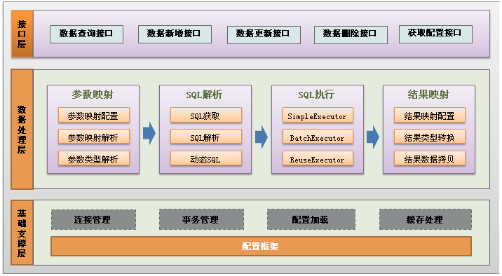

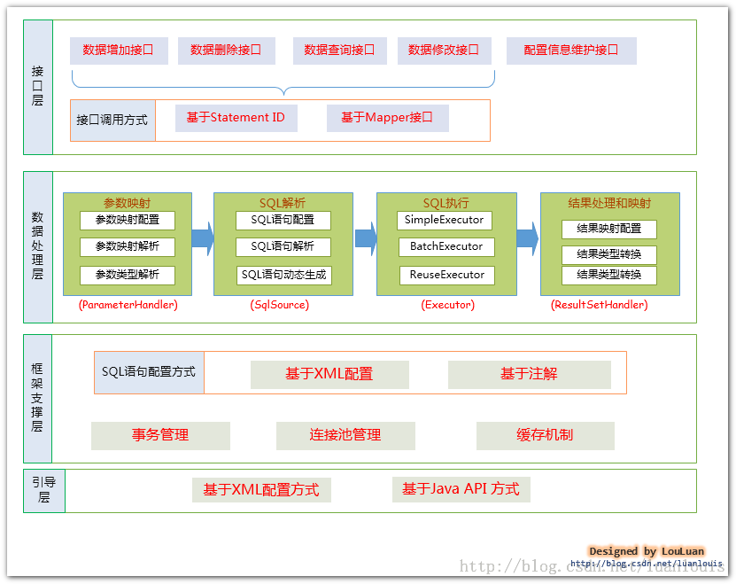

- **API 接口层**：提供给外部使用的接口 API，开发人员通过这些本地 API 来操纵数据库。接口层一接收到调用请求就会调用数据处理层来完成具体的数据处理。

MyBatis和数据库的交互有两种方式：

* 使用传统的MyBatis提供的API；
   这是传统的传递Statement Id 和查询参数给 SqlSession 对象，使用 SqlSession对象完成和数据库的交互；MyBatis 提供了非常方便和简单的API，供用户实现对数据库的增删改查数据操作，以及对数据库连接信息和MyBatis 自身配置信息的维护操作。  

   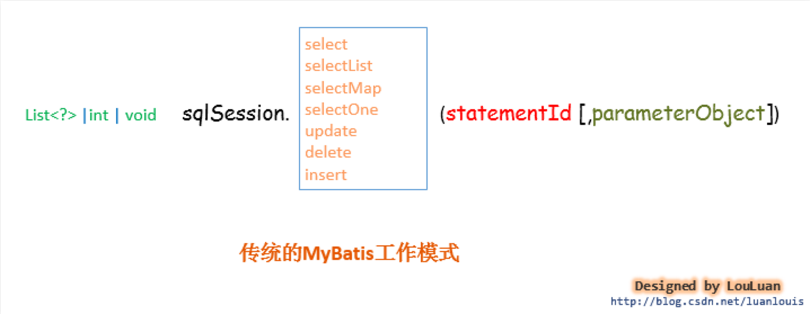

   上述使用MyBatis 的方法，是创建一个和数据库打交道的SqlSession对象，然后根据Statement Id 和参数来操作数据库，这种方式固然很简单和实用，但是它不符合面向对象语言的概念和面向接口编程的编程习惯。由于面向接口的编程是面向对象的大趋势，MyBatis 为了适应这一趋势，增加了第二种使用MyBatis 支持接口（Interface）调用方式。
* 使用Mapper接口；
  MyBatis 将配置文件中的每一个`<mapper>` 节点抽象为一个 Mapper 接口，而这个接口中声明的方法和跟`<mapper>` 节点中的`<select|update|delete|insert>` 节点项对应，即`<select|update|delete|insert>` 节点的id值为Mapper 接口中的方法名称，parameterType 值表示Mapper 对应方法的入参类型，而resultMap 值则对应了Mapper 接口表示的返回值类型或者返回结果集的元素类型。 

  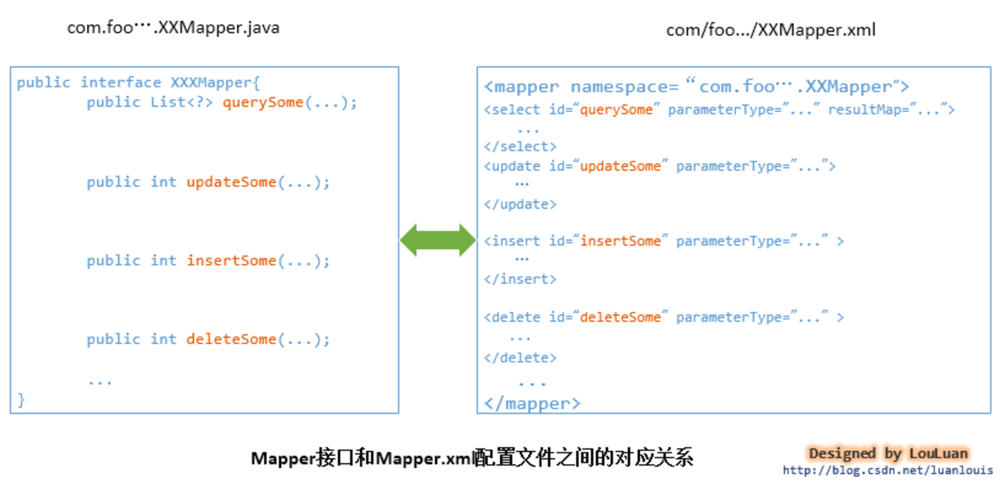 
  
  根据MyBatis 的配置规范配置好后，通过SqlSession.getMapper(XXXMapper.class)方法，MyBatis 会根据相应的接口声明的方法信息，通过动态代理机制生成一个Mapper 实例，我们使用Mapper 接口的某一个方法时，MyBatis 会根据这个方法的方法名和参数类型，确定Statement Id，底层还是通过SqlSession.select("statementId",parameterObject);或者SqlSession.update("statementId",parameterObject); 等等来实现对数据库的操作， MyBatis 引用Mapper 接口这种调用方式，纯粹是为了满足面向接口编程的需要。（其实还有一个原因是在于，面向接口的编程，使得用户在接口上可以使用注解来配置SQL语句，这样就可以脱离XML配置文件，实现“0配置”）。 

- **数据处理层**：负责具体的 SQL 查找、SQL 解析、SQL 执行和执行结果映射处理等。它主要的目的是根据调用的请求完成一次数据库操作。


  数据处理层可以说是MyBatis 的核心，从大的方面上讲，它要完成两个功能：

* 通过传入参数构建动态SQL语句；
  
  动态语句生成可以说是MyBatis框架非常优雅的一个设计，MyBatis 通过传入的参数值，使用 Ognl 来动态地构造SQL语句，使得MyBatis 有很强的灵活性和扩展性。 
  
  参数映射指的是对于java 数据类型和jdbc数据类型之间的转换：这里有包括两个过程：查询阶段，我们要将java类型的数据，转换成jdbc类型的数据，通过 preparedStatement.setXXX() 来设值；另一个就是对resultset查询结果集的jdbcType 数据转换成java 数据类型。

* SQL语句的执行以及封装查询结果集成`List<E>`

  动态SQL语句生成之后，MyBatis 将执行SQL语句，并将可能返回的结果集转换成`List<E>` 列表。MyBatis 在对结果集的处理中，支持结果集关系一对多和多对一的转换，并且有两种支持方式，一种为嵌套查询语句的查询，还有一种是嵌套结果集的查询。

- **基础支撑层**：负责最基础的功能支撑，包括连接管理、事务管理、配置加载和缓存处理，这些都是共用的东西，将他们抽取出来作为最基础的组件，为上层的数据处理层提供最基础的支撑。

* 事务管理机制 
  
  事务管理机制对于ORM框架而言是不可缺少的一部分，事务管理机制的质量也是考量一个ORM框架是否优秀的一个标准。 

* 连接池管理机制 
  
  由于创建一个数据库连接所占用的资源比较大， 对于数据吞吐量大和访问量非常大的应用而言，连接池的设计就显得非常重要。 

* 缓存机制 
  
  为了提高数据利用率和减小服务器和数据库的压力，MyBatis 会对于一些查询提供会话级别的数据缓存，会将对某一次查询，放置到SqlSession 中，在允许的时间间隔内，对于完全相同的查询，MyBatis 会直接将缓存结果返回给用户，而不用再到数据库中查找。
  
* SQL语句的配置方式 
  
  传统的MyBatis 配置SQL 语句方式就是使用XML文件进行配置的，但是这种方式不能很好地支持面向接口编程的理念，为了支持面向接口的编程，MyBatis 引入了Mapper接口的概念，面向接口的引入，对使用注解来配置SQL 语句成为可能，用户只需要在接口上添加必要的注解即可，不用再去配置XML文件了，但是，目前的MyBatis 只是对注解配置SQL 语句提供了有限的支持，某些高级功能还是要依赖XML配置文件配置SQL 语句。

- 引导层
  引导层是配置和启动MyBatis配置信息的方式。
  
  MyBatis 提供两种方式来引导MyBatis ：基于XML配置文件的方式和基于Java API 的方式。

### 框架架构

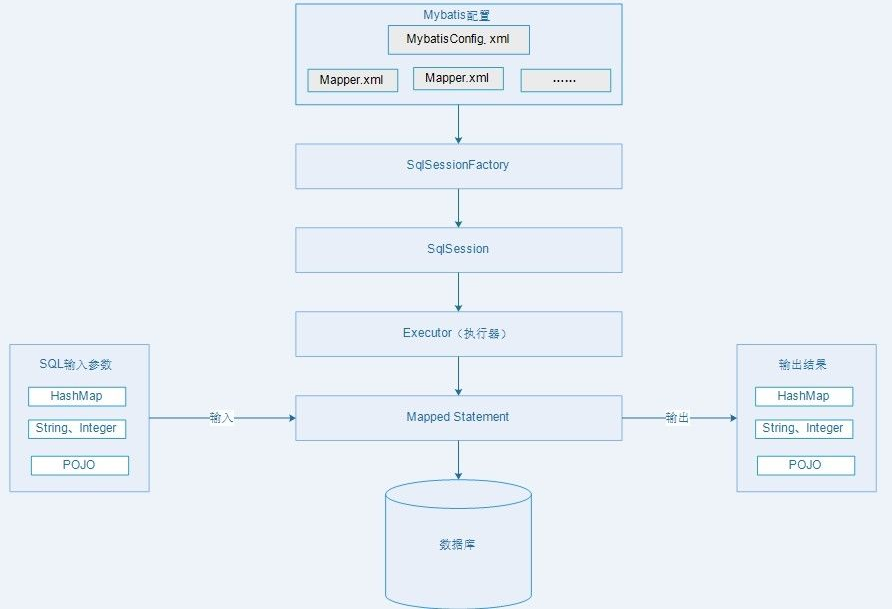

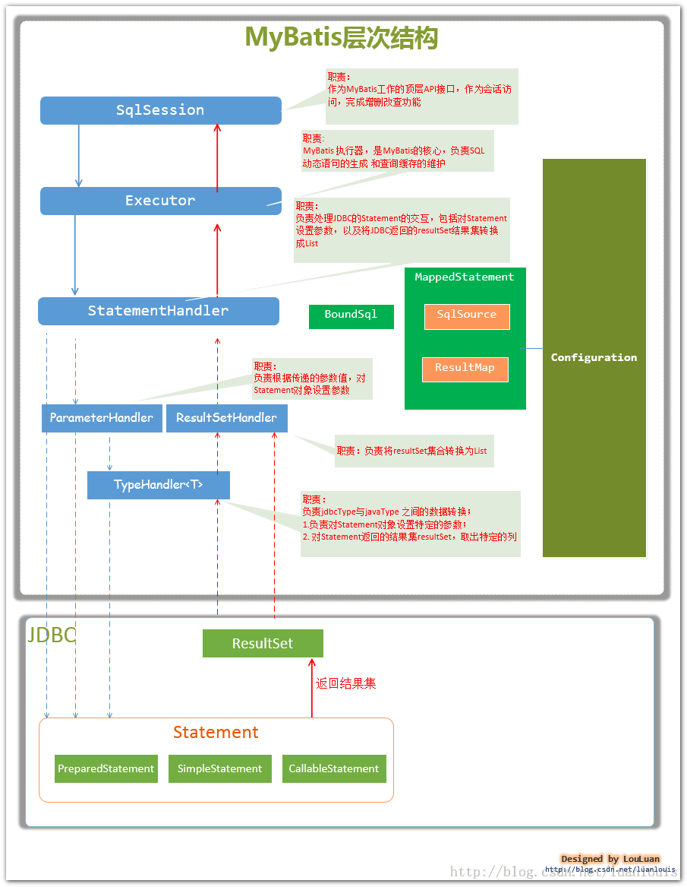


主要的核心部件解释如下： 
* `SqlSession` 作为MyBatis工作的主要顶层API，表示和数据库交互的会话，完成必要数据库增删改查功能
*  `Executor` MyBatis执行器，是MyBatis 调度的核心，负责SQL语句的生成和查询缓存的维护 
*  `StatementHandler` 封装了JDBC Statement操作，负责对JDBC statement 的操作，如设置参数、将Statement结果集转换成List集合。 
*  `ParameterHandler` 负责对用户传递的参数转换成JDBC Statement 所需要的参数， 
*  `ResultSetHandler` 负责将JDBC返回的ResultSet结果集对象转换成List类型的集合； 
*  `TypeHandler` 负责java数据类型和jdbc数据类型之间的映射和转换 
*  `MappedStatement` MappedStatement维护了一条`<select|update|delete|insert>`节点的封装， 
*  `SqlSource` 负责根据用户传递的parameterObject，动态地生成SQL语句，将信息封装到BoundSql对象中，并返回 
*  `BoundSql` 表示动态生成的SQL语句以及相应的参数信息 
*  `Configuration` MyBatis所有的配置信息都维持在Configuration对象之中。

- **加载配置**：MyBatis 应用程序根据 XML 配置文件加载运行环境，创建 SqlSessionFactory，SqlSessionFactory，配置来源于两个地方，一处是配置文件，一处是 Java 代码的注解，将 SQL 的配置信息加载成为一个个 MappedStatement 对象（包括了传入参数映射配置、执行的 SQL 语句、结果映射配置），存储在内存中。
- **SQL 解析**：当 API 接口层接收到调用请求时，会接收到传入 SQL 的 ID 和传入对象（可以是 Map、JavaBean 或者基本数据类型），Mybatis 会根据 SQL 的 ID 找到对应的 MappedStatement，然后根据传入参数对象对 MappedStatement 进行解析，解析后可以得到最终要执行的 SQL 语句和参数。
- **SQL 执行**：SqlSession 将最终得到的 SQL 和参数拿到数据库进行执行，得到操作数据库的结果。
- **结果映射**：将操作数据库的结果按照映射的配置进行转换，可以转换成 HashMap、JavaBean 或者基本数据类型，并将最终结果返回，用完之后关闭 SqlSession。

#### SqlSessionFactory

每个基于 MyBatis 的应用都是以一个 SqlSessionFactory 的实例为核心的。SqlSessionFactory 是单个数据库映射关系经过编译后的内存映像。SqlSessionFactory 的实例可以通过 SqlSessionFactoryBuilder 获得。而 SqlSessionFactoryBuilder 则可以从 XML 配置文件或一个预先定制的 Configuration 的实例构建出 SqlSessionFactory 的实例。SqlSessionFactory 是创建 SqlSession 的工厂。

#### SqlSession

SqlSession 是执行持久化操作的对象，它完全包含了面向数据库执行 SQL 命令所需的所有方法，可以通过 SqlSession 实例来直接执行已映射的 SQL 语句。在使用完 SqlSession 后我们应该使用 finally 块来确保关闭它。

### MyBatis 的优点

1. 简单小巧易于上手，方便浏览修改 SQL 语句
2. 解除 SQL 与程序代码的耦合
3. 提供映射标签，支持对象与数据库的 ORM 字段关系映射
4. 提供 xml 标签，支持编写动态 SQL

### MyBatis 与 JDBC、Hibernate 的区别

**Mybatis 也是基于 JDBC 的**。Java 与数据库操作仅能通过 JDBC 完成。 Mybatis 也要通过 JDBC 完成数据查询、更新这些动作。Mybatis 仅仅是在 JDBC 基础上做了，OO 化、封装事务管理接口这些东西。 Mybatis 和 Hibernate 都屏蔽 JDBC API 的底层访问细节，使我们不用于 JDBC API 打交道就可以访问数据库。但是，Hibernate 是全自动的 ORM 映射工具，可以自动生成 SQL 语句，Mybatis 需要在 xml 配置文件中写 SQL 语句；因为 Hibernate 是自动生成 SQL 语句的，在写复杂查询时，Hibernate 实现比 Mybatis 复杂的多1

## MyBatis持久层框架

### 概念

MyBatis的前身就是iBatis,iBatis本是apache的一个开源项目，2010年5月这个项目由apahce sofeware foundation 迁移到了google code，并且改名为MyBatis。

MyBatis 是支持普通 SQL 查询,存储过程和高级映射的优秀持久层框架。MyBatis 消除了几乎所有的 JDBC 代码和参数的手工设置以及结果集的检索。

1. 简化JDBC的开发
2. 能够更好的完成ORM(对象关系映射)

### 内部组件结构图

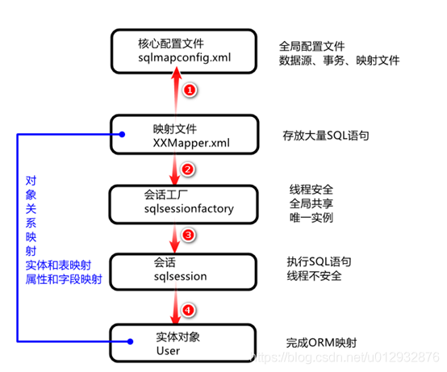

### 准备数据表

```sql
create database mybatisdb default character set utf8;
use mybatisdb;
create table user(id int primary key auto_increment,name varchar(100),addr varchar(100),age int);
Insert into user values(null,'hanmeimei','北京',28);
Insert into user values(null,'xiongda','上海',20);
Insert into user values(null,'xiaonger','上海',19);
DROP TABLE IF EXISTS `dept`;
CREATE TABLE `dept` (
  `id` int(11) NOT NULL AUTO_INCREMENT,
  `dname` varchar(14) DEFAULT NULL,
  `loc` varchar(13) DEFAULT NULL,
  PRIMARY KEY (`id`)
) ENGINE=InnoDB AUTO_INCREMENT=11 DEFAULT CHARSET=utf8;

-- ----------------------------
-- Records of dept
-- ----------------------------
INSERT INTO `dept` VALUES ('1', '呵呵呵', '一区');
INSERT INTO `dept` VALUES ('2', '哈哈哈哈', '二区');
INSERT INTO `dept` VALUES ('3', 'operations', '二区');
INSERT INTO `dept` VALUES ('5', 'java教研部', '大钟寺');
INSERT INTO `dept` VALUES ('10', '开发', '西二旗');
DROP TABLE IF EXISTS `emp`;
CREATE TABLE `emp` (
  `id` int(11) NOT NULL AUTO_INCREMENT,
  `ename` varchar(10) DEFAULT NULL,
  `job` varchar(9) DEFAULT NULL,
  `mgr` decimal(4,0) DEFAULT NULL,
  `hiredate` date DEFAULT NULL,
  `sal` decimal(7,2) DEFAULT NULL,
  `comm` decimal(7,2) DEFAULT NULL,
  `deptno` int(11) DEFAULT NULL,
  PRIMARY KEY (`id`)
) ENGINE=InnoDB AUTO_INCREMENT=510 DEFAULT CHARSET=utf8;

-- ----------------------------
-- Records of emp
-- ----------------------------
INSERT INTO `emp` VALUES ('100', 'jack', '副总', null, '2002-05-03', '90000.00', null, '1');
INSERT INTO `emp` VALUES ('200', 'tony', '总监', '100', '2015-02-02', '10000.00', '2000.00', '2');
INSERT INTO `emp` VALUES ('300', 'hana', '经理', '200', '2017-02-02', '8000.00', '1000.00', '2');
INSERT INTO `emp` VALUES ('400', 'leo', '员工', '300', '2019-02-22', '3000.00', '200.12', '2');
INSERT INTO `emp` VALUES ('500', 'liu', '员工', '300', '2019-03-19', '3500.00', '200.58', '2');
INSERT INTO `emp` VALUES ('502', '王一博', 'topidol.', '1000', '2021-03-31', '20000.00', '99.00', '88');
INSERT INTO `emp` VALUES ('504', '蔡徐坤', 'rapper', '10', '2021-03-29', '100.00', '1000.00', '100');

```

## MyBatis：XML映射方式

### Maven工程结构

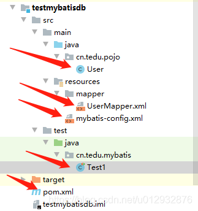

注：导入jUnit5，使用@BeforeEach注解替代jUnit4的@Before。

### pom.xml

```java
<?xml version="1.0" encoding="UTF-8"?>
<project xmlns="http://maven.apache.org/POM/4.0.0" xmlns:xsi="http://www.w3.org/2001/XMLSchema-instance"
	xsi:schemaLocation="http://maven.apache.org/POM/4.0.0 https://maven.apache.org/xsd/maven-4.0.0.xsd">
	<modelVersion>4.0.0</modelVersion>
	
	<groupId>cn.tedu</groupId>
	<artifactId>mybatis</artifactId>
	<version>0.0.1-SNAPSHOT</version>
	<name>mybatis</name>
	<description>Demo project for Spring Boot</description>
<parent>
		<groupId>org.springframework.boot</groupId>
		<artifactId>spring-boot-starter-parent</artifactId>
		<version>2.4.2</version>
		<relativePath/> <!-- lookup parent from repository -->
	</parent>
	<properties>
		<java.version>1.8</java.version>
	</properties>
	<dependencies>
		<!--mybatis依赖包-->
		<dependency>
			<groupId>org.mybatis.spring.boot</groupId>
			<artifactId>mybatis-spring-boot-starter</artifactId>
			<version>2.1.4</version>
		</dependency>
		<!--jdbc依赖包-->
		<dependency>
			<groupId>mysql</groupId>
			<artifactId>mysql-connector-java</artifactId>
			<version>5.1.48</version>

		</dependency>
		
		<dependency>
			<groupId>org.springframework.boot</groupId>
			<artifactId>spring-boot-starter-test</artifactId>
			<scope>test</scope>
		</dependency>
	</dependencies>

	<build>
		<plugins>
			<plugin>
				<groupId>org.springframework.boot</groupId>
				<artifactId>spring-boot-maven-plugin</artifactId>
			</plugin>
		</plugins>
	</build>

</project>

```

### mybatis-config.xml

```java
<?xml version="1.0" encoding="UTF-8"?>
<!DOCTYPE configuration
    PUBLIC "-//mybatis.org//DTD Config 3.0//EN"
    "http://mybatis.org/dtd/mybatis-3-config.dtd">

<!-- mybatis的核心配置文件 -->
 <configuration>
 	<environments default="test">
 		<environment id="test">
 			<transactionManager type="JDBC"></transactionManager>
 			<dataSource type="POOLED">
 			<property name="driver" value="com.mysql.jdbc.Driver"/> 
            <property name="url" value="jdbc:mysql://localhost:3306/mybatisdb?characterEncoding=utf8&amp;serverTimezone=Asia/Shanghai" /> 
				<property name="username" value="root"/> 
				<property name="password" value="root"/> 
 			</dataSource>
 		</environment>
 	</environments>
 
</configuration>

```

### User.java

```java
package cn.tedu.pojo;
public class User {
	private int id;
	private String name;
	private String addr;
	private int age;
	public int getId() {
		return id;
	}
	public void setId(int id) {
		this.id = id;
	}
	public String getName() {
		return name;
	}
	public void setName(String name) {
		this.name = name;
	}
	public String getAddr() {
		return addr;
	}
	public void setAddr(String addr) {
		this.addr = addr;
	}
	public int getAge() {
		return age;
	}
	public void setAge(int age) {
		this.age = age;
	}
	@Override
	public String toString() {
		return "User [id=" + id + ", name=" + name + ", addr=" + addr + ", age=" + age + "]";
	}
}

```

### UserMapper.xml

```java
<?xml version="1.0" encoding="UTF-8"?>
<!DOCTYPE mapper
	PUBLIC "-//mybatis.org//DTD Mapper 3.0//EN"
	"http://mybatis.org/dtd/mybatis-3-mapper.dtd">

<mapper namespace="hello">
	<select id="get" resultType="cn.tedu.pojo.User">
		select * from user
	</select>
</mapper>

```

### 引入 UserMapper.xml

```java
<?xml version="1.0" encoding="UTF-8"?>
<!DOCTYPE configuration
    PUBLIC "-//mybatis.org//DTD Config 3.0//EN"
    "http://mybatis.org/dtd/mybatis-3-config.dtd">

<!-- mybatis的核心配置文件 -->
 <configuration>
 	<environments default="test">
 		<environment id="test">
 			<transactionManager type="JDBC"></transactionManager>
 			<dataSource type="POOLED">
 				<property name="driver" value="com.mysql.jdbc.Driver"/> 
				<property name="url" value="jdbc:mysql://localhost:3306/mybatisdb?characterEncoding=utf8&amp;serverTimezone=Asia/Shanghai" /> 
				<property name="username" value="root"/> 
				<property name="password" value="root"/> 
 			</dataSource>
 		</environment>
 	</environments>
 
 **<mappers>
 	<mapper resource="mappers/UserMapper.xml"/>
 </mappers>**
 
 </configuration>

```

### TestMybatis.java

```java
package cn.tedu.test;

import java.io.File;
import java.io.IOException;
import java.io.InputStream;
import java.util.List;

import org.apache.ibatis.io.Resources;
import org.apache.ibatis.session.SqlSession;
import org.apache.ibatis.session.SqlSessionFactory;
import org.apache.ibatis.session.SqlSessionFactoryBuilder;
import org.junit.jupiter.api.Test;

import cn.tedu.pojo.User;

public class TestMybatis {

	@Test
	public void get() throws IOException {
		//1，创建SqlSessionFactory对象，线程非安全，用来产生SqlSession
		//2，创建SqlSession，用来执行sql
		//3, 定位SQL： namespace的值+id的值
		//4，解析结果并打印
InputStream in = Resources.getResourceAsStream("mybatis-config.xml");
SqlSessionFactory session = new SqlSessionFactoryBuilder().build(in);
		
		SqlSession sqlSession = session.openSession();
		List<User> list = sqlSession.selectList("hello.get");
		for (User u : list) {
			System.out.println(u);
		}
	}
}

```

## 参数解析

### 别名：alias

在sqlMapConfig.xml配置，在映射文件中直接写对象名称即可

```java
<typeAliases>
<typeAlias type="cn.mybatis.pojo.User" alias="User"/>
</typeAliases>

```

### 参数值：paramterType

指定参数类型，通常制定一个对象类型。

### 返回值：resultType

非常重要的东西，即完成ORM的映射关系所在。这里指定的cd.tedu.mybatis.domain.User代表把结果集转换成一个User对象实例。

### 返回值：resultMap

resultMap 用于对复杂对象结构时，对应的ResultMap结构名称

### #和$的区别

两种方式都可以获取参数的值。区别如下：

（推荐！）#： 使用#{parameterName}引用参数的时候，Mybatis会把这个参数认为是一个字符串，例如传入参数是"Smith"，那么在SQL（Select * from emp where name = #{employeeName})使用的时候就会转换为Select * from emp where name = 'Smith'。

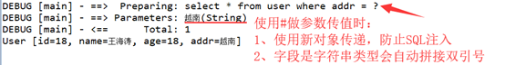

$： 不做字符串拼接，SQL（Select * from emp where name = ${employeeName}）使用的时候就会转换为Select * from emp where name = Smith。此时，如果字段是varchar类型直接抛出SQL异常。

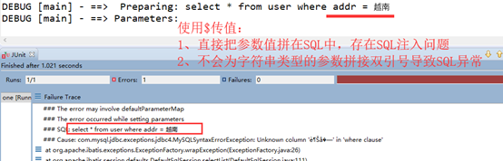

从安全性上考虑，能使用#尽量使用#来传参，因为这样可以有效防止SQL注入的问题。

### SQL中有特殊字符

当SQL中有特殊字符，mybatis不能正常解析时，

用`<![CDATA[ ?? ]]>`括起来就解决了` <![CDATA[ and age<=#{age} ]]>`

```java
<![CDATA[
	and age<=#{age}
]]>

```


## 动态SQL

Mybatis提供使用ognl表达式动态生成sql的功能。

### sql和include

Sql标签用来提取SQL片段,来提高SQL的复用.

使用位置需要通过include引用指定的SQL片段.

```java
<sql id="cols">
id,title,sell_point,price,num,barcode,image,cid,status,created,updated
</sql>

<select id="find" resultType="Item" parameterType="Item">
SELECT <include refid="cols"/> FROM tb_item
</select>

```

### if

执行SQL时,可以添加一些判断条件.

```java
<select id="find" resultType="Item" parameterType="Item">
SELECT <include refid="cols"/> FROM tb_item where
	<if test="title != null"> title like #{title} </if>
	<if test="sellPoint != null">and sell_point like #{sellPoint}</if>
</select>

```

### where

去掉条件中可能多余的and或者or：

```java
<select id="find" resultType="Item" parameterType="Item">
SELECT <include refid="cols"/> FROM tb_item
<where> 
	<if test="title != null"> title like #{title} </if>
	<if test="sellPoint != null">and sell_point like #{sellPoint}</if>
</where>
</select>

```

### set

去掉最后可能多余的逗号：

```java
<update id="update">
UPDATE teachers 
<set>
		<if test="tname != null">tname=#{tname},</if>
		<if test="tsex != null">tsex=#{tsex},</if>
		<if test="tbirthday != null">tbirthday=#{tbirthday},</if>
		<if test="prof != null">prof=#{prof},</if>
		<if test="depart != null">depart=#{depart}</if>
</set>
WHERE tno=#{tno}	
</update>

```

### foreach

用于in子查询中的多个值的遍历：

```java
<delete id="delete">
DELETE FROM teachers WHERE tno IN 
<!--ids是给SQL传递的参数Map里的key,item的值就像是for循环里的i变量名-->
<foreach collection="ids" item="id" open="(" close=")" separator=",">
#{id}
</foreach>	
</delete>

调用代码：

Map<String,Object> map = new HashMap<String,Object>();
String[] ps = {"1","22"};
map.put("ids", ps );
mapper.delete(map);

```

## MyBatis：接口映射方式

### 概述

在上面的测试用例中，在调用session的方法的时候，都会传入要调用的SQL的namespace+id名称，这不是必须的。可以只传入id即可。但是，如果在mybatis的环境中有多个相同id的映射名称，就会报错。所以，一般情况下，调用方法最好还是使用namespace+id。但是，namespace+id的使用方式很容易报错，因为是string类型的，没有检查。所以，mybatis提供了一种非常好的设计方式来避免这种问题，即Mapper接口。

### Maven工程结构

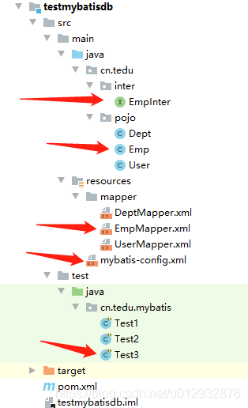

注：导入jUnit5，使用@BeforeEach注解替代jUnit4的@Before。

### 创建Emp.java

```java
package cn.tedu.pojo;

import java.util.Date;

public class Emp {
	private int id;
	private String ename;
	private String job;
	private double mgr;
	private Date hiredate;
	private double sal;
	private double comm;
	private int deptno;
	
	public int getId() {
		return id;
	}
	public void setId(int id) {
		this.id = id;
	}
	public String getEname() {
		return ename;
	}
	public void setEname(String ename) {
		this.ename = ename;
	}
	public String getJob() {
		return job;
	}
	public void setJob(String job) {
		this.job = job;
	}
	public double getMgr() {
		return mgr;
	}
	public void setMgr(double mgr) {
		this.mgr = mgr;
	}
	public Date getHiredate() {
		return hiredate;
	}
	public void setHiredate(Date hiredate) {
		this.hiredate = hiredate;
	}
	public double getSal() {
		return sal;
	}
	public void setSal(double sal) {
		this.sal = sal;
	}
	public double getComm() {
		return comm;
	}
	public void setComm(double comm) {
		this.comm = comm;
	}
	public int getDeptno() {
		return deptno;
	}
	public void setDeptno(int deptno) {
		this.deptno = deptno;
	}
	@Override
	public String toString() {
		return "Emp [id=" + id + ", ename=" + ename + ", job=" + job + ", mgr=" + mgr + ", hiredate=" + hiredate
				+ ", sal=" + sal + ", comm=" + comm + ", deptno=" + deptno + "]";
	}
}

```

### 创建EmpMapper.xml

```java
<?xml version="1.0" encoding="UTF-8"?>
<!DOCTYPE mapper
	PUBLIC "-//mybatis.org//DTD Mapper 3.0//EN"
	"http://mybatis.org/dtd/mybatis-3-mapper.dtd">
	
<mapper namespace="cn.tedu.mapper.EmpMapper">
	<!-- SQL片段,提高SQL的复用 -->
	<sql id="columns">
		id,ename,job,mgr,hiredate,sal,comm,deptno
	</sql>
	
	<select id="getAll" resultType="cn.tedu.pojo.Emp">
		<!-- select empno,ename,job,mgr,hiredate,sal,comm,deptno  from emp --> 
		<!-- 引用指定的SQL片段 -->
		select <include refid="columns"></include>  from emp 
	</select>
	
	<!-- resultType必须配置 ,parameterType可以省略-->
	<select id="getOne" resultType="cn.tedu.pojo.Emp" parameterType="int">
		select <include refid="columns"></include>  from emp
		where 
		<!-- 判断条件,满足就执行SQL,不满足就不执行了 -->
		<if test="x != 0" >id = #{x}</if>
	</select>
	
	<select id="getCount" resultType="int">
		select count(*) from emp
	</select>
	
	<!-- Emp在核心配置文件里加了别名配置了 -->
	<insert id="add" parameterType="Emp">
		insert into emp( <include refid="columns"></include>) 
		values(null,
		<if test="ename!=null">#{ename},</if>
		<if test="job!=null">#{job},</if>
		<if test="mgr!=0">#{mgr},</if>
		NOW(),
		<if test="sal!=0">#{sal},</if>
		<if test="comm!=0">#{comm},</if>
		<if test="deptno!=0">#{deptno}</if>
		);
	</insert>
	
	<update id="update" parameterType="Emp">
		update Emp 
		<set><!-- set能去多余逗号 -->
			<if test="ename !=null">ename=#{ename},</if>
			<if test="job !=null">job=#{job},</if>
			<if test="mgr !=0">mgr=#{mgr},</if>
			hiredate=NOW(),
			<if test="sal !=0">sal=#{sal},</if>
			<if test="comm !=0">comm=#{comm},</if>
			<if test="deptno !=0">	deptno=#{deptno},</if>
		</set>
		<where>
			<if test="id !=0">id=#{id}</if>
		</where>
	</update>

	<delete id="del" parameterType="int">
		delete from emp 
		<where>id=#{x}</where>
	</delete>
	
	<delete id="delmore">
		delete from emp
		<!-- where id in(1,2,3,4,5); -->
		where id in
		<!--获取map里的数据, ids是map里的key 
			<foreach collection="ids" open="(" close=")" separator="," item="i"> 
		-->
		<!--获取数组里的数据, array是固定写法
		    <foreach collection="array" open="(" close=")" separator="," item="i">
		-->
		<!--获取list里的数据, list是固定写法 -->
		    <foreach collection="list" open="(" close=")" separator="," item="i">
			#{i}
		</foreach>
	</delete>
</mapper>

```

### 创建EmpMapper接口

**注意：**

1. **包名** **+** **类名** **= UserMapper.xml**中 namespace的值
2. **接口中方法名** **= mapper.xml**中定义的 id 值
3. **方法的返回值类型和参数类型要和映射文件中一致**

```java
package cn.tedu.mapper;
import java.util.List;
import java.util.Map;

import cn.tedu.pojo.Emp;
public interface EmpMapper {
	List<Emp> getAll();
	Emp getOne(int id);
	int getCount();
	void add(Emp emp);
	void update(Emp emp);
	void del(int id);
	void delmore(Map map);//多个参数封装成map结构,SQL里通过#{key}取就行
	void delmore(List list);//多个参数封装成list结构,SQL里需要遍历
	<T> void delmore(T[] t);
}

```

### 创建测试类

```java
package cn.tedu.test;

import java.io.IOException;
import java.io.InputStream;
import java.util.HashMap;
import java.util.List;
import java.util.Map;

import org.apache.ibatis.io.Resources;
import org.apache.ibatis.session.SqlSession;
import org.apache.ibatis.session.SqlSessionFactory;
import org.apache.ibatis.session.SqlSessionFactoryBuilder;
import org.junit.jupiter.api.BeforeEach;
import org.junit.jupiter.api.Test;

import cn.tedu.mapper.EmpMapper;
import cn.tedu.pojo.Emp;
//接口开发模式
public class TestEmpInter {
	private SqlSession session ;
	@BeforeEach
	public void init() throws IOException {
		InputStream in = Resources.getResourceAsStream("sqlMapConfig.xml");
		SqlSessionFactory factory = new SqlSessionFactoryBuilder().build(in);
		session = factory.openSession();
//		session = factory.openSession(true);//开启自动提交
	}
	@Test
	public void getAll() {
		EmpMapper mapper = session.getMapper(EmpMapper.class);
		List<Emp> list = mapper.getAll();
		for (Emp e : list) {
			System.out.println(e);
		}
	}
	@Test
	public void getOne() {
		EmpMapper mapper=session.getMapper(EmpMapper.class);
		Emp emp = mapper.getOne(100);
		System.out.println(emp);
	}
	@Test
	public void getCount() {
		EmpMapper mapper = session.getMapper(EmpMapper.class);
		int count = mapper.getCount();
		System.out.println("总记录数:"+count);
	}
	@Test
	public void add() {
		EmpMapper mapper = session.getMapper(EmpMapper.class);
		Emp emp = new Emp();
		emp.setEname("蔡徐坤2");
		emp.setJob("rapper");
		emp.setMgr(10);
		emp.setSal(100);
		emp.setComm(1000);
		emp.setDeptno(100);
		mapper.add(emp);
		session.commit();//提交事务,commit()或者openSession(true)
	}
	@Test
	public void update() {
		EmpMapper mapper = session.getMapper(EmpMapper.class);
		Emp emp = new Emp();
		emp.setId(502);
		emp.setEname("王一博");
		emp.setJob("topidol.");
		emp.setMgr(1000);
		emp.setSal(20000);
		emp.setComm(99);
		emp.setDeptno(88);
		mapper.update(emp);
		session.commit();
	}
	@Test
	public void del() {
		EmpMapper mapper = session.getMapper(EmpMapper.class);
		mapper.del(503);
		session.commit();
	}
		@Test
	public void delmore() {
		EmpMapper mapper = session.getMapper(EmpMapper.class);
//		Map<String,Object> map = new HashMap<>();
//		map.put("ids", new int[] {506,508,509});
//		mapper.delmore(map);//用map封装数据
		
		List list = new ArrayList();
		Collections.addAll(list,500,400);
		mapper.delmore(list);//用list封装数据
		
//		mapper.delmore(new Integer[] {510,511});//用数组封装数据
		session.commit();
	}
}

```

## ResultMap简单使用

### 概述

当数据库的字段名 和 对象的属性名 一致时，可以用简单属性resultType。

但是当 数据库中的字段名称 和 对象中的属性名称 不 一致时，就需要resultMap属性。

### 案例

```java
<?xml version="1.0" encoding="UTF-8"?>
<!DOCTYPE mapper
	PUBLIC "-//mybatis.org//DTD Mapper 3.0//EN"
	"http://mybatis.org/dtd/mybatis-3-mapper.dtd">
<mapper namespace="cn.tedu.mybatis.pojo.PersonMapper">
	<!-- 最强大对象resultMap，结果封装到哪个pojo对象，type就是谁 -->
	<resultMap type="Person" id="personRM">
		<!—单独处理 属性名 和 字段名不一致的 -->
		<result property="userName" column="user_name"/>
	</resultMap>
	<!-- 查询所有 -->
<select id="find"  resultMap="personRM">
SELECT id,user_name FROM person WHERE id=#{id}
</select>
</mapper>

```

### 自动匹配规范驼峰规则

数据库中我们习惯使用全大写，多个单词用下划线隔开，而po对象中，习惯使用java驼峰规则。那一个一个手工写resultMap字段，浪费开发时间，直接配置一下就可以了。

如：

数据库字段： is_man

Javabean属性： private Integer isMan

mapper配置不需要写字段与属性的配置，会自动映射

注意：主键需要单独写，其它字段就可以直接利用驼峰规则自动映射。

第一步：在sqlMapConfig.xml中配置settings：

```java
<?xml version="1.0" encoding="UTF-8" ?>
<!DOCTYPE configuration
PUBLIC "-//mybatis.org//DTD Config 3.0//EN"
"http://mybatis.org/dtd/mybatis-3-config.dtd">
<configuration>
	<settings>
         <!--开启驼峰规则-->
		<setting name="mapUnderscoreToCamelCase" value="true" />
	</settings>
</configuration>

```

第二步：resultMap配置autoMapping=“true”

```java
<resultMap type="cn.tedu.jk.domain.Contract" id="contractRM" autoMapping="true">
<!-- <id property="id" column="CONTRACT_ID"/> -- >
</resultMap>

```

## 扩展

### JDBC和MyBatis的区别？

JDBC是java提供了一套专门用于和数据库对接的api，java.sql.*，其规范了如何和数据库进行对接，实现由各数据库厂商进行各自的实现和扩展。学习JDBC重点在学习如何使用其api。

MyBatis框架是轻量级封装了JDBC，我们已经看不到这些api，连接connection、语句preparedstatement、结果集ResultSet，而关注的是mybatis框架体系如何去使用，一旦写好，我们关注的是java对象。

### XML和接口方式的区别？

MyBatis提供了两种操作数据库的方式，一种是通过xml映射文件，一种是通过java的接口类。按面向对象方式更加推荐接口方式，但如果复杂的多表映射，仍然需要使用xml映射文件的ResultMap方式实现。

接口只是假象，其底层仍然是通过xml实现，好不容易实现了一套方式，怎忍丢掉呢？可以做个测试就知道它底层怎么实现的？把xml中的sql删除，它就玩不转了。

### 接口方式怎么找到xml执行的？

SqlSession的getMapper方法找到类，通过反射可以获取到类的全路径（包名.类名），相加后就定位到某个xml的命名空间namespace，在根据调用的方法去找到xml中某个标签的id属性。从而实现价值接口，调用接口的方法而间接找到xml中的标签，通过解析xml获取这个标签的内容，从而获取到sql语句。

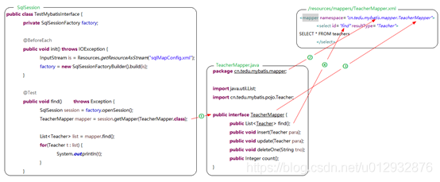
