# MyBatis入门程序
[[TOC]]

# Mybatis入门程序(Windows)

## Mybatis介绍

[官网地址:](https://mybatis.org/mybatis-3/zh/index.html) 

**MyBatis 是一款优秀的持久层框架**，它支持自定义 SQL、存储过程以及高级**映射**。MyBatis 免除了几乎所有的 JDBC 代码以及设置参数和获取结果集的工作。MyBatis 可以通过简单的 XML 或注解来配置和映射原始类型、接口和 Java POJO（Plain Old Java Objects，普通老式 Java 对象）为数据库中的记录。

总结:

1. **MyBatis 是一款优秀的持久层框架** 在内部封装了JDBC,简化了操作数据库的过程.
2. 映射: 数据库中的表 与POJO中的类一一映射.
   表中的字段与类中的属性一一映射

## 导入数据库


#### 配置数据库
首先，登录MySQL控制台，创建名为`mall_ams`的数据库：

```sql
CREATE DATABASE mall_ams;
```

然后，在[IntelliJ IDEA中配置数据库视图：](http://doc.canglaoshi.org/doc/idea_database/index.html)

然后，通过数据库视图的Console面板创建数据表：

```sql
create table ams_admin (
    id bigint unsigned auto_increment,
    username varchar(50) default null unique comment '用户名',
    password char(64) default null comment '密码（密文）',
    nickname varchar(50) default null comment '昵称',
    avatar varchar(255) default null comment '头像URL',
    phone varchar(50) default null unique comment '手机号码',
    email varchar(50) default null unique comment '电子邮箱',
    description varchar(255) default null comment '描述',
    is_enable tinyint unsigned default 0 comment '是否启用，1=启用，0=未启用',
    last_login_ip varchar(50) default null comment '最后登录IP地址（冗余）',
    login_count int unsigned default 0 comment '累计登录次数（冗余）',
    gmt_last_login datetime default null comment '最后登录时间（冗余）',
    gmt_create datetime default null comment '数据创建时间',
    gmt_modified datetime default null comment '数据最后修改时间',
    primary key (id)
) comment '管理员表' charset utf8mb4;
```

至此，本案例所需的数据库与数据表已经准备完毕。

在`src/main/resources`下创建`datasource.properties`配置文件，用于配置连接数据库的参数，例如：

```yml
datasource.url=jdbc:mysql://localhost:3306/mall_ams?useUnicode=true&characterEncoding=UTF-8&serverTimezone=Asia/Shanghai
datasource.driver=com.mysql.cj.jdbc.Driver
datasource.username=root
datasource.password=root
```

并且，在`cn.tedu.mybatis`包下（不存在，则创建）创建`SpringConfig`类，读取以上配置文件：

```java
@Configuration
@PropertySource("classpath:datasource.properties")
public class SpringConfig {
}
```

完成后，在测试方法中补充测试代码：

```java
@Test
public void contextLoads() {
    System.out.println("MybatisTests.contextLoads()");
    AnnotationConfigApplicationContext ac
            = new AnnotationConfigApplicationContext(SpringConfig.class);

    ConfigurableEnvironment environment = ac.getEnvironment();

    System.out.println(environment.getProperty("datasource.url"));
    System.out.println(environment.getProperty("datasource.driver"));
    System.out.println(environment.getProperty("datasource.username"));
    System.out.println(environment.getProperty("datasource.password"));

    ac.close();
}
```

接下来，在`SpringConfig`中配置一个`DataSource`对象：

```java
package cn.tedu.mybatis;

import org.apache.commons.dbcp.BasicDataSource;
import org.springframework.context.annotation.Bean;
import org.springframework.context.annotation.Configuration;
import org.springframework.context.annotation.PropertySource;
import org.springframework.core.env.Environment;

import javax.sql.DataSource;

@Configuration
@PropertySource("classpath:datasource.properties")
public class SpringConfig {

    @Bean
    public DataSource dataSource(Environment env) {
        BasicDataSource dataSource = new BasicDataSource();
        dataSource.setUrl(env.getProperty("datasource.url"));
        dataSource.setDriverClassName(env.getProperty("datasource.driver"));
        dataSource.setUsername(env.getProperty("datasource.username"));
        dataSource.setPassword(env.getProperty("datasource.password"));
        return dataSource;
    }

}
```

并在测试类中添加新的测试方法，以尝试获取数据库的连接对象，检测是否可以正确连接到数据库：

```java
@Test
public void testConnection() throws Exception {
    AnnotationConfigApplicationContext ac
            = new AnnotationConfigApplicationContext(SpringConfig.class);

    DataSource dataSource = ac.getBean("dataSource", DataSource.class);

    Connection connection = dataSource.getConnection();
    System.out.println(connection);

    ac.close();
}
```

至此，项目的数据库编程的准备完毕。

## Mybatis入门案例


### 创建项目

1. 创建项目
   
   

2. 勾选jar包
   
   

### 导入项目

1. 编辑pom.xml配置文件

```xml
 <!--mybatis依赖包-->
        <dependency>
            <groupId>org.mybatis.spring.boot</groupId>
            <artifactId>mybatis-spring-boot-starter</artifactId>
            <version>2.2.0</version>
        </dependency>

        <!--jdbc依赖包-->
        <dependency>
            <groupId>mysql</groupId>
            <artifactId>mysql-connector-java</artifactId>
        </dependency>

        <!--添加lombok的包-->
        <dependency>
            <groupId>org.projectlombok</groupId>
            <artifactId>lombok</artifactId>
        </dependency>
```

2. 导入src配置文件
   
   说明: 将课前资料中的项目的src文件进行导入. 如图所示
   
   

### lombok插件安装

####  lombok介绍

说明: pojo对象中必须添加get/set/toString等常规方法,但是该方法写起来繁琐,但是又必须添加. 所以可以引入lombok插件动态生成上述的方法.

#### 导入jar包

```java
 		<!--添加lombok的包-->
        <dependency>
            <groupId>org.projectlombok</groupId>
            <artifactId>lombok</artifactId>
        </dependency>

```

####  安装lombok插件

1. 搜索安装: lombok的插件


2. 本地安装
说明: 下载lombok的安装文件, 如图所示:
文件下载: 去码云中下载即可


3. 导入插件 勾选zip包即可
   


lombok 版本地址: https://plugins.jetbrains.com/plugin/6317-lombok/versions

#### lombok注解标识POJO

```java
@Data //动态生成get/set/toString/equals/hashCode等方法
@Accessors(chain = true) //开启链式加载  重写set方法
@NoArgsConstructor       //无参构造
@AllArgsConstructor      //全参构造
public class User implements Serializable {
    private Integer id;
    private String name;
    private Integer age;
    private String sex;

   /* public User setId(Integer id){
        this.id = id;
        return this; //表示当前对象 运行期有效
    }

    public void xx(){
        User user = new User();
        //链式结构 重写set方法 要求返回user对象
        user.setName("xxx").setAge(10).setSex("女");
    }*/

}

```

### 编辑Mapper接口

规则: 基于面向接口开发的规则,准备一个新的接口

```java
@Mapper //将接口交给Spring容器管理 Map<userMapper,JDK代理对象>
//@Repository //将持久层交给Spring容器管理
public interface UserMapper {
    //查询所有的用户信息
    List<User> findAll();
}

```

### 编辑mapper的映射文件

核心作用: 编辑操作数据库的Sql

```xml
<?xml version="1.0" encoding="UTF-8" ?>
<!DOCTYPE mapper
        PUBLIC "-//mybatis.org//DTD Mapper 3.0//EN"
        "http://mybatis.org/dtd/mybatis-3-mapper.dtd">
<!--
    调用流程:
         1.编辑Mapper接口 编辑接口方法
         2.映射文件与Mapper接口绑定 namespace
-->
<mapper namespace="com.jt.mapper.UserMapper">
    <!--
        1.id与接口的方法名称绑定
        2. 回顾:JDBC->resultSet->遍历结果集->手动封装对象
        3. resultType: mybatis自动的将结果集的数据封装为对象
                       如果返回值List集合,则自动封装为List,User充当其中的泛型对象
                       如果返回值User对象.则直接返回User对象
    -->
    <select id="findAll" resultType="com.jt.pojo.User">
        select * from demo_user
    </select>
    
</mapper>

```

### Spring整合Mybatis的配置
Mybatis可以不依赖于Spring等框架直接使用的，但是，就需要进行大量的配置，前期配置工作量较大，基于Spring框架目前是业内使用的标准之一，所以，通常会整合Spring与Mybatis，以减少配置。其中的配置信息暂时了解即可.

说明: Mybatis原生代码的结构混乱,比较复杂.
#### yml配置
```yml
#1.配置端口号  注意缩进!!!!!
server:
  port: 8090

#2.配置数据源
spring:
  datasource:
    driver-class-name: com.mysql.cj.jdbc.Driver
    url: jdbc:mysql://127.0.0.1:3306/jt?serverTimezone=GMT%2B8&useUnicode=true&characterEncoding=utf8&autoReconnect=true&allowMultiQueries=true
    username: root
    #yml文件 0不解析 如果字母以0开头则引号包裹
    #password: "0123456"
    password: root

#3.配置Mybatis
mybatis:
  #定义别名包
  type-aliases-package: com.jt.pojo
  #将所有的映射文件全部加载
  mapper-locations: classpath:/mappers/*.xml
  #开启驼峰映射
  configuration:
    map-underscore-to-camel-case: true

#4.打印Sql com.jt.mapper下的Sql日志
logging:
  level:
    com.jt.mapper: debug

```

#### Maven xml配置
在创建工程时，创建普通的Maven工程即可（不需要选择特定的骨架）。

在`pom.xml`中，需要添加几个依赖项，分别是：

Mybatis的依赖项：`mybatis`

```xml
<!-- https://mvnrepository.com/artifact/org.mybatis/mybatis -->
<dependency>
    <groupId>org.mybatis</groupId>
    <artifactId>mybatis</artifactId>
    <version>3.5.6</version>
</dependency>
```

Mybatis整合Spring的依赖项：`mybatis-spring`

```xml
<!-- https://mvnrepository.com/artifact/org.mybatis/mybatis-spring -->
<dependency>
    <groupId>org.mybatis</groupId>
    <artifactId>mybatis-spring</artifactId>
    <version>2.0.6</version>
</dependency>
```

Spring的依赖项：`spring-context`

```xml
<!-- https://mvnrepository.com/artifact/org.springframework/spring-context -->
<dependency>
    <groupId>org.springframework</groupId>
    <artifactId>spring-context</artifactId>
    <version>5.3.14</version>
</dependency>
```

Spring JDBC的依赖项：`spring-jdbc`

```xml
<dependency>
    <groupId>org.springframework</groupId>
    <artifactId>spring-jdbc</artifactId>
    <version>5.3.14</version>
</dependency>
```

MySQL连接的依赖项：`mysql-connector-java`

```xml
<!-- https://mvnrepository.com/artifact/mysql/mysql-connector-java -->
<dependency>
    <groupId>mysql</groupId>
    <artifactId>mysql-connector-java</artifactId>
    <version>8.0.21</version>
</dependency>
```

数据库连接池的依赖项：`commons-dbcp2`

```xml
<!-- https://mvnrepository.com/artifact/org.apache.commons/commons-dbcp2 -->
<dependency>
    <groupId>org.apache.commons</groupId>
    <artifactId>commons-dbcp2</artifactId>
    <version>2.8.0</version>
</dependency>
```

JUnit测试的依赖项：`junit-jupiter-api`

```xml
<!-- https://mvnrepository.com/artifact/org.junit.jupiter/junit-jupiter-api -->
<dependency>
    <groupId>org.junit.jupiter</groupId>
    <artifactId>junit-jupiter-api</artifactId>
    <version>5.7.0</version>
    <scope>test</scope>
</dependency>
```

创建完成后，可以在`src/test/java`下创建测试类，并编写测试方法，例如：

```java
package cn.tedu.mybatis;

import org.junit.jupiter.api.Test;

public class MybatisTests {

    @Test
    public void contextLoads() {
        System.out.println("MybatisTests.contextLoads()");
    }

}
```

由于目前尚未编写实质的代码，以上测试代码也非常简单，应该是可以成功通过测试的，如果不能通过测试，必然是开发工具、开发环境、依赖项、项目创建步骤等问题。

### Spring整合Mybatis的基本使用
当使用Mybatis实现数据访问时，主要：

- 编写数据访问的抽象方法
- 配置抽象方法对应的SQL语句

关于抽象方法：

- 必须定义在某个接口中，这样的接口通常使用`Mapper`作为名称的后缀，例如`AdminMapper`
  - Mybatis框架底层将通过接口代理模式来实现
- 方法的返回值类型：如果要执行的数据操作是增、删、改类型的，统一使用`int`作为返回值类型，表示“受影响的行数”，也可以使用`void`，但是不推荐；如果要执行的是查询操作，返回值类型只需要能够装载所需的数据即可
- 方法的名称：自定义，不要重载，建议风格如下：
  - 插入数据使用`insert`作为方法名称中的前缀或关键字
  - 删除数据使用`delete`作为方法名称中的前缀或关键字
  - 更新数据使用`update`作为方法名称中的前缀或关键字
  - 查询数据时：
    - 如果是统计，使用`count`作为方法名称中的前缀或关键字
    - 如果是单个数据，使用`get`或`find`作为方法名称中的前缀或关键字
    - 如果是列表，使用`list`作为方法名称中的前缀或关键字
  - 如果操作数据时有条件，可在以上前缀或关键字右侧添加`by字段名`，例如`deleteById`
- 方法的参数列表：取决于需要执行的SQL语句中有哪些参数，如果有多个参数，可将这些参数封装到同一个类型中，使用封装的类型作为方法的参数类型

假设当需要实现“插入一条管理员数据”，则需要执行的SQL语句大致是：

```mysql
insert into ams_admin (username, password, nickname, avatar, phone, email, description, is_enable, last_login_ip, login_count, gmt_last_login, gmt_create, gmt_modified) values (?,?,? ... ?);
```

由于以上SQL语句中的参数数量较多，则应该将它们封装起来，则在`cn.tedu.mybatis`包下创建`Admin`类，声明一系列的属性，对应以上各参数值：

```java
package cn.tedu.mybatis;

import java.time.LocalDateTime;

public class Admin {
    
    private String username;
    private String password;
    private String nickname;
    private String avatar;
    private String phone;
    private String email;
    private String description;
    private Integer isEnable;
    private String lastLoginIp;
    private Integer loginCount;
    private LocalDateTime gmtLastLogin;
    private LocalDateTime gmtCreate;
    private LocalDateTime gmtModified;
    
 	// Setters & Getters
    // toString()
}
```

接下来，在`cn.tedu.mybatis`包下创建`mapper.AdminMapper`接口，并在接口中添加“插入1条管理员数据”的抽象方法：

```java
package cn.tedu.mybatis.mapper;

import cn.tedu.mybatis.Admin;

public interface AdminMapper {

    int insert(Admin admin);

}
```

所有用于Mybatis处理数据的接口都必须被Mybatis识别，有2种做法：

- 在每个接口上添加`@Mapper`注解
- 推荐：在配置类上添加`@MapperScan`注解，指定接口所在的根包

例如，在`SpringConfig`上添加配置`@MapperScan`：

```java
@Configuration
@PropertySource("classpath:datasource.properties")
@MapperScan("cn.tedu.mybatis.mapper")
public class SpringConfig {

    // ... ...
    
}
```

注意：因为Mybatis会扫描以上配置的包，并自动生成包中各接口中的代理对象，所以，千万不要放其它接口文件！

接下来，需要配置抽象方法对应的SQL语句，这些SQL语句推荐配置在XML文件中，可以从[此网站]( http://doc.canglaoshi.org/config/Mapper.xml.zip) 下载到XML文件。在项目的`src/main/resources`下创建`mapper`文件夹，并将下载得到的XML文件复制到此文件夹中，重命名为`AdminMapper.xml`。

打开XML文件夹，进行配置：

```xml
<?xml version="1.0" encoding="UTF-8" ?>
<!DOCTYPE mapper
  PUBLIC "-//mybatis.org//DTD Mapper 3.0//EN"
  "http://mybatis.org/dtd/mybatis-3-mapper.dtd">

<!-- 根节点必须是mapper -->
<!-- 根节点的namespace属性用于配置此XML对应哪个接口 -->
<mapper namespace="cn.tedu.mybatis.mapper.AdminMapper">

    <!-- 根据需要执行的SQL语句的种类选择需要配置的节点名称 -->
    <!-- 配置SQL的节点的id属性取值为抽象方法名称 -->
    <!-- 在节点内部配置SQL语句 -->
    <!-- SQL语句中的参数值使用 #{} 格式的占位符表示 -->
    <insert id="insert">
        insert into ams_admin (
            username, password, nickname, avatar, 
            phone, email, description, is_enable, 
            last_login_ip, login_count, gmt_last_login, gmt_create, 
            gmt_modified
        ) values (
            #{username}, #{password}, #{nickname}, #{avatar}, 
            #{phone}, #{email}, #{description}, #{isEnable}, 
            #{lastLoginIp}, #{loginCount}, #{gmtLastLogin}, #{gmtCreate}, 
            #{gmtModified}
        )
    </insert>

</mapper>
```

最后，还需要将`DataSource`配置给Mybatis框架，并且，为Mybatis配置这些XML文件的路径，这2项配置都将通过配置`SqlSessionFactoryBean`来完成。

先在`datasource.properties`中补充一条配置：

```
mybatis.mapper-locations=classpath:mapper/AdminMapper.xml
```

然后在配置类中创建`SqlSessionFactoryBean`类型的对象：

```java
@Bean
public SqlSessionFactoryBean sqlSessionFactoryBean(DataSource dataSource,
        @Value("${mybatis.mapper-locations}") Resource mapperLocations) {
    SqlSessionFactoryBean sqlSessionFactoryBean = new SqlSessionFactoryBean();
    sqlSessionFactoryBean.setDataSource(dataSource);
    sqlSessionFactoryBean.setMapperLocations(mapperLocations);
    return sqlSessionFactoryBean;
}
```

最后，在测试类中补充测试方法，以检验是否可以通过调用`AdminMapper`的`insert()`方法插入数据：

```java
@Test
public void testInsert() {
    AnnotationConfigApplicationContext ac
            = new AnnotationConfigApplicationContext(SpringConfig.class);

    AdminMapper adminMapper = ac.getBean(AdminMapper.class);

    Admin admin = new Admin();
    admin.setUsername("admin001");
    admin.setPassword("12345678");
    adminMapper.insert(admin);

    ac.close();
}
```
### 获取新增的数据的自动编号的id
如果某数据的id是自动编号，当需要获取新增的数据的id时，需要先使得插入的数据类型中有id对应的属性，则在`Admin`类中添加`id`属性：

```java
public class Admin {

    private Long id;
    // 原有其它属性及Setter & Getter
    
    // 补充id的Setter & Getter
    // 重新生成toString()
    
}
```

接下来，在`<insert>`节点配置2个属性，分别是`useGeneratedKeys`和`keyProperty`：

```xml
<insert id="insert" useGeneratedKeys="true"  keyProperty="id">
    原有代码
</insert>
```

当配置完成后，Mybatis执行此插入数据的操作后，会将自动编号的id赋值到参数`Admin admin`的`id`属性中，以上`keyProperty`指的就是将自动编号的值放回到参数对象的哪个属性中！

### 关于查询时的字列表
在阿里巴巴的《Java开发手册》中指出：

> **【强制】在表查询中，一律不要使用 * 作为查询的字段列表，需要哪些字段必须明确写明。**

通常，建议将字段列表使用`<sql>`节点进行封装，例如：

```xml
<sql id="BaseQueryFields">
    <if test="true">
        id, username, password, nickname, avatar, phone, email, description, is_enable, last_login_ip, login_count, gmt_last_login, gmt_create, gmt_modified
    </if>
</sql>
```

提示：为避免IntelliJ IDEA误以为以上代码片段是错误的而提示红色的波浪线，所以使用`<if test="true">`框住了字段列表的代码片段，但这个`<if>`并不是必须的，即使提示了红色的波浪线，也不影响运行。

注意：以上`<Sql>`节点可以用于封装任何SQL语句的任何片段，不仅仅只是字段列表。

封装后，当需要引用以上代码片段时，可以使用`<include>`节点进行引用，例如：

```xml
<!-- Admin getById(Long id); -->
<select id="getById" resultMap="BaseResultMap">
    select
        <include refid="BaseQueryFields" />
    from ams_admin where id=#{id}
</select>

<!-- List<Admin> list(); -->
<select id="list" resultMap="BaseResultMap">
    select
        <include refid="BaseQueryFields" />
    from ams_admin order by id
</select>
```

### Spring的测试类

说明: Spring为了后期测试代码方便,专门针对于测试方法,开发了一个注解@SpringBootTest

```java
package com.jt;

import com.jt.mapper.UserMapper;
import com.jt.pojo.User;
import org.junit.jupiter.api.Test;
import org.springframework.beans.factory.annotation.Autowired;
import org.springframework.boot.test.context.SpringBootTest;

import java.util.List;

@SpringBootTest //该注解的作用启动spring容器中,之后动态的获取对象
public class TestMybatis {

    @Autowired  //IDEA编译异常 不影响代码的执行
    private UserMapper userMapper;

    @Test
    public void test01(){
        List<User> userList = userMapper.findAll();
        System.out.println(userList);
    }
}

```


### 基于Spring的测试

在`pom.xml`中添加`spring-test`依赖项：

```xml
<dependency>
    <groupId>org.springframework</groupId>
    <artifactId>spring-test</artifactId>
    <version>5.3.14</version>
</dependency>
```

**注意：与其它的`spring-????`使用完全相同的版本！**

接下来，在编写测试时，就可以在测试类上添加`@SpringJUnitConfig`注解，并在注解中配置Spring的配置类作为参数，则执行此类的任何测试方法之前，都会加载这些Spring配置类，并且，在编写测试时，只要是在Spring容器中存在的对象，都可以自动装配，例如：

```java
@SpringJUnitConfig(SpringConfig.class)
public class MybatisSpringTests {

    @Autowired
    Environment env;

    @Test
    public void contextLoads() {
        System.out.println(env.getProperty("datasource.url"));
        System.out.println(env.getProperty("datasource.driver"));
        System.out.println(env.getProperty("datasource.username"));
        System.out.println(env.getProperty("datasource.password"));
    }
    
}
```

### 关于`@Sql`注解

当添加了`spring-test`依赖后，可以在测试时使用`@Sql`注解，以加载某些`.sql`脚本，使得测试之前或之后将执行这些脚本！

使用此注解主要是为了保障可以反复测试，并且得到预期的结果！例如执行删除的测试时，假设数据是存在的，第1次删除可以成功，但是在这之后的测试将不会成功，因为数据在第1次测试时就已经被删除！则可以编写一个`.sql`脚本，通过脚本向数据表中插入数据，并在每次测试之前执行此脚本，即可保证每次测试都是成功的！

此注解可以添加在测试类上，则对当前测试类的每个测试方法都是有效的。

此注解也可以添加在测试方法上，则只对当前测试方法是有效的。

如果测试类和测试方法上都添加了此注解，则仅测试方法上的注解会生效。

此注解除了配置需要执行的`.sql`脚本以外，还可以通过`executionPhase`属性配置其执行阶段，例如取值为`Sql.ExecutionPhase.AFTER_TEST_METHOD`时将使得`.sql`脚本会在测试方法之后被执行。

每个测试方法可以添加多个`@Sql`注解。

例如：

```java
@Test
@Sql(scripts = {"classpath:truncate.sql", "classpath:insert_data.sql"})
@Sql(scripts = {"classpath:truncate.sql"}, 
     executionPhase = Sql.ExecutionPhase.AFTER_TEST_METHOD)
public void testDeleteByIdSuccessfully() {
    Long id = 1L;
    int rows = adminMapper.deleteById(id);
    Assertions.assertEquals(1, rows);
}
```

`insert_data.sql`脚本示例：

```mysql
insert into ams_admin (username, password) values ('admin001', '123456');
insert into ams_admin (username, password) values ('admin002', '123456');
insert into ams_admin (username, password) values ('admin003', '123456');
insert into ams_admin (username, password) values ('admin004', '123456');
insert into ams_admin (username, password) values ('admin005', '123456');
```

`truncate.sql`脚本示例：

```mysql
truncate ams_admin;
```

# Mybatis入门程序(Linux)

利用 MyBatis 实现数据库数据的增删改查操作。

#### 实验知识点

- MyBatis 框架
- 接口式编程
- MySQL

#### 实验环境

- JDK1.8
- WEB IDE
- MySQL 5.7

#### 代码获取

```bash
wget https://labfile.oss.aliyuncs.com/courses/802/MybatisTest.zip
```

## 项目文件结构

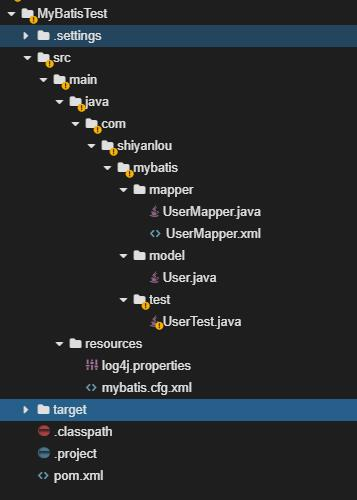

## 实验步骤

### 数据库准备

本次课程使用 MySQL 数据库。首先启动 mysql ：

```bash
sudo service mysql start
```

然后在终端下输入以下命令，进入到 MySQL 数据库（-u 表示用户名，比如这里的 root，-p 表示密码，这里没有密码就省略了）：

```bash
mysql -u root
```

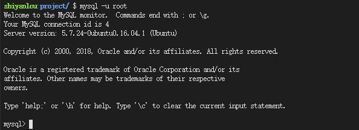

为了实验方便，我们在这里新建一个数据库并取名 `mybatis` 用作实验。

```sql
create database mybatis;
show databases;
```

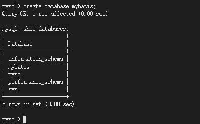

创建表 `user` ，代码如下：

```sql
use mybatis;
create table user(
id int primary key auto_increment,
username varchar(20),
password varchar(20),
sex varchar(10),
address varchar(20));
```

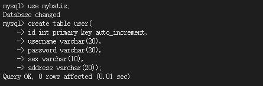

###  新建项目工程

首先打开 WEB IDE，选择 File->Open New Terminal，在终端中输入：

```bash
mvn archetype:generate -DgroupId=com.shiyanlou.mybatis -DartifactId=MyBatisTest -DarchetypeArtifactId=maven-archetype-quickstart
```

参数说明：

- Group Id：项目的组织机构，也是包的目录结构，一般都是域名的倒序，比如 `com.shiyanlou.mybatis`；
- DartifactId ：项目实际的名字，比如 `MyBatisTest`；
- archetype Artifact Id ：使用的 maven 骨架名称

输入命令之后，maven 会提示我们输入版本号，这里可以直接定义版本号也可以直接回车，接着 maven 会提示当前要创建项目的基本信息，输入 y 然后回车确认。 接着切换工作空间到`/home/project/MybatisTest`目录。

### 导入所需 jar 包

打开 pom.xml 文件，修改为以下内容

```xml
<project xmlns="http://maven.apache.org/POM/4.0.0" xmlns:xsi="http://www.w3.org/2001/XMLSchema-instance"
         xsi:schemaLocation="http://maven.apache.org/POM/4.0.0 http://maven.apache.org/maven-v4_0_0.xsd">
    <modelVersion>4.0.0</modelVersion>
    <groupId>com.shiyanlou.mybatis</groupId>
    <artifactId>MybatisTest</artifactId>
    <packaging>jar</packaging>
    <version>1.0-SNAPSHOT</version>
    <name>MybatisTest</name>
    <url>http://maven.apache.org</url>
    <dependencies>
        <dependency>
            <groupId>org.mybatis</groupId>
            <artifactId>mybatis</artifactId>
            <version>3.4.6</version>
        </dependency>
        <dependency>
            <groupId>mysql</groupId>
            <artifactId>mysql-connector-java</artifactId>
            <version>6.0.6</version>
        </dependency>
        <dependency>
            <groupId>log4j</groupId>
            <artifactId>log4j</artifactId>
            <version>1.2.17</version>
        </dependency>

    </dependencies>

    <build>
        <resources>
            <resource>
                <directory>src/main/java</directory>
                <includes>
                    <include>**/*.xml</include>
                </includes>
            </resource>
            <resource>
                <directory>src/main/resources</directory>
                <includes>
                    <include>**/*.*</include>
                </includes>
            </resource>
        </resources>
    </build>
</project>
```

###  配置文件 mybatis.cfg.xml

在项目目录 `src/main/` 下新建文件夹`resources`，接着在`resources`下新建 MyBatis 配置文件 `mybatis.cfg.xml` ，用来配置 Mybatis 的运行环境、数据源、事务等。

mybatis.cfg.xml 的配置如下，具体解释注释已经给出：

```xml
<?xml version="1.0" encoding="UTF-8"?>
<!DOCTYPE configuration PUBLIC "-//mybatis.org//DTD Config 3.0//EN" "http://mybatis.org/dtd/mybatis-3-config.dtd">
<configuration>
       <!-- 配置 mybatis 运行环境 -->
    <environments default="development">
        <environment id="development">
           <!-- type="JDBC" 代表直接使用 JDBC 的提交和回滚设置 -->
            <transactionManager type="JDBC" />

            <!-- POOLED 表示支持 JDBC 数据源连接池 -->
            <!-- 数据库连接池，由 Mybatis 管理，数据库名是 mybatis，MySQL 用户名 root，密码为空 -->
            <dataSource type="POOLED">
                <property name="driver" value="com.mysql.jdbc.Driver" />
                <property name="url" value="jdbc:mysql://localhost:3306/mybatis" />
                <property name="username" value="root" />
                <property name="password" value="" />
            </dataSource>
        </environment>
    </environments>
</configuration>
```

###  实体类 User

在包 `com.shiyanlou.mybatis.model` 下新建类 User.java ， 一个用户具有：id、username、password、sex、address 五个属性。作为 mybatis 进行 sql 映射使用，与数据库表对应。

User 类的代码如下：

```java
package com.shiyanlou.mybatis.model;

public class User {

    private Integer id;
    private String username;
    private String password;
    private String sex;
    private String address;

    public Integer getId() {
        return id;
    }

    public void setId(Integer id) {
        this.id = id;
    }

    public String getUsername() {
        return username;
    }

    public void setUsername(String username) {
        this.username = username;
    }

    public String getPassword() {
        return password;
    }

    public void setPassword(String password) {
        this.password = password;
    }

    public String getSex() {
        return sex;
    }

    public void setSex(String sex) {
        this.sex = sex;
    }

    public String getAddress() {
        return address;
    }

    public void setAddress(String address) {
        this.address = address;
    }

}
```

###  创建方法接口和定义映射文件

新建包 `com.shiyanlou.mybatis.mapper` ，并在包下新建方法接口 UserMapper.java ，提供简单的增删改查数据操作。

UserMapper 接口的代码如下：

```java
package com.shiyanlou.mybatis.mapper;

import java.util.List;

import com.shiyanlou.mybatis.model.User;

public interface UserMapper {

    /*
     * 新增用戶
     * @param user
     * @return
     * @throws Exception
     */
    public int insertUser(User user) throws Exception;

    /*
     * 修改用戶
     * @param user
     * @param id
     * @return
     * @throws Exception
     */
    public int updateUser(User user) throws Exception;

    /*
     * 刪除用戶
     * @param id
     * @return
     * @throws Exception
     */
    public int deleteUser(Integer id) throws Exception;

    /*
     * 根据 id 查询用户信息
     * @param id
     * @return
     * @throws Exception
     */
    public User selectUserById(Integer id) throws Exception;

    /*
     * 查询所有的用户信息
     * @return
     * @throws Exception
     */
    public List<User> selectAllUser() throws Exception;
}
```

在包 `com.shiyanlou.mybatis.mapper` 下新建映射文件 `UserMapper.xml` ，用来定义各种 SQL 语句和这些语句的参数，以及要返回的类型等。

UserMapper.xml 的配置如下：

```xml
<?xml version="1.0" encoding="UTF-8"?>
<!DOCTYPE mapper PUBLIC "-//mybatis.org/DTD Mapper 3.0" "http://mybatis.org/dtd/mybatis-3-mapper.dtd">
<mapper namespace="com.shiyanlou.mybatis.mapper.UserMapper">
    <!-- 自定义返回结果集 -->
    <resultMap id="userMap" type="User">
        <id property="id" column="id" javaType="int"></id>
        <result property="username" column="username" javaType="String"></result>
        <result property="password" column="password" javaType="String"></result>
        <result property="sex" column="sex" javaType="String"></result>
        <result property="address" column="address" javaType="String"></result>
    </resultMap>

    <!-- 定义 SQL 语句，其中 id 需要和接口中的方法名一致 -->
    <!-- useGeneratedKeys：实现自动生成主键 -->
    <!-- keyProperty： 唯一标记一个属性 -->
    <!-- parameterType 指明查询时使用的参数类型，resultType 指明查询返回的结果集类型 -->
    <insert id="insertUser" useGeneratedKeys="true" keyProperty="id">
        insert into user (username,password,sex,address) values
        (#{username},#{password},#{sex},#{address})
    </insert>

    <update id="updateUser"  parameterType="User">
        update user set
        address=#{address} where
        id=#{id}
    </update>

    <delete id="deleteUser" parameterType="int">
        delete from user where
        id=#{id}
    </delete>

    <!-- 如未为 Java Bean 起类别名，resultType="com.shiyanlou.mybatis.model.User" -->

    <!-- 使用 resultType 时，一定要保证，你属性名与字段名相同；如果不相同，就使用 resultMap -->
    <select id="selectUserById" parameterType="int" resultType="User">
        select * from user where id=#{id}
    </select>

    <select id="selectAllUser" resultMap="userMap">
        select * from user
    </select>

</mapper>
```

UserMapper.xml 映射文件写好后，需要在 mybatis.cfg.xml 中加载它，在 mybatis.cfg.xml 中添加代码：

```xml
<mappers>
    <!-- 通过 mapper 接口包加载整个包的映射文件 -->
    <package name="com.shiyanlou.mybatis.mapper" />
</mappers>
```

同时为 Java Bean 起别名，添加如下代码：

```xml
<!-- 为 JavaBean 起类别名 -->
<typeAliases>
    <!-- 指定一个包名起别名，将包内的 Java 类的类名作为类的类别名 -->
    <package name="com.shiyanlou.mybatis.model" />
</typeAliases>
```

注意顺序：typeAliases -> environments -> mappers

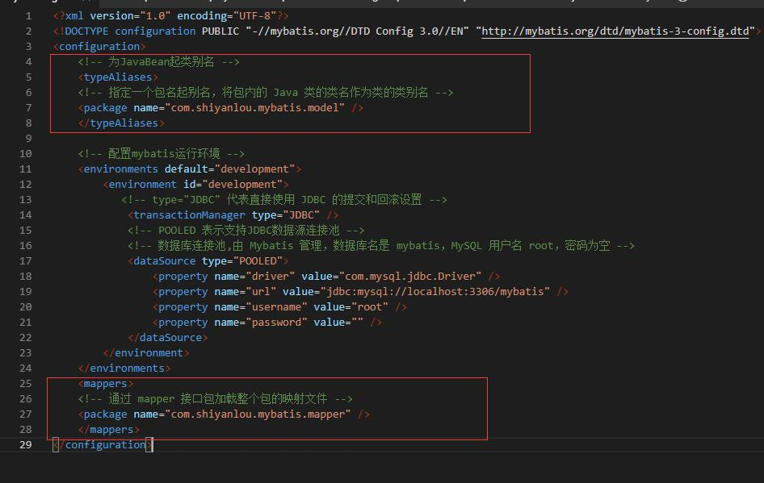

###  日志记录 log4j.properties

使用日志文件是为了查看控制台输出的 SQL 语句。

在项目目录 `src/main/resources` 下新建 MyBatis 日志记录文件 log4j.properties ，在里面添加如下内容：

```txt
# Global logging configuration
log4j.rootLogger=DEBUG, stdout
# Console output...
log4j.appender.stdout=org.apache.log4j.ConsoleAppender
log4j.appender.stdout.layout=org.apache.log4j.PatternLayout
log4j.appender.stdout.layout.ConversionPattern=%5p [%t] - %m%n
```

###  测试类 UserTest

在包 `com.shiyanlou.mybatis.test` 下新建测试类 `UserTest.java` ， 用来测试数据的增删改查操作。

UserTest 类的代码如下：

```java
package com.shiyanlou.mybatis.test;

import java.io.IOException;
import java.io.InputStream;
import java.util.List;

import org.apache.ibatis.io.Resources;
import org.apache.ibatis.session.SqlSession;
import org.apache.ibatis.session.SqlSessionFactory;
import org.apache.ibatis.session.SqlSessionFactoryBuilder;

import com.shiyanlou.mybatis.mapper.UserMapper;
import com.shiyanlou.mybatis.model.User;

public class UserTest {
    private static SqlSessionFactory sqlSessionFactory;

    public static void main(String[] args) {
        // Mybatis 配置文件
        String resource = "mybatis.cfg.xml";

        // 得到配置文件流
        InputStream inputStream = null;
        try {
            inputStream = Resources.getResourceAsStream(resource);
        } catch (IOException e) {
            e.printStackTrace();
        }

        // 创建会话工厂，传入 MyBatis 的配置文件信息
        sqlSessionFactory = new SqlSessionFactoryBuilder().build(inputStream);

        insertUser();
        // updateUser();
        // deleteUser();
        // selectUserById();
        // selectAllUser();

    }

    // 新增用戶
    private static void insertUser() {
        // 通过工厂得到 SqlSession
        SqlSession session = sqlSessionFactory.openSession();

        UserMapper mapper = session.getMapper(UserMapper.class);
        User user = new User();
        user.setUsername("Tom");
        user.setPassword("123456");
        user.setSex("male");
        user.setAddress("chengdu");
        try {
            mapper.insertUser(user);

            session.commit();
        } catch (Exception e) {
            e.printStackTrace();
            session.rollback();
        }

        // 释放资源
        session.close();
    }

    // 更新用戶
    private static void updateUser() {

        SqlSession session = sqlSessionFactory.openSession();

        UserMapper mapper = session.getMapper(UserMapper.class);
        User user = null;
        try {
            user = mapper.selectUserById(1);
        } catch (Exception e1) {
            e1.printStackTrace();
        }
        user.setAddress("chongqing");
        try {
            mapper.updateUser(user);
            session.commit();
        } catch (Exception e) {
            e.printStackTrace();
            session.rollback();
        }

        session.close();
    }

    // 删除用戶
    private static void deleteUser() {

        SqlSession session = sqlSessionFactory.openSession();

        UserMapper mapper = session.getMapper(UserMapper.class);
        try {
            mapper.deleteUser(3);
            session.commit();
        } catch (Exception e) {
            e.printStackTrace();
            session.rollback();
        }

        session.close();
    }

    // 根据 id 查询用户信息
    private static void selectUserById() {

        SqlSession session = sqlSessionFactory.openSession();

        UserMapper mapper = session.getMapper(UserMapper.class);
        try {
            User user = mapper.selectUserById(1);
            session.commit();
            System.out.println(user.getId() + " " + user.getUsername() + " "
                    + user.getPassword() + " " + user.getSex() + " "
                    + user.getAddress());
        } catch (Exception e) {
            e.printStackTrace();
            session.rollback();
        }

        session.close();
    }

    // 查询所有的用户信息
    private static void selectAllUser() {

        SqlSession session = sqlSessionFactory.openSession();

        UserMapper mapper = session.getMapper(UserMapper.class);
        try {
            List<User> userList = mapper.selectAllUser();
            session.commit();
            for (User user : userList) {
                System.out.println(user.getId() + " " + user.getUsername() + " "
                        + user.getPassword() + " " + user.getSex() + " "
                        + user.getAddress());
            }
        } catch (Exception e) {
            e.printStackTrace();
            session.rollback();
        }

        session.close();
    }
}
```

### 运行测试

分别调用 UserTest 类中的增删改查方法。使用下面的命令就可以运行`UserTest.java`

```bash
mvn compile
mvn exec:java -Dexec.mainClass="com.shiyanlou.mybatis.test.UserTest" -Dexec.cleanupDaemonThreads=false
```

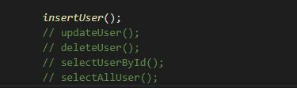

结果如下：

#### insertUser()

插入一条用户数据：

（1）控制台输出

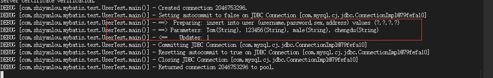

（2）查看数据库

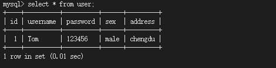

#### updateUser()

将 id 为 1 的用户的 address 修改为 chongqing：

（1）控制台输出

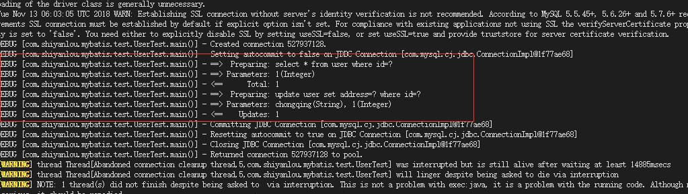

（2）查看数据库

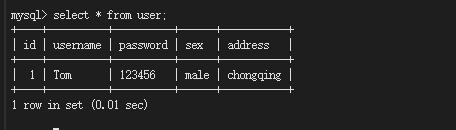

#### deleteUser()

在进行测试之前，再往数据库表中插入两行用户记录。

```sql
insert into user (id,username,password,sex,address) values (2,"Jack","13579","male","beijing"),(3,"Rose","24680","female","shanghai");
```

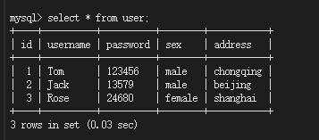

将 id 为 3 的用户删除：

（1）控制台输出

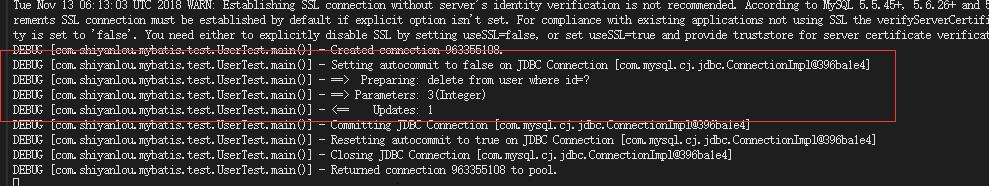

（2）查看数据库

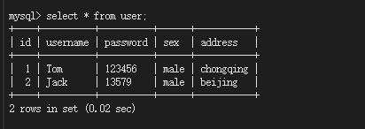

#### selectUserById()

查询 id 为 1 的用户信息：

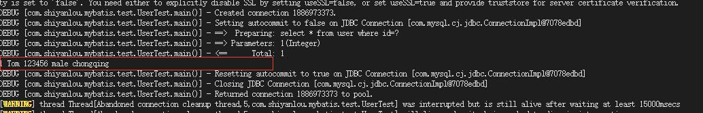

#### selectAllUser()

查询所有用户信息：

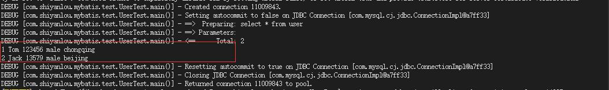

