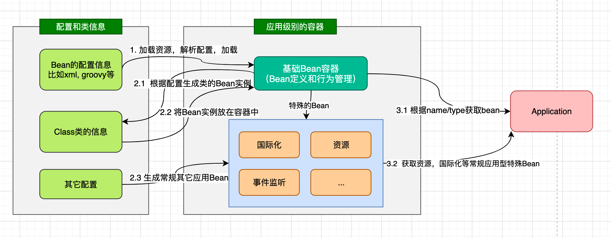
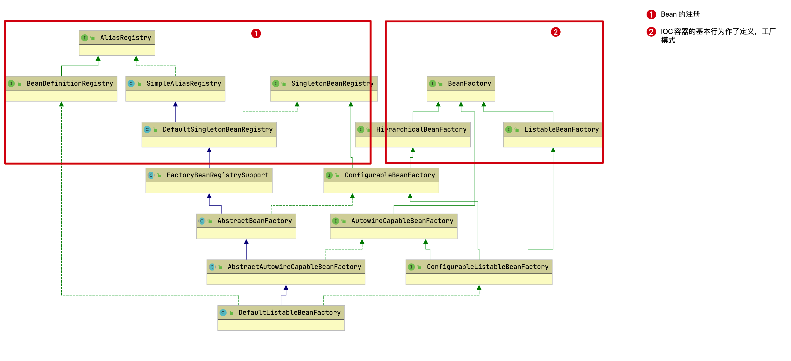
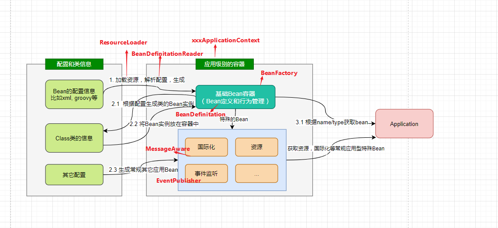

# Bean工厂
[[TOC]]

IoC是设计思想，IoC有三个核心：BeanFactory、反射、DI。BeanFactory利用反射实现对象的创建，DI实现对象关系管理。
## BeanFactory---IOC容器功能规范]
我们初步的画出IOC容器的整体功能。



在此基础上，我们初步的去思考，如果作为一个IOC容器的设计者，主体上应该包含哪几个部分： 
- 加载Bean的配置（比如xml配置）
  比如不同类型资源的加载，解析成生成统一Bean的定义 
- 根据Bean的定义加载生成Bean的实例，并放置在Bean容器中
  比如Bean的依赖注入，Bean的嵌套，Bean存放（缓存）等 
- 除了基础Bean外，还有常规针对企业级业务的特别Bean
  比如国际化Message，事件Event等生成特殊的类结构去支撑 
- 对容器中的Bean提供统一的管理和调用
  比如用工厂模式管理，提供方法根据名字/类的类型等从容器中获取Bean 


Spring Bean的创建是典型的工厂模式，这一系列的Bean工厂，也即IOC容器为开发者管理对象间的依赖关系提供了很多便利和基础服务，在Spring中有许多的IOC容器的实现供用户选择和使用，这是IOC容器的基础；在顶层的结构设计主要围绕着BeanFactory和xxxRegistry进行： 
- BeanFactory： 工厂模式定义了IOC容器的基本功能规范 
- BeanRegistry： 向IOC容器手工注册 
- BeanDefinition 对象的方法

其相互关系如下：



### BeanFactory定义了IOC 容器基本功能规范？

BeanFactory作为最顶层的一个接口类，它定义了IOC容器的基本功能规范，BeanFactory 有三个子类：ListableBeanFactory、HierarchicalBeanFactory 和AutowireCapableBeanFactory。我们看下BeanFactory接口：
```java
public interface BeanFactory {    
      
    //用于取消引用实例并将其与FactoryBean创建的bean区分开来。例如，如果命名的bean是FactoryBean，则获取将返回Factory，而不是Factory返回的实例。
    String FACTORY_BEAN_PREFIX = "&"; 
        
    //根据bean的名字和Class类型等来得到bean实例    
    Object getBean(String name) throws BeansException;    
    Object getBean(String name, Class requiredType) throws BeansException;    
    Object getBean(String name, Object... args) throws BeansException;
    <T> T getBean(Class<T> requiredType) throws BeansException;
    <T> T getBean(Class<T> requiredType, Object... args) throws BeansException;

    //返回指定bean的Provider
    <T> ObjectProvider<T> getBeanProvider(Class<T> requiredType);
    <T> ObjectProvider<T> getBeanProvider(ResolvableType requiredType);

    //检查工厂中是否包含给定name的bean，或者外部注册的bean
    boolean containsBean(String name);

    //检查所给定name的bean是否为单例/原型
    boolean isSingleton(String name) throws NoSuchBeanDefinitionException;
    boolean isPrototype(String name) throws NoSuchBeanDefinitionException;

    //判断所给name的类型与type是否匹配
    boolean isTypeMatch(String name, ResolvableType typeToMatch) throws NoSuchBeanDefinitionException;
    boolean isTypeMatch(String name, Class<?> typeToMatch) throws NoSuchBeanDefinitionException;

    //获取给定name的bean的类型
    @Nullable
    Class<?> getType(String name) throws NoSuchBeanDefinitionException;

    //返回给定name的bean的别名
    String[] getAliases(String name);
     
}
```

### BeanFactory为何要定义这么多层次的接口？定义了哪些接口？

主要是为了区分在 Spring 内部在操作过程中对象的传递和转化过程中，对对象的数据访问所做的限制。

有哪些接口呢？ 

- ListableBeanFactory：该接口定义了访问容器中 Bean 基本信息的若干方法，如查看Bean 的个数、获取某一类型 Bean 的配置名、查看容器中是否包括某一 Bean 等方法； 
- HierarchicalBeanFactory：父子级联 IoC 容器的接口，子容器可以通过接口方法访问父容器； 通过 HierarchicalBeanFactory 接口， Spring 的 IoC 容器可以建立父子层级关联的容器体系，子容器可以访问父容器中的 Bean，但父容器不能访问子容器的 Bean。Spring 使用父子容器实现了很多功能，比如在 Spring MVC 中，展现层 Bean 位于一个子容器中，而业务层和持久层的 Bean 位于父容器中。这样，展现层 Bean 就可以引用业务层和持久层的 Bean，而业务层和持久层的 Bean 则看不到展现层的 Bean。 
- ConfigurableBeanFactory：是一个重要的接口，增强了 IoC 容器的可定制性，它定义了设置类装载器、属性编辑器、容器初始化后置处理器等方法； 
- ConfigurableListableBeanFactory: ListableBeanFactory 和 ConfigurableBeanFactory的融合；
- AutowireCapableBeanFactory：定义了将容器中的 Bean 按某种规则（如按名字匹配、按类型匹配等）进行自动装配的方法；
### 如何将Bean注册到BeanFactory中？BeanRegistry

Spring 配置文件中每一个`<bean>`节点元素在 Spring 容器里都通过一个 BeanDefinition 对象表示，它描述了 Bean 的配置信息。而 BeanDefinitionRegistry 接口提供了向容器手工注册 BeanDefinition 对象的方法。


把之前的设计要点和设计结构结合起来看:



