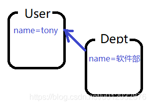

# DI依赖注入
[[TOC]]

## 概述
相对于IoC而言，依赖注入(DI)更加准确地描述了IoC的设计理念。所谓依赖注入，即组件之间的依赖关系由容器在应用系统运行期来决定，也就是由容器动态地将某种依赖关系的目标对象实例注入到应用系统中的各个关联的组件之中。



### IOC和DI是什么关系

控制反转是通过依赖注入实现的，其实它们是同一个概念的不同角度描述。**通俗来说就是IoC是设计思想，DI是实现方式。**


DI—Dependency Injection，即依赖注入：组件之间依赖关系由容器在运行期决定，形象的说，即由容器动态的将某个依赖关系注入到组件之中。依赖注入的目的并非为软件系统带来更多功能，而是为了提升组件重用的频率，并为系统搭建一个灵活、可扩展的平台。通过依赖注入机制，我们只需要通过简单的配置，而无需任何代码就可指定目标需要的资源，完成自身的业务逻辑，而不需要关心具体的资源来自何处，由谁实现。 

我们来深入分析一下： 
- 谁依赖于谁？ 
  当然是应用程序依赖于IoC容器； 
- 为什么需要依赖？ 
  应用程序需要IoC容器来提供对象需要的外部资源； 
- 谁注入谁？ 
  很明显是IoC容器注入应用程序某个对象，应用程序依赖的对象； 
- 注入了什么？ 
  就是注入某个对象所需要的外部资源（包括对象、资源、常量数据）。 
- IoC和DI由什么关系呢？ 
  其实它们是同一个概念的不同角度描述，由于控制反转概念比较含糊（可能只是理解为容器控制对象这一个层面，很难让人想到谁来维护对象关系），所以2004年大师级人物Martin Fowler又给出了一个新的名字：“依赖注入”，相对IoC 而言，“依赖注入”明确描述了“被注入对象依赖IoC容器配置依赖对象”。通俗来说就是IoC是设计思想，DI是实现方式。

## 依赖注入的三种方式

### 构造方法注入（Construct注入）
在XML配置方式中，<constructor-arg>是通过构造函数参数注入，比如下面的xml:
```xml
<?xml version="1.0" encoding="UTF-8"?>
<beans xmlns="http://www.springframework.org/schema/beans"
       xmlns:xsi="http://www.w3.org/2001/XMLSchema-instance"
       xsi:schemaLocation="http://www.springframework.org/schema/beans
 http://www.springframework.org/schema/beans/spring-beans.xsd">
    <!-- services -->
    <bean id="userService" class="tech.pdai.springframework.service.UserServiceImpl">
        <constructor-arg name="userDao" ref="userDao"/>
        <!-- additional collaborators and configuration for this bean go here -->
    </bean>
    <!-- more bean definitions for services go here -->
</beans>
```
本质上是new UserServiceImpl(userDao)创建对象, 所以对应的service类是这样的：
```java
/**
 * @author pdai
 */
public class UserServiceImpl {

    /**
     * user dao impl.
     */
    private final UserDaoImpl userDao;

    /**
     * init.
     * @param userDaoImpl user dao impl
     */
    public UserServiceImpl(UserDaoImpl userDaoImpl) {
        this.userDao = userDaoImpl;
    }

    /**
     * find user list.
     *
     * @return user list
     */
    public List<User> findUserList() {
        return this.userDao.findUserList();
    }

}

```
**在注解和Java配置方式下**

```java
/**
 * @author pdai
 */
 @Service
public class UserServiceImpl {

    /**
     * user dao impl.
     */
    private final UserDaoImpl userDao;

    /**
     * init.
     * @param userDaoImpl user dao impl
     */
    @Autowired // 这里@Autowired也可以省略
    public UserServiceImpl(final UserDaoImpl userDaoImpl) {
        this.userDao = userDaoImpl;
    }

    /**
     * find user list.
     *
     * @return user list
     */
    public List<User> findUserList() {
        return this.userDao.findUserList();
    }

}
```
在Spring4.x版本中推荐的注入方式就是这种.
### setter注入
在XML配置方式中，property都是setter方式注入，比如下面的xml:
```xml
<?xml version="1.0" encoding="UTF-8"?>
<beans xmlns="http://www.springframework.org/schema/beans"
       xmlns:xsi="http://www.w3.org/2001/XMLSchema-instance"
       xsi:schemaLocation="http://www.springframework.org/schema/beans
 http://www.springframework.org/schema/beans/spring-beans.xsd">
    <!-- services -->
    <bean id="userService" class="tech.pdai.springframework.service.UserServiceImpl">
        <property name="userDao" ref="userDao"/>
        <!-- additional collaborators and configuration for this bean go here -->
    </bean>
    <!-- more bean definitions for services go here -->
</beans>
```
本质上包含两步： 第一步，需要new UserServiceImpl()创建对象, 所以需要默认构造函数 第二步，调用setUserDao()函数注入userDao的值, 所以需要setUserDao()函数 所以对应的service类是这样的：
```java
/**
 * @author pdai
 */
public class UserServiceImpl {

    /**
     * user dao impl.
     */
    private UserDaoImpl userDao;

    /**
     * init.
     */
    public UserServiceImpl() {
    }

    /**
     * find user list.
     *
     * @return user list
     */
    public List<User> findUserList() {
        return this.userDao.findUserList();
    }

    /**
     * set dao.
     *
     * @param userDao user dao
     */
    public void setUserDao(UserDaoImpl userDao) {
        this.userDao = userDao;
    }
}
```

**在注解和Java配置方式下**
```java
/**
 * @author pdai
 */
public class UserServiceImpl {

    /**
     * user dao impl.
     */
    private UserDaoImpl userDao;

    /**
     * find user list.
     *
     * @return user list
     */
    public List<User> findUserList() {
        return this.userDao.findUserList();
    }

    /**
     * set dao.
     *
     * @param userDao user dao
     */
    @Autowired
    public void setUserDao(UserDaoImpl userDao) {
        this.userDao = userDao;
    }
}
```
在Spring3.x刚推出的时候，推荐使用注入的就是这种, 但是这种方式比较麻烦，所以在Spring4.x版本中推荐构造函数注入。
### 基于注解的注入（接口注入）
#### 自动装配
利用注解方式，我们只需要写@Autowired注解，底层就会去容器中找对应的对象，如果有获取到，反射调用其对应的set方法，设置。而这个调用过程都是自动，我们没有手工去写set方法。所以这个过程也称为自动装配。

关于`@Autowired`的装配机制：

首先，会根据需要装配的数据的类型在Spring容器中查找匹配的Bean（对象）的数量，当数量为：

- 0个：判断`@Autowired`注解的`required`属性的值
  - 当`required=true`时：装配失败，启动项目时即报告异常
  - 当`required=false`时：放弃自动装配，不会报告异常
    - 后续当使用到此属性时，会出现`NullPointerException`
- 1个：直接装配，且装配成功
- 多个：自动尝试按照名称实现装配（属性的名称与Spring Bean的名称）
  - 存在与属性名称匹配的Spring Bean：装配成功
  - 不存在与属性名称匹配的Spring Bean：装配失败，启动项目时即报告异常

另外，使用`@Resource`注解也可以实现自动装配（此注解是`javax`包中的），其装配机制是先尝试根据名称来装配，如果失败，再尝试根据类型装配！

除了对属性装配以外，Spring的自动装配机制还可以表现出：如果**某个方法是由Spring框架自动调用的**（通常是构造方法，或`@Bean`方法，其它的方法中，如果参数有限制则专门说明），当这个方法被声明了参数时，Spring框架也会自动的尝试从容器找到匹配的对象，用于调用此方法！

以@Autowired（自动注入）注解注入为例，修饰符有三个属性：Constructor，byType，byName。默认按照byType注入。 
- constructor：通过构造方法进行自动注入，spring会匹配与构造方法参数类型一致的bean进行注入，如果有一个多参数的构造方法，一个只有一个参数的构造方法，在容器中查找到多个匹配多参数构造方法的bean，那么spring会优先将bean注入到多参数的构造方法中。 
- byName：被注入bean的id名必须与set方法后半截匹配，并且id名称的第一个单词首字母必须小写，这一点与手动set注入有点不同。 
- byType：查找所有的set方法，将符合符合参数类型的bean注入。

比如:
```java
/**
 * @author pdai
 */
@Service
public class UserServiceImpl {

    /**
     * user dao impl.
     */
    @Autowired //相当于框架完成了:new UserServiceImpl().setUserDao(UserDaoImpl userDao);
    private UserDaoImpl userDao;

    /**
     * find user list.
     *
     * @return user list
     */
    public List<User> findUserList() {
        return userDao.findUserList();
    }

}
```
## 读取properties配置文件中的信息

操作步骤：

- 创建新的工程`spring04`，创建步骤参考前序案例

- 在`src/main/resources`文件夹下创建`jdbc.properties`，内容为：

  ```
  spring.jdbc.url=jdbc:mysql://localhost:3306/tedu
  spring.jdbc.driver=com.mysql.jdbc.Driver
  spring.jdbc.username=root
  spring.jdbc.password=1234
  spring.jdbc.init-size=5
  spring.jdbc.max-active=20
  ```

  **注意：自定义的属性名称建议添加一些前缀，避免与系统属性和Java属性冲突。**

- 在`src/main/java`下创建Java类，使用`@PropertySource`注解读取以上配置文件中的信息，则创建`cn.tedu.spring.SpringConfig`类：

  ```java
  package cn.tedu.spring;
  
  import org.springframework.context.annotation.ComponentScan;
  import org.springframework.context.annotation.Configuration;
  import org.springframework.context.annotation.PropertySource;
  
  @Configuration
  @ComponentScan("cn.tedu.spring")
  @PropertySource("classpath:jdbc.properties")
  public class SpringConfig {
  }
  ```

  提示：当Spring框架读取了配置文件中的信息后，会将这些读取到的数据封装在内置的`Environment`对象中，后续，任何需要这些配置信息的组件都可以从`Environment`中读取到配置的数据。

- 接下来，可以创建某个Java类，从`Environment`中读取配置的数据，例如创建`JdbcConfig`类：

  ```java
  package cn.tedu.spring;
  
  import org.springframework.beans.factory.annotation.Value;
  import org.springframework.stereotype.Component;
  
  @Component
  public class JdbcConfig {
  
      @Value("${spring.jdbc.url}")
      private String url;
      @Value("${spring.jdbc.driver}")
      private String driver;
      @Value("${spring.jdbc.username}")
      private String username;
      @Value("${spring.jdbc.password}")
      private String password;
      @Value("${spring.jdbc.init-size}")
      private int initSize;
      @Value("${spring.jdbc.max-active}")
      private int maxActive;
  
      public String getUrl() {
          return url;
      }
  
      public void setUrl(String url) {
          this.url = url;
      }
  
      public String getDriver() {
          return driver;
      }
  
      public void setDriver(String driver) {
          this.driver = driver;
      }
  
      public String getUsername() {
          return username;
      }
  
      public void setUsername(String username) {
          this.username = username;
      }
  
      public String getPassword() {
          return password;
      }
  
      public void setPassword(String password) {
          this.password = password;
      }
  
      public int getInitSize() {
          return initSize;
      }
  
      public void setInitSize(int initSize) {
          this.initSize = initSize;
      }
  
      public int getMaxActive() {
          return maxActive;
      }
  
      public void setMaxActive(int maxActive) {
          this.maxActive = maxActive;
      }
  }
  ```

  提示：前序的操作中，在`SpringConfig`中已经配置了组件扫描，这个`JdbcConfig`类必须在组件扫描的范围内，并添加组件注解，这样Spring框架才会创建`JdbcConfig`类的对象，进而根据各`@Value`注解将`Environment`中的配置数据注入到属性中

- 最后，可以执行本案例：

  ```java
  package cn.tedu.spring;
  
  import org.springframework.context.annotation.AnnotationConfigApplicationContext;
  
  public class SpringRunner {
  
      public static void main(String[] args) {
          // 1. 加载Spring
          System.out.println("1. 加载Spring，开始……");
          AnnotationConfigApplicationContext ac
                  = new AnnotationConfigApplicationContext(SpringConfig.class);
          System.out.println("1. 加载Spring，完成！");
          System.out.println();
  
          // 2. 从Spring中获取对象
          System.out.println("2. 从Spring中获取对象，开始……");
          JdbcConfig jdbcConfig = ac.getBean("jdbcConfig", JdbcConfig.class);
          System.out.println("2. 从Spring中获取对象，完成！");
          System.out.println();
  
          // 3. 测试使用对象，以便于观察是否获取到了有效的对象
          System.out.println("3. 测试使用对象，开始……");
          System.out.println("\turl >> " + jdbcConfig.getUrl());
          System.out.println("\tdriver >> " + jdbcConfig.getDriver());
          System.out.println("\tusername >> " + jdbcConfig.getUsername());
          System.out.println("\tpassword >> " + jdbcConfig.getPassword());
          System.out.println("\tinit-size >> " + jdbcConfig.getInitSize());
          System.out.println("\tmax-active >> " + jdbcConfig.getMaxActive());
          System.out.println("3. 测试使用对象，完成！");
          System.out.println();
  
          // 4. 关闭
          System.out.println("4. 关闭，开始……");
          ac.close();
          System.out.println("4. 关闭，完成！");
      }
  }
  ```

另外，还可以直接装配一个`Environment`对象，并在需要的时候通过`Environment`对象读取配置的数据，例如：

```java
package cn.tedu.spring;

import org.springframework.beans.factory.annotation.Autowired;
import org.springframework.core.env.Environment;
import org.springframework.stereotype.Component;

@Component
public class EnvironmentData {

    @Autowired
    private Environment environment;

    public Environment getEnvironment() {
        return environment;
    }

}
```

```java
package cn.tedu.spring;

import org.springframework.context.annotation.AnnotationConfigApplicationContext;
import org.springframework.core.env.Environment;

public class SpringRunner {

    public static void main(String[] args) {
        // 1. 加载Spring
        System.out.println("1. 加载Spring，开始……");
        AnnotationConfigApplicationContext ac
                = new AnnotationConfigApplicationContext(SpringConfig.class);
        System.out.println("1. 加载Spring，完成！");
        System.out.println();

        // 2. 从Spring中获取对象
        System.out.println("2. 从Spring中获取对象，开始……");
        EnvironmentData environmentData
                = ac.getBean("environmentData", EnvironmentData.class);
        System.out.println("2. 从Spring中获取对象，完成！");
        System.out.println();

        // 3. 测试使用对象，以便于观察是否获取到了有效的对象
        System.out.println("3. 测试使用对象，开始……");
        System.out.println("---------------------------------------");
        System.out.println("通过自动装配Environment对象获取的值：");
        Environment env = environmentData.getEnvironment();
        System.out.println("\tEnvironment >> " + env);
        System.out.println("\turl >> " + env.getProperty("spring.jdbc.url"));
        System.out.println("\tdriver >> " + env.getProperty("spring.jdbc.driver"));
        System.out.println("\tusername >> " + env.getProperty("spring.jdbc.username"));
        System.out.println("\tpassword >> " + env.getProperty("spring.jdbc.password"));
        System.out.println("\tinit-size >> " + env.getProperty("spring.jdbc.init-size"));
        System.out.println("\tmax-active >> " + env.getProperty("spring.jdbc.max-active"));
        System.out.println("3. 测试使用对象，完成！");
        System.out.println();

        // 4. 关闭
        System.out.println("4. 关闭，开始……");
        ac.close();
        System.out.println("4. 关闭，完成！");
    }
}
```


## IOC和DI使用问题小结

### 关于Spring框架的小结
关于Spring框架，你应该：

- 了解Spring框架的作用：创建对象，管理对象
- 掌握通过Spring创建对象的2种方式：
  - 在配置类（带`@Configuration`注解的类）中使用`@Bean`方法
  - 使用组件扫描，并在类上添加组件注解
    - 组件注解有：`@Component`、`@Controller`、`@Service`、`@Repository`
  - 如果是自定义的类，应该使用组件扫描+组件注解的方式，如果不是自定义的类，必须使用配置类中的`@Bean`方法
- 了解Spring Bean的作用域与生命周期
- 掌握`@Autowired`自动装配，理解其装配机制
  - 建议背下来：`@Autowired`与`@Resource`的区别
- 掌握读取`.properties`配置文件中的数据
  - 先使用`@PropertySource`注解指定需要读取的文件
  - 读取配置的数据时，可以：
    - 使用`@Value`注解将值注入到属性中
    - 自动装配`Environment`对象，并调用此对象的`getProperty()`方法以获取配置值
- 了解Spring的IoC（Inversion of Controll：控制反转）和DI（Dependency Injection：依赖注入）
  - Spring框架基于DI实现了IoC，DI是一种实现手段，IoC是最终实现的目标/效果

### @Autowired和@Resource以及@Inject等注解注入有何区别？

#### @Autowired

##### Autowired注解源码
在Spring 2.5 引入了 @Autowired 注解

```java
@Target({ElementType.CONSTRUCTOR, ElementType.METHOD, ElementType.PARAMETER, ElementType.FIELD, ElementType.ANNOTATION_TYPE})
@Retention(RetentionPolicy.RUNTIME)
@Documented
public @interface Autowired {
  boolean required() default true;
}
```
从Autowired注解源码上看，可以使用在下面这些地方：

```java
@Target(ElementType.CONSTRUCTOR) #构造函数
@Target(ElementType.METHOD) #方法
@Target(ElementType.PARAMETER) #方法参数
@Target(ElementType.FIELD) #字段、枚举的常量
@Target(ElementType.ANNOTATION_TYPE) #注解
```
还有一个value属性，默认是true。

##### 简单总结


1、@Autowired是Spring自带的注解，通过AutowiredAnnotationBeanPostProcessor 类实现的依赖注入 

2、@Autowired可以作用在CONSTRUCTOR、METHOD、PARAMETER、FIELD、ANNOTATION_TYPE 

3、@Autowired默认是根据类型（byType ）进行自动装配的 

4、如果有多个类型一样的Bean候选者，需要指定按照名称（byName ）进行装配，则需要配合@Qualifier。 

指定名称后，如果Spring IOC容器中没有对应的组件bean抛出NoSuchBeanDefinitionException。也可以将@Autowired中required配置为false，如果配置为false之后，当没有找到相应bean的时候，系统不会抛异常


##### 简单使用代码
在字段属性上。
```java
@Autowired
private HelloDao helloDao;
```
或者
```java
private HelloDao helloDao;
public HelloDao getHelloDao() {
 return helloDao;
}
@Autowired
public void setHelloDao(HelloDao helloDao) {
 this.helloDao = helloDao;
}
```
或者
```java
private HelloDao helloDao;
//@Autowired
public HelloServiceImpl(@Autowired HelloDao helloDao) {
 this.helloDao = helloDao;
}
// 构造器注入也可不写@Autowired，也可以注入成功。
```


将@Autowired写在被注入的成员变量上，setter或者构造器上，就不用再xml文件中配置了。 

如果有多个类型一样的Bean候选者，则默认根据设定的属性名称进行获取。如 HelloDao 在Spring中有 helloWorldDao 和 helloDao 两个Bean候选者。
```java
@Autowired
private HelloDao helloDao;
```
首先根据类型获取，发现多个HelloDao，然后根据helloDao进行获取，如果要获取限定的其中一个候选者，结合@Qualifier进行注入

```java
@Autowired
@Qualifier("helloWorldDao")
private HelloDao helloDao;
```
著作权归https://pdai.tech所有。
链接：https://pdai.tech/md/spring/spring-x-framework-ioc.html

注入名称为helloWorldDao 的Bean组件。@Qualifier("XXX") 中的 XX是 Bean 的名称，所以 @Autowired 和 @Qualifier 结合使用时，自动注入的策略就从 byType 转变成 byName 了。

多个类型一样的Bean候选者，也可以@Primary进行使用，设置首选的组件，也就是默认优先使用哪一个。

注意：使用@Qualifier 时候，如何设置的指定名称的Bean不存在，则会抛出异常，如果防止抛出异常，可以使用：

```java
@Qualifier("xxxxyyyy")
@Autowired(required = false)
private HelloDao helloDao;
```
在SpringBoot中也可以使用@Bean+@Autowired进行组件注入，将@Autowired加到参数上，其实也可以省略。

```java
@Bean
public Person getPerson(@Autowired Car car){
 return new Person();
}
// @Autowired 其实也可以省略
```

#### @Resource

##### Resource注解源码
```java
@Target({TYPE, FIELD, METHOD})
@Retention(RUNTIME)
public @interface Resource {
    String name() default "";
    // 其他省略
}
```
从Resource注解源码上看，可以使用在下面这些地方
```java
@Target(ElementType.TYPE) #接口、类、枚举、注解
@Target(ElementType.FIELD) #字段、枚举的常量
@Target(ElementType.METHOD) #方法
```
name 指定注入指定名称的组件。
##### 简单总结

1、@Resource是JSR250规范的实现，在javax.annotation包下 

2、@Resource可以作用TYPE、FIELD、METHOD上

3、@Resource是默认根据属性名称进行自动装配的，如果有多个类型一样的Bean候选者，则可以通过name进行指定进行注入
##### 简单使用代码
```java
@Component
public class SuperMan {
    @Resource
    private Car car;
}
```
按照属性名称 car 注入容器中的组件。如果容器中BMW还有BYD两种类型组件。指定加入BMW。如下代码：

```java
@Component
public class SuperMan {
    @Resource(name = "BMW")
    private Car car;
}
```
name 的作用类似 @Qualifier

#### @Inject

##### Inject注解源码
```java
@Target({ METHOD, CONSTRUCTOR, FIELD })
@Retention(RUNTIME)
@Documented
public @interface Inject {}
```
从Inject注解源码上看，可以使用在下面这些地方：
```java
@Target(ElementType.CONSTRUCTOR) #构造函数
@Target(ElementType.METHOD) #方法
@Target(ElementType.FIELD) #字段、枚举的常量
```
##### 简单总结
1、@Inject是JSR330 (Dependency Injection for Java)中的规范，需要导入javax.inject.Inject jar包 ，才能实现注入 

2、@Inject可以作用CONSTRUCTOR、METHOD、FIELD上 

3、@Inject是根据类型进行自动装配的，如果需要按名称进行装配，则需要配合@Named；

##### 简单使用代码
```java
@Inject
private Car car;
```

指定加入BMW组件。
```java
@Inject
@Named("BMW")
private Car car;
```
@Named 的作用类似 @Qualifier！

#### 总结


1、@Autowired是Spring自带的，@Resource是JSR250规范实现的，@Inject是JSR330规范实现的 

2、@Autowired、@Inject用法基本一样，不同的是@Inject没有required属性 

3、@Autowired、@Inject是默认按照类型匹配的，@Resource是按照名称匹配的 

4、@Autowired如果需要按照名称匹配需要和@Qualifier一起使用，@Inject和@Named一起使用，@Resource则通过name进行指定