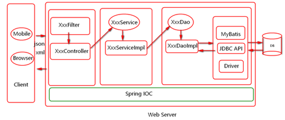
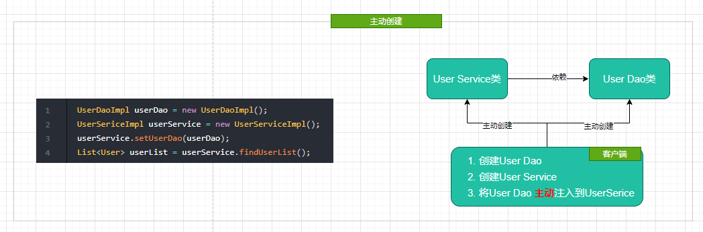
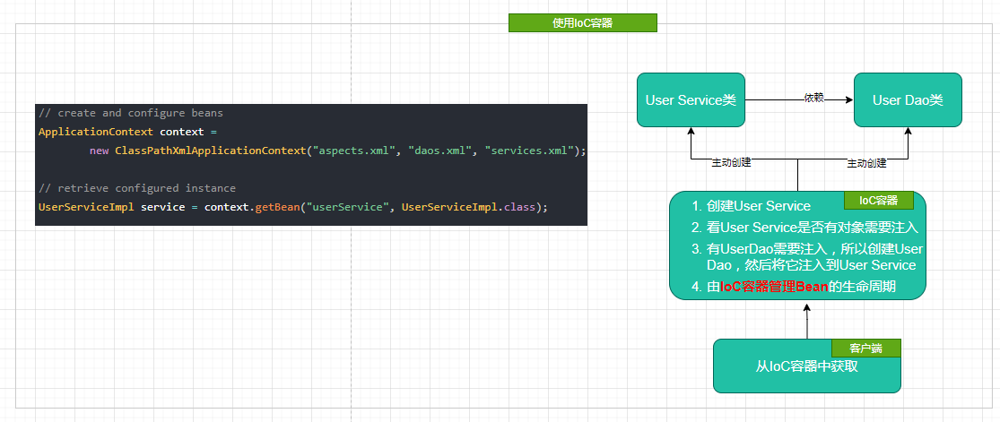
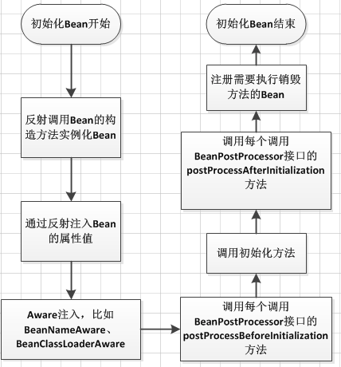
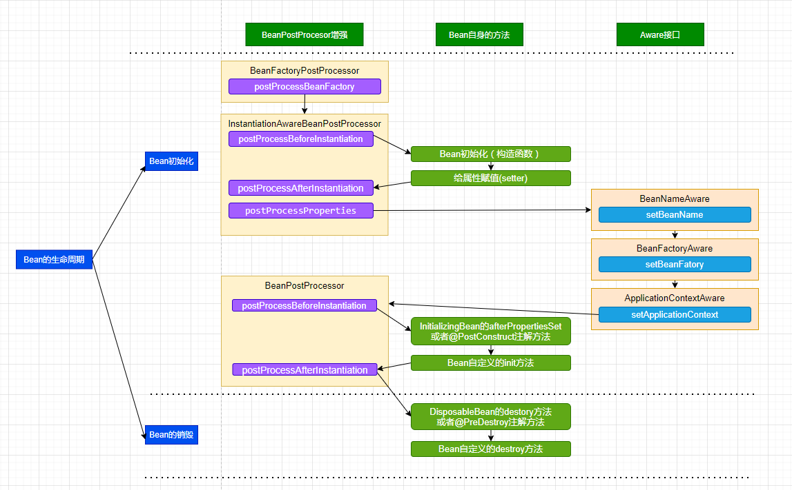

# IOC控制反转
[[TOC]]

## 概述
就是指将对象的创建，对象的存储(map)，对象的管理(依赖查找,依赖注入)交给了spring容器。



如果你有精力看英文，首推 Martin Fowler大师的 [Inversion of Control Containers and the Dependency Injection pattern](https://www.martinfowler.com/articles/injection.html)；其次IoC作为一种设计思想，不要过度解读，而是应该简化理解，所以我这里也整合了 张开涛早前的博客[IoC基础](https://www.iteye.com/blog/jinnianshilongnian-1413846)并加入了自己的理解。

## 如何理解IoC
### Spring Bean是什么
Spring里面的bean就类似是定义的一个组件，而这个组件的作用就是实现某个功能的，这里所定义的bean就相当于给了你一个更为简便的方法来调用这个组件去实现你要完成的功能。
### IoC是什么
IoC—Inversion of Control，即“控制反转”，不是什么技术，而是一种设计思想。在Java开发中，IoC意味着将你设计好的对象交给容器控制，而不是传统的在你的对象内部直接控制。


我们来深入分析一下： 
- 谁控制谁，控制什么？ 
  
  传统Java SE程序设计，我们直接在对象内部通过new进行创建对象，是程序主动去创建依赖对象；而IoC是有专门一个容器来创建这些对象，即由IoC容器来控制对 象的创建；
  
  谁控制谁？当然是IoC 容器控制了对象；控制什么？那就是主要控制了外部资源获取（不只是对象包括比如文件等）。 
- 为何是反转，哪些方面反转了? 
  
  有反转就有正转，传统应用程序是由我们自己在对象中主动控制去直接获取依赖对象，也就是正转；而反转则是由容器来帮忙创建及注入依赖对象；
  
  为何是反转？因为由容器帮我们查找及注入依赖对象，对象只是被动的接受依赖对象，所以是反转；哪些方面反转了？依赖对象的获取被反转了。 
  
- 用图例说明一下? 
  
  传统程序设计下，都是主动去创建相关对象然后再组合起来：

  

  当有了IoC/DI的容器后, 在客户端类中不再主动去创建这些对象了, 如图

  


### IoC能做什么


传统应用程序都是由我们在类内部主动创建依赖对象，从而导致类与类之间高耦合，难于测试；有了IoC容器后，**把创建和查找依赖对象的控制权交给了容器，由容器进行注入组合对象，所以对象与对象之间是 松散耦合，这样也方便测试，利于功能复用，更重要的是使得程序的整个体系结构变得非常灵活。** 

其实IoC对编程带来的最大改变不是从代码上，而是从思想上，发生了“主从换位”的变化。应用程序原本是老大，要获取什么资源都是主动出击，但是在IoC/DI思想中，应用程序就变成被动的了，被动的等待IoC容器来创建并注入它所需要的资源了。 

IoC很好的体现了面向对象设计法则之一—— 好莱坞法则：“别找我们，我们找你”；即由IoC容器帮对象找相应的依赖对象并注入，而不是由对象主动去找。

### IoC 容器

IoC 容器就是**具有依赖注入功能的容器**，IoC 容器负责实例化、定位、配置应用程序中的对象及建立这些对象间的依赖。应用程序无需直接在代码中 new 相关的对象，应用程序由 IoC 容器进行组装。在 Spring 中 BeanFactory 是 IoC 容器的实际代表者。

Spring IoC 容器如何知道哪些是它管理的对象呢？

> 这就需要配置文件，Spring IoC 容器通过读取配置文件中的配置元数据，通过元数据对应用中的各个对象进行实例化及装配。一般使用基于 xml 配置文件进行配置元数据，而且 Spring 与配置文件完全解耦的，可以使用其他任何可能的方式进行配置元数据，比如注解、基于 java 文件的、基于属性文件的配置都可以。

> 在 Spring Ioc 容器的代表就是 org.springframework.beans 包中的 BeanFactory 接口，BeanFactory 接口提供了 IoC 容器最基本功能；而 org.springframework.context 包下的 ApplicationContext 接口扩展了 BeanFactory，还提供了与 Spring AOP 集成、国际化处理、事件传播及提供不同层次的 context 实现，如针对 web 应用的 WebApplicationContext。简单说，BeanFactory 提供了 IoC 容器最基本功能，而 ApplicationContext 则增加了更多支持企业级功能支持。ApplicationContext 完全继承 BeanFactory，因而 BeanFactory 所具有的语义也适用于 ApplicationContext。

- XmlBeanFactory：BeanFactory 实现，提供基本的 IoC 容器功能，可以从 classpat h 或文件系统等获取资源。

  ```bash
  Resource resource = new ClassPathResource("classpath.xml");
  BeanFactory beanFactory = new XmlBeanFactory(resource);
  ```

- ClassPathXmlApplicationContext：ApplicationContext 实现，从 classpath 获取配置文件。

- FileSystemXmlApplicationContext：ApplicationContext 实现，从文件系统获取配置文件。

## IoC配置的三种方式
总体上目前的主流方式是 **注解 + Java 配置**。
### XML配置
优点： 可以使用于任何场景，结构清晰，通俗易懂

缺点： 配置繁琐，不易维护，枯燥无味，扩展性差

### Java配置

将类的创建交给我们配置的JavcConfig类来完成，Spring只负责维护和管理，采用纯Java创建方式。其本质上就是把在XML上的配置声明转移到Java配置类中 
- 优点：适用于任何场景，配置方便，因为是纯Java代码，扩展性高，十分灵活 
- 缺点：由于是采用Java类的方式，声明不明显，如果大量配置，可读性比较差 
- 举例： 
  - 创建一个配置类， 添加@Configuration注解声明为配置类 
  - 创建方法，方法上加上@bean，该方法用于创建实例并返回，该实例创建后会交给spring管理，方法名建议与实例名相同（首字母小写）。注：实例类不需要加任何注解

```java
/**
 * @author pdai
 */
@Configuration
public class BeansConfig {

    /**
     * @return user dao
     */
    @Bean("userDao")
    public UserDaoImpl userDao() {
        return new UserDaoImpl();
    }

    /**
     * @return user service
     */
    @Bean("userService")
    public UserServiceImpl userService() {
        UserServiceImpl userService = new UserServiceImpl();
        userService.setUserDao(userDao());
        return userService;
    }
}
```

### 注解配置

#### 通过@Bean方法

##### Configuration

通过使用注释 @Configuration 告诉 Spring，这个 Class 是 Spring 的核心配置文件，并且通过使用注解 @Bean 定义 bean，举例说明：

```java
package com.shiyanlou.spring.java_config;

import org.springframework.context.annotation.Bean;
import org.springframework.context.annotation.Configuration;

@Configuration
public class AppConfig {

    @Bean(name = "animal")
    public IAnimal getAnimal(){
        return new Dog();
    }
}
```

App.java 内容：

```java
package com.shiyanlou.spring.java_config;

import org.springframework.context.ApplicationContext;
import org.springframework.context.annotation.AnnotationConfigApplicationContext;

public class App {

    private static ApplicationContext context;

    public static void main(String[] args) {
        context = new AnnotationConfigApplicationContext(AppConfig.class);
        IAnimal obj = (IAnimal) context.getBean("animal");
        obj.makeSound();

    }

}
```

通过上面的 @Configuration 注解，相当于在 ApplicationContext.xml 文件中添加如下配置，使用了 @Configuration + @Bean 就不需要添加了：

```xml
<bean id = "animal" class = "com.shiyanlou.spring.java_config.Dog">
```
##### 演示案例
操作步骤：

- 创建`cn.tedu.spring.SpringBeanFactory`类
- 在类中添加方法，方法的返回值类型就是你希望Spring创建并管理的对象的类型，并在此方法中自行编写返回有效对象的代码
- 在此类上添加`@Configuration`注解
- 在此方法上添加`@Bean`注解

以上步骤的示例代码：

```java
package cn.tedu.spring;

import org.springframework.context.annotation.Bean;
import org.springframework.context.annotation.Configuration;

import java.util.Random;

@Configuration
public class SpringBeanFactory {

    @Bean
    public Random random() {
        return new Random();
    }

}
```

接下来，创建某个类用于执行：

```java
public class SpringRunner {

    public static void main(String[] args) {
        // 1. 加载Spring
        AnnotationConfigApplicationContext ac
                = new AnnotationConfigApplicationContext(SpringBeanFactory.class);

        // 2. 从Spring中获取对象
        Random random = (Random) ac.getBean("random");

        // 3. 测试使用对象，以便于观察是否获取到了有效的对象
        System.out.println("random > " + random);
        System.out.println("random.nextInt() > " + random.nextInt());

        // 4. 关闭
        ac.close();
    }

}
```

接下来，运行`SpringRunner`类的`main()`方法即可看到执行效果。

关于以上代码：

- 在`AnnotationConfigApplicationContext`的构造方法中，应该将`SpringBeanFactory.class`作为参数传入，否则就不会加载`SpringBeanFactory`类中内容
  - 其实，在以上案例中，`SpringBeanFactory`类上的`@Configuration`注解并不是必须的
- 在`getBean()`时，传入的字符串参数`"random"`是`SpringBeanFactory`类中的方法的名称
- 在`SpringBeanFactory`类中的方法必须添加`@Bean`注解，其作用是使得Spring框架自动调用此方法，并管理此方法返回的结果
- 关于`getBean()`方法，此方法被重载了多次，典型的有：
  - `Object getBean(String beanName)`
    - 通过此方法，传入的`beanName`必须是有效的，否则将导致`NoSuchBeanDefinitionException`
  - `T getBean(Class<T> beanClass)`;
    - 使用此方法时，传入的类型在Spring中必须**有且仅有1个对象**，如果没有匹配类型的对象，将导致`NoSuchBeanDefinitionException`，如果有2个，将导致`NoUniqueBeanDefinitionException`
  - `T getBean(String beanName, Class<T> beanClass)`
    - 此方法仍是根据传入的`beanName`获取对象，并且根据传入的`beanClass`进行类型转换
- 使用的`@Bean`注解可以传入`String`类型的参数，如果传入，则此注解对应的方法的返回结果的`beanName`就是`@Bean`注解中传入的`String`参数值


#### 组件扫描方式-------只适用于自定义

通过在类上加注解的方式，来声明一个类交给Spring管理，Spring会自动扫描带有@Component，@Controller，@Service，@Repository这四个注解的类，然后帮我们创建并管理，前提是需要先配置Spring的注解扫描器。 

- 优点：开发便捷，通俗易懂，方便维护。 
- 缺点：具有局限性，对于一些第三方资源，无法添加注解。只能采用XML或JavaConfig的方式配置 
- 举例： 
  - 对类添加@Component相关的注解，比如@Controller，@Service，@Repository 
  - 设置ComponentScan的basePackage, 比如`<context:component-scan base-package='tech.pdai.springframework'>`, 或者`@ComponentScan("tech.pdai.springframework")`注解，或者 `new AnnotationConfigApplicationContext("tech.pdai.springframework")`指定扫描的basePackage.
  
```java
/**
 * @author pdai
 */
@Service
public class UserServiceImpl {

    /**
     * user dao impl.
     */
    @Autowired
    private UserDaoImpl userDao;

    /**
     * find user list.
     *
     * @return user list
     */
    public List<User> findUserList() {
        return userDao.findUserList();
    }

}
```
##### @Component

被此注解标注的类将被 Spring 容器自动识别，自动生成 Bean 定义。即：

```java
packeage com.shiyanlou.spring;

@Component("shiyanlou")
public class shiyanlou{

}
```

与在 XML 中配置以下效果相同：

```bash
<bean id = "shiyanlou" class = "com.shiyanlou.spring.shiyanlou">
```

除此之外，Spring 有三个与 @Component 等效的注解：

1. @Controller：对应表现层的 Bean，也就是 Action。
2. @Service：对应的是业务层 Bean。
3. @Repository：对应数据访问层 Bean。

##### 演示案例
操作步骤：

- 在`pom.xml`中添加`spring-context`的依赖项

- 自行创建某个类，例如创建`cn.tedu.spring.UserMapper`类，并在类的声明之前添加`@Component`注解

- 与前次案例相似，创建可执行的类，与前次案例的区别在于：

  - 在`AnnotationConfigApplicationContext`的构造方法中传入的是`UserMapper`类的包名，即：

    ```java
    AnnotationConfigApplicationContext ac
        	= new AnnotationConfigApplicationContext("cn.tedu.spring");
    ```

  - 调用`getBean()`时，传入的名称是将`UserMapper`类的名称的首字母改为小写，即：

    ```java
    UserMapper userMapper = ac.getBean("userMapper", UserMapper.class);
    ```

关于以上代码：

- 在创建`AnnotationConfigApplicationContext`时传入的参数是一个`basePackages`，即多个“根包”，它会使得Spring框架**扫描**这个包及其子孙包中的所有类，并尝试创建这些包中的组件的对象
  - `AnnotationConfigApplicationContext`的构造方法设计的是`String...`类型的参数，即可变参数，当需要输入多个包名时，各包名使用逗号隔开即可
  - 推荐传入的包名是更加具体的，但不需要特别精准，只需要保证不会扫描到非自定义的包即可，例如包名肯定不会包含项目的依赖项的包
- 即使有了组件扫描，Spring也不会直接创建包下所有类的对象，仅当类上添加了组件注解，才会被Spring视为“组件”，Spring才会创建对应的类的对象
- 当`getBean()`时，由Spring创建的组件类的对象，默认的名称都是将首字母改为小写
  - 以上规则仅适用于：类名中的第1个字母是大写，且第2个字母是小写的情况，如果类名不符合这种情况，则`getBean()`时传入的名称就是类名（与类名完全相同的字符串）

关于组件：

- 在Spring框架中，可用的组件注解有：
  - `@Component`：通用组件注解
  - `@Controller`：应该添加在“控制器类”上
  - `@Service`：应该添加在“业务类”上
  - `@Repository`：应该添加在“数据存取类”上
- 另外，`@Configuration`是一种特殊的组件，应该添加在“配置类”上，当执行组件扫描时，添加了`@Configuration`注解的类也会被创建对象

其它：

- 可以在`@Component`等组件注解（不包含`@Configuration`）中配置字符串参数，以显式的指定Bean的名称

- 可以使用一个配置类，在配置类上通过`@ComponentScan`来指定组件扫描的包，并在加载Spring时，传入此配置类即可，例如：

  ```java
  package cn.tedu.spring;
  
  import org.springframework.context.annotation.ComponentScan;
  import org.springframework.context.annotation.Configuration;
  
  @Configuration
  @ComponentScan("cn.tedu.spring")
  public class SpringConfig {
  }
  ```

  ```java
  // 以下是加载Spring的代码片段
  AnnotationConfigApplicationContext ac
  		= new AnnotationConfigApplicationContext(SpringConfig.class);
  ```

  在使用`@ComponentScan`时，也可以传入多个包名，例如：

  ```java
  @ComponentScan({"cn.tedu.spring.controller", "cn.tedu.spring.service"})
  ```
##### 2种通过Spring创建对象的做法

以上分别介绍了使用`@Bean`方法和使用组件扫描的方式使得Spring创建对象的做法，在实际应用中：

- 使用`@Bean`方法可用在所有场景，但是使用过程相对繁琐
- 使用组件扫描的做法只适用于自定义的类型（这些类是你自己编写出来的），使用过程非常便捷

所以，当需要被Spring创建对象的类型是自定义的，应该使用组件扫描的做法，如果不是自定义的，只能使用`@Bean`方法。**这2种做法在实际的项目开发中都会被使用到**！

#### Spring注解模式执行过程

1).当程序启动Spring容器时 `AnnotationConfigApplicationContext`利用`beanFactory`实例化对象
2).根据配置类中的包扫描开始加载指定的注解(4个). 根据配置文件的顺序依次进行加载


3).当程序实例化Controller时,由于缺少Service对象,所以挂起线程 继续执行后续逻辑.
当构建Service时,由于缺少Dao对象,所以挂起线程 继续执行后续逻辑.
当实例化Dao成功时,保存到Spring所维护的Map集合中. 执行之前挂起的线程.
所以以此类推 所有对象实现封装.最终容器启动成功


4). 根据指定的注解/注入指定的对象.之后统一交给Spring容器进行管理.最终程序启动成功.

## 关于单例多例模式说明
由Spring管理的对象的作用域默认是单例的（并不是单例模式），对于同一个Bean，无论获取多少次，得到的都是同一个对象！如果希望某个被Spring管理的对象不是单例的，可以在类上添加`@Scope("prototype")`注解。

并且，在单例的情况下，默认不是懒加载的，还可以通过`@Lazy`注解控制它是否为懒加载模式！所谓的懒加载，就是“不要逼不得已不创建对象”。

在 Spring 中，Bean 的作用域决定了从 Spring 容器中返回的 Bean 实例的类型。在 Spring 中，支持以下 5 种类型的作用域：

1. singleton — 单例模式，由 IOC 容器返回一个唯一的 bean 实例。
2. prototype — 原型模式，被请求时，每次返回一个新的 bean 实例。
3. request — 每个 HTTP Request 请求返回一个唯一的 Bean 实例。
4. session — 每个 HTTP Session 返回一个唯一的 Bean 实例。
5. globalSession — Http Session 全局 Bean 实例。

> 注：大多数情况下，你可能只需要处理 Spring 的核心作用域 — 单例模式（singleton）和原型模式（prototype），默认情况下，作用域是单例模式。
## 生命周期
Spring 只帮我们管理单例模式 Bean 的完整生命周期，对于 prototype 的 bean ，Spring 在创建好交给使用者之后则不会再管理后续的生命周期。

Spring 容器可以管理 singleton 作用域 Bean 的生命周期，在此作用域下，Spring 能够精确地知道该 Bean 何时被创建，何时初始化完成，以及何时被销毁。


而对于 prototype 作用域的 Bean，Spring 只负责创建，当容器创建了 Bean 的实例后，Bean 的实例就交给客户端代码管理，一般担当管理角色的是 BeanFactory 或者 ApplicationContext, Spring 容器将不再跟踪其生命周期。每次客户端请求 prototype 作用域的 Bean 时，Spring 容器都会创建一个新的实例，并且不会管那些被配置成 prototype 作用域的 Bean 的生命周期。

了解 Spring 生命周期的意义就在于，可以利用 Bean 在其存活期间的指定时刻完成一些相关操作。这种时刻可能有很多，但一般情况下，会在 Bean 被初始化后和被销毁前执行一些相关操作。

下面以 BeanFactory 为例，说明一个 Bean 的生命周期活



- Bean 的建立，由 BeanFactory 读取 Bean 定义文件，并生成各个实例。
- Setter 注入，执行 Bean 的属性依赖注入。
- BeanNameAware 的 `setBeanName()`，如果实现该接口，则执行其 setBeanName 方法
- BeanFactoryAware 的 `setBeanFactory()`，如果实现该接口，则执行其 setBeanFactory 方法。
- BeanPostProcessor 的 `processBeforeInitialization()`，如果有关联的 processor，则在 Bean 初始化之前都会执行这个实例的 `processBeforeInitialization()` 方法。
- InitializingBean 的 `afterPropertiesSet()`，如果实现了该接口，则执行其 `afterPropertiesSet()` 方法。
- Bean 定义文件中定义 init-method。
- BeanPostProcessors 的 `processAfterInitialization()`，如果有关联的 processor，则在 Bean 初始化之前都会执行这个实例的 `processAfterInitialization()` 方法。
- DisposableBean 的 `destroy()`，在容器关闭时，如果 Bean 类实现了该接口，则执行它的 `destroy()` 方法。
- Bean 定义文件中定义 destroy-method，在容器关闭时，可以在 Bean 定义文件中使用“destory-method”定义的方法。

如果使用 ApplicationContext 来维护一个 Bean 的生命周期，则基本上与上边的流程相同，只不过在执行 BeanNameAware 的 `setBeanName()` 后，若有 Bean 类实现了 `org.springframework.context.ApplicationContextAware` 接口，则执行其 `setApplicationContext()` 方法，然后再进行 BeanPostProcessors 的 `processBeforeInitialization()`。

实际上，ApplicationContext 除了向 BeanFactory 那样维护容器外，还提供了更加丰富的框架功能，如 Bean 的消息，事件处理机制等。

### Spring Bean的生命周期流程
在 Spring 中，Bean 的生命周期是一个很复杂的执行过程，我们可以利用 Spring 提供的方法定制 Bean 的创建过程。



由Spring创建并管理对象，则开发人员就没有了对象的控制权，无法对此对象的历程进行干预，而Spring允许在类中自定义最多2个方法，分别表示初始化方法和销毁方法，并且，Spring会在创建对象之后就执行初始化方法，在销毁对象之前执行销毁方法。

关于这2个方法，你可以按需添加，例如，当你只需要干预销毁过程时，你可以只定义销毁的方法，不需要定义初始化方法。

关于这2个方法的声明：

- 访问权限：推荐使用`public`
- 返回值类型：推荐使用`void`
- 方法名称：自定义
- 参数列表：推荐为空

然后，需要在初始化方法的声明之前添加`@PostConstruct`注解，在销毁方法的声明之前添加`@PreDestroy`注解。

例如：

```java
package cn.tedu.spring;

import org.springframework.context.annotation.Configuration;
import org.springframework.context.annotation.Lazy;
import org.springframework.context.annotation.Scope;
import org.springframework.stereotype.Component;
import org.springframework.stereotype.Controller;
import org.springframework.stereotype.Repository;
import org.springframework.stereotype.Service;

import javax.annotation.PostConstruct;
import javax.annotation.PreDestroy;

@Component
public class UserMapper {

    public UserMapper() {
        System.out.println("\tUserMapper.UserMapper()");
    }

    @PostConstruct
    public void init() {
        System.out.println("\tUserMapper.init()");
    }

    @PreDestroy
    public void destroy() {
        System.out.println("\tUserMapper.destroy()");
    }

}
```

注意：仅当类的对象被Spring管理且是单例的，才有讨论生命周期的价值，否则，不讨论生命周期。

如果某个类的对象是通过`@Bean`方法被Spring管理的，并且这个类不是自定义的，可以在`@Bean`注解中配置`initMethod`和`destroyMethod`这2个属性（它们的值就是方法名称，例如`destroyMethod="close"`），将这个类中的方法指定为生命周期方法。


