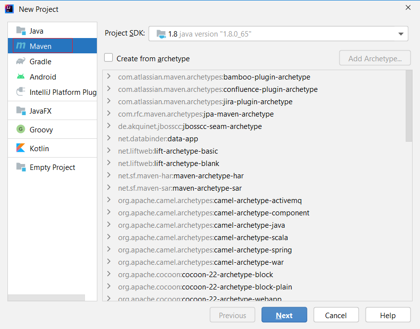
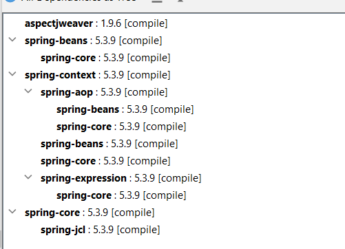
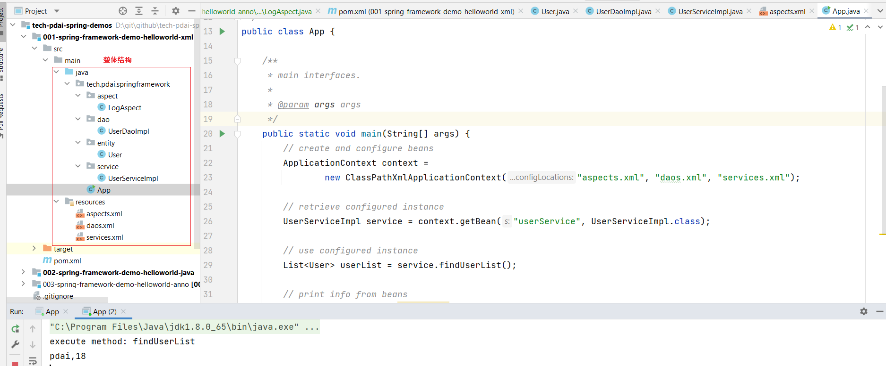
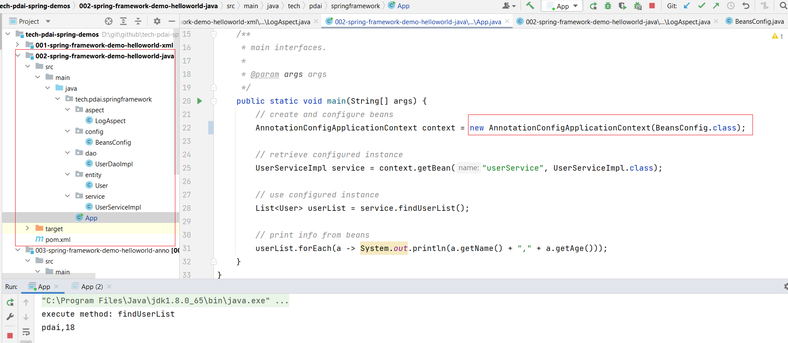
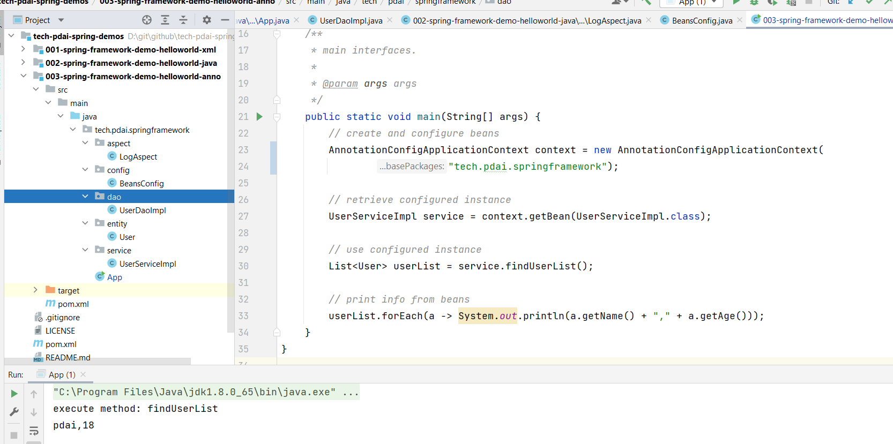
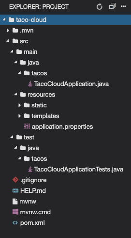
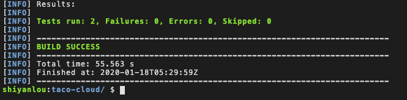
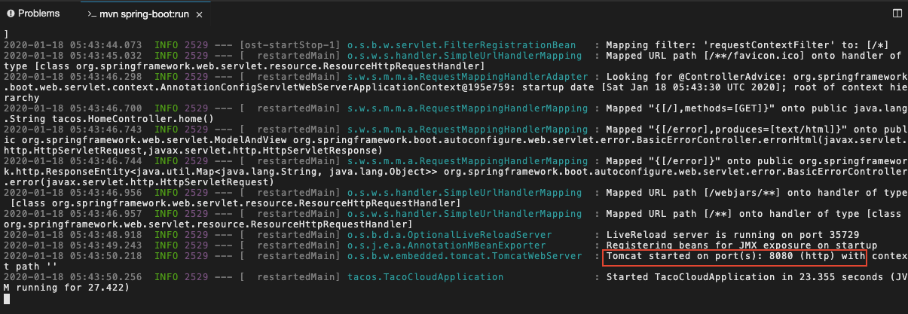
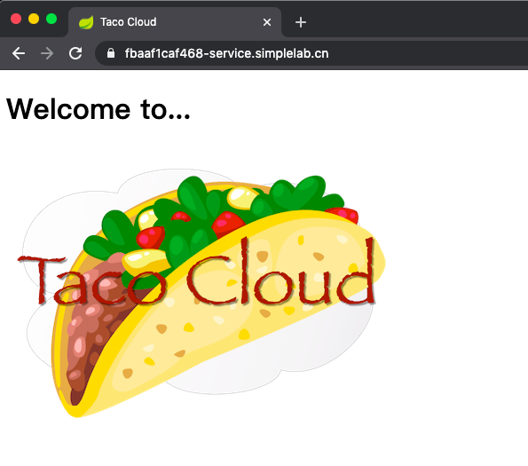

# Spring入门案例
[[TOC]]

## 初始化Spring应用(Windows)
### 设计一个Spring的HelloWorld

结合上面的使用场景，设计一个查询用户的案例的两个需求，来看Spring框架帮我们简化了什么开发工作: 
- 查询用户数据 - 来看DAO+POJO-> Service 的初始化和装载。 
- 给所有Service的查询方法记录日志

#### 创建一个Maven的Java项目



#### 引入Spring框架的POM依赖, 以及查看这些依赖之间的关系

```xml
<?xml version="1.0" encoding="UTF-8"?>
<project xmlns="http://maven.apache.org/POM/4.0.0"
         xmlns:xsi="http://www.w3.org/2001/XMLSchema-instance"
         xsi:schemaLocation="http://maven.apache.org/POM/4.0.0 http://maven.apache.org/xsd/maven-4.0.0.xsd">
    <modelVersion>4.0.0</modelVersion>

    <groupId>tech.pdai</groupId>
    <artifactId>001-spring-framework-demo-helloworld-xml</artifactId>
    <version>1.0-SNAPSHOT</version>

    <properties>
        <maven.compiler.source>8</maven.compiler.source>
        <maven.compiler.target>8</maven.compiler.target>
        <spring.version>5.3.9</spring.version>
        <aspectjweaver.version>1.9.6</aspectjweaver.version>
    </properties>

    <dependencies>
        <dependency>
            <groupId>org.springframework</groupId>
            <artifactId>spring-context</artifactId>
            <version>${spring.version}</version>
        </dependency>
        <dependency>
            <groupId>org.springframework</groupId>
            <artifactId>spring-core</artifactId>
            <version>${spring.version}</version>
        </dependency>
        <dependency>
            <groupId>org.springframework</groupId>
            <artifactId>spring-beans</artifactId>
            <version>${spring.version}</version>
        </dependency>
        <dependency>
            <groupId>org.aspectj</groupId>
            <artifactId>aspectjweaver</artifactId>
            <version>${aspectjweaver.version}</version>
        </dependency>
    </dependencies>

</project>
```



#### POJO-User

```java
package tech.pdai.springframework.entity;

/**
 * @author pdai
 */
public class User {

    /**
     * user's name.
     */
    private String name;

    /**
     * user's age.
     */
    private int age;

    /**
     * init.
     *
     * @param name name
     * @param age  age
     */
    public User(String name, int age) {
        this.name = name;
        this.age = age;
    }

    public String getName() {
        return name;
    }

    public void setName(String name) {
        this.name = name;
    }

    public int getAge() {
        return age;
    }

    public void setAge(int age) {
        this.age = age;
    }
}
```

#### DAO获取POJO, UserDaoServiceImpl(mock数据)

```java
package tech.pdai.springframework.dao;

import java.util.Collections;
import java.util.List;

import tech.pdai.springframework.entity.User;

/**
 * @author pdai
 */
public class UserDaoImpl {

    /**
     * init.
     */
    public UserDaoImpl() {
    }

    /**
     * mocked to find user list.
     *
     * @return user list
     */
    public List<User> findUserList() {
        return Collections.singletonList(new User("pdai", 18));
    }
}
```
并增加daos.xml
```xml
<?xml version="1.0" encoding="UTF-8"?>
<beans xmlns="http://www.springframework.org/schema/beans"
       xmlns:xsi="http://www.w3.org/2001/XMLSchema-instance"
       xsi:schemaLocation="http://www.springframework.org/schema/beans
 http://www.springframework.org/schema/beans/spring-beans.xsd">
    <bean id="userDao" class="tech.pdai.springframework.dao.UserDaoImpl">
        <!-- additional collaborators and configuration for this bean go here -->
    </bean>
    <!-- more bean definitions for data access objects go here -->
</beans>

```

#### 业务层 UserServiceImpl(调用DAO层)
```java
package tech.pdai.springframework.service;

import java.util.List;

import tech.pdai.springframework.dao.UserDaoImpl;
import tech.pdai.springframework.entity.User;

/**
 * @author pdai
 */
public class UserServiceImpl {

    /**
     * user dao impl.
     */
    private UserDaoImpl userDao;

    /**
     * init.
     */
    public UserServiceImpl() {
    }

    /**
     * find user list.
     *
     * @return user list
     */
    public List<User> findUserList() {
        return this.userDao.findUserList();
    }

    /**
     * set dao.
     *
     * @param userDao user dao
     */
    public void setUserDao(UserDaoImpl userDao) {
        this.userDao = userDao;
    }
}
```
并增加services.xml
```xml
<?xml version="1.0" encoding="UTF-8"?>
<beans xmlns="http://www.springframework.org/schema/beans"
       xmlns:xsi="http://www.w3.org/2001/XMLSchema-instance"
       xsi:schemaLocation="http://www.springframework.org/schema/beans
 http://www.springframework.org/schema/beans/spring-beans.xsd">
    <!-- services -->
    <bean id="userService" class="tech.pdai.springframework.service.UserServiceImpl">
        <property name="userDao" ref="userDao"/>
        <!-- additional collaborators and configuration for this bean go here -->
    </bean>
    <!-- more bean definitions for services go here -->
</beans>
```
#### 拦截所有service中的方法, 并输出记录
```java
package tech.pdai.springframework.aspect;

import java.lang.reflect.Method;

import org.aspectj.lang.ProceedingJoinPoint;
import org.aspectj.lang.annotation.Around;
import org.aspectj.lang.annotation.Aspect;
import org.aspectj.lang.reflect.MethodSignature;
import org.springframework.context.annotation.EnableAspectJAutoProxy;

/**
 * @author pdai
 */
@Aspect
public class LogAspect {

    /**
     * aspect for every methods under service package.
     */
    @Around("execution(* tech.pdai.springframework.service.*.*(..))")
    public Object businessService(ProceedingJoinPoint pjp) throws Throwable {
        // get attribute through annotation
        Method method = ((MethodSignature) pjp.getSignature()).getMethod();
        System.out.println("execute method: " + method.getName());

        // continue to process
        return pjp.proceed();
    }

}
```
并增加aspect.xml
```xml
<?xml version="1.0" encoding="UTF-8"?>
<beans xmlns="http://www.springframework.org/schema/beans"
       xmlns:xsi="http://www.w3.org/2001/XMLSchema-instance"
       xmlns:aop="http://www.springframework.org/schema/aop"
       xmlns:context="http://www.springframework.org/schema/context"
       xsi:schemaLocation="http://www.springframework.org/schema/beans
 http://www.springframework.org/schema/beans/spring-beans.xsd
 http://www.springframework.org/schema/aop
 http://www.springframework.org/schema/aop/spring-aop.xsd
 http://www.springframework.org/schema/context
 http://www.springframework.org/schema/context/spring-context.xsd
">

    <context:component-scan base-package="tech.pdai.springframework" />

    <aop:aspectj-autoproxy/>

    <bean id="logAspect" class="tech.pdai.springframework.aspect.LogAspect">
        <!-- configure properties of aspect here as normal -->
    </bean>
    <!-- more bean definitions for data access objects go here -->
</beans>
```
#### 组装app
```java
package tech.pdai.springframework;

import java.util.List;

import org.springframework.context.ApplicationContext;
import org.springframework.context.support.ClassPathXmlApplicationContext;
import tech.pdai.springframework.entity.User;
import tech.pdai.springframework.service.UserServiceImpl;

/**
 * @author pdai
 */
public class App {

    /**
     * main interfaces.
     *
     * @param args args
     */
    public static void main(String[] args) {
        // create and configure beans
        ApplicationContext context =
                new ClassPathXmlApplicationContext("aspects.xml", "daos.xml", "services.xml");

        // retrieve configured instance
        UserServiceImpl service = context.getBean("userService", UserServiceImpl.class);

        // use configured instance
        List<User> userList = service.findUserList();

        // print info from beans
        userList.forEach(a -> System.out.println(a.getName() + "," + a.getAge()));
    }
}
```
#### 整体结构和运行app



### 这个例子体现了Spring的哪些核心要点

#### 控制反转--IOC
来看第一个需求：查询用户（service通过调用dao查询pojo)，本质上如何创建User/Dao/Service等；

##### 如果没有Spring框架，我们需要自己创建User/Dao/Service等，比如：
```java
UserDaoImpl userDao = new UserDaoImpl();
UserSericeImpl userService = new UserServiceImpl();
userService.setUserDao(userDao);
List<User> userList = userService.findUserList();
```
##### 有了Spring框架，可以将原有Bean的创建工作转给框架, 需要用时从Bean的容器中获取即可，这样便简化了开发工作
```java
// create and configure beans
ApplicationContext context =
        new ClassPathXmlApplicationContext("aspects.xml", "daos.xml", "services.xml");

// retrieve configured instance
UserServiceImpl service = context.getBean("userService", UserServiceImpl.class);

// use configured instance
List<User> userList = service.findUserList();
```
Bean的创建和使用分离了。


更进一步，你便能理解为何会有如下的知识点了：
- Spring框架管理这些Bean的创建工作，即由用户管理Bean转变为框架管理Bean，这个就叫控制反转 
- Inversion of Control (IoC) Spring 框架托管创建的Bean放在哪里呢？ 这便是IoC Container; 
- Spring 框架为了更好让用户配置Bean，必然会引入不同方式来配置Bean？ 这便是xml配置，Java配置，注解配置等支持 
- Spring 框架既然接管了Bean的生成，必然需要管理整个Bean的生命周期等； 
- 应用程序代码从Ioc Container中获取依赖的Bean，注入到应用程序中，这个过程叫 依赖注入(Dependency Injection，DI) ； 
- 所以说控制反转是通过依赖注入实现的，其实它们是同一个概念的不同角度描述。通俗来说就是IoC是设计思想，DI是实现方式 在依赖注入时，有哪些方式呢？这就是构造器方式，@Autowired, @Resource, @Qualifier... 
- 同时Bean之间存在依赖（可能存在先后顺序问题，以及循环依赖问题等） 


#### 面向切面---AOP

来看第二个需求：给Service所有方法调用添加日志（调用方法时)，本质上是解耦问题；

##### 如果没有Spring框架，我们需要在每个service的方法中都添加记录日志的方法，比如：

```java
/**
* find user list.
*
* @return user list
*/
public List<User> findUserList() {
    System.out.println("execute method findUserList");
    return this.userDao.findUserList();
}
```

##### 有了Spring框架，通过@Aspect注解 定义了切面，这个切面中定义了拦截所有service中的方法，并记录日志； 可以明显看到，框架将日志记录和业务需求的代码解耦了，不再是侵入式的了
```java
/**
* aspect for every methods under service package.
*/
@Around("execution(* tech.pdai.springframework.service.*.*(..))")
public Object businessService(ProceedingJoinPoint pjp) throws Throwable {
    // get attribute through annotation
    Method method = ((MethodSignature) pjp.getSignature()).getMethod();
    System.out.println("execute method: " + method.getName());

    // continue to process
    return pjp.proceed();
}
```


更进一步，你便能理解为何会有如下的知识点了： 
- Spring 框架通过定义切面, 通过拦截切点实现了不同业务模块的解耦，这个就叫面向切面编程 - Aspect Oriented Programming (AOP) 
- 为什么@Aspect注解使用的是aspectj的jar包呢？这就引出了Aspect4J和Spring AOP的历史渊源，只有理解了Aspect4J和Spring的渊源才能理解有些注解上的兼容设计 
- 如何支持更多拦截方式来实现解耦， 以满足更多场景需求呢？ 这就是@Around, @Pointcut... 等的设计 
- 那么Spring框架又是如何实现AOP的呢？ 这就引入代理技术，分静态代理和动态代理，动态代理又包含JDK代理和CGLIB代理等

### Spring框架设计如何逐步简化开发的

通过上述的框架介绍和例子，已经初步知道了Spring设计的两个大的要点：IOC和AOP；从框架的设计角度而言，更为重要的是简化开发，比如提供更为便捷的配置Bean的方式，直至0配置（即约定大于配置）。这里我将通过Spring历史版本的发展，和SpringBoot的推出等，来帮你理解Spring框架是如何逐步简化开发的。

#### Java配置改造
在前文的例子中， 通过xml配置方式实现的，这种方式实际上比较麻烦； 我通过Java配置进行改造： 
- User，UserDaoImpl, UserServiceImpl，LogAspect不用改 
- 将原通过.xml配置转换为Java配置

```java
package tech.pdai.springframework.config;

import org.springframework.context.annotation.Bean;
import org.springframework.context.annotation.Configuration;
import org.springframework.context.annotation.EnableAspectJAutoProxy;
import tech.pdai.springframework.aspect.LogAspect;
import tech.pdai.springframework.dao.UserDaoImpl;
import tech.pdai.springframework.service.UserServiceImpl;

/**
 * @author pdai
 */
@EnableAspectJAutoProxy
@Configuration
public class BeansConfig {

    /**
     * @return user dao
     */
    @Bean("userDao")
    public UserDaoImpl userDao() {
        return new UserDaoImpl();
    }

    /**
     * @return user service
     */
    @Bean("userService")
    public UserServiceImpl userService() {
        UserServiceImpl userService = new UserServiceImpl();
        userService.setUserDao(userDao());
        return userService;
    }

    /**
     * @return log aspect
     */
    @Bean("logAspect")
    public LogAspect logAspect() {
        return new LogAspect();
    }
}
```
在App中加载BeanConfig的配置
```java
package tech.pdai.springframework;

import java.util.List;

import org.springframework.context.annotation.AnnotationConfigApplicationContext;
import tech.pdai.springframework.config.BeansConfig;
import tech.pdai.springframework.entity.User;
import tech.pdai.springframework.service.UserServiceImpl;

/**
 * @author pdai
 */
public class App {

    /**
     * main interfaces.
     *
     * @param args args
     */
    public static void main(String[] args) {
        // create and configure beans
        AnnotationConfigApplicationContext context = new AnnotationConfigApplicationContext(BeansConfig.class);

        // retrieve configured instance
        UserServiceImpl service = context.getBean("userService", UserServiceImpl.class);

        // use configured instance
        List<User> userList = service.findUserList();

        // print info from beans
        userList.forEach(a -> System.out.println(a.getName() + "," + a.getAge()));
    }
}
```
整体结构和运行app



### 注解配置方式改造

更进一步，Java 5开始提供注解支持，Spring 2.5 开始完全支持基于注解的配置并且也支持JSR250 注解。在Spring后续的版本发展倾向于通过注解和Java配置结合使用.

#### BeanConfig不再需要Java配置
```java
package tech.pdai.springframework.config;

import org.springframework.context.annotation.ComponentScan;
import org.springframework.context.annotation.ComponentScans;
import org.springframework.context.annotation.Configuration;
import org.springframework.context.annotation.EnableAspectJAutoProxy;

/**
 * @author pdai
 */
@Configuration
@EnableAspectJAutoProxy
public class BeansConfig {

}
```
##### UserDaoImpl增加了@Repository注解

```java
/**
 * @author pdai
 */
@Repository
public class UserDaoImpl {

    /**
     * mocked to find user list.
     *
     * @return user list
     */
    public List<User> findUserList() {
        return Collections.singletonList(new User("pdai", 18));
    }
}
```

##### UserServiceImpl增加了@Service注解, 并通过@Autowired注入userDao

```java
/**
 * @author pdai
 */
@Service
public class UserServiceImpl {

    /**
     * user dao impl.
     */
    @Autowired
    private UserDaoImpl userDao;

    /**
     * find user list.
     *
     * @return user list
     */
    public List<User> findUserList() {
        return userDao.findUserList();
    }

}
```
##### 在App中扫描tech.pdai.springframework包

```java
package tech.pdai.springframework;

import java.util.List;

import org.springframework.context.annotation.AnnotationConfigApplicationContext;
import tech.pdai.springframework.entity.User;
import tech.pdai.springframework.service.UserServiceImpl;

/**
 * @author pdai
 */
public class App {

    /**
     * main interfaces.
     *
     * @param args args
     */
    public static void main(String[] args) {
        // create and configure beans
        AnnotationConfigApplicationContext context = new AnnotationConfigApplicationContext(
                "tech.pdai.springframework");

        // retrieve configured instance
        UserServiceImpl service = context.getBean(UserServiceImpl.class);

        // use configured instance
        List<User> userList = service.findUserList();

        // print info from beans
        userList.forEach(a -> System.out.println(a.getName() + "," + a.getAge()));
    }
}

```
##### 整体结构和运行app



## 初始化Spring应用(Linux)
### 初始化Spring

我们有多种初始化 Spring 应用的可选方案。尽管我可以教你手动创建项目目录结构和定义构建规范的各个步骤，但这无疑是浪费时间，我们最好将时间花在编写应用代码上。因此，我们将会学习如何使用 Spring Initializr 初始化应用。

Spring Initializr 是一个基于浏览器的 Web 应用，同时也是一个 REST API，能够生成一个 Spring 项目结构的骨架，我们还可以使用各种想要的功能来填充它。使用 Spring Initializr 的几种方式如下：

- 通过地址为 https://start.spring.io/ 的 Web 应用；
- 在命令行中使用 `curl` 命令；
- 在命令行中使用 Spring Boot 命令行接口；
- 在 Spring Tool Suite 中创建新项目；
- 在 IntelliJ IDEA 中创建新项目；
- 在 NetBeans 中创建新项目。

### 初始化项目

实验中我们将通过命令行 curl 命令的方式来创建项目，在实验楼 WebIDE 中执行以下命令。

```bash
curl https://start.spring.io/starter.tgz \
-d groupId=sia \
-d artifactId=taco-cloud \
-d packaging=jar \
-d name=taco-cloud \
-d packageName=tacos \
-d dependencies=web,devtools,thymeleaf \
-d type=maven-project \
-d baseDir=taco-cloud \
-d bootVersion=2.4.0 \
-d javaVersion=1.8 \
| tar -xzvf -
```

`-d` 指定额外的参数。

- `groupId`：指定 `groupId`。
- `artifactId`：指定 `artifactId`。
- `packaging`：指定打包方式。
- `name`：指定项目名，如果没有指定 `applicationName`，则将其作为 Application Name。
- `packageName`：指定项目的包名。
- `dependencies`：指定项目的依赖。
- `type`：指定项目的类型（使用哪种构建工具）。
- `baseDir`：指定项目的根目录名称。
- `bootVersion`：指定 SpringBoot 的版本。

> 这些参数都有其默认值，可以参考手册。使用 `curl https://start.spring.io` 命令，该命令将会输出使用手册内容。为了便于阅读，你也可以加上 `-o manual.txt` 将输出结果保存在 `manual.txt` 文件中。

### 检查Spring项目

项目创建之后，我们来看一下项目的目录结构，看一下其中都包含什么内容。



你可能已经看出来了，这就是一个典型的 Maven 或 Gradle 项目结构，其中应用的源码放到了 `src/main/java` 中，测试代码放到了 `src/test/java` 中，而非 Java 的资源放到了 `src/main/resources`。在这个项目结构中，我们需要注意以下几点。

- `mvnw` 和 `mvnw.cmd`：这是 Maven 包装器（wrapper）脚本。借助这些脚本，即便你的机器上没有安装 Maven，也可以构建项目。
- `pom.xml`：这是 Maven 构建规范，随后我们将会深入介绍该文件。
- `TacoCloudApplication.java`：这是 Spring Boot 主类，它会启动该项目。随后，我们会详细介绍这个类。
- `application.properties`：这个文件起初是空的，但是它为我们提供了指定配置属性的地方。在本章中，我们会稍微修改一下这个文件，但是我会将配置属性的详细阐述放到第 5 章。
- `static`：在这个文件夹下，你可以存放任意为浏览器提供服务的静态内容（图片、样式表、JavaScript 等），该文件夹初始为空。
- `templates`：这个文件夹中存放用来渲染内容到浏览器的模板文件。这个文件夹初始是空的，不过我们很快就会往里面添加 Thymeleaf 模板。
- `TacoCloudApplicationTests.java`：这是一个简单的测试类，它能确保 Spring 应用上下文可以成功加载。在开发应用的过程中，我们会将更多的测试添加进来。

随着 Taco Cloud 应用功能的增长，我们会不断使用 Java 代码、图片、样式表、测试以及其他附属内容来充实这个项目结构。不过，在此之前，我们先看一下 Spring Initializr 提供的几个条目。

#### 探索构建规范

使用 Initializr 创建项目时，其默认使用 Maven 来进行构建。因此，Spring Initializr 所生成的 `pom.xml` 文件已经包含了我们所选择的依赖。下面代码展示了 Initializr 为我们提供的完整 `pom.xml`。

```xml
<?xml version="1.0" encoding="UTF-8"?>
<project xmlns="http://maven.apache.org/POM/4.0.0"
  xmlns:xsi="http://www.w3.org/2001/XMLSchema-instance"
  xsi:schemaLocation="http://maven.apache.org/POM/4.0.0
          http://maven.apache.org/xsd/maven-4.0.0.xsd">
  <modelVersion>4.0.0</modelVersion>

  <groupId>sia</groupId>
  <artifactId>taco-cloud</artifactId>
  <version>0.0.1-SNAPSHOT</version>
  <packaging>jar</packaging>

  <name>taco-cloud</name>
  <description>Taco Cloud Example</description>

  <parent>
    <groupId>org.springframework.boot</groupId>
    <artifactId>spring-boot-starter-parent</artifactId>
    <version>2.4.0</version>
    <relativePath/> <!-- lookup parent from repository -->
  </parent>

  <properties>
    <project.build.sourceEncoding>
        UTF-8</project.build.sourceEncoding>
    <project.reporting.outputEncoding>
        UTF-8</project.reporting.outputEncoding>
    <java.version>1.8</java.version>
  </properties>

  <dependencies>
    <dependency>
      <groupId>org.springframework.boot</groupId>
      <artifactId>spring-boot-starter-thymeleaf</artifactId>
    </dependency>
    <dependency>
      <groupId>org.springframework.boot</groupId>
      <artifactId>spring-boot-starter-web</artifactId>
    </dependency>
    <dependency>
      <groupId>org.springframework.boot</groupId>
      <artifactId>spring-boot-devtools</artifactId>
      <scope>runtime</scope>
    </dependency>

    <dependency>
      <groupId>org.springframework.boot</groupId>
      <artifactId>spring-boot-starter-test</artifactId>
      <scope>test</scope>
    </dependency>

    <dependency>
      <groupId>org.seleniumhq.selenium</groupId>
      <artifactId>selenium-java</artifactId>
        <scope>test</scope>
    </dependency>

     <dependency>
        <groupId>org.seleniumhq.selenium</groupId>
        <artifactId>htmlunit-driver</artifactId>
        <scope>test</scope>
      </dependency>

      <dependency>
        <groupId>junit</groupId>
        <artifactId>junit</artifactId>
        <version>4.13</version>
      </dependency>
  </dependencies>

  <build>
    <plugins>
      <plugin>
        <groupId>org.springframework.boot</groupId>
        <artifactId>spring-boot-maven-plugin</artifactId>
      </plugin>
    </plugins>
  </build>

</project>
```

在 `pom.xml` 文件中，我们第一个需要注意的地方就是 `<packaging>`。我们选择了将应用构建成一个可执行的 `JAR` 文件，而不是 `WAR` 文件。这可能是你所做出的最奇怪的选择之一，对 Web 应用来说尤为如此。毕竟，传统的 Java Web 应用都是打包成 WAR 文件，`JAR` 只是用来打包库和较为少见的桌面 UI 应用的。

打包为 `JAR` 文件是基于云思维做出的选择。尽管 `WAR` 文件非常适合部署到传统的 Java 应用服务器上，但对于大多数云平台来说它们并不是理想的选择。有些云平台（比如 Cloud Foundry）也能够部署和运行 `WAR` 文件，但是所有的 Java 云平台都能够运行可执行的 `JAR` 文件。因此，Spring Initializr 默认会使用基于 `JAR` 的打包方式，除非我们明确告诉它采用其他的方式。

如果你想要将应用部署到传统的 Java 应用服务器上，那么需要选择使用基于 WAR 的打包方式并要包含一个 Web 初始化类。在第 2 章中，我们将会更详细地了解如何构建 `WAR` 文件。

接下来，请留意 `<parent>` 元素，更具体来说是它的 `<version>` 子元素。这表明我们的项目要以 `spring-boot-starter-parent` 作为其父 POM。除了其他的一些功能之外，这个父 POM 为 Spring 项目常用的一些库提供了依赖管理，现在你不需要指定它们的版本，因为这是通过父 POM 来管理的。这里的 `2.0.4.RELEASE` 表明要使用 Spring Boot 2.0.4，所以会根据这个版本的 Spring Boot 定义来继承依赖管理。

既然我们谈到了依赖的话题，那么需要注意在 `<dependencies>` 元素下声明了 4 个依赖。在某种程度上，你可能会对前两个更熟悉一些。它们直接对应我们使用 `curl` 创建新项目中所指定的 `Web` 和 `Thymeleaf` 依赖。第四个依赖 `test` 提供了很多有用的测试功能。我们没有必要专门指定它，因为 Spring Initializr 假定你将会编写测试（希望你会正确地开展这项工作）。

你可能也会注意到这 4 个依赖的 Artifact ID 中有 3 个都有 `starter` 这个单词。Spring Boot starter 依赖的特别之处在于它们本身并不包含库代码，而是传递性地拉取其他的库。这种 starter 依赖主要有 3 个好处。

- 构建文件会显著减小并且更易于管理，因为这样不必为每个所需的依赖库都声明依赖。
- 我们能够根据它们所提供的功能来思考依赖，而不是根据库的名称。如果是开发 Web 应用，那么你只需要添加 web starter 就可以了，而不必添加一堆单独的库再编写 Web 应用。
- 我们不必再担心库版本的问题。你可以直接相信给定版本的 Spring Boot，传递性引入的库的版本是兼容的。现在，你只需要关心使用的是哪个版本的 Spring Boot 就可以了。

最后，构建规范还包含一个 Spring Boot 插件。这个插件提供了一些重要的功能。

- 它提供了一个 Maven goal，允许我们使用 Maven 来运行应用。在后面小节，我们将会尝试这个 goal。
- 它会确保依赖的所有库都会包含在可执行 JAR 文件中，并且能够保证它们在运行时类路径下是可用的。
- 它会在 JAR 中生成一个 manifest 文件，将引导类（在我们的场景中，也就是 TacoCloudApplication）声明为可执行 JAR 的主类。

谈到了主类，我们打开它看一下。

因为我们将会通过可执行 JAR 文件的形式来运行应用，所以很重要的一点就是要有一个主类，它将会在 JAR 运行的时候被执行。我们同时还需要一个最小化的 Spring 配置，以引导该应用。这就是 TacoCloudApplication 类所做的事情，如下面代码所示。

```java
package tacos;

import org.springframework.boot.SpringApplication;
import org.springframework.boot.autoconfigure.SpringBootApplication;

@SpringBootApplication // <--- Spring Boot应用
public class TacoCloudApplication {

  public static void main(String[] args) {
    SpringApplication.run(TacoCloudApplication.class, args);   // <--- 运行应用
  }

}
```

尽管在 TacoCloudApplication 中只有很少的代码，但是它包含了很多的内容。其中，最强大的一行代码也是最短的。`@SpringBootApplication` 注解明确表明这是一个 Spring Boot 应用。但是，`@SpringBootApplication` 远比看上去更强大。

`@SpringBootApplication` 是一个组合注解，它组合了 3 个其他的注解。

- `@SpringBootConfiguration`：将该类声明为配置类。尽管这个类目前还没有太多的配置，但是后续我们可以按需添加基于 Java 的 Spring 框架配置。这个注解实际上是 `@Configuration` 注解的特殊形式。
- `@EnableAutoConfiguration`：启用 Spring Boot 的自动配置。我们随后会介绍自动配置的更多功能。就现在来说，我们只需要知道这个注解会告诉 Spring Boot 自动配置它认为我们会用到的组件。
- `@ComponentScan`：启用组件扫描。这样我们能够通过像 `@Component`、`@Controller`、`@Service` 这样的注解声明其他类，Spring 会自动发现它们并将它们注册为 Spring 应用上下文中的组件。

TacoCloudApplication 另外一个很重要的地方是它的 `main()` 方法。这是 JAR 文件执行的时候要运行的方法。在大多数情况下，这个方法都是样板代码，我们编写的每个 Spring Boot 应用都会有一个类似或完全相同的方法（类名不同则另当别论）。

这个 `main()` 方法会调用 SpringApplication 中静态的 `run()` 方法，后者会真正执行应用的引导过程，也就是创建 Spring 的应用上下文。在传递给 `run()` 的两个参数中，一个是配置类，另一个是命令行参数。尽管传递给 `run()` 的配置类不一定要和引导类相同，但这是最便利和最典型的做法。

你可能并不需要修改引导类中的任何内容。对于简单的应用程序来说，你可能会发现在引导类中配置一两个组件是非常方便的，但是对于大多数应用来说，最好还是要为没有实现自动配置的功能创建一个单独的配置类。在本课程的整个过程中，我们将会创建多个配置类，所以请继续关注后续的细节。

#### 测试应用

测试是软件开发的重要组成部分。鉴于此，Spring Initializr 为我们提供了一个测试类作为起步。下面代码展现了这个测试类的概况。

```java
package tacos;

import org.junit.Test;
import org.junit.runner.RunWith;
import org.springframework.boot.test.context.SpringBootTest;
import org.springframework.test.context.junit4.SpringRunner;

@RunWith(SpringRunner.class)            // <--- 使用Spring的运行器
@SpringBootTest                         // <--- Spring Boot测试
public class TacoCloudApplicationTests {

  @Test                                   // <--- 测试方法
  public void contextLoads() {
  }

}
```

TacoCloudApplicationTests 类中的内容并不多：这个类中只有一个空的测试方法。即便如此，这个测试类还是会执行必要的检查，确保 Spring 应用上下文能够成功加载。如果你所做的变更导致 Spring 应用上下文无法创建，那么这个测试将会失败，你就可以做出反应来解决相关的问题了。

另外，注意这个类带有 `@RunWith(SpringRunner.class)` 注解。`@RunWith` 是 JUnit 的注解，它会提供一个测试运行器（runner）来指导 JUnit 如何运行测试。可以将其想象为给 JUnit 应用一个插件，以提供自定义的测试行为。在本例中，为 JUnit 提供的是 SpringRunner，这是一个 Spring 提供的测试运行器，它会创建测试运行所需的 Spring 应用上下文。

#### 测试运行器的其他名称

如果你已经熟悉如何编写 Spring 测试或者见过其他一些基于 Spring 的测试类，那么你可能见过名为 SpringJUnit4ClassRunner 的测试运行器。SpringRunner 是 SpringJUnit4ClassRunner 的别名，是在 Spring 4.3 中引入的，以便于移除对特定 JUnit 版本的关联（比如，JUnit 4）。毫无疑问，这个别名更易于阅读和输入。

`@SpringBootTest` 会告诉 JUnit 在启动测试的时候要添加上 Spring Boot 的功能。从现在开始，我们可以将这个测试类视同为在 `main()` 方法中调用 `SpringApplication.run()`。在这本书中，我们将会多次看到 `@SpringBootTest`，而且会不断见识它的威力。

最后，就是测试方法本身了。尽管 `@RunWith(SpringRunner.class)` 和 `@SpringBootTest` 会为测试加载 Spring 应用上下文，但是如果没有任何测试方法，那么它们其实什么事情都没有做。即便没有任何断言或代码，这个空的测试方法也会提示这两个注解完成了它们的工作并成功加载 Spring 应用上下文。如果这个过程中有任何问题，那么测试都会失败。

此时，我们已经看完了 Spring Initializr 为我们提供的代码。我们看到了一些用来开发 Spring 应用程序的基础样板，但是还没有编写任何代码。现在是时候启动 IDE、准备好键盘并向 Taco Cloud 应用程序添加一些自定义的代码了。

### 编写Spring应用

因为是刚刚开始，所以我们首先为 Taco Cloud 做一些小的变更，但是这些变更会展现 Spring 的很多优点。在刚开始的时候，比较合适的做法是为 Taco Cloud 应用添加一个主页。在添加主页时，我们将会创建两个代码构件：

- 一个控制器类，用来处理主页相关的请求；
- 一个视图模板，用来定义主页看起来是什么样子。

测试是非常重要的，所以我们还会编写一个简单的测试类来测试主页。但是，要事优先，我们需要先编写控制器。

#### 处理Web请求

Spring 自带了一个强大的 Web 框架，名为 Spring MVC。Spring MVC 的核心是控制器（controller）的理念。控制器是处理请求并以某种方式进行信息响应的类。在面向浏览器的应用中，控制器会填充可选的数据模型并将请求传递给一个视图，以便于生成返回给浏览器的 HTML。

我们将会学习更多关于 Spring MVC 的知识。现在，我们会编写一个简单的控制器类以处理对根路径（比如，`/`）的请求，并将这些请求转发至主页视图，在这个过程中不会填充任何的模型数据。

在 `src/main/java/tacos` 包下创建 `HomeController.java` 文件，编写代码如下。

```java
package tacos;

import org.springframework.stereotype.Controller;
import org.springframework.web.bind.annotation.GetMapping;

@Controller                   // <--- 控制器
public class HomeController {

  @GetMapping("/")            // <--- 处理对根路径“/”的请求
  public String home() {
    return "home";                 // <--- 返回视图名
  }

}
```

可以看到，这个类带有 `@Controller`。就其本身而言，`@Controller` 并没有做太多的事情。它的主要目的是让组件扫描将这个类识别为一个组件。因为 HomeController 带有 `@Controller`，所以 Spring 的组件扫描功能会自动发现它，并创建一个 HomeController 实例作为 Spring 应用上下文中的 bean。

实际上，有一些其他的注解与 `@Controller` 有着类似的目的（包括 `@Component`、`@Service` 和 `@Repository`）。你可以为 HomeController 添加上述的任意其他注解，其作用是完全相同的。但是，在这里选择使用 `@Controller` 更能描述这个组件在应用中的角色。

`home()` 是一个简单的控制器方法。它带有 `@GetMapping` 注解，表明如果针对 `/` 发送 HTTP GET 请求，那么这个方法将会处理请求。该方法所做的只是返回 String 类型的 `home` 值。

这个值将会被解析为视图的逻辑名。视图如何实现取决于多个因素，但是因为 Thymeleaf 位于类路径中，所以我们可以使用 Thymeleaf 来定义模板。

##### 为何使用 Thymeleaf

你可能会想为什么要选择 Thymeleaf 作为模板引擎呢？为何不使用 JSP？为何不使用 FreeMarker？为何不选择其他的几个可选方案？

简单来说，我必须要做出选择，我喜欢 Thymeleaf，相对于其他的方案，我会优先使用它。

模板名称是由逻辑视图名派生而来的，再加上 `/templates/` 前缀和 `.html` 后缀。最终形成的模板路径将是 `/templates/home.html`。所以，我们需要将模板放到项目的 `src/main/resources/templates/home.html` 目录中。现在，就让我们来创建这个模板。

#### 定义视图

为了让主页尽可能简单，除了欢迎用户访问站点之外，它不会做其他的任何事情。在 `src/main/resources/templates` 目录下创建 `home.html` 文件，编写代码如下。

```html
<!DOCTYPE html>
<html xmlns="http://www.w3.org/1999/xhtml" xmlns:th="http://www.thymeleaf.org">
  <head>
    <title>Taco Cloud</title>
  </head>

  <body>
    <h1>Welcome to...</h1>
    

    <a th:href="@{/design}" id="design">Design a taco</a>
  </body>
</html>
```

上面代码是一个基本的 Thymeleaf 模板，它定义了 Taco Cloud 的主页。

这个模板并没有太多需要讨论的。唯一需要注意的一行代码是用于展现 Taco Cloud Logo 的 `` 标签。它使用了 Thymeleaf 的 `th:src` 属性和 `@{...}` 表达式，以便于引用相对于上下文路径的图片。除此之外，它就是一个 Hello World 页面。

但是，我们再讨论一下这个图片。我将定义 Taco Cloud Logo 的工作留给你，你需要将它放到应用的正确位置中。


```bash
# 下载图片
wget https://labfile.oss.aliyuncs.com/courses/1517/TacoCloud.png
# 创建目录
mkdir -p /home/project/taco-cloud/src/main/resources/static/images/
# 移动图片到指定目录
mv TacoCloud.png /home/project/taco-cloud/src/main/resources/static/images/
```

图片是使用相对于上下文的 `/images/TacoCloud.png` 路径来进行引用的。回忆一下我们的项目结构，像图片这样的静态资源是放到 `/src/main/resources/static` 文件夹中的。这意味着，在项目中，Taco Cloud Logo 图片必须要位于 `src/main/resources/static/images/TacoCloud.png`。

我们已经有了一个处理主页请求的控制器并且有了渲染主页的模板，现在基本就可以启动应用来看一下它的效果了。在此之前，我们先看一下如何为控制器编写测试。

#### 测试控制器

在测试 Web 应用时，对 HTML 页面的内容进行断言是比较困难的。幸好 Spring 对测试提供了强大的支持，这使得测试 Web 应用变得非常简单。

对于主页来说，我们所编写的测试在复杂性上与主页本身差不多。测试需要针对根路径“/”发送一个 HTTP GET 请求并期望得到成功结果，其中视图名称为 home 并且结果内容包含“Welcome to...”。

在 `src/test/java/tacos` 包下新建 `HomeControllerTest.java` 文件中，编写代码如下。

```java
package tacos;

import static org.hamcrest.Matchers.containsString;
import static org.springframework.test.web.servlet.request.MockMvcRequestBuilders.get;
import static org.springframework.test.web.servlet.result.MockMvcResultMatchers.content;
import static org.springframework.test.web.servlet.result.MockMvcResultMatchers.status;
import static org.springframework.test.web.servlet.result.MockMvcResultMatchers.view;

import org.junit.Test;
import org.junit.runner.RunWith;
import org.springframework.beans.factory.annotation.Autowired;
import org.springframework.boot.test.autoconfigure.web.servlet.WebMvcTest;
import org.springframework.test.context.junit4.SpringRunner;
import org.springframework.test.web.servlet.MockMvc;

@RunWith(SpringRunner.class)
@WebMvcTest(HomeController.class)         // <--- 针对HomeController的Web测试
public class HomeControllerTest {

  @Autowired
  private MockMvc mockMvc;                 // <--- 注入MockMvc

  @Test
  public void testHomePage() throws Exception {
    mockMvc.perform(get("/"))                // <--- 发起对“/”的GET

      .andExpect(status().isOk())            // <--- 期望得到HTTP 200

      .andExpect(view().name("home"))         // <--- 期望得到home视图

      .andExpect(content().string(             // <--- 期望包含“Welcome to...”
             containsString("Welcome to...")));
  }

}
```

对于这个测试，我们首先注意到的可能就是它使用了与 TacoCloudApplicationTests 类不同的注解。HomeControllerTest 没有使用 `@SpringBootTest` 标记，而是添加了 `@WebMvcTest` 注解。这是 Spring Boot 所提供的一个特殊测试注解，它会让这个测试在 Spring MVC 应用的上下文中执行。更具体来讲，在本例中，它会将 HomeController 注册到 Spring MVC 中，这样的话，我们就可以向它发送请求了。

`@WebMvcTest` 同样会为测试 Spring MVC 应用提供 Spring 环境的支持。尽管我们可以启动一个服务器来进行测试，但是对于我们的场景来说，仿造一下 Spring MVC 的运行机制就可以。测试类被注入了一个 MockMvc，能够让测试实现 mockup。

通过 `testHomePage()` 方法，我们定义了针对主页想要执行的测试。它首先使用 MockMvc 对象对 `/`（根路径）发起 HTTP GET 请求。对于这个请求，我们设置了如下的预期：

- 响应应该具备 HTTP 200 (OK) 状态；
- 视图的逻辑名称应该是 home；
- 渲染后的视图应该包含文本 "Welcome to..."。

如果在 MockMvc 对象发送请求之后，这些期望有不满足的话，那么这个测试会失败。但是，我们的控制器和模板引擎在编写时都满足了这些预期，所以测试应该能够通过，并且带有成功的图标——至少能够看到一些绿色的背景，表明测试通过了。


```bash
# 进入项目根目录
cd /home/project/taco-cloud
# 测试
mvn test
```

测试结果如下。



控制器已经编写好了，视图模板也已经创建完毕，而且我们还通过了测试，看上去我们已经成功实现了主页。尽管测试已经通过了，但是如果能够在浏览器中看到结果那会更有成就感，毕竟这才是 Taco Cloud 的客户所能看到的效果。接下来，我们构建应用并运行它。

#### 构建和运行应用

因为我们初始化项目时设置了项目类型为 Maven 项目，并在 `pom.xml` 中设置添加了 Spring Boot 的 Maven 插件，所以可以 Maven 命令来运行应用。

在实验楼 WebIDE 终端中，执行以下命令运行程序。

```bash
mvn clean spring-boot:run
```

> 注：可通过 `Ctrl + C` 来终止程序运行。

在应用启动的过程中，你会在控制台看到一些 Spring ASCII 码，随后会是描述应用启动各个步骤的日志条目。在控制台输出的最后，你将会看到一条 Tomcat 已经在 `port(s): 8080 (http)` 启动的日志，这意味着此时你可以打开 Web 浏览器并导航至主页，这样就能看到我们的劳动成果了。



稍等一下！刚才说启动 Tomcat？但是我们是什么时候将应用部署到 Tomcat 的呢？

Spring Boot 应用的习惯做法是将所有它需要的东西都放到一起，没有必要将其部署到某种应用服务器中。在这个过程中，我们根本没有将应用部署到 Tomcat 中……Tomcat 是我们应用的一部分！（在后面小节，我会介绍 Tomcat 是如何成为我们应用的一部分的。）

现在，应用已经启动起来了，点击侧边栏的 Web 服务来访问实验环境中的 `http://localhost:8080`，你将会看到如下图所示的界面。如果你设计了自己的 Logo 图片，那么显示效果可能会有所不同。但是，与 xx 图相比，应该不会有太大的差异。



看上去似乎并不太美观，但这不是一本关于平面设计的书。目前，略显简陋的主页外观已经足够了，它为我们学习 Spring 打下了一个良好的开端。

到现在为止，我一直没有提及 DevTools。在初始化项目的时候，我们将其作为一个依赖添加了进来。在最终生成的 `pom.xml` 文件中，它表现为一个依赖项。那么，DevTools 是什么，它又能为我们做些什么呢？接下来，让我们快速浏览一下 DevTools 最有用的一些特性。

### 了解Spring Boot Dev Tools

顾名思义，DevTools 为 Spring 开发人员提供了一些便利的开发期工具，其中包括：

- 代码变更后应用会自动重启；
- 当面向浏览器的资源（如模板、JavaScript、样式表）等发生变化时，会自动刷新浏览器（实验楼 WebIDE 中需要手动刷新 Web 服务的页面）；
- 自动禁用模板缓存；
- 如果使用 H2 数据库的话，内置了 H2 控制台。

DevTools 在 Spring Tool Suite、IntelliJ IDEA 和 NetBeans 中，它都能很好地运行。另外，因为它的目的是仅仅用于开发，所以能够很智能地在生产环境中把自己禁用掉。现在，我们主要关注 Spring Boot DevTools 最有用的特性，先从应用的自动重启开始。

#### 应用自动重启

如果将 DevTools 作为项目的一部分，那么你可以看到，当对项目中的 Java 代码和属性文件做出修改后，这些变更稍后就能发挥作用。DevTools 会监控变更，当它看到有变化的时候，将会自动重启应用。

更准确地说，当 DevTools 运行的时候，应用程序会被加载到 Java 虚拟机（Java virtual Machine，JVM）两个独立的类加载器中。其中一个类加载器会加载你的 Java 代码、属性文件以及项目中 `src/main/` 路径下几乎所有的内容。这些条目很可能会经常发生变化。另外一个类加载器会加载依赖的库，这些库不太可能经常发生变化。

当探测到变更的时候，DevTools 只会重新加载包含项目代码的类加载器，并重启 Spring 的应用上下文，在这个过程中另外一个类加载器和 JVM 会原封不动。这个策略非常精细，但是它能减少应用启动的时间。

这种策略的一个不足之处就是自动重启无法反映依赖项的变化。这是因为包含依赖库的类加载器不会自动重新加载。这意味着每当我们在构建规范中添加、变更或移除依赖的时候，为了让变更生效，我们需要重新启动应用。

#### 浏览器自动刷新和禁用模板缓存

默认情况下，像 Thymeleaf 和 FreeMarker 这样的模板方案在配置时会缓存模板解析的结果。这样的话，在为每个请求提供服务的时候，模板就不用重新解析了。在生产环境中，这是一种很好的方式，因为它会带来一定的性能收益。

但是，在开发期，缓存模板就不太好了。在应用运行的时候，如果缓存模板，那么我们刷新浏览器就无法看到模板变更的效果了。即便我们对模板做了修改，在应用重启之前，缓存的模板依然会有效。

DevTools 通过禁用所有模板缓存解决了这个问题。你可以对模板进行任意数量的修改，只需要刷新一下浏览器就能看到结果。

如果你像我这样，连浏览器的刷新按钮都懒得点，那么对代码做出变更之后，马上在浏览器中看到结果就好了。幸运的是，DevTools 有一些特殊的功能可以供我们使用。

DevTools 在运行的时候，它会和你的应用程序一起，同时自动启动一个 LiveReload 服务器。LiveReload 服务器本身并没有太大的用处。但是，当它与 LiveReload 浏览器插件结合起来的时候，就能够在模板、图片、样式表、JavaScript 等（实际上，几乎涵盖为浏览器提供服务的所有内容）发生变化的时候自动刷新浏览器。

LiveReload 有针对 Google Chrome、Safari 和 Firefox 的浏览器插件（要对 Internet Explorer 和 Edge 粉丝说声抱歉）。请访问 LiveReload 官网，以了解如何为你的浏览器安装 LiveReload。