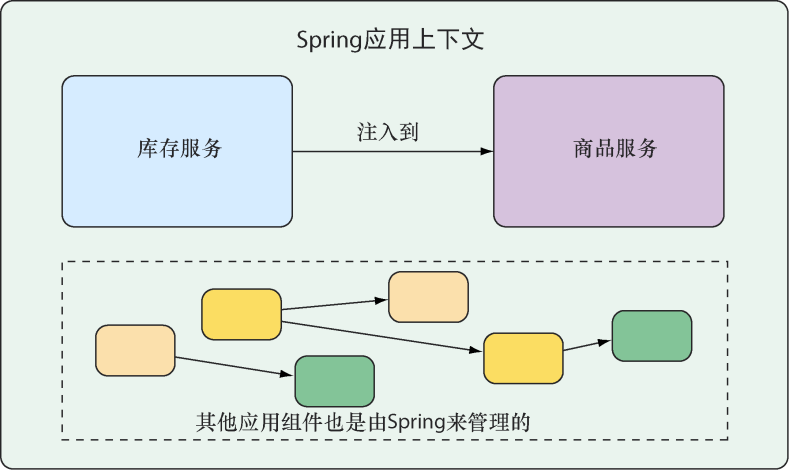
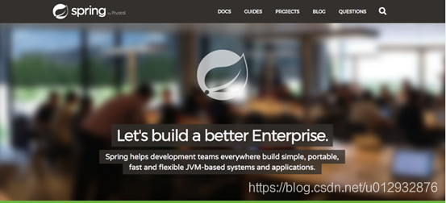
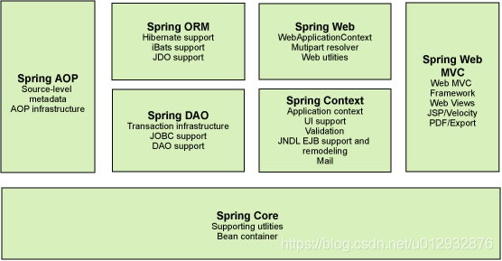

# Spring概述
[[TOC]]

## 初识Spring框架

### 时代变迁

原始时代我们用一个jsp搞定一切，但如此开发大型项目时我们遇到了问题，前端美化的代码和后端的代码交织，代码中又有html、js、css样式，又有业务逻辑和数据库访问代码，杂乱不清晰，美工和开发打架。

于是mvc分层架构封建时代出现，把我们写代码的地方硬性分成3个地方，Model层封装数据，View视图层页面展现，Controller控制层访问转发。代码之间的耦合度降低。概念有了，需要实际干活的。于是随着mvc分层概念的深入人心，业界涌现出很多实现框架，最著名的莫过于struts1和struts2。随着前端框架的成熟，后端框架也应运而生如：dbutils、jdbcTemplate、hibernate、ibatis、mybatis。

一个前端WEB层框架有了，一个后端数据库层访问框架有了，那中间呢？谁来胜任？spring破石而出。

### Spring 是什么

我们现在开发应用的方式和 1 年前、5 年前、10 年前都是不同的，更别提 15 年前了，当时 Rod Johnson 的图书 Expert One-on-One J2EE Design and Development 介绍了 Spring 框架的初始形态。

当时，最常见的应用形式是基于浏览器的 Web 应用，后端由关系型数据库作为支撑。尽管这种形式的开发依然有它的价值，Spring 也为这种应用提供了良好的支持，但是我们现在感兴趣的还包括如何开发面向云的由微服务组成的应用，这些应用会将数据保存到各种类型的数据库中。另外一个崭新的关注点是反应式编程，它致力于通过非阻塞操作提供更好的扩展性并提升性能。

随着软件开发的发展，Spring 框架也在不断变化，以解决现代应用开发中的问题，其中就包括微服务和反应式编程。Spring 还通过引入 Spring Boot 简化自己的开发模型。

不管你是开发以数据库作为支撑的简单 Web 应用，还是围绕微服务构建一个现代应用，Spring 框架都能帮助你达成目标。

任何实际的应用程序都是由很多组件组成的，每个组件负责整个应用功能的一部分，这些组件需要与其他的应用元素进行协调以完成自己的任务。当应用程序运行时，需要以某种方式创建并引入这些组件。

Spring 的核心是提供了一个**容器（container）**，通常称为 **Spring 应用上下文（Spring application context）**，它们会**创建和管理应用组件**。这些组件**也可以称为 bean**，会在 Spring 应用上下文中装配在一起，从而形成一个完整的应用程序。这就像砖块、砂浆、木材、管道和电线组合在一起，形成一栋房子似的。

**将 bean 装配在一起的行为是通过一种基于依赖注入（dependency injection，DI）的模式实现的**。此时，组件不会再去创建它所依赖的组件并管理它们的生命周期，使用依赖注入的应用依赖于单独的实体（容器）来创建和维护所有的组件，并将其注入到需要它们的 bean 中。通常，**这是通过构造器参数和属性访问方法来实现的。**

举例来说，假设在应用的众多组件中，有两个是我们需要处理的：库存服务（用来获取库存水平）和商品服务（用来提供基本的商品信息）。商品服务需要依赖于库存服务，这样它才能提供商品的完整信息。下图阐述这些 bean 和 Spring 应用上下文之间的关系。



在核心容器之上，Spring 及其一系列的相关库提供了 Web 框架、各种持久化可选方案、安全框架、与其他系统集成、运行时监控、微服务支持、反应式编程以及众多现代应用开发所需的特性。

在历史上，**指导 Spring 应用上下文将 bean 装配在一起的方式是使用一个或多个 XML 文件（描述各个组件以及它们与其他组件的关联关系）**。例如，如下的 XML 描述了两个 bean，也就是 InventoryService bean 和 ProductService bean，并且通过构造器参数将 InventoryService 装配到了 ProductService 中：

```xml
<bean id="inventoryService"
      class="com.example.InventoryService" />

<bean id="productService"
      class="com.example.ProductService" />
  <constructor-arg ref="inventoryService" />
</bean>
```

但是，**在最近的 Spring 版本中，基于 Java 的配置更为常见。**如下基于 Java 的配置类是与 XML 配置等价的：

```java
@Configuration
public class ServiceConfiguration {
  @Bean
  public InventoryService inventoryService() {
    return new InventoryService();
  }

  @Bean
  public ProductService productService() {
    return new ProductService(inventoryService());
  }
}
```

`@Configuration` 注解会告知 Spring 这是一个配置类，会为 Spring 应用上下文提供 bean。这个配置类的方法使用 `@Bean` 注解进行了标注，表明这些方法所返回的对象会以 bean 的形式添加到 Spring 的应用上下文中（默认情况下，这些 bean 所对应的 bean ID 与定义它们的方法名称是相同的）。

相对于基于 XML 的配置方式，基于 Java 的配置会带来多项额外的收益，包括**更强的类型安全性以及更好的重构能力**。即便如此，不管是使用 Java 还是使用 XML 的显式配置，只有当 Spring 不能进行自动配置的时候才是必要的。

Spring 是一个开源的轻量级 **Java SE（Java 标准版本）**/**Java EE（Java 企业版本）**开发应用框架，其目的是用于简化企业级应用程序开发。在传统应用程序开发中，一个完整的应用是由一组相互协作的对象组成的。所以开发一个应用除了要开发业务逻辑之外，最多的是关注使这些对象协作来完成所需功能的同时，实现低耦合、高内聚。所以，业务逻辑开发是不可避免的。如果有个框架可以帮我们来创建对象及管理这些对象之间的依赖关系，能通过配置方式来创建对象，管理对象之间依赖关系，我们不需要通过工厂和生成器来创建及管理对象之间的依赖关系，这样我们必然会减少许多工作量，加快开发。Spring 框架问世之初主要就是来完成这个功能。

Spring 框架除了帮我们管理对象及其依赖关系，还提供像通用日志记录、性能统计、安全控制、异常处理等面向切面的能力，可以帮我们管理最头疼的数据库事务，同时，它本身提供了一套简单的 JDBC 访问实现，能与第三方数据库访问框架集成（如 Hibernate、JPA），与各种 Java EE 技术整合（如 Java Mail、任务调度等等），提供一套自己的 Web 层框架 Spring MVC、而且还能非常简单的与第三方 Web 框架集成。从这里我们可以认为 Spring 是一个超级粘合平台，除了自己提供功能外，还提供粘合其他技术和框架的能力，从而使我们可以更自由的选择到底使用什么技术进行开发。而且不管是 JAVA SE（C/S 架构）应用程序还是 JAVA EE（B/S 架构）应用程序都可以使用这个平台进行开发。

### Spring的野心

了解了历史，有个问题值得我们去深思？spring到底想干什么？

它想把全球最好的技术组合到一起，为企业提供高质量的企业级的应用程序框架，减轻开发者开发的难度，减少重复的代码。

目标很宏大，那如何下手呢？如果是你，你会怎么实现？第一步要干什么呢？

我们拿经典的框架来举例子。

struts2作为WEB框架深受企业爱戴，它会自己管理action，来创建其实例，这样在程序中就可以访问action的资源。hibernate作为持久层优秀的框架，它也自己管理持久对象。可以看到，各个诸侯都自己管理对象，而要想让它们对象复用，那真是繁琐。前面就有失败者WebService，为了管理不同的开发语言的对象而层层包装转换，辛苦制定的规则，还借着J2EE规范之名，也推广不开。

如何破局呢？想发号施令，想让人听从，最好的解决办法就是扼住他们的咽喉。在java的世界里最重要的无疑就是**对象的生命周期管理**。于是spring以此为切入点，实现自己的统治。官宣所有对象由我来管理，struts2你不再管理对象，由我来管理，你要用从我这拿。hibernate你也不再管理对象，由我来管理，你要用从我这拿。你说管就能管的吗？这两个征战数年战功赫赫的大将军会听一个初出茅庐乳臭未干野小子的话？他们当然不会听，spring的话可以不听，但他们都要听开发者的。**开发一个完整的系统有四个核心，WEB层支持、业务逻辑层、持久层支持、事务支持**。而这就是它们的软肋，这就是它们的命门所在，它们只能完成一部分工作，不是一个整体解决方案。而spring并没有抹杀它们，而是依然给它们高官厚禄，承认它们的市场地位，还赠与一个事务管理。一边打压一边拉拢，它们两位看看大势已去，只能俯首称臣。于是兵不血刃，一场变革悄然兴起，一个经典的三层框架诞生SSH （Strut2+Spring+Hibernate）。

故事很传奇，听的人很开心。可spring真就这么简单吗？如果这样想，你就大错特错了。例如：spring怎么来实现对象的管辖？怎么让不同技术之间能简单的互相配合？这才是spring的决胜之处。

为实现这些spring可是绞尽脑汁、煞费苦心呢。它创新的形成了一套新的理论体系，可谓前无古人后无来者。其中最核心的是：**IoC控制反转、DI依赖注入、Bean工厂、SpringAOP面向切面编程、事务控制**。

并且spring并没有停止不前，这只是统治地球的第一步，随着spring占领市场后，开始对有功之臣进行清洗，struts2不再优秀，致命bug层出不穷，刚好落井下石，spring推出了springmvc，最终终结了struts2。**hibernate想用jdbcTemplate和jdo替代，却被mybatis超越，目前还未统一**。世界又达到新的平衡，经典的新三大框架诞生，SSM（SpringMVC+Spring+MyBatis）。Spring并没有放弃，而是另辟蹊径，推出新的产品**SpringBoot+SpringCloud 微服务，目前新的趋势已经尘埃落定，一统江湖！**


#### Spring boot

在 Spring 技术中，自动配置起源于所谓的自动装配（autowiring）和组件扫描（component scanning）。借助组件扫描技术，Spring 能够自动发现应用类路径下的组件，并将它们创建成 Spring 应用上下文中的 bean。借助自动装配技术，Spring 能够自动为组件注入它们所依赖的其他 bean。

最近，随着 Spring Boot 的引入，自动配置的能力已经远远超出了组件扫描和自动装配。**Spring Boot 是 Spring 框架的扩展，提供了很多增强生产效率的方法。最为大家所熟知的增强方法就是自动配置（autoconfiguration），Spring Boot 能够基于类路径中的条目、环境变量和其他因素合理猜测需要配置的组件并将它们装配在一起。**

我非常愿意为你展现一些关于自动配置的示例代码，但是我做不到。自动配置就像风一样，你可以看到它的效果，但是我找不到代码指给你说，「看！这就是自动配置的样例！」事情发生了，组件启用了，功能也提供了，但是不用编写任何代码。没有代码就是自动装配的本质，也是它如此美妙的原因所在。

Spring Boot 大幅度减少了构建应用所需的显式配置的数量（不管是 XML 配置还是 Java 配置）。

**Spring Boot 极大地改善了 Spring 的开发，因此很难想象在没有它的情况下如何开发 Spring 应用。**因此，会将 Spring 和 Spring Boot 当成一回事。我们会尽可能多地使用 Spring Boot，只有在必要的时候才使用显式配置。因为 **Spring XML 配置是一种过时的方式，**所以**我们主要关注 Spring 基于 Java 的配置。**

### 官网

```java
http://spring.io
```


## 框架组成



Spring是一个开源框架，是为了解决企业应用程序开发复杂性而创建的。Spring框架的不光是技术牛，而是它的核心思想更牛，它不重复发明轮子，而是"拿来主义"，把业界做的最好的技术黏合起来形成一个强大的企业级的应用框架。

Spring 框架是一个分层架构，由7个定义良好的模块组成。Spring 模块构建在核心容器之上，核心容器定义了创建、配置和管理 bean 的方式，如下图所示：



组成 Spring 框架的每个模块（或组件）都可以单独存在，或者与其他一个或多个模块联合实现。每个模块的功能如下：

| **模块**                   | **说明**                                                     |
| -------------------------- | ------------------------------------------------------------ |
| 核心容器Spring Core        | 核心容器提供Spring框架的基本功能。核心容器的主要组件是BeanFactory，它是工厂模式的实现。BeanFactory 使用控制反转（IOC）模式，将应用程序的配置和依赖性规范与实际的应用程序代码分开。 |
| Spring上下文Spring Context | Spring上下文是一个配置文件，向 Spring 框架提供上下文信息。Spring 上下文包括企业服务，例如 JNDI、EJB、电子邮件、国际化、校验和调度功能。 |
| Spring AOP                 | 通过配置管理特性，Spring AOP 模块直接将面向方面的编程功能集成到了 Spring 框架中。可以很容易地使 Spring框架管理的任何对象支持AOP。Spring AOP模块为基于 Spring 的应用程序中的对象提供了事务管理服务。通过使用 Spring AOP，不用依赖 EJB 组件，就可以将声明性事务管理集成到应用程序中。 |
| Spring DAO                 | JDBC DAO 抽象层提供了有意义的异常层次结构，可用该结构来管理异常处理和不同数据库供应商抛出的错误消息。异常层次结构简化了错误处理，并且极大地降低了需要编写的异常代码数量（例如打开和关闭连接）。Spring DAO 的面向 JDBC 的异常遵从通用的 DAO 异常层次结构。 |
| Spring ORM                 | Spring 框架插入了若干个 ORM 框架，从而提供了 ORM 的对象关系工具，其中包括JDO、Hibernate和iBatis SQL Map。所有这些都遵从 Spring 的通用事务和 DAO 异常层次结构。 |
| Spring Web                 | Web上下文模块建立在应用程序上下文模块之上，为基于 Web 的应用程序提供了上下文。所以Spring 框架支持与 Jakarta Struts的集成。Web模块还简化了处理多部分请求以及将请求参数绑定到域对象的工作。 |
| Spring MVC框架             | MVC 框架是一个全功能的构建 Web 应用程序的 MVC 实现。通过策略接口，MVC 框架变成为高度可配置的，MVC 容纳了大量视图技术，其中包括 JSP、Velocity、Tiles、iText 和 POI。 |

Spring 框架的功能可以用在任何J2EE服务器中，大多数功能也适用于不受管理的环境。Spring 的核心要点是：支持不绑定到特定J2EE服务的可重用业务和数据访问对象。毫无疑问，这样的对象可以在不同J2EE环境（Web或EJB）、独立应用程序、测试环境之间重用。

Spring以一种非侵入式的方式来管理你的代码，Spring提倡"最少侵入"，这也就意味着你可以适当的时候安装或卸载Spring ，但这点越来越模糊。

## Spring架构图


Spring框架主要由七部分组成，分别是 Spring Core、 Spring AOP、 Spring ORM、 Spring DAO、Spring Context、 Spring Web和 Spring Web MVC。

#### 核心容器：包括 Core、Beans、Context、EL 模块

- Core 模块：封装了框架依赖的最底层部分，包括资源访问、类型转换及一些常用工具类。
- Beans 模块：提供了框架的基础部分，包括控制反转（IOC）和依赖注入（DI）。其中 BeanFactory 是容器核心，本质是“工厂设计模式”的实现，而且无需编程实现“单例设计模式”，单例完全由容器控制，而且提倡面向接口编程，而非面向实现编程。所有应用程序对象及对象间关系由框架管理，从而真正从程序逻辑中把维护对象之间的依赖关系提取出来，所有这些依赖关系都由 BeanFactory 来维护。
- Context 模块：以 Core 和 Beans 为基础，集成 Beans 模块功能并添加资源绑定、数据验证、国际化、Java EE 支持、容器生命周期、事件传播等。核心接口是 ApplicationContext。
- EL 模块：提供强大的表达式语言支持，支持访问和修改属性值，方法调用，支持访问及修改数组、容器和索引器，命名变量，支持算数和逻辑运算，支持从 Spring 容器获取 Bean，它也支持列表投影、选择和一般的列表聚合等。

#### AOP、Aspects 模块

- AOP 模块：Spring AOP 模块提供了符合 AOP Alliance 规范的面向切面的编程（aspect-oriented programming）实现，提供比如日志记录、权限控制、性能统计等通用功能和业务逻辑分离的技术，并且能动态的把这些功能添加到需要的代码中，这样各专其职，降低业务逻辑和通用功能的耦合。
- Aspects 模块：提供了对 AspectJ 的集成，AspectJ 提供了比 Spring AOP 更强大的功能。
- 数据访问/集成模块：该模块包括了 JDBC、ORM、OXM、JMS 和事务管理。
- 事务模块：该模块用于 Spring 管理事务，只要是 Spring 管理对象都能得到 Spring 管理事务的好处，无需在代码中进行事务控制了，而且支持编程和声明性的事务管理。
- JDBC 模块：提供了一个 JDBC 的样例模板，使用这些模板能消除传统冗长的 JDBC 编码还有必须的事务控制，而且能享受到 Spring 管理事务的好处。
- ORM 模块：提供与流行的“对象-关系”映射框架的无缝集成，包括 Hibernate、JPA、MyBatis 等。而且可以使用 Spring 事务管理，无需额外控制事务。
- OXM 模块：提供了一个对 Object/XML 映射实现，将 java 对象映射成 XML 数据，或者将 XML 数据映射成 java 对象，Object/XML 映射实现包括 JAXB、Castor、XMLBeans 和 XStream。
- JMS 模块：用于 JMS（Java Messaging Service），提供一套“消息生产者、消息消费者”模板用于更加简单的使用 JMS。JMS 用于用于在两个应用程序之间，或分布式系统中发送消息，进行异步通信。
- Web/Remoting 模块：Web/Remoting 模块包含了 Web、Web-Servlet、Web-Struts、Web-Porlet 模块。
- Web 模块：提供了基础的 Web 功能。例如多文件上传、集成 IoC 容器、远程过程访问（RMI、Hessian、Burlap）以及 Web Service 支持，并提供一个 RestTemplate 类来提供方便的 Restful services 访问。
- Web-Servlet 模块：提供了一个 Spring MVC Web 框架实现。Spring MVC 框架提供了基于注解的请求资源注入、更简单的数据绑定、数据验证等及一套非常易用的 JSP 标签，完全无缝与 Spring 其他技术协作。
- Web-Struts 模块：提供了与 Struts 无缝集成，Struts 1.x 和 Struts 2.x 都支持。
- Test 模块：Spring 支持 Junit 和 TestNG 测试框架，而且还额外提供了一些基于 Spring 的测试功能，比如在测试 Web 框架时，模拟 Http 请求的功能。

## Bean, Context, Core三大核心组件的关系

### 核心概念

| **模块**                        | **说明**                                                     |
| ------------------------------- | ------------------------------------------------------------ |
| BeanFactory                     | Spring内部使用，创建bean的工厂                               |
| ApplicationContext              | 外部应用程序调用，也成为spring容器                           |
| IoC控制反转Inversion of Control | 开发者在无需自己new对象，无需关心对象的创建过程User user = new User(); 手动创建对象User user = context.getBean(user); 容器创建对象 |
| DI依赖注入Dependency Injection  | 松耦合方式实现对象直接的依赖                                 |
| AOP面向切面编程                 | 补充java面向对象的不足                                       |

- Bean 包装的是 Object，而 Object 必然有数据，如何给这些数据提供生存环境就是 Context要解决的问题，对 Context 来说它就是要发现每个 Bean 之间的关系，为它们建立这种关系并且要维护好这种关系。**被spring容器管理的对象称之为Bean**
- Spring框架的核心价值在于：开发者可以通过Spring框架提供的机制，将创建对象、管理对象的任务交给Spring来完成，以至于开发者不必再关心这些过程，当需要某个对象时，只需要通过Spring获取对象即可。
    - Spring框架也经常被称之为：Spring容器

- 所以 Context 就是一个Bean关系的集合，这个关系集合又叫 Ioc 容器，一旦建立起这个 Ioc 容器后 Spring 就可以为你工作了。
- 那 Core 组件又有什么用武之地呢？其实Core 就是发现、建立和维护每个 Bean 之间的关系所需要的一些类的工具，从这个角度看来，Core 这个组件叫 Util 更能让你理解。

## 主要jar组成
| **模块**                            | **说明**                                                     |
| ----------------------------------- | ------------------------------------------------------------ |
| org.springframework.core            | 核心工具包，其他包依赖此包                                   |
| org.springframework.beans           | 核心，包括：配置文件，创建和管理bean等                       |
| org.springframework.aop             | 面向切面编程，提供AOP的实现                                  |
| org.springframework.context         | 提供IoC功能上的扩展服务，此外还提供许多企业级服务的支持，邮件、任务调度、JNDI定位、EJB集成、远程访问、缓存以及多种视图层框架的支持 |
| org.springframework.web.mvc         | 包含SpringMVC应用开发时所需的核心类                          |
| org.springframework.transaction     | 为JDBC、Hibernate、JDO、JPA提供一致的声明式和编程式事务管理  |
| org.springframework.web             | 包含Web应用开发时所需支持类                                  |
| org.springframework.aspects         | 提供对AspectJ框架的支持                                      |
| org.springframework.test            | 对junit等测试框架的简单封装                                  |
| org.springframework.asm             | 3.0后提供自己独立的，反编译                                  |
| org.springframework.context.support | Context的扩展支持，用于mvc方面                               |
| org.springframework.expression      | Spring表达式语言                                             |
| org.springframework.instument       | 对服务器的代理接口                                           |
| org.springframework.jdbc            | 对jdbc的简单封装                                             |
| org.springframework.jms             | 为简化jms api的使用而做的简单封装                            |
| org.springframework.orm             | 整合第三方orm，如hibernate/mybatis                           |
| org.springframework.web.servlet     | 增强servlet                                                  |

## Sring能帮我们做什么
#### Spring 能帮我们根据配置文件创建及组装对象之间的依赖关系

传统程序开发，创建对象及组装对象间依赖关系由我们在程序内部进行控制，这样会加大各个对象间的耦合，如果我们要修改对象间的依赖关系就必须修改源代码，重新编译、部署。而如果采用 Spring，则由 Spring 根据配置文件来进行创建及组装对象间依赖关系，只需要修改配置文件即可，无需重新编译。

#### Spring 面向切面编程能帮助我们无耦合的实现日志记录、性能统计、安全控制

当我们要进行一些日志记录、权限控制、性能统计等工作时，在传统应用程序当中我们可能在需要的对象或方法中进行，而且比如权限控制、性能统计大部分是重复的，这样代码中就存在大量重复代码，即使把通用部分提取出来，仍旧存在重复调用。

像性能统计我们可能只是在必要时才进行，在诊断完毕后要删除这些代码；还有日志记录，比如记录一些方法访问日志、数据访问日志等等，这些都会渗透到各个访问方法中；还有权限控制，必须在方法执行时开始进行审核，可见这些工作急需优化。如果采用 Spring，这些日志记录、权限控制、性能统计从业务逻辑中分离出来，通过 Spring 支持的面向切面编程，动态添加这些功能，无需渗透到各个需要的方法或对象中。

反观其他的解决方案，通过使用“代理设计模式”或“包装器设计模式”，仍需通过编程方式来创建代理对象，仍需耦合这些代理对象，而采用 Spring 面向切面编程能提供一种更好的方式来完成上述功能。通过配置方式，而不需要在现有代码中添加任何额外代码，使现有代码专注业务逻辑。

#### Spring 能非常简单的帮我们管理数据库事务

在传统应用程序当中，我们如何来完成数据库事务管理？需要一系列“获取连接，执行 SQL，提交或回滚事务，关闭连接”，而且还要保证在最后一定要关闭连接，多么可怕的事情，而且也很无聊。如果采用 Spring，我们只需获取连接，执行 SQL，其他的都交给 Spring 来管理，简单方便。

**除以上之外，Spring 还可以：**

- 与第三方数据库访问框架（如 Hibernate、JPA）无缝集成，而且自己也提供了一套 JDBC 访问模板，来方便数据库访问。
- 与第三方 Web（如 Struts、JSF）框架无缝集成，而且自己也提供了一套 Spring MVC 框架，来方便 Web 层搭建。
- 与 Java EE（如 Java Mail、任务调度）整合，与更多技术整合（比如缓存框架）。

## 关键概念
- POJO：Plain Ordinary Java Object，简单的 Java 对象。所有用于封装属性的类型都可以统称为POJO。实际就是普通JavaBeans，是为了避免和EJB混淆所创造的简称。它可以包含业务逻辑或持久化逻辑，但不担当任何特殊角色且不继承或不实现任何其它 Java 框架的类或接口。其中有一些属性及其getter、setter方法的类，没有业务逻辑，有时可以作为VO（value-object）或DTO（Data Transfer Object）来使用。不允许有业务方法，也不能携带connection之类的方法，实际就是普通JavaBeans。POJO类中可以有属性和get、set方法，但是没有业务逻辑。**注意：在为封装属性的类进行命名时，以上BO、DO、VO、DTO等这些后缀的每一个字母都应该是大写的！**
- 容器：在日常生活中容器就是一种盛放东西的器具，从程序设计角度看就是装对象的对象，因为存在放入、拿出等操作，所以容器还要管理对象的生命周期。
- 控制反转：即 Inversion of Control，缩写为 IoC，控制反转还有一个名字叫做依赖注入（Dependency Injection），就是由容器控制程序之间的关系，而非传统实现中，由程序代码直接操控。
- Bean：一般指容器管理对象，在 Spring 中指 Spring IoC 容器管理对象。不是一种技术，而是一种规范。大家针对这种规范，总结了很多开发技巧、工具函数。符合这种规范的类，可以被其它的程序员或者框架使用。它的方法命名，构造及行为必须符合特定的约定：
  - 所有属性为private。
  - 这个类必须有一个公共的缺省构造函数。即是提供无参数的构造器。
  - 这个类的属性使用getter和setter来访问，其他方法遵从标准命名规范。
  - 这个类应是可序列化的。实现serializable接口。
  - 以上这些要求主要是靠约定而不是靠实现接口。另外Bean是可以有方法的。
- POJO和Bean区别: POJO其实是比Bean更纯净的简单类或接口。POJO严格地遵守简单对象的概念，而一些Bean中往往会封装一些简单逻辑。
  - POJO主要用于数据的临时传递，它只能装载数据， 作为数据存储的载体，而不具有业务逻辑处理的能力。
  - Bean虽然数据的获取与POJO一样，但是Bean当中可以有其它的方法。
- Entity: entity就是实体类，一般一个entity都是与数据库中一个表对应的。关于这个要求也没有特定的定义，只有一些常用的规范：
  - 就是属性类，通常定义在model层里面。
  - 对对象实体的封装，体现OO思想。
  - 属性可以对字段定义和状态进行判断和过滤（比如非映射字段）
  - 把相关信息用一个实体类封装后，我们在程序中可以把实体类作为参数传递，更加方便（但是规范中一般不建议表的格式直接对外暴露）。
  - 一般的实体类对应一个数据表，其中的属性对应数据表中的字段（在没有特殊情况下名字要驼峰对应）。为了让程序员在对数据库操作的时候不用写SQL语句，就是一个数据库表生成一个类，这样做对数据库操作起来方便。编写代码较少，提高效率，可以使程序员专注逻辑关系
- entity类的定义的好坏会直接影响编写代码的质量和难易程度，以下是别人总结的一些经验：
   - 实体类的名字尽量和数据库的表的名字对应相同。
   - 实体类应该实现java.io.Serializable接口。
   - 实体类应该有个无参的构造方法。
   - 实体类有属性和方法，属性对应数据库中表的字段，主要有getter和setter方法。
   - 属性一般是private类型，方法位public类型，对于数据库自动生成的ID字段对应的属性的set方法应为private或者不生成set方法。
- 框架：能完成一定功能的半成品，比如我们可以使用框架进行购物网站开发。框架做一部分功能，我们自己做一部分功能，辅助高效工作。而且框架规定了你在开发应用程序时的整体架构，提供了一些基础功能，还规定了类和对象的如何创建、如何协作等，从而简化我们的代码编写，让我们专注于业务逻辑开发。
- 非侵入式设计：从框架角度可以这样理解，无需继承框架提供的类，这种设计就可以看作是非侵入式设计；如果继承了这些框架类，就是侵入设计。如果以后想更换框架，之前写过的代码几乎无法重用，如果非侵入式设计则之前写过的代码仍然可以继续使用。
- 非常轻量级的容器：以集中的、自动化的方式进行应用程序对象创建和装配，除此之外还会负责管理对象生命周期，能组合成复杂的应用程序。Spring 容器是非侵入式的（不需要依赖任何 Spring 特定类），而且完全采用 POJOs 进行开发，使应用程序更容易测试、更容易管理。而且核心 jar 包非常小，Spring 3.0.5 不到 1 M，而且不需要依赖任何应用服务器，可以部署在任何环境（Java SE 或 Java EE）。
- AOP：AOP 是 Aspect Oriented Programming 的缩写，意思是面向切面编程。从另一个角度来考虑程序结构以完善面向对象编程（OOP），_即可以通过在编译期间、装载期间或运行期间实现在不修改源代码的情况下给程序动态添加功能的一种技术_。通俗点说就是把可重用的功能提取出来，然后将这些通用功能在合适的时候织入到应用程序中。比如安全，日志记录，这些都是通用的功能，我们可以把它们提取出来，然后在程序执行的合适地方植入这些代码并执行它们，从而完成需要的功能并复用了这些功能。
- 简单的数据库事务管理：在使用数据库的应用程序当中，自己管理数据库事务是一项很让人头疼的事，而且很容易出现错误，Spring 支持可插入的事务管理支持，而且无需 JavaEE 环境支持，通过 Spring 管理事务可以把我们从事务管理中解放出来来专注业务逻辑。
- JDBC 抽象及 ORM（对象关系映射）框架支持：Spring 使 JDBC 更加容易使用。提供 DAO（数据访问对象）支持，非常方便集成第三方 ORM 框架，比如 Hibernate 等。并且完全支持 Spring 事务和使用 Spring 提供的一致的异常体系。

## 如何学好Spring
- 首先要明确 Spring 是个什么东西，能帮我们做些什么事情，知道了这些然后做个简单的例子，这样就基本知道怎么使用 Spring 了
- Spring 核心是 IoC 容器，所以一定要透彻理解什么是控制反转（IoC）容器，以及如何配置及使用容器，其他所有技术都是基于容器实现的
- 理解好 IoC 后，接下来是面向切面编程（AOP），首先还是明确概念，基本配置，最后是实现原理
- 数据库事务管理-----------Spring 管理事务是通过面向切面编程实现的，所以基础很重要，IoC 容器和 AOP 学好，其余都是基于这两个核心东西的实现
- 说明: IOC-DI 利用面向接口编程.从根本上解决了类与实现类之间的绑定关系----解耦
