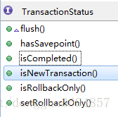

# 事务控制
[[TOC]]
## 事务的基本原理

Spring事务的本质其实就是数据库对事务的支持，使用JDBC的事务管理机制,就是利用java.sql.Connection对象完成对事务的提交，那在没有Spring帮我们管理事务之前，我们要怎么做。

```java
Connection conn = DriverManager.getConnection();
try {  
    conn.setAutoCommit(false);  //将自动提交设置为false                         
    执行CRUD操作 
    conn.commit();      //当两个操作成功后手动提交  
} catch (Exception e) {  
    conn.rollback();    //一旦其中一个操作出错都将回滚，所有操作都不成功
    e.printStackTrace();  
} finally {
    conn.colse();
}
```

事务是一系列的动作，一旦其中有一个动作出现错误，必须全部回滚，系统将事务中对数据库的所有已完成的操作全部撤消，滚回到事务开始的状态，避免出现由于数据不一致而导致的接下来一系列的错误。事务的出现是为了确保数据的完整性和一致性，在目前企业级应用开发中，事务管理是必不可少的。

事务: 是一种能够保证统一个业务中多个写(增删改)操作要么全部成果,要么全部失败的机制!

在业务方法上添加`@Transactional`即可保证此方法是业务性(要么全部失败, 要么全部成功).

在Spring JDBC中, 处理事务的机制大致是
```
开启事务:  Begin
try{
    你的业务方法
    提交: Commit
} catch(RuntimeEXception e){
    回滚: Rollback
}
```

所以，为了保证事务性，所有的写操作在执行之后，必须有某个判定为失败的标准，且判断定为失败后，必须抛出`RuntimeException`或其子孙类异常！

- Spring JDBC默认对`RuntimeException`进行回滚处理，有必要的话，也可以配置为其它异常类型

当需要方法是事务性的，可以使用`@Transactional`注解，此注解可以添加在： 

- 接口
  - 会使得此接口的实现类的所有实现方法都是事务性的
- 接口中的抽象方法上
  - 会使得此接口的实现类中，重写的此方法是事务性的
  - 只作用于当前方法
  - 如果接口上也配置了此注解，并且接口和抽象方法的注解均配置了参数，以方法上的配置为准
- 业务实现类
  - 会使得当前类中所有重写的方法都是事务性
    - 自定义的方法不会是事务性的
- 业务实现类中的方法
  - 不可以添加在自定义的（不是重写的接口的）方法上
    - 语法上，可以添加，但执行时，不允许

Spring JDBC是通过接口代理的方式进行事务管理，所以，只对接口中声明的方法有效！

通常，应该将`@Transactional`添加在接口中的抽象方法上（如果偷懒，或为了避免遗漏，也可以直接添加在接口上）。


## 与事务相关的理论知识

众所周知，事务有四大特性（ACID）

1.原子性（Atomicity）事务是一个原子操作，由一系列动作组成。事务的原子性确保动作要么全部完成，要么完全不起作用。

2.一致性（Consistency）事务在完成时，必须是所有的数据都保持一致状态。

3.隔离性（Isolation）并发事务执行之间无影响，在一个事务内部的操作对其他事务是不产生影响，这需要事务隔离级别来指定隔离性。

4.持久性（Durability）一旦事务完成，数据库的改变必须是持久化的。

在企业级应用中，多用户访问数据库是常见的场景，这就是所谓的事务的并发。事务并发所可能存在的问题：
1.脏读：一个事务读到另一个事务未提交的更新数据。
2.不可重复读：一个事务两次读同一行数据，可是这两次读到的数据不一样。
3.幻读：一个事务执行两次查询，但第二次查询比第一次查询多出了一些数据行。
4.丢失更新：撤消一个事务时，把其它事务已提交的更新的数据覆盖了。

我们可以在java.sql.Connection中看到JDBC定义了五种事务隔离级别来解决这些并发导致的问题：

```java
/**
 * A constant indicating that transactions are not supported. 
 */
int TRANSACTION_NONE         = 0;

/**
 * A constant indicating that
 * dirty reads, non-repeatable reads and phantom reads can occur.
 * This level allows a row changed by one transaction to be read
 * by another transaction before any changes in that row have been
 * committed (a "dirty read").  If any of the changes are rolled back, 
 * the second transaction will have retrieved an invalid row.
 */
int TRANSACTION_READ_UNCOMMITTED = 1;

/**
 * A constant indicating that
 * dirty reads are prevented; non-repeatable reads and phantom
 * reads can occur.  This level only prohibits a transaction
 * from reading a row with uncommitted changes in it.
 */
int TRANSACTION_READ_COMMITTED   = 2;

/**
 * A constant indicating that
 * dirty reads and non-repeatable reads are prevented; phantom
 * reads can occur.  This level prohibits a transaction from
 * reading a row with uncommitted changes in it, and it also
 * prohibits the situation where one transaction reads a row,
 * a second transaction alters the row, and the first transaction
 * rereads the row, getting different values the second time
 * (a "non-repeatable read").
 */
int TRANSACTION_REPEATABLE_READ  = 4;

/**
 * A constant indicating that
 * dirty reads, non-repeatable reads and phantom reads are prevented.
 * This level includes the prohibitions in
 * <code>TRANSACTION_REPEATABLE_READ</code> and further prohibits the 
 * situation where one transaction reads all rows that satisfy
 * a <code>WHERE</code> condition, a second transaction inserts a row that
 * satisfies that <code>WHERE</code> condition, and the first transaction
 * rereads for the same condition, retrieving the additional
 * "phantom" row in the second read.
 */
int TRANSACTION_SERIALIZABLE     = 8;1234567891011121314151617181920212223242526272829303132333435363738394041424344454647
```

翻译过来这几个常量就是
TRANSACTION_NONE JDBC 驱动不支持事务
TRANSACTION_READ_UNCOMMITTED 允许脏读、不可重复读和幻读。
TRANSACTION_READ_COMMITTED 禁止脏读，但允许不可重复读和幻读。
TRANSACTION_REPEATABLE_READ 禁止脏读和不可重复读，单运行幻读。
TRANSACTION_SERIALIZABLE 禁止脏读、不可重复读和幻读。

隔离级别越高，意味着数据库事务并发执行性能越差，能处理的操作就越少。你可以通过conn.setTransactionLevel去设置你需要的隔离级别。
JDBC规范虽然定义了事务的以上支持行为，但是各个JDBC驱动，数据库厂商对事务的支持程度可能各不相同。
出于性能的考虑我们一般设置TRANSACTION_READ_COMMITTED就差不多了，剩下的通过使用数据库的锁来帮我们处理别的，关于数据库的锁这个之后再说。

了解了基本的JDBC事务，那有了Spring，在事务管理上会有什么新的改变呢？
有了Spring，我们再也无需要去处理获得连接、关闭连接、事务提交和回滚等这些操作，使得我们把更多的精力放在处理业务上。事实上Spring并不直接管理事务，而是提供了多种事务管理器。他们将事务管理的职责委托给Hibernate或者JTA等持久化机制所提供的相关平台框架的事务来实现。

## Spring事务管理

Spring事务管理的核心接口是PlatformTransactionManager


事务管理器接口通过getTransaction(TransactionDefinition definition)方法根据指定的传播行为返回当前活动的事务或创建一个新的事务，这个方法里面的参数是TransactionDefinition类，这个类就定义了一些基本的事务属性。
在TransactionDefinition接口中定义了它自己的传播行为和隔离级别


除去常量，主要的方法有：

```java
int getIsolationLevel();// 返回事务的隔离级别
String getName();// 返回事务的名称
int getPropagationBehavior();// 返回事务的传播行为
int getTimeout();  // 返回事务必须在多少秒内完成
boolean isReadOnly(); // 事务是否只读，事务管理器能够根据这个返回值进行优化，确保事务是只读的12345
```

#### Spring事务的传播属性

由上图可知，Spring定义了7个以PROPAGATION_开头的常量表示它的传播属性。

| 名称                      | 值   | 解释                                                         |
| ------------------------- | ---- | ------------------------------------------------------------ |
| PROPAGATION_REQUIRED      | 0    | 支持当前事务，如果当前没有事务，就新建一个事务。这是最常见的选择，也是Spring默认的事务的传播。 |
| PROPAGATION_SUPPORTS      | 1    | 支持当前事务，如果当前没有事务，就以非事务方式执行。         |
| PROPAGATION_MANDATORY     | 2    | 支持当前事务，如果当前没有事务，就抛出异常。                 |
| PROPAGATION_REQUIRES_NEW  | 3    | 新建事务，如果当前存在事务，把当前事务挂起。                 |
| PROPAGATION_NOT_SUPPORTED | 4    | 以非事务方式执行操作，如果当前存在事务，就把当前事务挂起。   |
| PROPAGATION_NEVER         | 5    | 以非事务方式执行，如果当前存在事务，则抛出异常。             |
| PROPAGATION_NESTED        | 6    | 如果当前存在事务，则在嵌套事务内执行。如果当前没有事务，则进行与PROPAGATION_REQUIRED类似的操作。 |

#### Spring事务的隔离级别

| 名称                       | 值   | 解释                                                         |
| -------------------------- | ---- | ------------------------------------------------------------ |
| ISOLATION_DEFAULT          | -1   | 这是一个PlatfromTransactionManager默认的隔离级别，使用数据库默认的事务隔离级别。另外四个与JDBC的隔离级别相对应 |
| ISOLATION_READ_UNCOMMITTED | 1    | 这是事务最低的隔离级别，它充许另外一个事务可以看到这个事务未提交的数据。这种隔离级别会产生脏读，不可重复读和幻读。 |
| ISOLATION_READ_COMMITTED   | 2    | 保证一个事务修改的数据提交后才能被另外一个事务读取。另外一个事务不能读取该事务未提交的数据。 |
| ISOLATION_REPEATABLE_READ  | 4    | 这种事务隔离级别可以防止脏读，不可重复读。但是可能出现幻读。 |
| ISOLATION_SERIALIZABLE     | 8    | 这是花费最高代价但是最可靠的事务隔离级别。事务被处理为顺序执行。除了防止脏读，不可重复读外，还避免了幻读。 |

调用PlatformTransactionManager接口的getTransaction()的方法得到的是TransactionStatus接口的一个实现
TransactionStatus接口



主要的方法有：

```java
void flush();//如果适用的话，这个方法用于刷新底层会话中的修改到数据库，例如，所有受影响的Hibernate/JPA会话。
boolean hasSavepoint(); // 是否有恢复点
boolean isCompleted();// 是否已完成
boolean isNewTransaction(); // 是否是新的事务
boolean isRollbackOnly(); // 是否为只回滚
void setRollbackOnly();  // 设置为只回滚123456
```

可以看出返回的结果是一些事务的状态，可用来检索事务的状态信息。

### 配置事务管理器

介绍完Spring事务的管理的流程大概是怎么走的。接下来可以动手试试Spring是如何配置事务管理器的
例如我在spring-mybatis中配置的:

```xml
<!-- 配置事务管理器 -->
<bean id="transactionManager" class="org.springframework.jdbc.datasource.DataSourceTransactionManager">
    <property name="dataSource" ref="dataSource" />
</bean>1234
```

这配置不是唯一的，可以根据自己项目选择的数据访问框架灵活配置事务管理器

配置了事务管理器后，事务当然还是得我们自己去操作，Spring提供了两种事务管理的方式：编程式事务管理和声明式事务管理，让我们分别看看它们是怎么做的吧。

### 编程式事务管理

编程式事务管理我们可以通过PlatformTransactionManager实现来进行事务管理，同样的Spring也为我们提供了模板类TransactionTemplate进行事务管理，下面主要介绍模板类，我们需要在配置文件中配置

```xml
    <!--配置事务管理的模板-->
    <bean id="transactionTemplate" class="org.springframework.transaction.support.TransactionTemplate">
        <property name="transactionManager" ref="transactionManager"></property>
        <!--定义事务隔离级别,-1表示使用数据库默认级别-->
        <property name="isolationLevelName" value="ISOLATION_DEFAULT"></property>
        <property name="propagationBehaviorName" value="PROPAGATION_REQUIRED"></property>
    </bean>1234567
```

TransactionTemplate帮我们封装了许多代码，节省了我们的工作。下面我们写个单元测试来测测。
为了测试事务回滚，专门建了一张tbl_accont表，用于模拟存钱的一个场景。service层主要代码如下
BaseSeviceImpl

```java
    //方便测试直接写的sql
    @Override
    public void insert(String sql, boolean flag) throws Exception {
        dao.insertSql(sql);
        // 如果flag 为 true ，抛出异常
        if (flag){
            throw new Exception("has exception!!!");
        }
    }
    //获取总金额
    @Override
    public Integer sum(){
        return dao.sum();
    }
```

dao对应的sum方法

```xml
    <select id="sum" resultType="java.lang.Integer">
        SELECT SUM(money) FROM tbl_account;
    </select>123
```

下面看看测试代码

```java
package com.gray;

import com.gray.service.BaseSevice;
import org.junit.Test;
import org.junit.runner.RunWith;
import org.springframework.beans.factory.annotation.Autowired;
import org.springframework.test.context.ContextConfiguration;
import org.springframework.test.context.junit4.SpringJUnit4ClassRunner;
import org.springframework.transaction.TransactionStatus;
import org.springframework.transaction.support.TransactionCallbackWithoutResult;
import org.springframework.transaction.support.TransactionTemplate;

import javax.annotation.Resource;

/**
 * Created by gray on 2017/4/8.
 */
@RunWith(SpringJUnit4ClassRunner.class)
@ContextConfiguration(locations = {"classpath:spring-test.xml"})
public class TransactionTest{
    @Resource
    private TransactionTemplate transactionTemplate;
    @Autowired
    private BaseSevice baseSevice;

    @Test
    public void transTest() {
        System.out.println("before transaction");
        Integer sum1 = baseSevice.sum();
        System.out.println("before transaction sum: "+sum1);
        System.out.println("transaction....");
        transactionTemplate.execute(new TransactionCallbackWithoutResult() {
            @Override
            protected void doInTransactionWithoutResult(TransactionStatus status) {
                try{
                    baseSevice.insert("INSERT INTO tbl_account VALUES (100);",false);
                    baseSevice.insert("INSERT INTO tbl_account VALUES (100);",false);
                } catch (Exception e){
                    //对于抛出Exception类型的异常且需要回滚时,需要捕获异常并通过调用status对象的setRollbackOnly()方法告知事务管理器当前事务需要回滚
                    status.setRollbackOnly();
                    e.printStackTrace();
                }
           }
        });
        System.out.println("after transaction");
        Integer sum2 = baseSevice.sum();
        System.out.println("after transaction sum: "+sum2);
    }
}
```

当baseSevice.insert的第二个参数为false时，我们假设插入数据没有出现任何问题，测试结果如图所示：


当第二个参数为true时，insert会抛出一个异常，这是事务就应该回滚，数据前后不应该有变化，如图所示：


### 声明式事务管理

声明式事务管理有两种常用的方式，一种是基于tx和aop命名空间的xml配置文件，一种是基于@Transactional注解，随着Spring和Java的版本越来越高，大家越趋向于使用注解的方式，下面我们两个都说。
**1.基于tx和aop命名空间的xml配置文件**
配置文件

```xml
    <tx:advice id="advice" transaction-manager="transactionManager">
        <tx:attributes>
            <tx:method name="insert" propagation="REQUIRED" read-only="false"  rollback-for="Exception"/>
        </tx:attributes>
    </tx:advice>

    <aop:config>
        <aop:pointcut id="pointCut" expression="execution (* com.gray.service.*.*(..))"/>
        <aop:advisor advice-ref="advice" pointcut-ref="pointCut"/>
    </aop:config>12345678910
```

测试代码

```java
    @Test
    public void transTest() {
        System.out.println("before transaction");
        Integer sum1 = baseSevice.sum();
        System.out.println("before transaction sum: "+sum1);
        System.out.println("transaction....");
        try{
            baseSevice.insert("INSERT INTO tbl_account VALUES (100);",true);
        } catch (Exception e){
            e.printStackTrace();
        }
        System.out.println("after transaction");
        Integer sum2 = baseSevice.sum();
        System.out.println("after transaction sum: "+sum2);
    }
```

事务正常执行结果截图


事务出现异常结果截图


**2.基于@Transactional注解**
这种方式最简单，也是最为常用的，只需要在配置文件中开启对注解事务管理的支持。

```xml
    <!-- 声明式事务管理 配置事物的注解方式注入-->
    <tx:annotation-driven transaction-manager="transactionManager"/>12
```

然后在需要事务管理的地方加上@Transactional注解，如：

```java
    @Transactional(rollbackFor=Exception.class)
    public void insert(String sql, boolean flag) throws Exception {
        dao.insertSql(sql);
        // 如果flag 为 true ，抛出异常
        if (flag){
            throw new Exception("has exception!!!");
        }
    }
```

rollbackFor属性指定出现Exception异常的时候回滚，遇到检查性的异常需要回滚，默认情况下非检查性异常，包括error也会自动回滚。
测试代码和上面那个一样
事务正常执行结果截图


事务出现异常结果截图


以上就是对Spring事务进行了详细的分析和代码示例。