# Spring MVC 简介

[[TOC]]

## 什么是MVC

MVC全名是Model View Controller，是模型(model)－视图(view)－控制器(controller)的缩写，一种软件设计典范，用一种业务逻辑、数据、界面显示分离的方法组织代码，将业务逻辑聚集到一个部件里面，在改进和个性化定制界面及用户交互的同时，不需要重新编写业务逻辑。


model通常表示要呈现给用户的数据模型;

view通常表示展示给用户的外观;

control主要职责就是负责将哪个数据模型最终在哪个view视图上呈现给用户;


Spring MVC中,支持传入的参数方式为与表单中输入框名字相同的参数.

此时会自动将表单对应的信息作为参数在调用当前方法时传入.

对于输入的是数字的内容可以直接用int型的参数接收.


## 什么是 Spring MVC

Spring MVC 属于 SpringFrameWork 的后续产品，已经融合在 Spring Web Flow 里面，是一个强大灵活的 Web 框架。Spring MVC 提供了一个 DispatcherServlet 作为前端控制器来分配请求。通过策略接口，Spring 框架是高度可配置的。Spring MVC 还包含多种视图技术，如 Java Server Pages（JSP）、Velocity、Tiles、iText 和 POI 等。Spring MVC 分离了控制器、模型对象、分派器以及处理程序对象的角色，这种分离让它们更容易进行定制。

需要注意：Spring MVC框架只关心V - C之间的交互，与M其实没有任何关系。 

Spring MVC 框架主要由 DispatcherServlet、处理器映射器、处理器适配器、处理器(控制器)、视图解析器、视图组成。

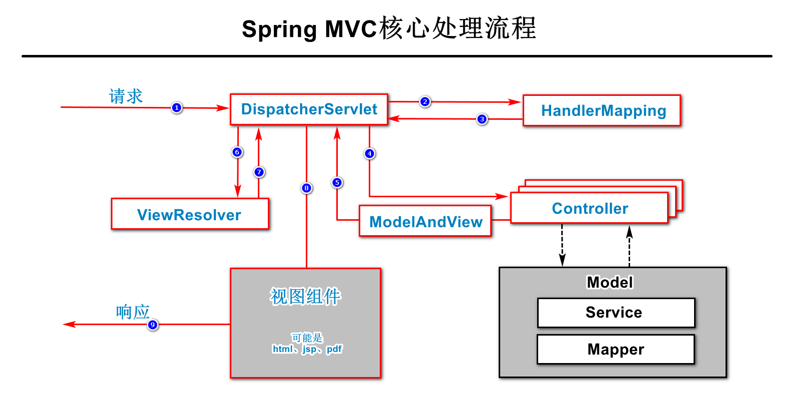


1）DispatcherServlet：前端控制器，所有请求经过它来统一分发，请求会被分发给对应Handler；  

2）HandlerMapping（处理器映射器）：解析请求链接，然后根据请求链接找到执行这个请求的类（HandlerMapping所说的handler）；       

3）HandlerAdapter（处理器适配器）：调用具体方法对用户发来请求进行处理；       

4）Controller：处理用户请求，处理完则返回ModelAndView对象给DispatcherServlet前端控制器； 宏观角度，DispatcherServlet是整个Web应用控制器，微观考虑，Controller是单个Http请求处理过程中的控制器；       

5）ViewResolver（视图解析器）：解析ModelModelAndView中逻辑视图变为一个真正的View对象，并将ModelAndView中的Model除。

## Spring MVC框架介绍

### 概述

Spring MVC属于SpringFrameWork的后续产品，已经融合在Spring Web Flow里面。Spring 框架提供了构建 Web 应用程序的全功能 MVC 模块。使用 Spring 可插入的 MVC 架构，从而在使用Spring进行WEB开发时，可以选择使用Spring的SpringMVC框架或集成其他MVC开发框架，如Struts1(现在一 般不用)，Struts2(一般老项目使用)等。

SpringMVC就是基于MVC设计模式来实现的。

我们的POJO就是Model层，我们的JSP就是视图层，我们的Controller就是控制层。

现在主流基于SSM三大框架开发都是在MVC上继续演化，又分为持久层DAO，业务层Service，控制层Controller。持久层用来和数据库读写ORM，业务层用来处理复杂的业务逻辑，控制层用来处理MVC的控制。

#### MVC模型

用来进行分层的结构，这样代码分离结构清晰，各层代码，各司其职，易于开发大型项目。

MVC(Model模型、View视图、Control控制层)，将软件进行分层达到松耦合的效果。

通用的软件编程思想, 在MVC设计模式中认为, 任何软件都可以分三层：控制层（Controller）、数据处理模型（Model）、负责展示数据的视图（View）。

在MVC设计思想中要求一个符合MVC设计思想的软件应该保证上面这三部分相互独立，互不干扰，每一个部分只负责自己擅长的部分。如果某一个模块发生变化，应该尽量做到不影响其他两个模块。提高代码的可读性，实现程序间的松耦合、提高代码复用性。


#### 性能超群

简单易用性能佳


#### 工作原理


**过程简单描述** 😗

客户端发送请求-> 前端控制器 DispatcherServlet 接受客户端请求 -> 找到处理器映射 HandlerMapping 解析请求对应的 Handler-> HandlerAdapter 会根据 Handler 来调用真正的处理器开处理请求，并处理相应的业务逻辑 -> 处理器返回一个模型视图 ModelAndView -> 视图解析器进行解析 -> 返回一个视图对象->前端控制器 DispatcherServlet 渲染数据（Moder）->将得到视图对象返回给用户.

**更具体一些的描述**😗

1、用户发送请求至前端控制器DispatcherServlet。

2、DispatcherServlet收到请求调用HandlerMapping处理器映射器。

3、处理器映射器找到具体的处理器(可以根据xml配置、注解进行查找)，生成处理器对象及处理器拦截器(如果有则生成)一并返回给DispatcherServlet。

4、DispatcherServlet调用HandlerAdapter处理器适配器。

5、HandlerAdapter经过适配调用具体的处理器(Controller，也叫后端控制器)。

6、Controller执行完成返回ModelAndView。

7、HandlerAdapter将controller执行结果ModelAndView返回给DispatcherServlet。

8、DispatcherServlet将ModelAndView传给ViewReslover视图解析器。

9、ViewReslover解析后返回具体View。

10、DispatcherServlet根据View进行渲染视图（即将模型数据填充至视图中）。

11、DispatcherServlet响应用户。

### 案例：展示汽车数据

从springmvc2.5开始引入注解方式，特别到了3.0就全面引入注解方式，号称xml零配置。spring3.0配置注解引入后也就是这个点成为了它和struts2的分水岭。随着springmvc的成熟，struts2开始落幕，趋于被市场淘汰。

那下面我们就来体验下：

#### 需求

访问链接： http://localhost:8080/car/get

得到JSON数据： {"id":718,"name":"保时捷","type":"Cayman T","color":"红色","price":641000.0}

#### 创建Maven module


#### 创建RunApp.java

```java

package cn.tedu;

import org.springframework.boot.SpringApplication;
import org.springframework.boot.autoconfigure.SpringBootApplication;
import org.springframework.stereotype.Controller;


@SpringBootApplication
@Controller
public class RunApp {
    public static void main(String[] args) {
        SpringApplication.run(RunApp.class);
    }
}


```

#### Car.java

```java
package cn.tedu.pojo;

//Model对象，也称为POJO

//保时捷718 Cayman T，红色，641000元起
public class Car {
	private Integer id;		//718
	private String name;		//保时捷
	private String type;		//Cayman T
	private String color;		//红色
	private Double price;	//641000
	
	public Integer getId() {
		return id;
	}
	public void setId(Integer id) {
		this.id = id;
	}
	public String getName() {
		return name;
	}
	public void setName(String name) {
		this.name = name;
	}
	public String getType() {
		return type;
	}
	public void setType(String type) {
		this.type = type;
	}
	public String getColor() {
		return color;
	}
	public void setColor(String color) {
		this.color = color;
	}
	public Double getPrice() {
		return price;
	}
	public void setPrice(Double price) {
		this.price = price;
	}
	@Override
	public String toString() {
		return "Car [id=" + id + ", name=" + name + ", type=" + type + ", color=" + color + ", price=" + price + "]";
	}
}

```

#### CarController.java

```java
package cn.tedu.controller;

import org.springframework.web.bind.annotation.RequestMapping;
import org.springframework.web.bind.annotation.RestController;

import cn.tedu.pojo.Car;

@RestController
@RequestMapping("/car")
public class CarController {
	@RequestMapping("/get")
	public Car get() {
		//保时捷718 Cayman T，红色，641000元起
		Car car = new Car();
		car.setId(718);
		car.setName("保时捷");
		car.setType("Cayman T");
		car.setColor("红色");
		car.setPrice(641000.0);
		
		return car;
	}
}

```

#### 测试

```java
访问:http://localhost:8080/car/get

```

执行结果：

```java
{"id":718,"name":"保时捷","type":"Cayman T","color":"红色","price":641000.0}

```

### 处理请求参数

#### 概述

当客户端打开浏览器要访问服务器时,可能会带着一些http请求参数过来.

这时,服务器需要获取http参数进行业务处理,如何处理http请求并获取参数呢?

总共有8种,重点时两种方式:GET方式和POST方式.

#### GET方式

向特定的资源发出请求,并返回实体.有固定的写法.而且数据有最大长度,超出就不行

例如:
`http://localhost:8080/car/insert?id=1&name=张三&age=18`

#### POST方式

向指定资源提交数据进行处理请求（例如提交表单或者上传文件）。数据被包含在请求体中。POST请求可能会导致新的资源的建立和/或已有资源的修改。

#### 接收请求参数

在Spring MVC中，当需要接收客户端的请求参数时，只需要将各参数直接声明为处理请求的方法的参数即可，例如：

```java
// http://localhost:8080/springmvc01_war_exploded/user/reg.do?username=root&password=123456&age=25
@RequestMapping("/reg.do")
public String reg(String username, String password, Integer age) {
    System.out.println("username = " + username
            + ", password = " + password
            + ", age = " + age);
    return "OK";
}
```

需要注意：

- 如果客户端提交的请求中根本没有匹配名称的参数，则以上获取到的值将是`null`
  - 例如：http://localhost/user/login.do
- 如果客户端仅提交了参数名称，却没有值，则以上获取到的值将是`""`（长度为0的字符串）
  - 例如：http://localhost/user/login.do?username=&password=&age=
- 如果客户端提交了匹配名称的参数，并且值是有效的，则可以获取到值
  - 例如：http://localhost/user/login.do?username=admin&password=1234&age=27
- 以上名称应该是由服务器端决定的，客户端需要根据以上名称来提交请求参数
- 声明参数时，可以按需将参数声明成期望的类型，例如以上将`age`声明为`Integer`类型
  - 注意：声明成`String`以外的类型时，应该考虑是否可以成功转换类型

当有必要的情况下，可以在以上各参数的声明之前添加`@RequestParam`注解，其作用主要有：

- 配置`name`属性：客户端将按照此配置的值提交请求参数，而不再是根据方法的参数名称来提交请求参数
- 配置`required`属性：是否要求客户端必须提交此请求参数，默认为`true`，如果不提交，则出现400错误，当设置为`false`时，如果不提交，则服务器端将此参数值视为`null`
- 配置`defaultValue`属性：配置此请求参数的默认值，当客户端没有提交此请求参数时，视为此值

另外，如果需要客户端提交的请求参数较多，可以将这些参数封装为自定义的数据类型，并将自定义的数据类型作为处理方法的参数即可，例如：

**cn.tedu.springmvc.dto.UserRegDTO**

```java
package cn.tedu.springmvc.dto;

public class UserRegDTO {

    private String username;
    private String password;
    private Integer age;

    // 生成Setters & Getters
    // 生成toString()
    
}
```

**UserController**（代码片段）

```java
// http://localhost:8080/springmvc01_war_exploded/user/reg.do?username=root&password=123456&age=25
@RequestMapping("/reg.do")
public String reg(UserRegDTO userRegDTO) {
    System.out.println(userRegDTO);
    return "OK";
}
```

需要注意，不要将`@RequestParam`添加在封装的类型之前。

另外，你也可以将多个请求参数区分开来，一部分直接声明为处理请求的方法的参数，另一部分封装起来。

#### RESTFul方式（推荐）

为了简化GET请求的写法,可以使用RESTFul方式,用法:

1、需要使用注解@PathVariable来获取请求路径中的参数值,@PathVariable用来绑定值

2、通过{???}获取路径中传递来的值

3、以前GET的访问方式即将被简化成:

```
http://localhost:8080/car/insert/1/张三/18
```

百科资料：RESTFUL是一种网络应用程序的设计风格和开发方式，基于HTTP，可以使用XML格式定义或JSON格式定义。RESTFUL适用于移动互联网厂商作为业务接口的场景，实现第三方OTT调用移动网络资源的功能，动作类型为新增、变更、删除所调用资源。

RESTful的设计风格的**典型表现**就是：将某些唯一的请求参数的值放在URL中，使之成为URL的一部分，例如https://www.zhihu.com/question/28557115这个URL的最后一部分`28557115` 应该就是这篇贴子的id值，而不是使用例如`?id=28557115`这样的方式放在URL参数中。

注意：RESTful只是一种设计风格，并不是一种规定，也没有明确的或统一的执行方式！

如果没有明确的要求，以处理用户数据为例，可以将URL设计为：

- `/users`：查看用户列表
- `/users/9527`：查询id=9527的用户的数据
- `/users/9527/delete`：删除id=9527的用户的数据

在RESTful风格的URL中，大多是包含了某些请求参数的值，在使用Spring MVC框架时，当需要设计这类URL时，可以使用`{名称}`进行占位，并在处理请求的方法的参数列表中，使用`@PathVariable`注解请求参数，即可将占位符的实际值注入到请求参数中！

例如：

```java
// http://localhost:8080/springmvc01_war_exploded/user/3/info.do
@GetMapping("/{id}/info.do")
public UserVO info(@PathVariable Long id) {
    System.out.println("即将查询 id = " + id + " 的用户的信息……");
    UserVO userVO = new UserVO();
    userVO.setUsername("chengheng");
    userVO.setPassword("1234567890");
    userVO.setEmail("chengheng@qq.com");
    return userVO;
}
```

提示：在以上代码中，URL中使用的占位符是`{id}`，则方法的参数名称也应该是`id`，就可以直接匹配上！如果无法保证这2处的名称一致，则需要在`@PathVariable`注解中配置占位符中的名称，例如：

```java
@GetMapping("/{userId}/info.do")
public UserVO info(@PathVariable("userId") Long id) {
    // ...
}
```

在使用`{}`格式的占位符时，还可以结合正则表达式进行匹配，其基本语法是：

```java
{占位符名称:正则表达式}
```

例如：

```java
@GetMapping("/{id:[0-9]+}/info.do")
```

当设计成以上URL时，仅当占位符位置的是纯数字的URL才会被匹配上，如果不是纯数字的刚出现404错误页面。

并且，以上模式的多种不冲突的正则表达式是可以同时存在的，例如：

```java
@GetMapping("/{id:[0-9]+}/info.do")
public UserVO info(@PathVariable Long id) {
    System.out.println("即将查询 id = " + id + " 的用户的信息……");
    // ...
}

@GetMapping("/{username:[a-zA-Z]+}/info.do")
public UserVO info(@PathVariable String username) {
    System.out.println("即将查询 用户名 = " + username + " 的用户的信息……");
    // ...
}
```

甚至，还可以存在不使用正则表达式，但是URL格式几乎一样的配置：

```java
@GetMapping("/{id:[0-9]+}/info.do")
public UserVO info(@PathVariable Long id) {
    System.out.println("即将查询 id = " + id + " 的用户的信息……");
    // ...
}

@GetMapping("/{username:[a-zA-Z]+}/info.do")
public UserVO info(@PathVariable String username) {
    System.out.println("即将查询 用户名 = " + username + " 的用户的信息……");
    // ...
}

// 【以下是新增的】
// http://localhost:8080/springmvc01_war_exploded/user/list/info.do
@GetMapping("/list/info.do")
public UserVO list() {
    System.out.println("即将查询 用户的列表 的信息……");
    // ...
}
```

最终执行时，如果使用`/user/list/info.do`，则会匹配到以上代码中的最后一个方法，并不会因为这个URL还能匹配第2个方法配置的`{username:[a-zA-Z]+}`而产生冲突。所以，使用了占位符的做法并不影响精准匹配的路径。

### 处理Get请求的参数

#### 编写后端程序

如果页面的名称和后台形参的名称不一致,可以使用@RequestParam(“页面名称”),就必须指定值.

```java
package cn.tedu.controller;

import org.springframework.web.bind.annotation.PathVariable;
import org.springframework.web.bind.annotation.RequestMapping;
import org.springframework.web.bind.annotation.RestController;

import cn.tedu.pojo.Car;

@RestController//接受请求,返回json数据
@RequestMapping("/car/")
public class CarController {
	//2，通过GET请求,传入参数并接收处理
		//访问 http://localhost:8080/car/add?id=10,必须设置id的值否则报错,?拼接是固定语法
	@RequestMapping("add")
	public void add(int id) {
		System.out.println("数据添加成功,id="+id);
	}
		//访问 http://localhost:8080/car/save?id=90&name=tony ,设置多个参数值时用&连接
	@RequestMapping("save")
	public void save(int id,String name) {
		System.out.println("数据保存成功,id="+id+",name="+name);
	}

	//访问 http://localhost:8080/car/obj?id=100&name=BMW&color=red
	@RequestMapping("obj") 
	public void obj(Car c) {//处理一个对象的参数
		System.out.println(c);
	}
	//3，优化GET传参的restful方式
		//GET方式访问: http://localhost:8080/car/insert?id=1&name=张三&age=18
		//restful方式访问: http://localhost:8080/car/insert/1/张三/18
	@RequestMapping("insert/{x}/{y}/{z}")
//restful配合@PathVariable注解一起用,使用{资源名}获取传过来的值
	public void insert(@PathVariable int x,
						@PathVariable String y,
						@PathVariable int z) {
		System.out.println("数据插入成功,id="+x+",name="+y+",age="+z);
	}
	
	@RequestMapping("g2/{name}/{age}/{sex}")
	//restful获取地址栏中的参数值,并自动封装给了User对应的属性
    public String get2(User u){
        return ""+u;
    }
}

```

#### 编写前端程序

```html
<!DOCTYPE html>
<html lang="en">
    <head>
        <meta charset="UTF-8">
        <title>前后端关联</title>
    </head>
    <body>
        <a href="http://localhost:8080/car/restful/3/1">点我</a>
    </body>
</html>

```

### 处理Post请求的参数

#### 架构图

激动吧，前行吧，终于我们要学一种常规的方式，和ajax不同，它是表单自身提供的一种方式，可以实现前台请求提交给后台系统，经过后台系统处理后，进行展现。


#### 项目结构


#### 接收参数

- 处理一个参数,比如:id
- 处理多个参数,比如:id,name,hobby
- 处理对象,比如:Student数据
- url的RESTFul形式

#### 准备stuform.html


```html
<!DOCTYPE html>
<html>
<head>
    <meta charset="utf-8">
    <title>stuform</title>
    <style>
        input[type='text']{
            width: 300px;
            height: 20px;
        }
    </style>
</head>
<body style="padding-left: 50px;font-size: 15px;font-weight: bold;">
<form action="http://localhost:8080/stu/add" method="post">
    <table style="margin: 30px;">
        <h2 style="padding-left: 100px;">学生管理系统</h2>
        <tr>
            <td>姓名:</td>
        </tr>
        <tr>
            <td>
                <input type="text" name="name"  placeholder="请输入姓名..."/>
            </td>
        </tr>
        <tr>
            <td>年龄:</td>
        </tr>
        <tr>
            <td>
                <input type="text" name="age" placeholder="请输入年龄..."  />
            </td>
        </tr>
        <tr>
            <td>
                性别：(单选框)
                <input type="radio" name="sex" checked="checked" value="0"/>男
                <input type="radio" name="sex" value="1" />女
            </td>
        </tr>
        <tr>
            <td>
                爱好：(多选)
                <input type="checkbox" name="hobby" checked="checked" value="ppq"/>乒乓球
                <input type="checkbox" name="hobby" value="ps"/>爬山
                <input type="checkbox" name="hobby" value="cg"/>唱歌
            </td>
        </tr>
        <tr>
            <td>
                学历：(下拉框)
                <select name="edu">
                    <option value ="1">本科</option>
                    <option value ="2">专科</option>
                    <option value ="3">研究生</option>
                </select>
            </td>
        </tr>
        <tr>
            <td>
                入学日期:
            </td>
        </tr>
        <tr>
            <td>
                <input type="date" name="intime"/>
            </td>
        </tr>
        <tr>
            <td>
                <input type="submit" value="保存" />
                <input type="reset" value="取消" />
            </td>
        </tr>
    </table>
</form>
</body>
</html>

```

#### 准备Student.java

```java
注意:: 日期属性要加注解,@DateTimeFormat(pattern="yyyy-MM-dd")，否则400错误
package cn.tedu.pojo;

import org.springframework.format.annotation.DateTimeFormat;

import java.util.Arrays;
import java.util.Date;

public class Student {private Integer id;
    private String name;
    private Integer age;
    private String sex;
    private String[] hobby;
    private String edu;
    @DateTimeFormat(pattern="yyyy-MM-dd")
    //网页上的日期是string,注解用来转换格式,不然400错误
    private Date intime;
    public Date getIntime() {
        return intime;
    }

    public void setIntime(Date intime) {
        this.intime = intime;
    }

    public Integer getId() {
        return id;
    }
    public void setId(Integer id) {
        this.id = id;
    }
    public String getName() {
        return name;
    }
    public void setName(String name) {
        this.name = name;
    }
    public Integer getAge() {
        return age;
    }
    public void setAge(Integer age) {
        this.age = age;
    }
    public String getSex() {
        return sex;
    }
    public void setSex(String sex) {
        this.sex = sex;
    }
    public String[] getHobby() {
        return hobby;
    }
    public void setHobby(String[] hobby) {
        this.hobby = hobby;
    }
    public String getEdu() {
        return edu;
    }
    public void setEdu(String edu) {
        this.edu = edu;
    }
    @Override
    public String toString() {
        return "Student{" +
                "id=" + id +
                ", name='" + name + '\'' +
                ", age=" + age +
                ", sex='" + sex + '\'' +
                ", hobby=" + Arrays.toString(hobby) +
                ", edu='" + edu + '\'' +
                ", intime=" + intime +
                '}';
    }

}

```

#### 准备StuController.java

```java
package cn.tedu.controller;

import cn.tedu.pojo.Student;
import org.springframework.web.bind.annotation.RequestMapping;
import org.springframework.web.bind.annotation.RestController;

@RestController
@RequestMapping("/stu/")
public class StuController {
    //stuform.html的提交路径,会执行此方法的业务
    @RequestMapping("add")
    public void add(Student s){
        System.out.println(s);
    }
}

```

#### 日期数据的处理

把页面上的intime日期数据,交给后台处理.由于页面的数据都当做String类型处理,所以交给后台处理时,会抛出400错误.需要使用注解进行类型转换.并指定日期格式:

```java
//页面报400 IllegalArgumentException: String->Date

@DateTimeFormat(pattern="yyyy-MM-dd";)

private java.util.Date intime;

public Date getIntime() {

	return intime;

}

public void setIntime(Date intime) {

	this.intime= intime;

}

```

#### 改造成Ajax访问

–1，把form标签的内容改成：`<form action="#" method="post" id="f1">`
–2，把提交按钮的内容改成：`<input type="button" value="保存" onclick="fun();"/>`
–3，添加ajax代码：

```html
<script src="jquery-1.8.3.min.js"></script>
<script>
	function fun(){
		$.ajax({
			url:"http://localhost:8080/stu/add",
			data:$("#f1").serialize(),
			success:function(data){
				console.log(data);
			}
		})
	}
</script>

```

–4，修改Controller代码并添加@CrossOrigin注解

### 关于响应正文时的结果类型

当响应正文时，只要方法的返回值是自定义的数据类型，则Spring MVC框架就一定会调用`jackson-databind`中的转换器，就可以将结果转换为JSON格式的字符串！

通常，在项目开发中，会定义一个“通用”的数据类型，无论是哪个控制器的哪个处理请求的方法，最终都将返回此类型！

显示的通用返回类型如下：

```java
public class JsonResult<T> {

    private Integer state; // 业务返回码
    private String message; // 消息
    private T data; // 数据

    private JsonResult() { }

    public static JsonResult<Void> ok() {
        return ok(null);
    }

    public static <T> JsonResult<T> ok(T data) {
        JsonResult<T> jsonResult = new JsonResult<>();
        jsonResult.state = State.OK.getValue();
        jsonResult.data = data;
        return jsonResult;
    }

    public static JsonResult<Void> fail(State state, String message) {
        JsonResult<Void> jsonResult = new JsonResult<>();
        jsonResult.state = state.getValue();
        jsonResult.message = message;
        return jsonResult;
    }

   public enum State {
       OK(20000),
       ERR_USERNAME(40400),
       ERR_PASSWORD(40600);

       Integer value;

       State(Integer value) {
           this.value = value;
       }

       public Integer getValue() {
           return value;
       }
   }

   // Setters & Getters

}
```

### 统一处理异常

Spring MVC框架提供了统一处理异常的机制，使得特定种类的异常对应一段特定的代码，后续，当编写代码时，无论在任何位置，都可以将异常直接抛出，由统一处理异常的代码进行处理即可！

关于统一处理异常，需要自定义方法对异常进行处理，关于此方法：

- 注解：需要添加`@ExceptionHandler`注解
- 访问权限：应该是公有的
- 返回值类型：可参考处理请求的方法的返回值类型
- 方法名称：自定义
- 参数列表：必须包含1个异常类型的参数，并且可按需添加`HttpServletRequest`、`HttpServletResponse`等少量特定的类型的参数，不可以随意添加参数

例如：

```java
@ExceptionHandler
public String handleException(NullPointerException e) {
    return "Error, NullPointerException!";
}
```

需要注意：以上处理异常的代码，只能作用于当前控制器类中各个处理请求的方法，对其它控制器类的中代码并不产生任何影响，也就无法处理其它控制类中处理请求时出现的异常！

为保证更合理的处理异常，应该：

- 将处理异常的代码放在专门的类中
- 在此类上添加`@ControllerAdvice`注解
  - 由于目前主流的响应方式都是“响应正文”的，则可以将`@ControllerAdvice`替换为`@RestControllerAdvice`

所以，可以创建`GlobalExceptionHandler`类，代码如下：

```java
@RestControllerAdvice
public class GlobalExceptionHandler {

    @ExceptionHandler
    public String handleException(NullPointerException e) {
        return "Error, NullPointerException!";
    }

}
```

另外，可以将处理异常的代码放在所有控制器类公共的父类中，则各控制器类都相当于有此代码，则处理异常的代码可以作用于所有控制器中处理请求的方法！但不推荐此做法。

在以上处理异常的过程中，Spring MVC的处理模式**大致**如下：

```java
try {
	userController.npe();
} catch (NullPointerException e) {
	globalExceptionHandler.handleException(e);
}
```

关于以上处理的方法的参数中的异常类型，将对应Spring MVC框架能够统一处理的异常类型，例如将其声明为`Throwable`时，所有异常都可被此方法进行处理！但是，在处理过程中，应该判断当前异常对象所归属的类型，以针对不同类型的异常进行不同的处理！

需要注意：允许存在多个统一处理异常的方法，例如：

```java
@ExceptionHandler
public String handleNullPointerException(NullPointerException e) {
    return "Error, NullPointerException!";
}

@ExceptionHandler
public String handleNumberFormatException(NumberFormatException e) {
    return "Error, NumberFormatException!";
}

@ExceptionHandler
public String handleThrowable(Throwable e) {
    e.printStackTrace();
    return "Error, Throwable!";
}
```

并且，如果某个异常能够被多个方法处理（异常类型符合多个处理异常的方法的参数类型），则优先执行最能精准匹配的处理异常的方法，例如，当出现`NullPointerException`时，将执行`handleNullPointerException()`而不会执行`handleThrowable()`！

**在开发实践中**，通常都会有`handleThrowable()`方法，以避免某个异常没有被处理而导致500错误！

关于`@ExceptionHandler`注解，可用于表示被注解的方法是用于统一处理异常的，而且，可用于配置被注解的方法能够处理的异常的类型，其效力的优先级高于在方法的参数上指定异常类型。

**在开发实践中**，建议为每一个`@ExceptionHandler`配置注解参数，在注解参数中指定需要处理异常的类型，而处理异常的方法的参数直接使用`Throwable`即可。

例如：

```java
@ExceptionHandler({
        NullPointerException.class,
        ClassCastException.class
})
public String handleNullPointerException(Throwable e) {
    return "Error, NullPointerException or ClassCastException!";
}

@ExceptionHandler(NumberFormatException.class)
public String handleNumberFormatException(Throwable e) {
    return "Error, NumberFormatException!";
}

@ExceptionHandler(Throwable.class)
public String handleThrowable(Throwable e) {
    return "Error, Throwable!";
}
```

### 拦截器（Interceptor）

在Spring MVC框架中，拦截器是可以运行在所有控制器处理请求之前和之后的一种组件，并且，如果拦截器运行在控制器处理请求之前，还可以选择对当前请求进行阻止或放行。

注意：拦截器的目的并不是“拦截下来后阻止运行”，更多的是“拦截下来后执行某些代码”，其优势在于可作用于若干种不同请求的处理过程，即写一个拦截器，就可以在很多种请求的处理过程中被执行。

只要是若干种不同的请求过程中都需要执行同样的或高度相似的代码，都可以使用拦截器解决，典型的例如验证用户是否已经登录等等。

当需要使用拦截器时，首先，需要自定义类，实现`HandlerInterceptor`接口，例如：

```java
package cn.tedu.springmvc.interceptor;

import org.springframework.web.servlet.HandlerInterceptor;
import org.springframework.web.servlet.ModelAndView;

import javax.servlet.http.HttpServletRequest;
import javax.servlet.http.HttpServletResponse;

public class LoginInterceptor implements HandlerInterceptor {
    @Override
    public boolean preHandle(HttpServletRequest request, HttpServletResponse response, Object handler) throws Exception {
        System.out.println("LoginInterceptor.preHandle()");
        return false;
    }

    @Override
    public void postHandle(HttpServletRequest request, HttpServletResponse response, Object handler, ModelAndView modelAndView) throws Exception {
        System.out.println("LoginInterceptor.postHandle()");
    }

    @Override
    public void afterCompletion(HttpServletRequest request, HttpServletResponse response, Object handler, Exception ex) throws Exception {
        System.out.println("LoginInterceptor.afterCompletion()");
    }
}

```

每个拦截器都必须注册才会被启用，注册过程通过重写`WebMvcConfigure`接口中的`addInterceptors()`方法即可，例如：

```java
@Configuration // 此注解不是必须的
@EnableWebMvc
@ComponentScan("cn.tedu.springmvc") // 必须配置在当前配置类，不可配置在Spring的配置类
public class SpringMvcConfig implements WebMvcConfigurer {

    @Override
    public void addInterceptors(InterceptorRegistry registry) {
        registry.addInterceptor(new LoginInterceptor())
                .addPathPatterns("/user/login.do");
    }

}
```

当进行访问时，在浏览器窗口中将看到一片空白，在Tomcat控制台可以看到`preHandle()`方法已经执行。当把拦截器中`preHandle()`方法的返回值改为`true`时，在Tomcat控制台可以看到依次执行了`preHandle()` > 控制器中处理请求的方法 > `postHandle()` > `afterCompletion()`。

其实，`preHandle()`方法的返回值为`true`时，表示“放行”，为`false`时，表示“阻止”。

关于注册拦截器时的配置，使用链式语法可以先调用`addInterceptor()`方法添加拦截器，然后调用`addPathPatter()`方法添加哪些路径需要被拦截，此方法的参数可以是`String...`，也可以是`List<String>`，在编写路径值时，可以使用`*`作为通配符，例如配置为`/user/*`，则可以匹配`/user/login.do`、`/user/reg.do`等所有直接在`/user`下的路径，但不能匹配`/user/1/info.do`，如果需要匹配若干层级，必须使用2个连续的星号，例如配置为`/user/**`。一旦使用通配符，就有可能导致匹配的范围过大，例如配置为`/user/**`时，还可以匹配到`/user/reg.do`（注册）和`/user/login.do`（登录），如果此拦截器是用于“验证用户是否登录”的，则不应该对这2个路径进行处理，那么，配置拦截器时，还可以在链式语法中调用`excludePathPattern()`方法，以添加“排除路径”（例外）。

配置示例：

```java
@Override
public void addInterceptors(InterceptorRegistry registry) {
    registry.addInterceptor(new LoginInterceptor())
            .addPathPatterns("/user/**")
            .excludePathPatterns("/user/reg.do", "/user/login.do");
}
```

### 总结

#### springmvc和struts2比较

| **技术**                          | **核心分发器**    | **拦截级别**                                                 | **说明**                                                     |
| --------------------------------- | ----------------- | ------------------------------------------------------------ | ------------------------------------------------------------ |
| **Struts1**                       | DispatcherServlet | 类级别                                                       | 基于Servlet实现企业中很多旧项目采用的框架action是单例模式，线程不安全的。Struts1使用JSTL EL表达式，但是对集合和索引属性的支持很弱。 |
| **Struts2**                       | DispatcherFilter  | 类级别一个类对应一个request上下文                            | 基于Filter实现Struts2 action是原型模式 prototype，每次访问对象都会创建新的实例，保证线程安全性；采用 OGNL解析页面标签。Struts2是基于松耦合，和web容器脱钩ValueStack复杂值栈、多例、OGNL导致性能低安全漏洞频繁，不安全 |
| **SpringMVC**                     | DispatcherServlet | 方法级别一个方法对应一个request上下文，而方法同时又跟一个url对应。 | 基于Servlet实现Springmvc controller是单例模式，整个程序只有一个对象实例。Spring的安全性是通过绑定threadlocal实现Spring3 mvc可以认为已经99.9%零配置了。采用JSTL解析页面标签 |
| 基于web容器、单例、JSTL导致性能高 |                   |                                                              |                                                              |

#### MVC和SSM的关系

![[外链图片转存失败,源站可能有防盗链机制,建议将图片保存下来直接上传(img-2hQ35lNn-1623044111740)(RackMultipart20210607-4-13lyxac_html_60023b040e554441.png)]](https://img-blog.csdnimg.cn/20210607134446571.png?x-oss-process=image/watermark,type_ZmFuZ3poZW5naGVpdGk,shadow_10,text_aHR0cHM6Ly9ibG9nLmNzZG4ubmV0L3UwMTI5MzI4NzY=,size_16,color_FFFFFF,t_70)

![[外链图片转存失败,源站可能有防盗链机制,建议将图片保存下来直接上传(img-CaTNOthN-1623044111742)(RackMultipart20210607-4-13lyxac_html_f88f6a68e6a991be.png)]](https://img-blog.csdnimg.cn/20210607134452205.png?x-oss-process=image/watermark,type_ZmFuZ3poZW5naGVpdGk,shadow_10,text_aHR0cHM6Ly9ibG9nLmNzZG4ubmV0L3UwMTI5MzI4NzY=,size_16,color_FFFFFF,t_70)

#### SpringMVC常用的注解

##### @Controller 标识是一个Controller，Spring包扫描创建实例

##### @RequestMapping 请求后的映射路径

`@RequestMapping`注解的**主要作用**是配置**请求路径**与**处理请求的方法**的映射关系，例如将此注解添加在控制器中某个方法之前：

```java
// http://localhost:8080/springmvc01_war_exploded/login.do
@RequestMapping("/login.do")
@ResponseBody
public String login() {
    return "UserController.login()";
}
```

就会将注解中配置的路径与注解所在的方法对应上！

除了方法之前，此注解还可以添加在控制器类之前，例如：

```java
@Controller
@RequestMapping("/user")
public class UserController {
}
```

一旦在类上添加了此注解并配置路径，则每个方法实际映射到的请求路径都是“类上的`@RequestMapping`配置的路径 + 方法上的`@RequestMapping`配置的路径”。

通常，在项目中，推荐为每一个控制器类都配置此注解，以指定某个URL前缀。

在使用`@RequestMapping`配置路径时，并不要求各路径使用 `/` 作为第1个字符！

另外，在`@RequestMapping`还可以配置：

- 请求方式
- 请求头
- 响应头
- 等等

所以，在`@RequestMapping`注解中，增加配置`method`属性，可以限制客户端的请求方式，例如可以配置为：

```java
@RequestMapping(value = "/login.do", method = RequestMethod.POST)
@ResponseBody
public String login() {
    return "UserController.login()";
}
```

如果按照以上代码，则`/login.do`路径只能通过`POST`方式发起请求才可以被正确的处理，如果使用其它请求方式（例如`GET`），则会导致HTTP的405错误。

如果没有配置`method`属性，则表示可以使用任何请求方式，包括：

```
GET, HEAD, POST, PUT, PATCH, DELETE, OPTIONS, TRACE
```

另外，Spring MVC框架还提供了`@RequestMapping`的相关注解，例如：

- `@GetMapping`
- `@PostMapping`
- `@PutMapping`
- `@DeleteMapping`
- 等等

这些注解就是已经限制了请求方式的注解！以`@GetMapping`为例，就限制了请求方式必须是`GET`，除此以外，使用方式与`@RequestMapping`完全相同！

所以，在实际应用中，在类的上方肯定使用`@RequestMapping`（其它的`@XxxMapping`不可以加在类上），方法上一般都使用`@GetMapping`、`@PostMapping`等注解，除非在极特殊的情况下，某些请求同时允许多种请求方式，才会在方法上使用`@RequestMapping`。

##### @PathVariable 标识接收单个参数

##### @ResponseBody 返回对象利用jackson工具类转换为json字符串

`@ResponseBody`注解表示：响应正文。

一旦配置为“响应正文”，则处理请求的方法的返回值就会直接响应到客户端去！

如果没有配置为“响应正文”，则处理请求的方法的返回值表示“视图组件的名称”，当方法返回后，服务器端并不会直接响应，而是根据“视图组件的名称”在服务器端找到对应的视图组件，并处理，最后，将处理后的视图响应到客户端去，这不是**前后端分离**的做法！

可以在需要正文的方法上添加`@ResponseBody`注解，由于开发模式一般相对统一，所以，一般会将`@ResponseBody`添加在控制器类上，表示此控制器类中所有处理请求的方法都将响应正文！

在Spring MVC框架中，还提供了`@RestController`注解，它同时具有`@Controller`和`@ResponseBody`注解的效果，所以，在响应正文的控制器上，只需要使用`@RestController`即可，不必再添加`@Controller`和`@ResponseBody`注解。

关于响应正文，Spring MVC内置了一系列的转换器（Converter），用于将方法的返回值转换为响应到客户端的数据（并根据HTTP协议补充了必要的数据），并且，Spring MVC会根据方法的返回值不同，自动选取某个转换器，例如，当方法的返回值是`String`时，会自动使用`StringHttpMessageConverter`这个转换器，这个转换器的特点就是直接将方法返回的字符串作为响应的正文，并且，其默认的响应文档的字符集是ISO-8859-1，所以在默认情况并不支持非ASCII字符（例如中文）。

在实际应用中，不会使用`String`作为处理请求的方法的返回值类型，主要是因为普通的字符串不足以清楚的表现多项数据，如果自行组织成JSON或其它某种格式的字符串成本太高！

通常，建议向客户端响应JSON格式的字符串，应该在项目中添加`jackson-databind`的依赖项：

```xml
<!-- https://mvnrepository.com/artifact/com.fasterxml.jackson.core/jackson-databind -->
<dependency>
    <groupId>com.fasterxml.jackson.core</groupId>
    <artifactId>jackson-databind</artifactId>
    <version>2.12.3</version>
</dependency>
```

以上`jackson-databind`依赖项中也有一个转换器，当Spring MVC调用的处理请求的方法的返回值是Spring MVC没有匹配的默认转换器时，会自动使用`jackson-databind`的转换器，而`jackson-databind`转换器就会解析方法的返回值，并将其处理为JSON格式的字符串，在响应头中将`Content-Type`设置为`application/json`。

注意：在Spring MVC项目中，还需要在Spring MVC的配置类（`SpringMvcConfig`）上添加`@EnableWebMvc`注解，否则响应时将导致出现HTTP的406错误。

**【示例代码】**

**cn.tedu.springmvc.vo.UserVO**

```java
package cn.tedu.springmvc.vo;

public class UserVO {

    private String username;
    private String password;
    private String email;

    // 请自行补充以上3个属性的Setter & Getter
}
```

`UserController`的代码片段：

```java
// http://localhost:8080/springmvc01_war_exploded/user/info.do
@GetMapping("/info.do")
public UserVO info() {
    UserVO userVO = new UserVO();
    userVO.setUsername("chengheng");
    userVO.setPassword("1234567890");
    userVO.setEmail("chengheng@qq.com");
    return userVO;
}
```

**SpringMvcConfig**（补充`@EnableWebMvc`注解）

```java
@Configuration // 此注解不是必须的
@EnableWebMvc
@ComponentScan("cn.tedu.springmvc") // 必须配置在当前配置类，不可配置在Spring的配置类
public class SpringMvcConfig implements WebMvcConfigurer {
}
```


##### @RequestParam 参数名和请求参数名称不同时使用，可以设置默认值

## Spring MVC 执行流程

### SpringMVC概述

> Spring MVC属于SpringFrameWork的后续产品，已经融合在Spring Web Flow里面。Spring 框架提供了构建 Web 应用程序的全功能 MVC 模块。使用 Spring 可插入的 MVC 架构，从而在使用Spring进行WEB开发时，可以选择使用Spring的Spring MVC框架或集成其他MVC开发框架。


### SpringMVC执行流程概括

> SpringMVC框架固然强大，但是其执行流程更是妙不可言。所以我们这次要用一个简单的例子去深究一下SpringMVC的底层执行流程！
>
> 如下是SpringMVC的执行流程梗概图，我会在后面的底层流程剖析中重点提到梗概图中的这几个零件，以及它们的作用！

------

| SpringMVC执行流程梗概图（切记：该图只是梳理思路，并不特别严谨，请谅解） |
| :----------------------------------------------------------: |
| 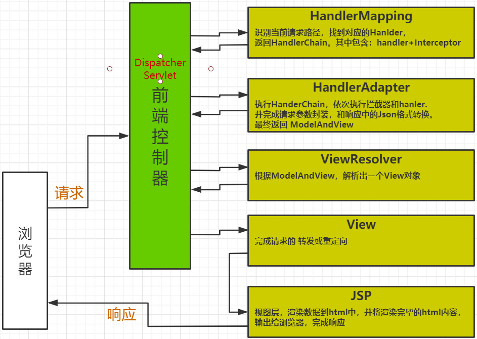 |


### SpringMVC的重要组件（可视化组件）

> 既然，我们要选择剖析SpringMVC底层执行流程，那肯定是要先分析我们能所看到表面的MVC重要组件。这样我们分析完可视组件后，就能找到分析SpringMVC底层执行流程的入口，所以分析它的重要组件显得更是重要！

SpringMVC的重要组件是由`核心的前端控制器（web.xml）`、`后端控制器（Controller）`和`spring-mvc.xml配置文件`组成。

- **核心的前端控制器：** 作为MVC框架，首先要解决的就是如何能收到请求。所以MVC框架大都会设计一款前端控制器（入口或者说起点），选型在Servlet或Filter两者之一，由前端控制器来最率先的工作，接收请求。在SpringMVC中，也不例外，前端控制器的选型确定为Servlet（DispatcherServlet），此前端控制器在接收请求后，还会负责SpringMVC的核心调度管理，所以既是前端又是核心。
- **后端控制器：** 后端控制器为Controller，等价于之前定义的Servlet。MVC框架中，后端控制器也是必不可少的重要组件之一。因为它接收了用户请求的大量数据参数对象（或Json）存储在域中方便页面（JSP）取值，或是携带着这些数据返回所需要跳转（重定向或请求转发）的页面。这里值得注意的是，后端控制器本质并不是一个普通的Servlet，也不是BaseServlet，它只是一个普通的类，里面却像曾经的BaseServlet一样可以拥有很多个方法，这些方法在SpringMVC中成为一个个Handler（换汤不换药，本质仍然）。所以在MVC模式的执行流程环节中，后端控制器控制着页面的跳转和数据的传递，在这里也有着很高的地位。
- **spring-mvc.xml配置文件：** 该配置文件配置着许多在执行过程中需要加载的组件，比如：注解扫描器、注解扫描驱动、试图解析器、静态资源处理器、异常解析器、拦截器、上传解析器等等，如果我们要使用这些组件，就需要在该配置文件中注入这些组件的相关配置，注入配置后由SpringMVC工厂在执行过程中加载这些组件，以达成我们使用这些组件的目的。所以这也是它受人青睐的原因。


### SpringMVC执行流程剖析

上述得知，我们执行流程剖析的入口既是`核心的前端控制器，即web.xml`，那我们有资格了解该前端控制器中配置了什么！如下：

|                          前端控制器                          |
| :----------------------------------------------------------: |
| 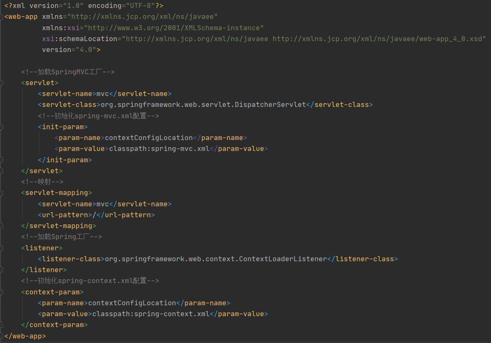 |

由上图所知，前端控制器中所包含的即是同时启动SpringMVC工厂和Spring工厂，让两个工厂同时运作处理请求，并作出响应。既然要剖析SpringMVC的底层执行流程，那我们要从加载SpringMVC工厂的`DispatcherServlet`说起。首先进入到DispatcherServlet中，查看源代码所有方法，如下图所示：

|                DispatcherServlet源码所有方法                 |
| :----------------------------------------------------------: |
| 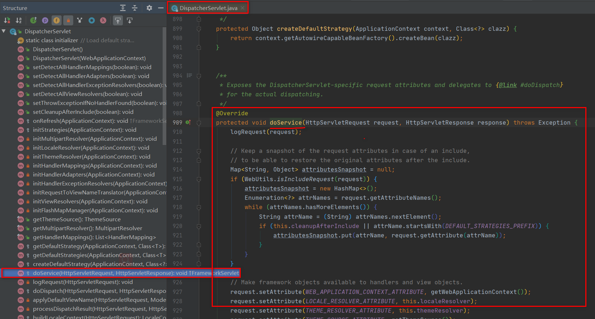 |
|          **DispatcherServlet继承FrameworkServlet**           |
| 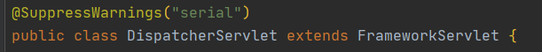 |

上图所示，我进入到了DispatcherServlet中。既然说它是一个Servlet，那肯定是需要寻找它的service方法，因为Service方法是Servlet的核心所在。于是我打开了IDEA的方法列表搜索service方法，未果。虽然未果，但是我发现两个重要的线索，一是该Servlet中有一个doSerivce方法，二是DispatcherServlet继承了FrameworkServlet，我想既然子类没有service方法，父类肯定有，于是我进入到了FrameworkServlet查看源代码，如下图所示：

|                     FrameworkServlet源码                     |
| :----------------------------------------------------------: |
| 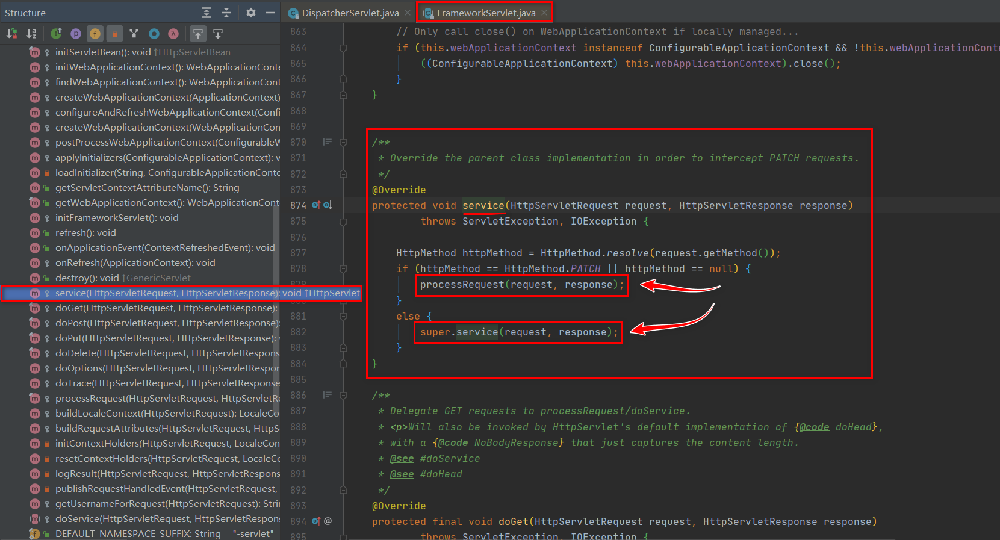 |

我兴冲冲在父类（FrameworkServlet）中找到了service方法，但是还是感觉高兴的太早了，该service方法中除了`resolve`方法获取请求方式和`processRequest`方法外，我一无所知。随后竟然发现了红色箭头所指向的东西`super.service(request, response);`，这意味着什么呢？这意味着它继承了父类拥有的service方法，于是我点击super句点后面的service方法查看源码惊人的发现这个类竟然是HttpServlet，显然我们找service方法的这条路走到尽头了。在里面有两个方法存在一个是`resolve`方法，它是获取请求方式的。还有一个方法不知道是做什么的，于是我点击了进去查看源码，如下图所示：

|                    processRequest方法源码                    |
| :----------------------------------------------------------: |
| 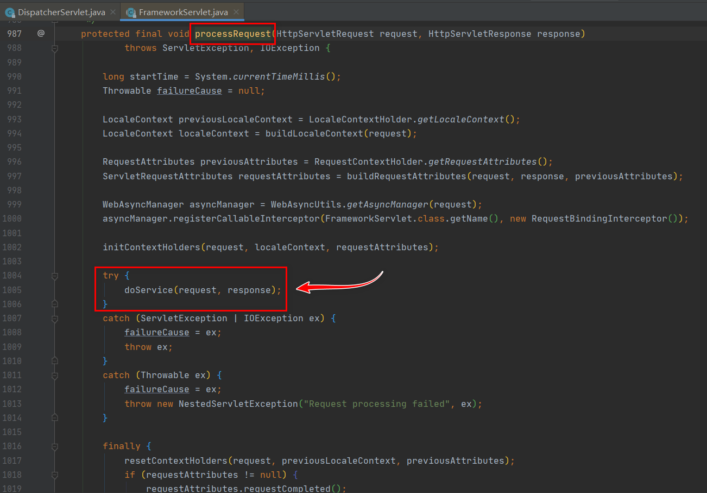 |

既然我们进去看到了processRequest方法的源码，就要找重要的方法。何为重要的方法呢，一般被try块包裹的方法必然是重要方法，于是我找到了`doService(request, response);`方法，并继续点击去看该doService方法的源码，如下图所示：

|            doService(request, response);方法源码             |
| :----------------------------------------------------------: |
| 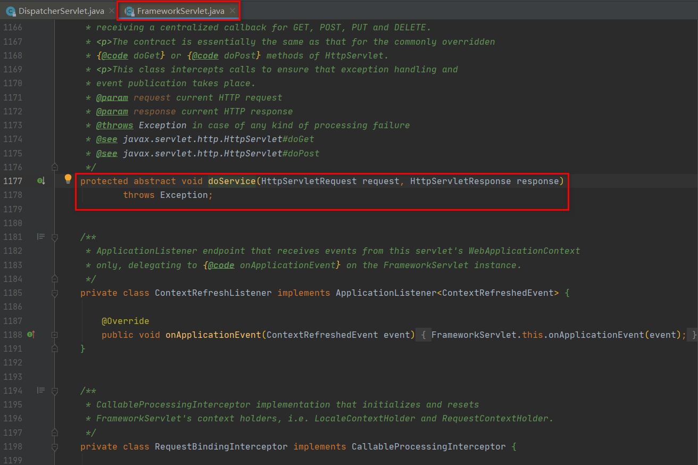 |

逐渐失去耐心的我真的被惊讶到了，进入到doService方法后，也没有跳到其他的类中，而却还是在该类中跳到了一个空的doService();方法中。唉，探究究竟真的是件不容易的事情呀~我叹了一口气。冷静下来一想，父类是空方法没有实现，那核心逻辑代码必定是在子类中了呀。这不是多态嘛！于是，我得出了结论，费劲吧难，找入口的逻辑代码回过头来还是得看DispatcherServlet中的那个doService方法。此时我知道，这必将是一个漫长的探索之路。于是，我秉着探究原理的心态，再一次点进了被我错过的那个DispatcherServlet中的doSerivce方法，如下图：

|             DispatcherServlet中的doService()方法             |
| :----------------------------------------------------------: |
| 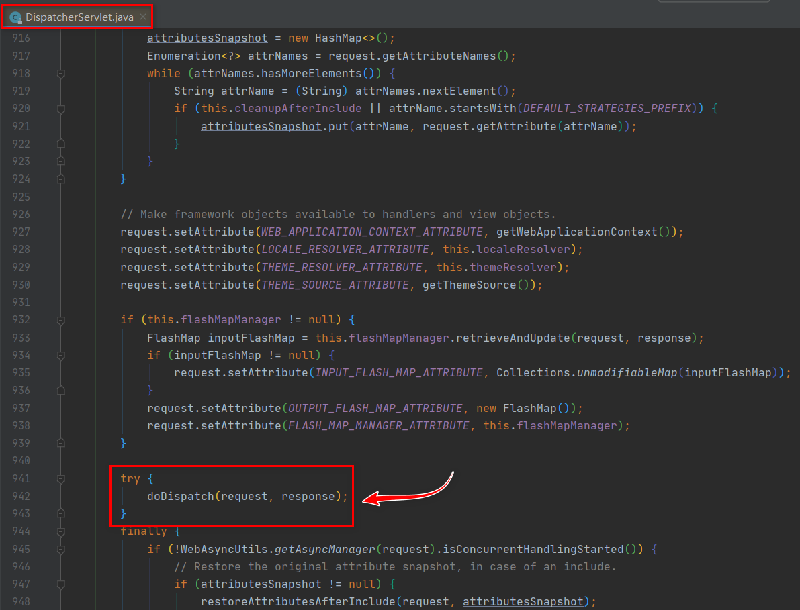 |

既然确定了这是探究底层原理的开始，那我们就在doServie()方法中寻找重要的逻辑，于是我再一次的在try块中找到了一个名为`doDispatch(request, response);`的方法（省略了前面的各种初始化和存储域数据）。在探究底层原理的道路上，你会发现越来越接近真理，虽然这注定是一个漫长的探索过程，我也情愿。于是，点击进入到了doDispatch()方法中的源码，如下图所示：

|                     doDispatch()方法源码                     |
| :----------------------------------------------------------: |
| 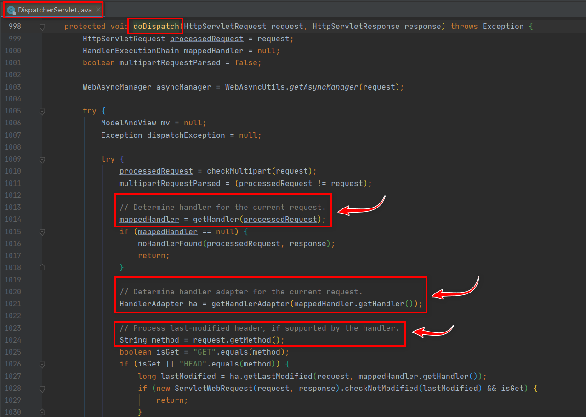 |

走进了doDispatch()方法的源码，才知道我没有看错你。里面标有注释的都是一些重要的执行逻辑方法。接下来我们会一个个的分析，逐步深入理解SpringMVC的执行流程。既然探索执行流程那就少不了Debug（Debug调试功能，Debug能很清晰的看到执行流程），于是我在`getHandler()`方法的那一行打了一个断点。下一步跟进执行流程进入到了`getHandler()`方法，如下图所示：

| getHandler方法源码（注释解释：为当前请求寻找并返回一个handler对象） |
| :----------------------------------------------------------: |
| 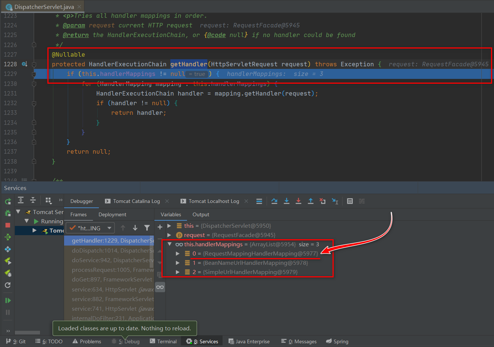 |

断点停留到了这一行，因为`getHandler()`的名字，顾名思义就是获取Controller层中的Handler。它是怎么获取到的呢？我们在断点的变量显示框中，看到handlerMappings是一个数组，其中有三个对象。他们可以分别以不同的方式处理不同的Handler，其中我们可以点击这个三个对象，一一把其对象展开查看重要属性，如下图所示：

|              0 = {RequestMappingHandlerMapping}              |
| :----------------------------------------------------------: |
| 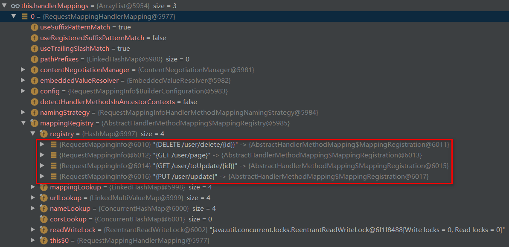 |
|              **2 = {SimpleUrlHandlerMapping}**               |
| 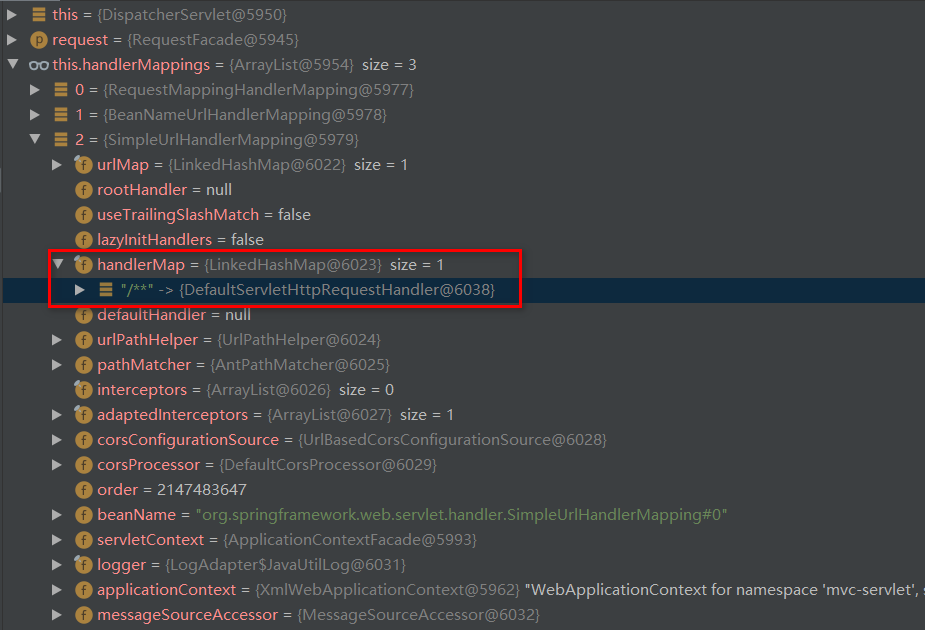 |

如上图得知，RequestMappingHandlerMapping对象识别了我们Controller中的@RequestMapping注解和各个Handler上方的注解路径。SimpleUrlHandlerMapping对象识别了处理静态资源驱动所创建的那个默认Servlet，而处理静态资源的默认Servlet路径给了`/**`，它识别了这个路径。HanderMapping映射器中的对象，通过注解识别获取到了Controller层的各个Handler请求路径注解后，就执行到了下一行，如下图：

|                      getHandler方法源码                      |
| :----------------------------------------------------------: |
| 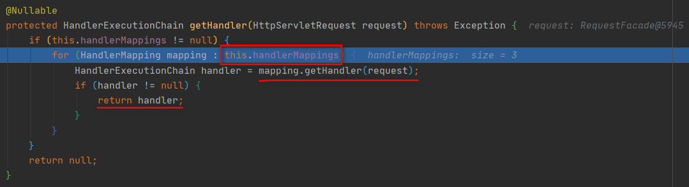 |

通过注解可以找到所有的Handler，其中所有的Handler就存储在`handlerMappings`中，于是它就遍历了此对象。随后根据各自的请求对象获取对应的Handler并判空返回获取到的对应Handler对象。继续向下执行，你还会发现这么一个东西，如下图：

|                        getHandler方法                        |
| :----------------------------------------------------------: |
| 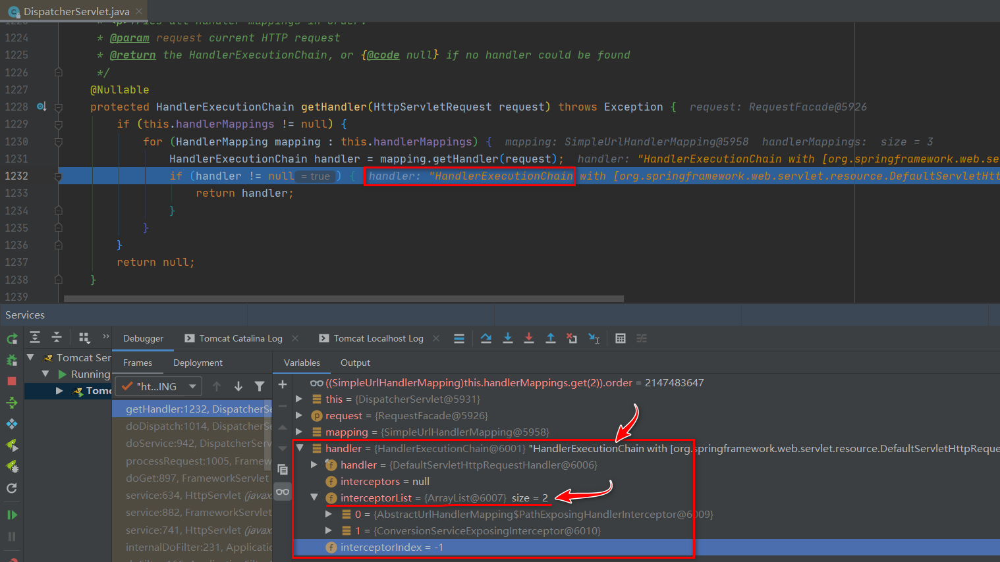 |

对，你会发现即将返回的Handler是一个名为HandlerExecutionChain的执行链。其中执行链内包含了即将返回的handler对象和一个interceptorList集合，其中集合内有两个对象，这两个对象就是拦截器。所以，不管是你自己使用了拦截器还是没有使用拦截器（内部底层有拦截器），这些拦截器和handler对象会以一个链条的形式执行（拦截器在前，handler对象在后）。则执行过程是遵循着先执行拦截器，后返回并执行handler对象的顺序。返回了HandlerExecutionChain执行链，那么就要开始执行执行链了！问题来了，究竟是谁依次执行拦截器和handler对象呢？如下图：

|                     doDispatch()方法源码                     |
| :----------------------------------------------------------: |
| 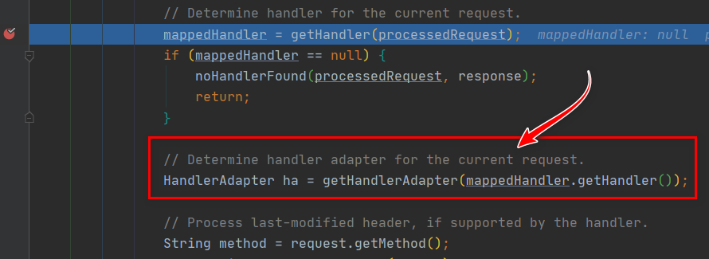 |

返回执行链后，继续执行就执行到了这一行代码，其注释解释为为当前请求对象寻找一个handler适配器。如果你学过适配器设计模式也许你会更容易理解，没有学过也没有关系，随后的解释你也可以理解的。知道了它要为请求对象寻找适配器，那么我们继续执行，就得到了如下啊信息：

|                  getHandlerAdapter方法源码                   |
| :----------------------------------------------------------: |
| 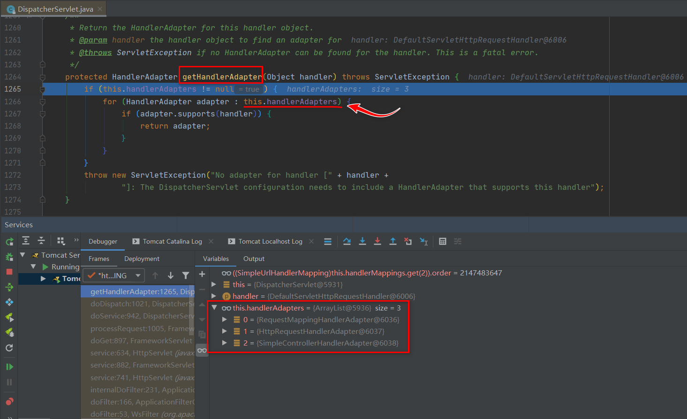 |

执行流程进入到了`getHandlerAdapter`方法，远远看到这个方法有一种似曾相识的感觉，对，它和HandlerMapping映射器很像，简直就是孪生兄弟。该方法要根据当前返回的handler对象，为其handler对象寻找一个适配器，而handlerAdapters集合对象中就存储着三个适配器，想想我们在映射器中获取执行链的时候是不是也三个呢？对的，他们是成对出现的，handler的对象找其对应的适配器才可以继续执行下去。找到与当前handler对象成对的适配器之后，就返回了该适配器。适配器返回后中间经过了如下方法：

|                     doDispatch()方法源码                     |
| :----------------------------------------------------------: |
| 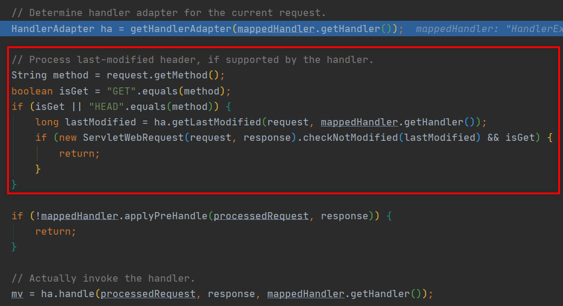 |

中间经过了这一段代码，获取了请求对象的请求方式并对此进行了一系列的判断操作。继续执行到了下面，下面有一个if判断，判断执行了`applyPreHandler`方法，此方法就是拦截器的前置方法。执行完拦截器的前置方法后，继续向下执行，这时候就该执行如下代码：

|                     doDispatch()方法源码                     |
| :----------------------------------------------------------: |
| 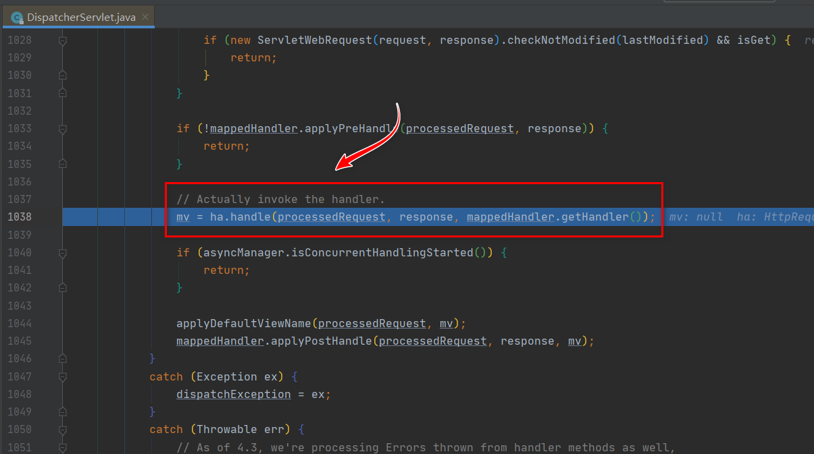 |

从此方法可见`ha`对象是此时的handler对象，说明在执行handler对象之前执行了拦截器，这也是遵循了执行链的顺序。继续执行下去，将完成了请求参数对象的封装和响应中Json字符串与对象的转换后，返回了一个mv对象。那么mv对象是什么呢？其实是在上面定义的ModelAndView对象。返回mv对象后，继续执行便执行到了如下重要的执行逻辑：

|                     doDispatch()方法源码                     |
| :----------------------------------------------------------: |
| 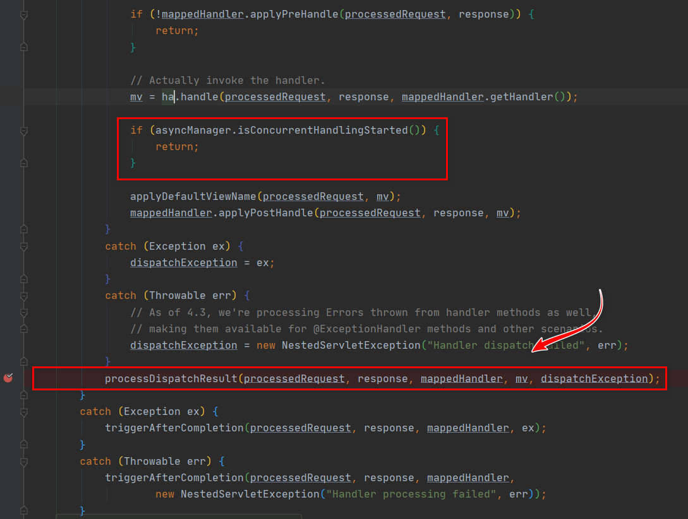 |

其中在执行过程中，判断并执行了拦截器的后置方法。执行完后置方法后，进行了一系列的判断，就开始执行了`processDispatchResult(processdRequest, response, mappdeHandler, mv, dispatchException)`方法，该方法中携带了请求对象、响应对象、handler对象、ModelAndView对象等，进入到此方法源码中，你会发现他进行了一系列的判断，通过如下方法对ModelAndView对象进行了渲染：

|                        render方法源码                        |
| :----------------------------------------------------------: |
| 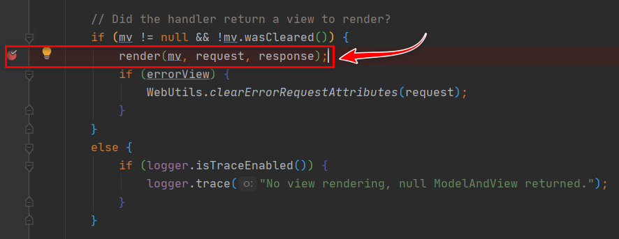 |

对ModelAndView对象进行渲染和视图解析后，继续跟进方法，因为胜利马上就要来临了。如下图：

|                        render方法源码                        |
| :----------------------------------------------------------: |
| 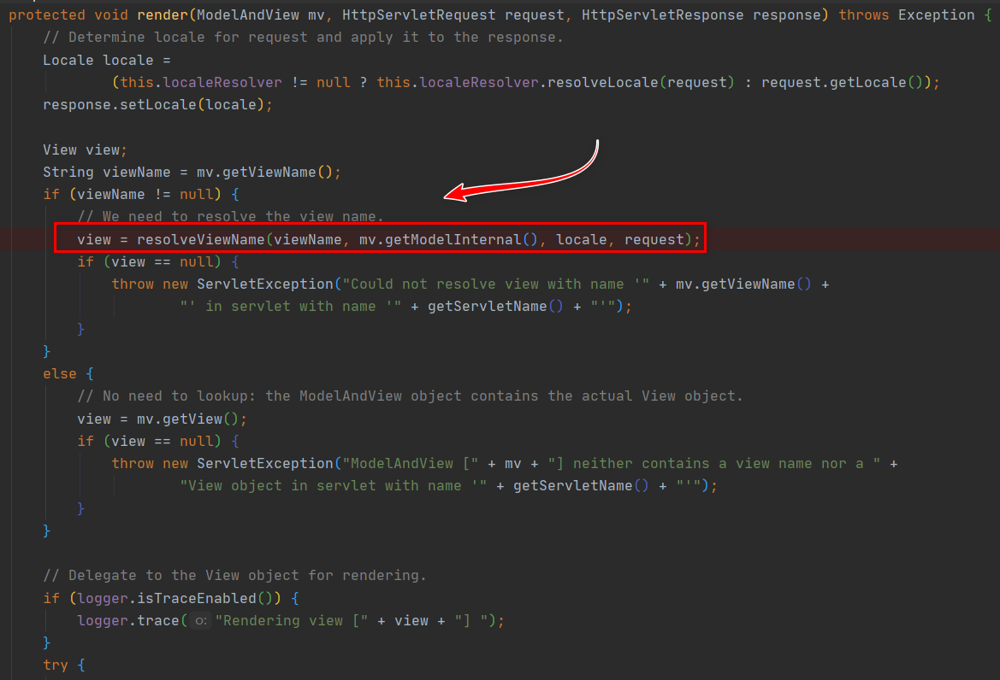 |

继续执行，就会发现它开始通过`resolveViewName`方法来解析视图了。于是，就进入到了该方法，如下图：

|                   resolveViewName方法源码                    |
| :----------------------------------------------------------: |
| 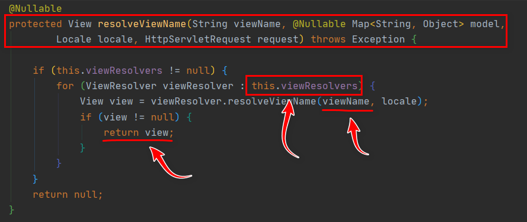 |

首先，看到此方法的源码，你可以发现，`viewResolvers`视图解析器会解析ModelAndView对象，并返回了一个View对象。后来View对象也会被一个名叫`render`的方法渲染，如下：

|                        view.render()                         |
| :----------------------------------------------------------: |
| 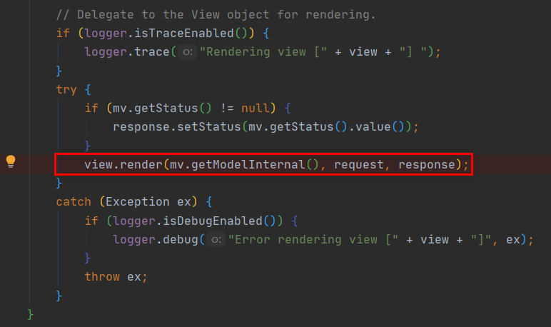 |

可见，此View对象并不简单，它执行了一番过后，由于我的网页跳转时使用的请求转发，于是就到了如下页面源码：

|                   InternalResourceView源码                   |
| :----------------------------------------------------------: |
| 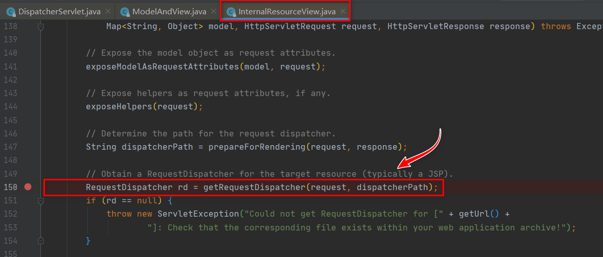 |

点击此方法就会发现我们熟悉的请求转发了，此时它在这里读取解析了`spring-mvc.xml`配置文件，为内部默认的请求转发拼接好了路径`forward:/XXX/XXX`（此时也解析了spring-mvc.xml配置文件内的其他组件），如下图：

|            请求转发（InternalResourceView.java）             |
| :----------------------------------------------------------: |
| 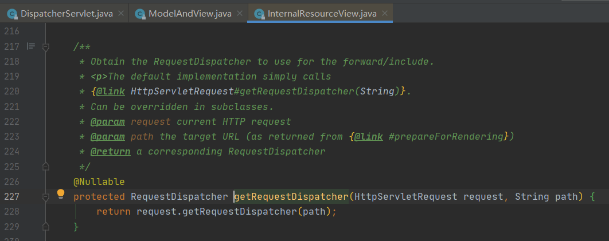 |

如果是重定向呢，那么就是如下类中的重定向方法，如下图所示：

|                 重定向（RedirectView.java）                  |
| :----------------------------------------------------------: |
| 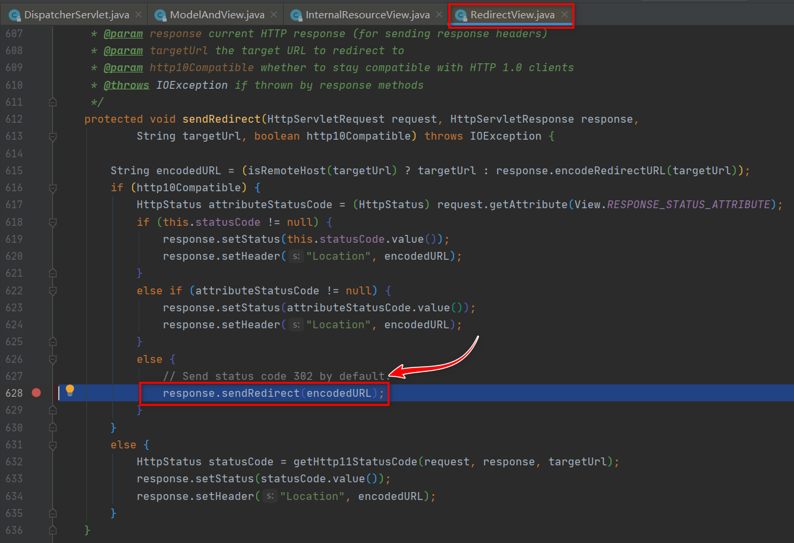 |

随后，转发或重定向跳转至JSP页面（视图层）后，渲染数据到HTML中，并渲染完HTML内容后，输出给浏览器并作出响应，在浏览器中显示！

> 此SpringMVC我以打断点调试的方式走了一遍底层的执行流程。我相信你自己打断点调试也会有一个不错的收获！


### SpringMVC的内部组件

> - **HandlerMapping（处理器映射器）** 
> - **HandlerAdapter（处理器适配器）** 
> - **ViewResolver（视图解析器）** 


### SpringMVC默认组件初始化加载

上面我们通过Debug简单的走了一遍SpringMVC的执行流程，但是前面所说的那么多内部组件是怎么来的呢？于是，我从DispatherServlet找到了一个方法`initStrategies`，如下：

|                    initStrategies方法源码                    |
| :----------------------------------------------------------: |
| 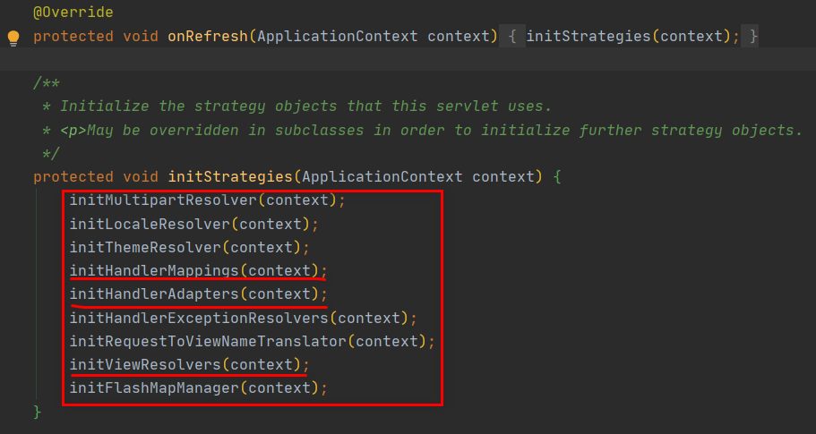 |

在执行流程开始之前，做了内部组件的一系列初始化操作，这里我们以`initHandlerMappings`方法进行追溯，找到 SpringMVC 的默认配置文件。进入 initHandlerMappings 方法，因为我们并没有进行配置（注解或者 Bean 标签），所以该方法中的前两种情况都会跳过，会来到最下面的默认情况处，调用了 getDefaultStrategies 方法，读取默认的配置文件。

|                 initHandlerMappings方法源码                  |
| :----------------------------------------------------------: |
| 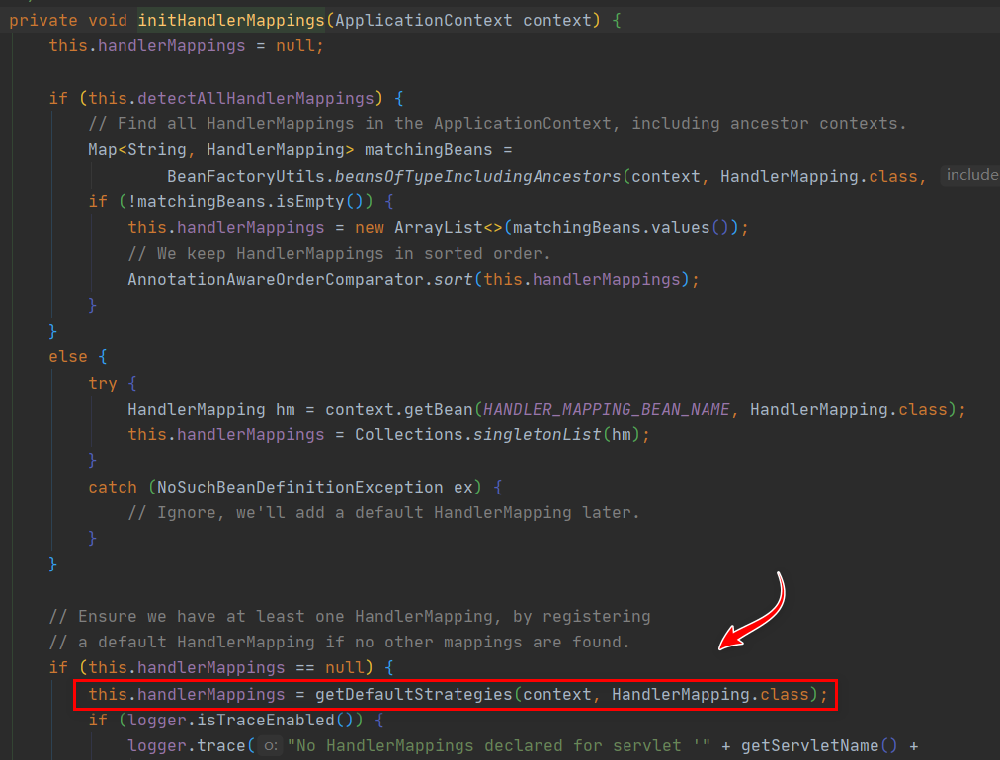 |
|               **getDefaultStrategies方法源码**               |
| 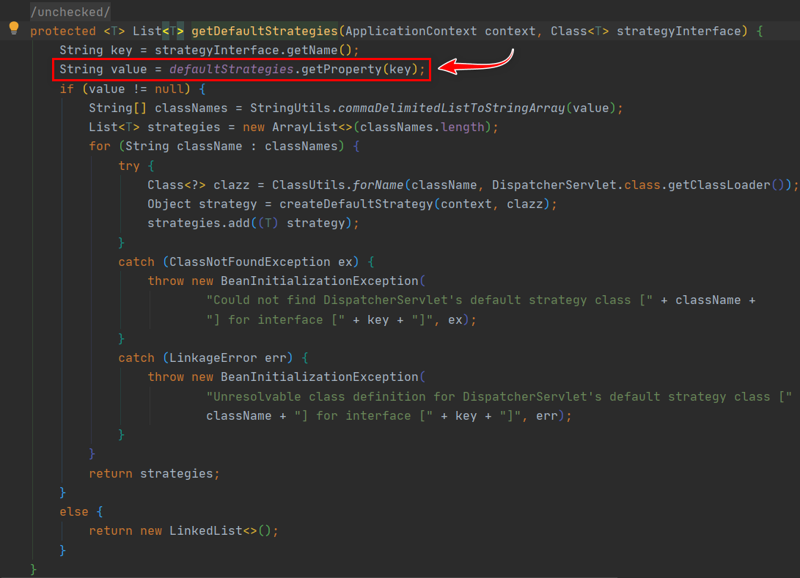 |

在 getDefaultStrategies 方法中，有一个 defaultStrategies，我们当该类上面看一下，如下图：

|                    defaultStrategies源码                     |
| :----------------------------------------------------------: |
| 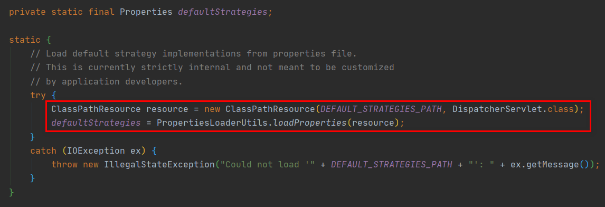 |

这里就是进行加载默认配置文件的地方，点击 **DEFAULT_STRATEGIES_PATH** 常量，找到了默认的配置配置文件。

|                 DEFAULT_STRATEGIES_PATH常量                  |
| :----------------------------------------------------------: |
| 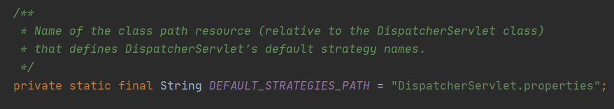 |

于是我想办法翻到了这个配置文件，里面就初始化了各种组件，大家可以查阅：

|             DispatcherServlet.properties配置文件             |
| :----------------------------------------------------------: |
| 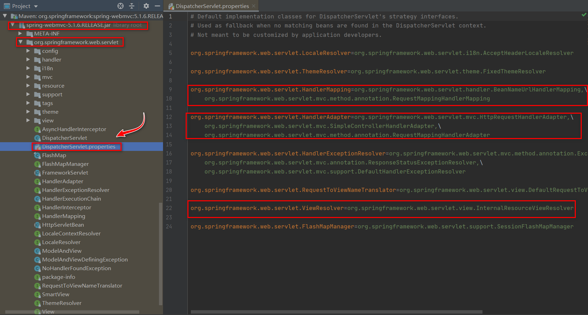 |

### 关于Spring MVC的小结

关于Spring MVC框架，你应该：

- 理解Spring MVC框架的作用
  - 接收请求，响应结果，处理异常……
- 掌握创建基于Maven的运行在Tomcat的Webapp
- 认识基础的依赖项
  - `spring-webmvc`、`javax.servlet-api`、`jackson-databind`
- 掌握配置Spring MVC的运行环境（使得控制器能接收到请求）
- 掌握以下注解的使用：
  - `@Controller` / `@RestController`
  - `@ResponseBody`
  - `@RequestMapping` / `@GetMapping` / `@PostMapping` ...
  - `@RequestParam` / `@PathVariable`
  - `@ExceptionHandler` / `@ControllerAdvice` / `@RestControllerAdvice`
  - `@EnableWebMvc`
- 掌握接收请求参数的方式
  - 将请求参数直接声明在处理请求的方法的参数列表中
  - 将若干个请求参数进行封装，并将封装的类型声明在处理请求的方法的参数列表中
  - 如果是URL中的路径，则需要使用`@PathVariable`
- 掌握响应JSON格式的正文的做法
  - 处理请求的方法必须添加`@ResponseBody`，或当前控制器类添加`@ResponseBody`，或当前控制器类添加`@RestController`
  - 在Spring MVC配置类上添加`@EnableWebMvc`
  - 在项目的`pom.xml`中添加了`jackson-databind`
  - 处理请求的方法返回自定义的数据类型
- 掌握响应JSON格式的正文时，统一的响应类型的类的设计
- 了解RESTful风格
- 掌握统一处理异常
- 掌握拦截器的创建与配置