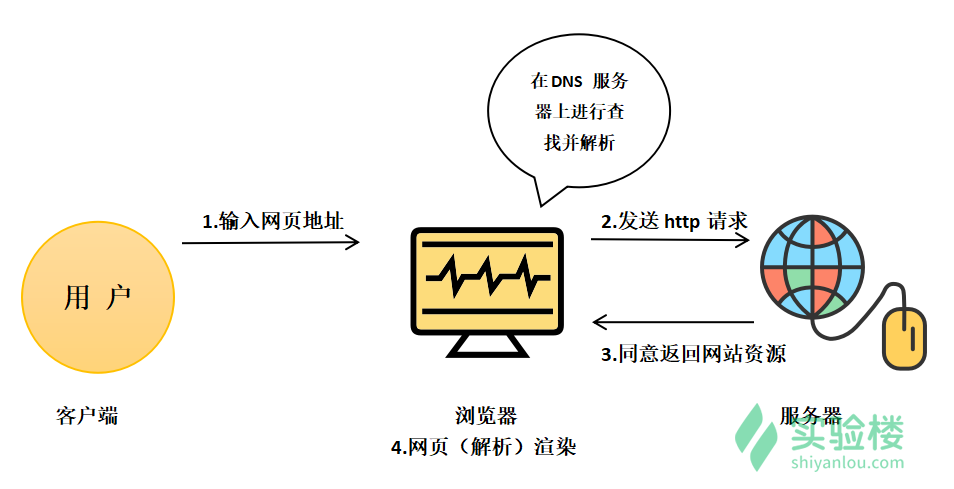
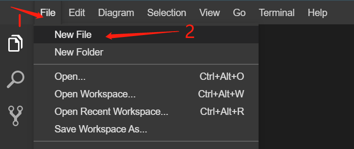
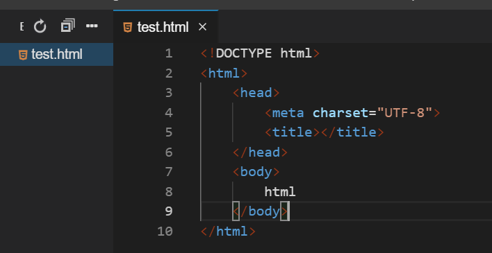
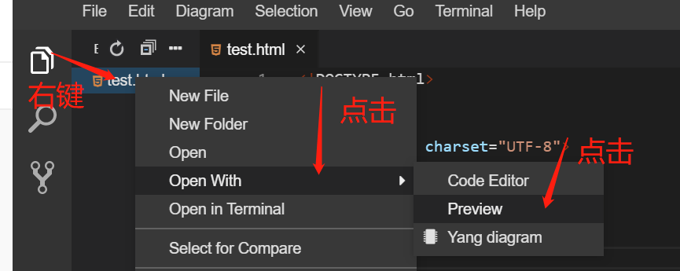
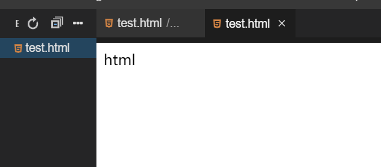

# HTML概述

[[TOC]]

## HTTP基础

#### HTTP 概述

> 超文本传输协议（HTTP，HyperText Transfer Protocol)是互联网上应用最为广泛的一种网络协议。所有的 WWW 文件都必须遵守这个标准。设计 HTTP 最初的目的是为了提供一种发布和接收 HTML 页面的方法。1960 年美国人 Ted Nelson 构思了一种通过计算机处理文本信息的方法，并称之为超文本（Hypertext）,这成为了 HTTP 超文本传输协议标准架构的发展根基。Ted Nelson 组织协调万维网协会（World Wide Web Consortium）和互联网工程工作小组（Internet Engineering Task Force ）共同合作研究，最终发布了一系列的 RFC，其中著名的 RFC 2616 定义了 HTTP 1.1。

注：定义来自于搜狗百科。



上图描述了客户端和服务器的交互过程。当用户在浏览器输入网址后，浏览器与服务器建立了一个连接，浏览器给 Web 服务器发送了一个 HTTP 请求，服务器接收并解析请求后，返回响应。HTTP 响应中包含状态代码和返回资源的内容（响应正文）。

#### 常见状态码

- 200 ：成功。
- 400 ：客户端请求有语法错误，服务器端不能理解。
- 401 ：该请求可能未经过授权。
- 403 ：服务器端收到该请求，但是拒绝为它提供服务，可能是没有权限等等。
- **404 ：该资源没找到。**
- 500 ：服务器端发生了一个不可预知的错误。
- 503 ：服务器端当前还不能处理客户端的这个请求，可能过段时间之后才能恢复正常。

## 什么是HTML

HTML（超文本标记语言）是一种用于创建网页的标准标记语言。 HTML 不需要编译，可以直接由浏览器执行，它的解析依赖于浏览器的内核。 它不是一种编程语言，而是一种标记语言。

## HTML网页结构

一个网页的基本结构：

```html
<!DOCTYPE html>
<html>
  <head>
    <title>HTML 简介</title>
  </head>
  <body></body>
</html>
```

`<!DOCTYPE html>` 是我们的文档声明头。他告诉了浏览器，本文档处理的是 HTML 文档。`html` 标签即根元素，此处表示文档的开始。`head` 标签是网页的头部，设置网页的相关信息。`title` 标签设置网页标题。`body` 标签定义文档的主体，也就是我们的主要内容。

## 中文乱码

中文乱码问题
可以在浏览器上设置编码方式为GB2312
或者在html的最前面加上编码设置

 ```html
 <head>
 
 <meta http-equiv="Content-Type" content="text/html; charset=GB2312">
 
 </head> 
 ```


这样就能告诉浏览器使用GB2312方式显示中文
如果 **GB2312**不行，就用**UTF-8**

## HTML网页编辑与显示

点击 `File`，然后点击 `New File`，输入 `test.html` 新建一个 `test.html` 文件。后续的例子中，将不再提醒建立 `test.html` 文件，大家根据个人需求自行创建对应的 html 文件，完成后续操作)：



输入以下内容：

```html
<!DOCTYPE html>
<html>
  <head>
    <meta charset="UTF-8" />
    <title></title>
  </head>
  <body>
    html
  </body>
</html>
```



右键新建的 `test.html` 文件，点击 `Open With` 后选择 `Preview` 查看效果。





## HTML注释

在 HTML 中满足以下格式的内容即为注释，被注释的内容将不会被渲染和显示。

```
<!-- 在此处写注释 -->
```

**注:** 在开始标签中有一个惊叹号，但是结束标签中没有。浏览器不会显示注释，但是能够帮助记录。

```html
<!DOCTYPE html>
<html>
  <body>
    <!--这是一段注释。注释不会在浏览器中显示。-->

    <p>这是一段普通的段落。</p>
  </body>
</html>
```
