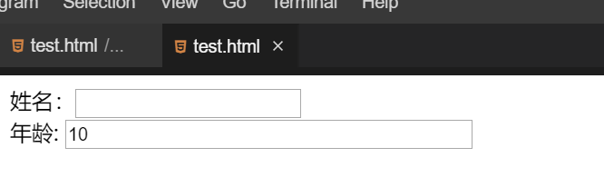
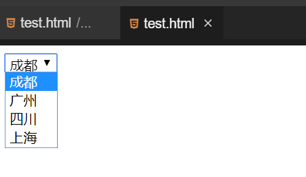
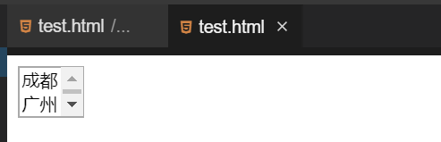
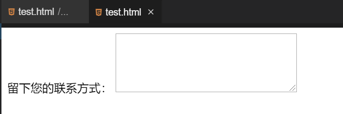

# HTML表单

[[TOC]]

HTML 表单是一个包含表单元素的区域，用于搜集不同类型的用户输入。表单是网页中提供的一种交互式手段操作，生活中我们很容易接触到表单，比如网上注册一个账号（实验楼账号，qq 账号等）或者我们去银行开户让我们填的表。

## 创建表单

`<form>` 标签用于创建 HTML 表单，常见的表单格式为：

```html
<form name="" method="" action=""></form>
```

- name：定义表单的名字-----------一定要有。
- method：定义表单结果从浏览器传送到服务器的方式，默认参数为：`get` ,请求方式提交表单数据，此时表单中的数据会被拼接到URL的抽象路径部分进行提交。`post` 安全性更高,请求方式提交表单数据，表单数据会被包含在请求的消息正文中进行提交，因此常用作传输密码等，而 `get` 安全性较低，一般用于查询数据。

  * 原则上:当表单中含有用户隐私信息(如密码)，或表单中含有附件这时要使用POST请求提交.

  * method属性可以不显示的指定出来，不指定则默认为GET请求提交
- action：**发送数据要去的地址**。它的值必须是一个有效的 URL，可以是相对 URL 也可以是绝对 URL。如果没有提供此属性或者 `action="#"`，则数据将被发送到包含表单的页面的 URL。
- 注意:**只有被包含在form标签中的输入框中用户输入的信息才会被提交。并且每个输入框都必须使用name属性指定名字，否则提交是该输入框会被忽略。**
- `maxlength`:最大字符长度
- `value`:设置默认值
- `readonly`:只读----可以不写在引号中

下面的表单提交后URL地址为:

```html
http://localhost:8088/myweb/reg?username=fanchuanqi&password=123456&nickname=chuanqi&age=22
```

其中的抽象路径部分:

  ```html
  /myweb/reg?username=fanchuanqi&password=123456&nickname=chuanqi&age=22
  ```

GET形式提交表单时，URL的抽象路径就会变成上述的样子。格式如下:
请求部分?参数部分
请求部分是由form表单中action指定的值决定的。
参数部分是由form表单中所有的输入框决定的。
格式为:输入框的名字=输入框上输入的信息,并用"&"分割每一个输入框内容

```html
username=fanchuanqi
password=123456
nickname=chuanqi
age=22
```

​           

## 插入表单对象


网页中的表单由许多不同的表单元素组成，这些表单元素包括文字字段、单选按钮、复选框、按钮等。

#### 文字字段

在网页中最常见的表单元素就是文字字段，用户可以在文字字段内输入字符或者单行文本。 语法：

```html
<input
  type="text"
  name="控件名称"
  value="文字字段的默认取值"
  size="控件的长度"
  maxlength="最长字符数"
/>
```

该语法包含了许多参数，除了 `type` 参数以外，其他的参数都是可选的，大家可以自行选择。举个例子：

```html
<form name="formBox" method="post" action="">
  姓名：<input type="text" name="name" size="20" /><br />
  年龄:<input type="text" name="age" size="40" value="10" maxlength="3" />
</form>
```



可以尝试给年龄输入值，如果文本字段长度超过了 3，就不能再输入了。

#### 密码输入框

密码输入框是一种特殊的文字字段，他的各个属性和文字字段是相同的，但是输入进密码输入框的字符全部是“*”表示，保证周围人看不见输入的文本。

```html
<input type="password" name="pwd" />
```

#### 单选按钮

单选按钮可以使用户从选择列表中选择一个选项。

```html
<form name="formBox" method="post" action="">
<!--value是单选框必须添加的属性,否则提交on;checked默认选中-->
  <input type="radio" name="sex" value="male" checked />男<br />
  <input type="radio" name="sex" value="female" />女

  gender:<input type="radio" name="gender" value="m" id="r1"><label for="r1">男</label>
<!--label--点击字之后也有效果-->
</form>
```

几个单选按钮可以连接在一起，只需要把它们的 `name` 值设置为相同的。同一组中只有一个按钮可以同时被选。如果没有选中任何一个，那么整个单选按钮池就被认为处于未知状态，且不会随表单提交。 可以尝试如果 name 不相同或者没有 name 会是什么情况。


#### 复选框

复选框可以让用户从一个选项列表中选择超出一个的选项。

```html
<form name="formBox" method="post" action="">
  <input type="checkbox" name="music" checked />音乐<br />
  <input type="checkbox" name="art" />美术<br />
  <input type="checkbox" name="math" />数学<br />
</form>
```

复选框可以拥有自己的名字，并不需要属于一个组。

#### 日期

```html
birthday:<input type="date" name="birthday"><br>
```


#### 按钮

HTML 表单中，有三种按钮：提交按钮，重置按钮，匿名按钮。我们可以使用 `<button>` 元素或者 `<input>` 元素来创建一个按钮。`type` 属性的值指定显示什么类型的按钮。

**提交按钮（submit）**

用于发送表单数据给服务器。

语法：

```html
<form name="formBox" method="post" action="">
  <input type="text" value="输入的内容" />
  <button type="submit">This a submit button</button>

  <!--or-->

  <input type="submit" value="This is a submit button" />
</form>
```

**重置按钮（reset）**

重置按钮用来清除用户在页面中输入的信息。

语法：

```html
<form name="formBox" method="post" action="">
  <input type="text" />
  <button type="reset">This a reset button</button>

  <!--or-->

  <input type="reset" value="This is a reset button" />
</form>
```

在文本框中输入内容，点击按钮即可清除。

**匿名按钮（button）**

没有自动生效的按钮，但是可以使用 JavaScript 代码进行定制。如果你省略了 `type` 属性，那么这就是默认值。

语法：

```html
<button type="button">This a anonymous button</button>

<!--or-->
<button>This a anonymous button</button>

<!--or-->
<input type="button" value="This is a anonymous button" />
```

不管使用的是 `<button>` 元素还是 `<input>` 元素，按钮的行为都是一样的。它们的不同点在于：

- 从前面的例子中也可以看出 `<button>` 元素允许你使用 HTML 内容作为其标记内容，但 `<input>` 元素只接受纯文本内容。
- 使用 `<button>` 元素，可以有一个不同于按钮标签的值（通过将其设置为 `value` 属性）。（但是在 IE 8 之前的版本中是不行的）。

## 菜单和列表

菜单和列表主要是用来选择给定答案中的一种，这类选择中往往答案比较多。

#### 下拉菜单

下拉菜单能够节省页面空间，正常状态下显示一个选项，单击展开所以选项。

```html
<form name="formBox" method="post" action="">
  <select name="select">
    <option value="成都">成都</option>
    <option value="广州">广州</option>
    <option value="四川">四川</option>
    <option value="上海" selected>上海</option>
<!--value设置提交的内容--s-->
  </select>
</form>
```



注意：下拉菜单的宽度是由 `<option>` 标记中包含的最长文本的宽度决定的。

#### 列表项

在页面中列表项可以显示出几条信息，一旦超出这个信息量，在列表项右侧会出现滚动条，拖动滚动条可以看到所有选项。

```html
<form name="formBox" method="post" action="">
  <select name="select" size="2" multiple="multiple">
    <option value="成都">成都</option>
    <option value="广州">广州</option>
    <option value="四川">四川</option>
    <option value="上海">上海</option>
  </select>
</form>
```



`size="2"` 表示一次显示 2 条数据。

## 文本域

当用户想要填入多行文本时，就应该使用文本域而不是文本字段。文本域使用 `<textarea>` 标记。

```html
<form name="formBox" method="post" action="">
  留下您的联系方式：
  <textarea name="textarea" cols="35" rows="5"></textarea>
</form>
```



`clos` 代表列数，`rows` 代表行数。

