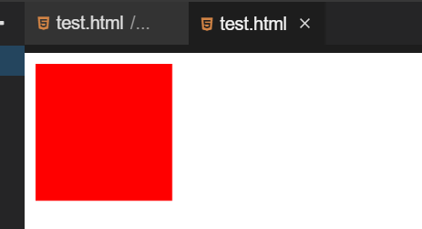
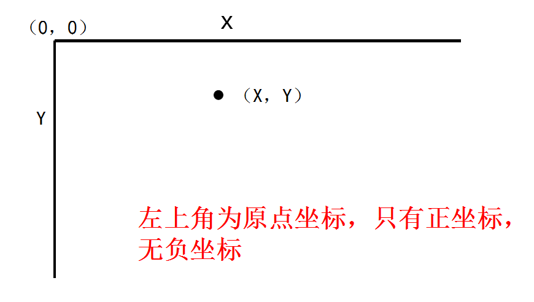
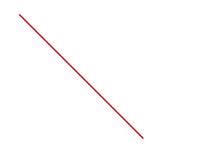
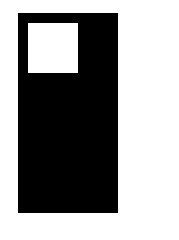
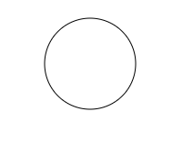
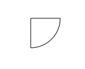
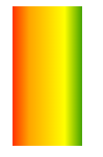
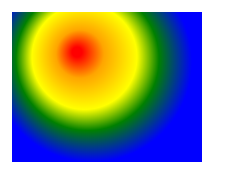

# HTML5 Canvas API

[[TOC]]

HTML5 Canvas 是现代浏览器都支持的 HTML5 非插件绘图的功能，Canvas 就是一个画布，主要用于图形表示、图表绘制、游戏制作等。

# Canvas 元素

`canvas` 元素的外观和 `img` 元素相似，但是没有 `img` 元素的 `src` 属性和 `alt` 属性。canvas 的 `width` 属性和 `height` 属性用来设置画布的宽和高，单位是 px。默认的画布的高度是 150px，宽度是 300px。

```html
<body>
  <canvas
    id="myCanvas"
    width="200"
    height="100"
    style="border:2px solid #000000;"
  >
  </canvas>
</body>
```

注意: 默认情况下 `<canvas>` 元素没有边框和内容，标签通常需要指定一个 `id` 属性 (脚本中经常引用)。

# 绘制简单图形

canvas 元素本身并不能实现图形绘制，所有的绘制工作必须要和 JavaScript 脚本结合起来。首先，给 canvas 元素添加一个 id 属性，这样能够让我们在 JavaScript 脚本中通过 id 属性找到对应的 canvas 元素。

```html
<canvas
  id="myCanvas"
  width="200"
  height="100"
  style="border:2px solid #000000;"
>
  <!-- 添加id属性值为myCanvas -->
</canvas>
```

添加了 id 属性后，找到对应的 canvas 元素：

```js
var myCanvas = document.getElementById("myCanvas");
// 通过document.getElementById来找到id为myCanvas的元素
```

然后通过 canvas 元素的 getContext()方法获取上下文，即创建 Context 对象，以获取允许进行绘制的 2D 环境。

```js
var ctx = myCanvas.getContext("2d");
```

最后通过 Context 对象的相关方法完成绘制，比如：fillStyle()等。

```js
ctx.fillStyle = "red";
//设置矩形的位置和尺寸（位置从 左上角原点坐标开始，尺寸为100*100的矩形）
ctx.fillRect(0, 0, 100, 100);
```

整体的代码：

```html
<!DOCTYPE html>
<html>
  <head>
    <meta charset="UTF-8" />
    <title></title>
  </head>

  <body>
    <!--添加canvas元素，设置画布的大小-->
    <canvas id="mycanvas" style="width:200;height:100">
      对不起，你的浏览器不支持canvas
    </canvas>

    <script type="text/javascript">
      var myCanvas = document.getElementById("mycanvas");
      var ctx = myCanvas.getContext("2d");
      //设置颜色
      ctx.fillStyle = "red";
      //设置矩形的位置和尺寸（位置从 左上角原点坐标开始，尺寸为100*100的矩形）
      ctx.fillRect(0, 0, 100, 100);
    </script>
  </body>
</html>
```



**注意：**进行绘制时，需要指定确定的坐标位置，坐标原点(0,0)位于 canvas 的左上角，x 轴水平方向向右延伸，y 轴垂直向下延伸，如图：



# 直线绘制

- strokeStyle：设置或返回笔的颜色、渐变或模式。默认值为：#000000。
- lineWidth：设置或返回当前的线条宽度 ，以像素计。
- beginPath()：起始一条路径，或重置当前路径。
- closePath()：创建从当前点回到起始点的路径。
- moveTo()：把路径移动到画布中的指定点，不创建线条。
- lineTo()：添加一个新点，然后在画布中创建从该点到最后指定点的线条。
- stroke()：绘制已定义的路径。

绘制一条直线例子：

```html
<!DOCTYPE html>
<html>
  <head>
    <meta charset="UTF-8" />
    <title></title>
  </head>

  <body>
    <!--添加canvas元素，设置画布的大小-->
    <canvas id="mycanvas" width="520px" height="1314px">
      对不起，你的浏览器不支持canvas
    </canvas>

    <script type="text/javascript">
      //获取canvas元素
      var myCanvas = document.getElementById("mycanvas");
      //获取Context上下文
      var ctx = myCanvas.getContext("2d");
      // 开始路径绘制
      ctx.beginPath();
      // 设置路径起点，坐标为(20,20)
      ctx.moveTo(20, 20);
      // 添加一个(200,200)的新点
      ctx.lineTo(200, 200);
      // 设置线宽
      ctx.lineWidth = 2.0;
      // 设置线的颜色
      ctx.strokeStyle = "#CC0000";
      // 绘制已定义的路径
      ctx.stroke();
    </script>
  </body>
</html>
```

运行效果为：



绘制三角形例子：

```html
<!DOCTYPE html>
<html>
  <head>
    <meta charset="UTF-8" />
    <title></title>
  </head>

  <body>
    <!--添加canvas元素，设置画布的大小-->
    <canvas id="mycanvas" width="520px" height="1314px">
      对不起，你的浏览器不支持canvas
    </canvas>

    <script type="text/javascript">
      //获取canvas元素
      var myCanvas = document.getElementById("mycanvas");
      //获取Context上下文
      var ctx = myCanvas.getContext("2d");
      // 开始路径绘制
      ctx.beginPath();
      // 设置路径起点，坐标为(20,20)
      ctx.moveTo(20, 20);
      // 添加一个(200,200)的新点
      ctx.lineTo(200, 200);
      // 添加一个(400,20)的新点
      ctx.lineTo(400, 20);
      //创建从当前点回到起始点的路径
      ctx.closePath();
      // 设置线宽
      ctx.lineWidth = 2.0;
      // 设置线的颜色
      ctx.strokeStyle = "#CC0000";
      // 绘制已定义的路径
      ctx.stroke();
    </script>
  </body>
</html>
```

运行效果为：


# 矩形绘制

#### rect() 方法介绍

使用 `rect()` 方法创建矩形。语法为：

```html
ctx.rect(x,y,width,height);
```

参数说明：

- x 表示矩形左上角的 x 坐标。
- y 表示矩形左上角的 y 坐标。
- width 表示矩形的宽度，以像素计。
- height 表示矩形的高度，以像素计。

注：使用 `stroke()` 或 `fill()` 方法在画布上实际地绘制矩形。

例子：

```html
<!DOCTYPE html>
<html>
  <head>
    <meta charset="UTF-8" />
    <title></title>
  </head>

  <body>
    <!--添加canvas元素，设置画布的大小-->
    <canvas id="mycanvas" width="520px" height="1314px">
      对不起，你的浏览器不支持canvas
    </canvas>

    <script type="text/javascript">
      //获取canvas元素
      var myCanvas = document.getElementById("mycanvas");
      //获取Context上下文
      var ctx = myCanvas.getContext("2d");
      //绘制矩形
      ctx.rect(10, 10, 100, 200);
      //绘制已定义的路径
      ctx.stroke();
    </script>
  </body>
</html>
```

运行效果为：


#### strokeRect() 方法介绍

使用 `strokeRect()` 方法绘制矩形（不填色）。笔触的默认颜色是黑色。语法为：

```js
ctx.strokeRect(x, y, width, height);
```

注：参数与 `rect()` 方法一致，唯一的区别是这里不需要再加一句 `stroke()` 或 `fill()` 方法。无法填色。

前面绘制矩形的例子也可以这样写：

```html
<!DOCTYPE html>
<html>
  <head>
    <meta charset="UTF-8" />
    <title></title>
  </head>

  <body>
    <!--添加canvas元素，设置画布的大小-->
    <canvas id="mycanvas" width="520px" height="1314px">
      对不起，你的浏览器不支持canvas
    </canvas>

    <script type="text/javascript">
      //获取canvas元素
      var myCanvas = document.getElementById("mycanvas");
      //获取Context上下文
      var ctx = myCanvas.getContext("2d");
      //绘制矩形
      ctx.strokeRect(10, 10, 100, 200);
    </script>
  </body>
</html>
```

#### fillRect() 方法介绍

使用 `fillRect()` 方法创建实心矩形。语法为：

```js
ctx.fillRect(x, y, width, height);
```

注：参数说明与前面一致，默认的填充颜色为黑色，可以使用 `fillStyle` 属性来设置用于填充绘图的颜色、渐变或模式。

例子：

```html
<!DOCTYPE html>
<html>
  <head>
    <meta charset="UTF-8" />
    <title></title>
  </head>

  <body>
    <!--添加canvas元素，设置画布的大小-->
    <canvas id="mycanvas" width="520px" height="1314px">
      对不起，你的浏览器不支持canvas
    </canvas>

    <script type="text/javascript">
      //获取canvas元素
      var myCanvas = document.getElementById("mycanvas");
      //获取Context上下文
      var ctx = myCanvas.getContext("2d");
      //绘制矩形
      ctx.fillRect(10, 10, 100, 200);
    </script>
  </body>
</html>
```

运行效果为：


#### clearRect() 方法介绍

使用 `clearRect()` 方法清空给定矩形内的指定像素。语法为：

```js
ctx.clearRect(x, y, width, height);
```

注：参数说明与前面一致。

例子：

```html
<!DOCTYPE html>
<html>
  <head>
    <meta charset="UTF-8" />
    <title></title>
  </head>

  <body>
    <!--添加canvas元素，设置画布的大小-->
    <canvas id="mycanvas" width="520px" height="1314px">
      对不起，你的浏览器不支持canvas
    </canvas>

    <script type="text/javascript">
      //获取canvas元素
      var myCanvas = document.getElementById("mycanvas");
      //获取Context上下文
      var ctx = myCanvas.getContext("2d");
      //绘制矩形
      ctx.fillRect(10, 10, 100, 200);
      //清空指定像素
      ctx.clearRect(20, 20, 50, 50);
    </script>
  </body>
</html>
```

运行效果为：



# 圆和扇形的绘制

使用 `arc()` 方法绘制圆或者椭圆。语法为：

```js
ctx.arc(x, y, r, sAngle, eAngle, counterclockwise);
```

参数说明：

- x 表示圆的中心的 x 坐标。
- y 表示圆的中心的 y 坐标。
- r 表示圆的半径。
- sAngle 表示起始角，以弧度计（特别需要注意的是弧的圆形的三点钟位置是 0 度而不是常规以为的 90 度）。
- eAngle 表示结束角，以弧度计。
- counterclockwise 表示绘制圆的方向，值为 false 表示顺时针，为 true 表示逆时针。是一个可选值，默认值是 false。

例子：

```html
<!DOCTYPE html>
<html>
  <head>
    <meta charset="UTF-8" />
    <title></title>
  </head>

  <body>
    <!--添加canvas元素，设置画布的大小-->
    <canvas id="mycanvas" width="520px" height="1314px">
      对不起，你的浏览器不支持canvas
    </canvas>

    <script type="text/javascript">
      //获取canvas元素
      var myCanvas = document.getElementById("mycanvas");
      //获取Context上下文
      var ctx = myCanvas.getContext("2d");
      //开始路径绘制
      ctx.beginPath();
      //绘制圆
      ctx.arc(100, 75, 50, 0, 2 * Math.PI);
      //绘制已定义的路径
      ctx.stroke();
    </script>
  </body>
</html>
```

运行效果为：



当然绘制扇形也很简单，只需要给定角度值小于 `2 * Math.PI` 再闭合一下就可以了，来看看例子。

```html
<!DOCTYPE html>
<html>
  <head>
    <meta charset="UTF-8" />
    <title></title>
  </head>

  <body>
    <!--添加canvas元素，设置画布的大小-->
    <canvas id="mycanvas" width="520px" height="1314px">
      对不起，你的浏览器不支持canvas
    </canvas>

    <script type="text/javascript">
      //获取canvas元素
      var myCanvas = document.getElementById("mycanvas");
      //获取Context上下文
      var ctx = myCanvas.getContext("2d");
      //开始路径绘制
      ctx.beginPath();
      //绘制圆
      ctx.arc(100, 75, 50, 0, 0.5 * Math.PI);
      //闭合
      ctx.moveTo(100, 125);
      ctx.lineTo(100, 75);
      ctx.lineTo(150, 75);
      //绘制已定义的路径
      ctx.stroke();
    </script>
  </body>
</html>
```

运行效果为：



# 填充和渐变

使用 `fillStyle` 属性，设置或返回用于填充绘画的颜色、渐变或模式。语法为：

```js
ctx.fillStyle = color | gradient | pattern;
```

参数说明：

- color 表示绘图填充的颜色。默认值是 `#000000`。
- gradient 表示用于填充绘图的渐变对象（线性或放射性）。
- pattern 表示用于填充绘图的 pattern 对象。

例子：

绘制实心矩形，填充颜色为红色。

```html
<!DOCTYPE html>
<html>
  <head>
    <meta charset="UTF-8" />
    <title></title>
  </head>

  <body>
    <!--添加canvas元素，设置画布的大小-->
    <canvas id="mycanvas" width="520px" height="1314px">
      对不起，你的浏览器不支持canvas
    </canvas>

    <script type="text/javascript">
      //获取canvas元素
      var myCanvas = document.getElementById("mycanvas");
      //获取Context上下文
      var ctx = myCanvas.getContext("2d");
      //填充为红色
      ctx.fillStyle = "red";
      //绘制实心矩形
      ctx.fillRect(10, 10, 100, 200);
    </script>
  </body>
</html>
```

运行效果为：


#### 渐变

使用 `createLinearGradient()` 方法创建线性渐变。语法为：

```js
ctx.createLinearGradient(x0, y0, x1, y1);
```

参数说明：

- x0 表示渐变开始点的 x 坐标。
- y0 表示渐变开始点的 y 坐标。
- x1 表示渐变结束点的 x 坐标。
- y1 表示渐变结束点的 y 坐标。

使用 `addColorStop()` 方法规定渐变对象中的颜色和停止位置。语法为：

```js
gradient.addColorStop(stop, color);
```

参数说明：

- stop 表示渐变中开始与结束之间的位置。是介于 `0.0` 与 `1.0` 之间的值。
- color 表示在结束位置显示的 CSS 颜色值。

注：`addColorStop()` 方法与 `createLinearGradient()` 或 `createRadialGradient()` 一起使用。我们可以多次调用 `addColorStop()` 方法来改变渐变。如果我们不对 `gradient` 对象使用该方法，那么渐变将不可见。为了获得可见的渐变，至少需要创建一个色标。

例子：

```html
<!DOCTYPE html>
<html>
  <head>
    <meta charset="UTF-8" />
    <title></title>
  </head>

  <body>
    <!--添加canvas元素，设置画布的大小-->
    <canvas id="mycanvas" width="520px" height="1314px">
      对不起，你的浏览器不支持canvas
    </canvas>

    <script type="text/javascript">
      //获取canvas元素
      var myCanvas = document.getElementById("mycanvas");
      //获取Context上下文
      var ctx = myCanvas.getContext("2d");
      //设置渐变色
      var gradient = ctx.createLinearGradient(0, 0, 170, 0);
      gradient.addColorStop(0, "red");
      gradient.addColorStop("0.2", "orange");
      gradient.addColorStop("0.5", "yellow");
      gradient.addColorStop("0.7", "green");
      gradient.addColorStop(1, "blue");
      //填充色为渐变色
      ctx.fillStyle = gradient;
      //绘制实心矩形
      ctx.fillRect(10, 10, 100, 200);
    </script>
  </body>
</html>
```

运行效果为：



使用 `createRadialGradient()` 方法创建放射状/环形的渐变。语法为：

```js
ctx.createRadialGradient(x0, y0, r0, x1, y1, r1);
```

参数说明：

- x0 表示渐变的开始圆的 x 坐标。
- y0 表示渐变的开始圆的 y 坐标。
- r0 表示开始圆的半径。
- x1 表示渐变的结束圆的 x 坐标。
- y1 表示渐变的结束圆的 y 坐标。
- r1 表示结束圆的半径。

例子：

```html
<!DOCTYPE html>
<html>
  <head>
    <meta charset="UTF-8" />
    <title></title>
  </head>

  <body>
    <!--添加canvas元素，设置画布的大小-->
    <canvas id="mycanvas" width="520px" height="1314px">
      对不起，你的浏览器不支持canvas
    </canvas>

    <script type="text/javascript">
      //获取canvas元素
      var myCanvas = document.getElementById("mycanvas");
      //获取Context上下文
      var ctx = myCanvas.getContext("2d");
      //设置渐变色
      var gradient = ctx.createRadialGradient(75, 50, 5, 90, 60, 100);
      gradient.addColorStop(0, "red");
      gradient.addColorStop("0.2", "orange");
      gradient.addColorStop("0.5", "yellow");
      gradient.addColorStop("0.7", "green");
      gradient.addColorStop(1, "blue");
      //填充色为渐变色
      ctx.fillStyle = gradient;
      //绘制实心矩形
      ctx.fillRect(10, 10, 190, 150);
    </script>
  </body>
</html>
```

运行效果为：



#### fill() 方法

使用 `fill()` 方法填充当前的图像（路径）。默认颜色是黑色。填充另一种颜色/渐变使用 `fillStyle` 属性。

语法为：

```js
ctx.fill();
```

注：如果路径未关闭，那么 `fill()` 方法会从路径结束点到开始点之间添加一条线，以关闭该路径，然后填充该路径。

例子：

```html
<!DOCTYPE html>
<html>
  <head>
    <meta charset="UTF-8" />
    <title></title>
  </head>

  <body>
    <!--添加canvas元素，设置画布的大小-->
    <canvas id="mycanvas" width="520px" height="1314px">
      对不起，你的浏览器不支持canvas
    </canvas>

    <script type="text/javascript">
      //获取canvas元素
      var myCanvas = document.getElementById("mycanvas");
      //获取Context上下文
      var ctx = myCanvas.getContext("2d");
      //绘制矩形
      ctx.rect(20, 20, 150, 100);
      ctx.fillStyle = "red";
      ctx.fill();
    </script>
  </body>
</html>
```

运行效果为：


# 文字绘制

#### fillText() 方法

使用 `fillText()` 方法在在画布上绘制实心文本。语法为：

```js
ctx.fillText(text, x, y, maxWidth);
```

参数说明：

- text 规定在画布上输出的文本。
- x 表示开始绘制文本的 x 坐标位置（相对于画布）。
- y 表示开始绘制文本的 y 坐标位置（相对于画布）。
- maxWidth 表示允许的最大文本宽度，以像素计。可选。

例子：

```html
<!DOCTYPE html>
<html>
  <head>
    <meta charset="UTF-8" />
    <title></title>
  </head>

  <body>
    <!--添加canvas元素，设置画布的大小-->
    <canvas id="mycanvas" width="520px" height="1314px">
      对不起，你的浏览器不支持canvas
    </canvas>

    <script type="text/javascript">
      //获取canvas元素
      var myCanvas = document.getElementById("mycanvas");
      //获取Context上下文
      var ctx = myCanvas.getContext("2d");
      //绘制实心文本
      ctx.fillText("Hello Syl!", 10, 50);
    </script>
  </body>
</html>
```

运行效果为：


#### strokeText() 方法

使用 `strokeText()` 方法在画布上绘制空心文本。语法为：

```js
ctx.strokeText(text, x, y, maxWidth);
```

注：参数说明与 `fillText()` 方法一致。

例子：

```html
<!DOCTYPE html>
<html>
  <head>
    <meta charset="UTF-8" />
    <title></title>
  </head>

  <body>
    <!--添加canvas元素，设置画布的大小-->
    <canvas id="mycanvas" width="520px" height="1314px">
      对不起，你的浏览器不支持canvas
    </canvas>

    <script type="text/javascript">
      //获取canvas元素
      var myCanvas = document.getElementById("mycanvas");
      //获取Context上下文
      var ctx = myCanvas.getContext("2d");
      //设置字体样式
      ctx.font = "50px Georgia";
      //绘制空心文本
      ctx.strokeText("Hello Syl!", 10, 50);
    </script>
  </body>
</html>
```

运行效果为：


#### font 属性

使用 `font` 属性设置或返回画布上文本内容的当前字体属性。`font` 属性使用的语法与 CSS `font` 属性相同。

#### textAlign 属性

使用 `textAlign` 属性设置或返回文本内容的当前对齐方式。语法为：

```js
ctx.textAlign = "center|end|left|right|start";
```

参数说明：

- start 默认值，表示文本在指定的位置开始。
- center 表示文本的中心被放置在指定的位置。
- end 表示文本在指定的位置结束。
- left 表示文本左对齐。
- right 表示文本右对齐。

注：使用 `fillText()` 或 `strokeText()` 方法在实际地在画布上绘制并定位文本。

例子：

```html
<!DOCTYPE html>
<html>
  <head>
    <meta charset="UTF-8" />
    <title></title>
  </head>

  <body>
    <!--添加canvas元素，设置画布的大小-->
    <canvas id="mycanvas" width="520px" height="1314px">
      对不起，你的浏览器不支持canvas
    </canvas>

    <script type="text/javascript">
      //获取canvas元素
      var myCanvas = document.getElementById("mycanvas");
      //获取Context上下文
      var ctx = myCanvas.getContext("2d");
      //画一条线便于展示
      ctx.strokeStyle = "blue";
      ctx.moveTo(200, 20);
      ctx.lineTo(200, 180);
      ctx.stroke();
      //设置字体样式
      ctx.font = "20px Georgia";
      //值为start的情况
      ctx.textAlign = "start";
      ctx.strokeText("Hello Syl!", 200, 20);
      //值为center的情况
      ctx.textAlign = "center";
      ctx.strokeText("Hello Syl!", 200, 60);
      //值为end的情况
      ctx.textAlign = "end";
      ctx.strokeText("Hello Syl!", 200, 100);
      //值为left的情况
      ctx.textAlign = "left";
      ctx.strokeText("Hello Syl!", 200, 140);
      //值为right的情况
      ctx.textAlign = "right";
      ctx.strokeText("Hello Syl!", 200, 180);
    </script>
  </body>
</html>
```

运行效果为：


#### textBaseline 属性

`textBaseline` 属性设置或返回在绘制文本时的当前文本基线。语法为：

```js
ctx.textBaseline = "alphabetic|top|hanging|middle|ideographic|bottom";
```

参数说明：

- alphabetic 表示文本基线是普通的字母基线。默认值。
- top 表示文本基线是 `em` 方框的顶端。
- hanging 表示文本基线是悬挂基线。
- middle 表示文本基线是 `em` 方框的正中。
- ideographic 表示文本基线是表意基线。
- bottom 表示文本基线是 `em` 方框的底端。

例子：

```html
<!DOCTYPE html>
<html>
  <head>
    <meta charset="UTF-8" />
    <title></title>
  </head>

  <body>
    <!--添加canvas元素，设置画布的大小-->
    <canvas id="mycanvas" width="1314px" height="1314px">
      对不起，你的浏览器不支持canvas
    </canvas>

    <script type="text/javascript">
      //获取canvas元素
      var myCanvas = document.getElementById("mycanvas");
      //获取Context上下文
      var ctx = myCanvas.getContext("2d");
      //画一条线便于展示
      ctx.strokeStyle = "blue";
      ctx.moveTo(20, 100);
      ctx.lineTo(1314, 100);
      ctx.stroke();
      //设置字体样式
      ctx.font = "30px Georgia";
      //值为alphabetic的情况
      ctx.textBaseline = "alphabetic";
      ctx.fillText("Hello Syl!", 20, 100);
      //值为top的情况
      ctx.textBaseline = "top";
      ctx.fillText("Hello Syl!", 220, 100);
      //值为hanging的情况
      ctx.textBaseline = "hanging";
      ctx.fillText("Hello Syl!", 420, 100);
      //值为middle的情况
      ctx.textBaseline = "middle";
      ctx.fillText("Hello Syl!", 620, 100);
      //值为ideographic的情况
      ctx.textBaseline = "ideographic";
      ctx.fillText("Hello Syl!", 820, 100);
      //值为bottom的情况
      ctx.textBaseline = "bottom";
      ctx.fillText("Hello Syl!", 1020, 100);
    </script>
  </body>
</html>
```

运行效果为：


# 图片绘制

在 Terminal 输入以下命令获取图片绘制用到的图片：

```bash
wget https://labfile.oss.aliyuncs.com/courses/1248/a.png
```

使用 `drawImage()` 方法在画布上绘制图像、画布或视频。`drawImage()` 方法也能够绘制图像的某些部分，或增加或减少图像的尺寸。

canvas 绘制图片的基本格式为：

```js
//创建一个图片对象
var image = new Image();
//设置图片的路径
image.src = "xxx";
//当图片加载完成后
image.onload = function () {
  //绘制图片
  ctx.drawImage();
};
```

语法 1，在画布上定位图像：

```js
ctx.drawImage(img, x, y);
```

语法 2，在画布上定位图像，并规定图像的宽度和高度：

```js
ctx.drawImage(img, x, y, width, height);
```

语法 3，剪切图像，并在画布上定位被剪切的部分：

```js
ctx.drawImage(img, sx, sy, swidth, sheight, x, y, width, height);
```

参数说明：

- img 规定要使用的图像、画布或视频。
- sx 表示开始剪切的 x 坐标位置。可选值。
- sy 表示开始剪切的 y 坐标位置。可选值。
- swidth 表示被剪切图像的宽度。可选值。
- sheight 表示被剪切图像的高度。可选值。
- x 表示在画布上放置图像的 x 坐标位置。
- y 表示在画布上放置图像的 y 坐标位置。
- width 表示要使用的图像的宽度（伸展或缩小图像）。可选值。
- height 表示要使用的图像的高度，（伸展或缩小图像）。可选值。

例子 1，在画布上定位图像并作出一个立体的效果：

```html
<!DOCTYPE html>
<html>
  <head>
    <meta charset="UTF-8" />
    <title></title>
  </head>

  <body>
    <!--添加canvas元素，设置画布的大小-->
    <canvas id="mycanvas" width="1314px" height="1314px">
      对不起，你的浏览器不支持canvas
    </canvas>

    <script type="text/javascript">
      //获取canvas元素
      var myCanvas = document.getElementById("mycanvas");
      //获取Context上下文
      var ctx = myCanvas.getContext("2d");
      //创建一张图片
      var image = new Image();
      //设置图片的路径
      image.src = "a.png";
      //当图片加载完成后
      image.onload = function () {
        //输出5张照片
        for (var i = 0; i < 5; i++) {
          //参数：（1）绘制的图片  （2）坐标x，（3）坐标y
          ctx.drawImage(image, 100 + i * 80, 100 + i * 80);
        }
      };
    </script>
  </body>
</html>
```

运行效果为：


例子 2，在画布上定位图像，并规定图像的宽度和高度：

```html
<!DOCTYPE html>
<html>
  <head>
    <meta charset="UTF-8" />
    <title></title>
  </head>

  <body>
    <!--添加canvas元素，设置画布的大小-->
    <canvas id="mycanvas" width="1314px" height="1314px">
      对不起，你的浏览器不支持canvas
    </canvas>

    <script type="text/javascript">
      //获取canvas元素
      var myCanvas = document.getElementById("mycanvas");
      //获取Context上下文
      var ctx = myCanvas.getContext("2d");
      //创建一张图片
      var image = new Image();
      //设置图片的路径
      image.src = "a.png";
      //当图片加载完成后
      image.onload = function () {
        //绘制图片
        ctx.drawImage(image, 100, 100, 150, 150);
      };
    </script>
  </body>
</html>
```

运行效果为：


例子 3，剪切图像，并在画布上定位被剪切的部分：

```html
<!DOCTYPE html>
<html>
  <head>
    <meta charset="UTF-8" />
    <title></title>
  </head>

  <body>
    <!--添加canvas元素，设置画布的大小-->
    <canvas id="mycanvas" width="1314px" height="1314px">
      对不起，你的浏览器不支持canvas
    </canvas>

    <script type="text/javascript">
      //获取canvas元素
      var myCanvas = document.getElementById("mycanvas");
      //获取Context上下文
      var ctx = myCanvas.getContext("2d");
      //创建一张图片
      var image = new Image();
      //设置图片的路径
      image.src = "a.png";
      //当图片加载完成后
      image.onload = function () {
        //绘制图片
        ctx.drawImage(image, 100, 100, 150, 150, 150, 150, 150, 150);
      };
    </script>
  </body>
</html>
```

运行效果为：

