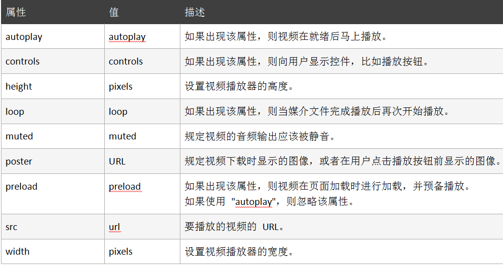
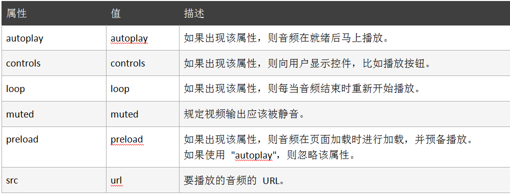

# HTML5 视频音频与拖放

[[TOC]]

在 HTML5 问世之前，如果我们想要在网页上面展示视频音频，经常会使用到的就是 Adobe Flash 这样的插件，很多人可能和我一样遇到过 Flash 插件崩溃的问题，让人相当烦躁，而在 HTML5 中，提供了音频和视频的标准接口使这一局面得到了改观.

下面给大家一个在线的音频视频转换网站：http://cn.office-converter.com/

# HTML5视频音频与拖放

HTML5 规定了一种通过 video 元素来包含视频的标准方法。

视频格式和浏览器支持如下所示：

| 格式       | 浏览器                                   |
| ---------- | ---------------------------------------- |
| .ogg       | FireFox 3.5+ ，chrome 5.0+ ，Opera 10.5+ |
| .mp4/H.264 | Safari 3.0+ ，chrome 5.0+ ，IE 9.0+      |
| .webm      | FireFox 4.0+ ，chrome 6.0+ ，Opera10.6+  |

例子：

```html
<!DOCTYPE html>
<html>
  <head>
    <meta charset="utf-8" />
    <title></title>
  </head>
  <body>
    <video width="320" height="240" controls="controls">
      <source
        src="https://labfile.oss.aliyuncs.com/courses/1248/video.ogg"
        type="video/ogg"
      />
      <source
        src="https://labfile.oss.aliyuncs.com/courses/1248/video.mp4"
        type="video/mp4"
      />
      你的浏览器不支持video元素
    </video>
  </body>
</html>
```

注：`<video>` 与 `</video>` 之间插入的内容是供不支持 `video` 元素的浏览器显示的。`video` 元素允许多个 `source` 元素，`source` 元素可以链接不同的视频文件，浏览器将使用第一个可识别的格式。

引入单个文件也可以这样写：

```html
<body>
  <video
    src="https://labfile.oss.aliyuncs.com/courses/1248/video.ogg"
    width="320"
    height="240"
    controls="controls"
  >
    你的浏览器不支持video元素
  </video>
</body>
```

`video` 标签的属性如下所示：



这些属性设置都很简单，大家可以自行尝试体验一番。

```html
<!DOCTYPE html>
<html lang="en">
<head>
    <meta charset="UTF-8">
    <title>Title</title>
</head>
<body>
<!--在视频元素上面右键检查 查找video元素 如果右键检查出现的不是video标签
在元素上右键hide element(让元素隐藏) 再次视频上右键检查 直到找到video标签为止
 找到后在video标签上面右键 copy->copy Element 复制到自己的页面即可 -->
<!--poster封面图片 loop循环播放 muted静音(如果需要自动播放必须设置为静音)
autoplay自动播放 controls是否显示控制元素
-->
<video id="bg" poster="https://ys.mihoyo.com/main/_nuxt/img/47f71d4.jpg"
       loop  muted autoplay controls
       style="width: 1280px; height: 720px;">
  <source src="https://ys.mihoyo.com/main/_nuxt/videos/3e78e80.mp4" type="audio/mp4">
  您的浏览器不支持播放此视频.
</video>
</body>
</html>
```


#### 字幕的简单使用

使用常用的 WebVtt 字幕格式，在 `<video>` 中使用 `<track>` 元素引入字幕。例如：

```html
<track
  src="https://labfile.oss.aliyuncs.com/courses/1248/video_ch.vtt"
  srclang="zh"
  kind="subtitles"
  label="中文"
  default
/>
<track
  src="https://labfile.oss.aliyuncs.com/courses/1248/video_en.vtt"
  srclang="en"
  kind="subtitles"
  label="English"
/>
```

track 元素属性说明：

- src：指定资源 `url`。
- srclang：资源的语言，例如：中文 `zh`，英文 `en`。
- kind：默认值是 `subtitles` 字幕，`captions` 标题、音效及其他音频信息，`descriptions` 视频的文本描述，`chapters` 章节导航，`metadata` 元数据。
- label：选择字幕时候出现的文字。
- default：`default` 指的是默认会显示的字幕。例如两个 `<track>` 元素，如果都没有 `default` 属性，那都不显示，需要用户手动调出。另外，`default` 只能出现在一个 `<track>` 元素上。

# HTML5音频介绍

HTML5 规定了一种通过 audio 元素来包含音频的标准方法。

音频格式和浏览器支持如下所示：

| 格式 | 浏览器                                 |
| ---- | -------------------------------------- |
| .ogg | FireFox 3.5+，chrome 3.0+，Opera 10.5+ |
| .mp3 | Safari 3.0+，chrome 3.0+，IE 9.0+      |
| .wav | FireFox 3.5+，Safari 3.0+，Opera10.5+  |

例子：

```html
<body>
  <audio controls="controls">
    <source
      src="https://labfile.oss.aliyuncs.com/courses/1248/video.ogg"
      type="audio/ogg"
    />
    <source
      src="https://labfile.oss.aliyuncs.com/courses/1248/phone.mp3"
      type="audio/mpeg"
    />
    你的浏览器不支持audio元素
  </audio>
</body>
```

注：`<audio>` 与 `</audio>` 之间插入的内容是供不支持 `audio` 元素的浏览器显示的。`audio` 元素允许多个 `source` 元素，`source` 元素可以链接不同的音频文件，浏览器将使用第一个可识别的格式。

引入单个文件也可以这样写：

```html
<body>
  <audio
    src="https://labfile.oss.aliyuncs.com/courses/1248/phone.mp3"
    controls="controls"
  >
    你的浏览器不支持video元素
  </audio>
</body>
```

`audio` 标签的属性如下所示：



# HTML5拖放概述

拖放（Drag 和 drop）是 HTML5 标准的组成部分，任何元素都能够拖放，从字面意思上来理解，拖放就是抓取对象后拖到另一个位置上。

注：`img`元素和 `a` 元素（必须指定 `href`）默认允许拖放。

#### 浏览器支持

Internet Explorer 9、Firefox、Opera 12、Chrome 以及 Safari 5 支持拖放。

**注释：**在 Safari 5.1.2 中不支持拖放。

# HTML5拖放使用

```HTml
<!DOCTYPE html>
<html>
  <head>
    <meta charset="UTF-8" />
    <title></title>
    <style type="text/css">
      #div1 {
        width: 200px;
        height: 100px;
        padding: 10px;
        border: 1px solid red;
      }
    </style>
    <script type="text/javascript">
      function allowDrop(ev) {
        ev.preventDefault();
      }

      function drag(ev) {
        ev.dataTransfer.setData("Text", ev.target.id);
      }

      function drop(ev) {
        ev.preventDefault();
        var data = ev.dataTransfer.getData("Text");
        ev.target.appendChild(document.getElementById(data));
      }
    </script>
  </head>

  <body>
    <p>请把图片拖放到矩形中：</p>
    <div id="div1" ondrop="drop(event)" ondragover="allowDrop(event)"></div>
    <br />
    
  </body>
</html>
```

#### 确定什么是可拖动的

为了使元素可拖放，首先把 `draggable` 属性设置为 `true`，再加上全局事件处理函数 `ondragstart`，如下所示：

```html

```

#### 定义拖动数据

每个 `drag event` 都有一个 `dataTransfer` 属性保保存事件的数据。这个属性（ `DataTransfer` 对象）也有管理拖动数据的方法。`setData()` 方法添加一个项目的拖拽数据，如下面的示例代码所示：

```js
function drag(ev) {
  ev.dataTransfer.setData("Text", ev.target.id);
}
```

在这个例子中数据类型是 `"Text"`，值是可拖动元素的 `id ("drag1")`。

#### 定义一个放置区

`ondragover` 事件规定在何处放置被拖动的数据。默认地，无法将数据/元素放置到其他元素中。如果需要设置允许放置，我们必须阻止对元素的默认处理方式,如下所示：

```js
function allowDrop(ev) {
  ev.preventDefault();
}
```

#### 进行放置

当放置被拖数据时，会发生 `drop` 事件。如下所示：

```js
function drop(ev) {
  //调用 preventDefault() 来避免浏览器对数据的默认处理
  ev.preventDefault();
  //通过 dataTransfer.getData("Text") 方法获得被拖的数据。该方法将返回在 setData() 方法中设置为相同类型的任何数据。
  var data = ev.dataTransfer.getData("Text");
  //被拖数据是被拖元素的 id ("drag1"),把被拖元素追加到放置元素（目标元素）中
  ev.target.appendChild(document.getElementById(data));
}
```

上面只是简单的讲解了一个图片拖放的案例，想要了解更多拖放的知识，请访问：[MDN HTML 拖放 API](https://developer.mozilla.org/zh-CN/docs/Web/API/HTML_Drag_and_Drop_API#接口)