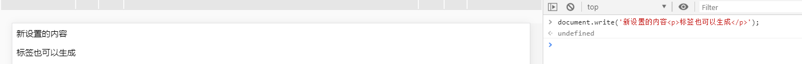
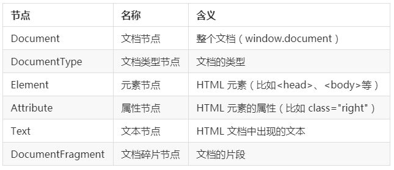

# API简介
[[TOC]]
浏览器是一个封装的较为完善的软件，它给我们提供了操作浏览器功能和页面元素的接口。

#### API

> API（Application Programming Interface，应用程序编程接口）："计算机操作系统"（Operating system）或"程序库"提供给应用程序调用使用的代码。其主要目的是让应用程序开发人员得以调用一组例程功能，而无须考虑其底层的源代码为何、或理解其内部工作机制的细节。API 本身是抽象的，它仅定义了一个接口，而不涉及应用程序在实际实现过程中的具体操作。

注：定义来自维基百科。

#### Web API

Web API 是浏览器提供的一套操作浏览器功能和页面元素的 API（BOM 和 DOM）。

# BOM简介---浏览器对象模型

> 浏览器对象模型（Browser Object Model (BOM)）指的是由 Web 浏览器暴露的所有对象组成的表示模型。BOM 与 DOM（Document Object Model，文档对象模型）不同，其既没有标准的实现，也没有严格的定义，所以浏览器厂商可以自由地实现 BOM。
>
> 作为显示文档的窗口，浏览器程序将其视为对象的分层集合。当浏览器分析文档时，它将创建一个对象的集合，以定义文档，并详细说明它应如何显示。浏览器创建的对象称为文档对象，它是浏览器使用的更大的对象集合的一部分。此浏览器对象集合统称为浏览器对象模型或 BOM。
>
> BOM 层次结构的顶层是窗口对象，它包含有关显示文档的窗口的信息。某些窗口对象本身就是描述文档和相关信息的对象。

注：定义来自维基百科。

## BOM的顶级对象window

window 是浏览器的顶级对象，当调用 window 下的属性和方法时，可以省略 window。

### 常用操作方法

#### `parseInt()`与`parseFloat()`

把字符串转成整数或小数

#### `console.log()`

控制台输出

#### NaN

Not a Number: 不是一个数

`isNaN(x)` 判断变量是否是NaN

#### 对话框

- `alert()`：显示带有一段消息和一个确认按钮的警告框。
- `prompt()`：显示可提示用户输入的对话框。
- `confirm()`：显示带有一段消息以及确认按钮和取消按钮的对话框。

#### 页面加载事件

- `onload`

```javascript
window.onload = function () {
  // 当页面加载完成执行
  // 当页面完全加载所有内容（包括图像、脚本文件、CSS 文件等）执行
};
```

- `onunload`

```javascript
window.onunload = function () {
  // 当用户退出页面时执行
};
```

#### 浏览器尺寸

```javascript
var width = window.innerWidth;
document.documentElement.clientWidth;
document.body.clientWidth;

var height = window.innerHeight;
document.documentElement.clientHeight;
document.body.clientHeight;
```

上述代码可以获取所有浏览器的宽高（不包括工具栏/滚动条）。

#### 定时器

- `setTimeout()` 方法在指定的毫秒数到达之后执行指定的函数，只执行一次。`clearTimeout()` 方法取消由 `setTimeout()` 方法设置的 `timeout`。

```javascript
// 创建一个定时器，2000毫秒后执行，返回定时器的标示
var timerId = setTimeout(function () {
  console.log("Hello shiyanlou");
}, 2000);

// 取消定时器的执行
clearTimeout(timerId);
```

- `setInterval()` 方法设置定时调用的函数也就是可以按照给定的时间（单位毫秒）周期调用函数，`clearInterval()` 方法取消由 `setInterval()` 方法设置的 `timeout`。

```javascript
// 创建一个定时器，每隔 2 秒调用一次
var timerId = setInterval(function () {
  var date = new Date();
  console.log(date.toLocaleTimeString());
}, 2000);

// 取消定时器的执行
clearInterval(timerId);


```

```html
<!DOCTYPE html>
<html lang="en">
<head>
    <meta charset="UTF-8">
    <title>Title</title>
</head>
<body>
<h1>0</h1>
<h2>0</h2>
<script>
    let count = 0
    /*开启定时器 每隔1秒调用一次方法*/
    /*方法作为参数进行传递时不写()*/
    setInterval(f,1000)
    function f(){
        count ++
        let h = document.querySelector("h1")
        h.innerText = count

    }
    let count2 = 0
    /*匿名方法开启定时器*/
    let timer = setInterval(function (){
        count2 ++
        let h = document.querySelector("h2")
        h.innerText = count2
        if(count2 == 50){
            //停止定时器
            clearInterval(timer)

        }
    },100)
</script>

</body>
</html>
```


注：BOM 的操作方法还有很多，但是一般情况下我们常用的就是上面所介绍的。有兴趣的可以自行百度了解 BOM 的更多操作方法和介绍。

### 常见的属性

- location位置

  - location.href  获取和修改浏览器当前的访问地址.

  - location.reload()  刷新
  - location.search  获取地址里面的参数

- history历史(当前窗口历史)

  - histotry.length     历史页面数量
  - histotry.back()   返回上一页面
  - histotry.forward() 前往下一页面
  - history.go(n)         n=1是前往下1页面  n=-1 返回上一页面  n=2 前往下2个页面    n=0代表刷新

- screen屏幕

  - screen.width 获取屏幕宽分辨率
  - screen.height 获取屏幕高分辨率

- navigator导航/帮助

  - navigator.userAgent 得到浏览器的版本信息

# DOM简介---文档对象模型

文档对象模型（Document Object Model，简称 DOM），是 W3C 组织推荐的处理可扩展标志语言的标准编程接口。DOM 定义了访问 HTML 和 XML 文档的标准。我们这里主要学习 HTML DOM。DOM 可以把 HTML 看做是文档树，通过 DOM 提供的 API 可以对树上的节点进行操作。下面我们来看一下 W3C 上的 DOM 树：


# DOM HTML

DOM 能够操作 HTML 的内容。

#### 改变 HTML 输出流

在 JavaScript 中，使用 `document.write()` 可用于直接向 HTML 输出流写内容。比如：

```javascript
document.write("新设置的内容<p>标签也可以生成</p>");
```

在控制台中复制上述代码运行后：



#### 改变 HTML 内容

使用 `innerHTML` 属性改变 HTML 内容。比如修改 p 标签中的内容：

```html
<!DOCTYPE html>
<html>
  <head>
    <meta charset="UTF-8" />
    <title></title>
  </head>
  <body>
    <p id="p1">Hello World!</p>
    <script>
      document.getElementById("p1").innerHTML = "Hello 实验楼";
    </script>
  </body>
</html>
```


##### 和页面相关的方法

1. 通过选择器获取页面中的元素对象

`let 元素对象 = document.querySelector`("选择器")

2. 获取和修改元素的文本内容 

`元素对象.innerText = "xxx"; `   修改文本内容

`元素对象.innerText   `      获取文本内容

3. 获取和修改input控件的值  

`控件对象.value="xxx";`   修改  

`控件对象.value` 获取

4. 创建元素对象

`let 元素对象 = document.createElement("标签名");`

5. 添加元素对象到某个元素里面

`document.body.appendChild(元素对象);`

```html
<!DOCTYPE html>
<html lang="en">
<head>
    <meta charset="UTF-8">
    <title>Title</title>
</head>
<body>
<div id="d1">这是div</div>
<input type="text">
<input type="button" value="按钮" onclick="f()">
<script>
    function f() {
        //通过id找到元素对象
        let d = document.getElementById("d1");
        //获取和修改元素的文本内容
        // console.log(d.innerText);
        // d.innerText="内容被改掉了!";
        //通过选择器找到页面中的元素对象
        let i = document.querySelector("input");
        //修改元素的value属性
        // i.value = "今天有点儿热";
        d.innerText = i.value;
    }


</script>
</body>
</html>
```

```html
<!DOCTYPE html>
<html lang="en">
<head>
    <meta charset="UTF-8">
    <title>Title</title>
</head>
<body>

<script>
    //创建标签
    let d = document.createElement("div");
    //给div设置显示文本
    d.innerText = "我是div";
    //把div添加到body里面
    document.body.appendChild(d);
    //创建h1 和 h2
    let h1 = document.createElement("h1");
    let h2 = document.createElement("h2");
    h1.innerText = "这是h1";
    h2.innerText = "这是h2";
    document.body.append(h1,h2);
    //创建图片并添加
    let i = document.createElement("img");
    //给元素设置属性
    i.src="../b.jpg";
    //添加到页面中
    document.body.append(i);


</script>
</body>
</html>
```


#### 改变 HTML 属性

通过id获取元素对象` document.getElementById("id");`

语法：

```javascript
document.getElementById(id).attribute = new value();
```

例子：

```html
<!DOCTYPE html>
<html>
  <head>
    <meta charset="UTF-8" />
    <title></title>
  </head>
  <body>
    
    <script>
      document.getElementById("image").src =
        "https://static.shiyanlou.com/img/shiyanlou_logo.svg";
    </script>
  </body>
</html>
```

注：上述例子将显示实验楼的 logo 图片。

# DOM CSS

DOM 能够改变 HTML 元素的样式。语法为：

```javascript
document.getElementById(id).style.property = new style();
```

例子：

```html
<!DOCTYPE html>
<html>
  <head>
    <meta charset="UTF-8" />
    <title></title>
  </head>
  <body>
    <p id="syl" style="color: red;">实验楼</p>
    <script>
      document.getElementById("syl").style.color = "green";
    </script>
  </body>
</html>
```

注：在上述例子中，p 标签中实验楼的颜色本来为红色，但是通过 DOM 方法，最后将其改变成了绿色。运行上述代码，最终的效果是显示一个颜色为绿色的实验楼文本。

# DOM 节点

根据 W3C 的 HTML DOM 标准，HTML 文档中的所有内容都是节点：整个文档就是一个文档节点，而每一个 HTML 标签都是一个元素节点。HTML 标签中的文本则是文本节点，HTML 标签的属性是属性节点，一切都是节点。



# DOM 节点的操作

### 获取节点

要操作节点，首先我们要找到节点。主要有以下三种办法：

1. 通过 ID 找到 HTML 元素：使用方法 `getElementById()` 通过元素的 ID 而选取元素，比如：

```javascript
document.getElementById("demo"); // 假定已经有一个 ID 名为 demo 的标签，可以这样来获取它
```

2. 通过标签名找到 HTML 元素：使用方法 getElementsByTagName() 来选取元素，如果有多个同类型标签，那么我们可以通过下标来确认，比如：

```html
<html>
  <body>
    <input type="text" />
    <input type="text" />
    <script>
      document.getElementsByTagName("input")[0].value = "hello"; // 下标为 [0] 表示选取第 1 个 input 标签
      document.getElementsByTagName("input")[1].value = "shiyanlou"; // 下标为 [1] 表示选取第 2 个 input 标签
    </script>
  </body>
</html>
```

3. 通过类名来找到 HTML 元素：使用方法 `getElementsByClassName()` 通过元素的类名来选取元素。比如：

```javascript
document.getElementsByClassName("name"); // 返回包含 class = "name" 的所有元素的一个列表。
```

### DOM 节点之间的关系

DOM 的节点并不是孤立的，我们从 DOM 树中也可以看出，节点与节点之间存在着相对的关系，就如同一个家族一样，有父辈，有兄弟，有儿子等等。下面我们来看一下都有哪些节点：

| 父节点     | 兄弟节点               | 子节点            | 所有子节点 |
| ---------- | ---------------------- | ----------------- | ---------- |
| parentNode | nextSibling            | firstChild        | childNodes |
|            | nextElementSibling     | firstElementChild | children   |
|            | previousSibling        | lastChild         |            |
|            | previousElementSibling | lastElementChild  |            |

例子：

```html
<html>
  <head>
    <title>DOM 节点演示</title>
  </head>
  <body>
    <h1>我是h1标签</h1>
    <p>我是p标签</p>
  </body>
</html>
```

上面的例子中：

- `<html>`节点没有父节点，它是根节点。
- `<head>` 和 `<body>` 的父节点是 `<html>` 节点。
- 文本节点 `我是 p 标签` 的父节点是 `<p>` 节点。
- `<html>` 节点有两个子节点：`<head>` 和 `<body>`。
- `<h1>` 节点和 `<p>` 节点是兄弟节点，同时也是 `<body>` 的子节点。

需要注意以下几点：

- `childNodes`：它是标准属性，它返回指定元素的子元素集合，包括 HTML 节点，所有属性，文本节点。
- `children`：非标准属性，它返回指定元素的子元素集合。但它只返回 HTML 节点，甚至不返回文本节点。
- `nextSibling` 和 `previousSibling` 获取的是节点，获取元素对应的属性是 `nextElementSibling` 和 `previousElementSibling`。
- `nextElementSibling` 和 `previousElementSibling` 有兼容性问题，IE9 以后才支持。

### DOM 节点的操作

1. 创建节点

- 创建元素节点：使用 `createElement()` 方法。比如：

```javascript
var par = document.createElement("p");
let tr = document.createElement("tr");
```

- 创建属性节点：使用 `createAttribute()` 方法。
- 创建文本节点：使用 `createTextNode()` 方法。

2. 插入子节点

- `appendChild ()` 方法向节点添加最后一个子节点。
- `insertBefore` (插入的新的子节点，指定的子节点) 方法在指定的子节点前面插入新的子节点。如果第二个参数没写或者为 null，则默认插入到后面。

```javascript
tr.appendChild(nameTd);
```

3. 删除节点：使用 `removeChild()` 方法。写法为：

```javascript
父节点.removeChild(子节点);
node.parentNode.removeChild(node); // 如果不知道父节点是什么，可以这样写
```

4. 替换子节点：使用 `replaceChild()` 方法。语法为：

```javascript
node.replaceChild(newnode, oldnode);
```

5. 设置节点的属性：

- 获取：`getAttribute(name)`
- 设置：`setAttribute(name, value)`
- 删除：`removeAttribute(name)`

### 示例

```html
<!DOCTYPE html>
<html lang="en">
<head>
    <meta charset="UTF-8">
    <title>Title</title>
</head>
<body>
<input type="text" placeholder="员工姓名" id="i1">
<input type="text" placeholder="员工工资" id="i2">
<input type="text" placeholder="员工工作" id="i3">
<input type="button" value="添加" onclick="f()">
<table border="1">
    <caption>员工列表</caption>
    <tr>
        <th>姓名</th>
        <th>工资</th>
        <th>工作</th>
    </tr>
</table>
<script>
    function f() {
        //创建tr和3个td
        let tr = document.createElement("tr");
        let nameTd = document.createElement("td");
        let salaryTd = document.createElement("td");
        let jobTd = document.createElement("td");
        //把用户输入的内容赋值给td
        nameTd.innerText = i1.value;
        salaryTd.innerText = i2.value;
        jobTd.innerText = i3.value;
        //把td装进tr
        tr.appendChild(nameTd);
        tr.appendChild(salaryTd);
        tr.appendChild(jobTd);
        //把tr装进table
        let table = document.querySelector("table");
        table.append(tr);
    }
</script>
</body>
</html>
```


# DOM事件

#### 事件的定义

在什么时候执行什么事---系统给提供的一些特定时间点, 包括鼠标事件/键盘事件/状态改变事件

#### 事件三要素

事件由：事件源 + 事件类型 + 事件处理程序组成。

- 事件源：触发事件的元素。
- 事件类型：事件的触发方式（比如鼠标点击或键盘点击）。
- 事件处理程序：事件触发后要执行的代码（函数形式，匿名函数）。

#### 常用的事件

| 事件名      | 说明                                 |
| ----------- | ------------------------------------ |
| onclick     | 鼠标单击                             |
| ondblclick  | 鼠标双击                             |
| onkeyup     | 按下并释放键盘上的一个键时触发       |
| onchange    | 文本内容或下拉菜单中的选项发生改变   |
| onfocus     | 获得焦点，表示文本框等获得鼠标光标。 |
| onblur      | 失去焦点，表示文本框等失去鼠标光标。 |
| onmouseover | 鼠标悬停，即鼠标停留在图片等的上方   |
| onmouseout  | 鼠标移出，即离开图片等所在的区域     |
| onload      | 网页文档加载事件                     |
| onunload    | 关闭网页时                           |
| onsubmit    | 表单提交事件                         |
| onreset     | 重置表单时                           |

例子 1 ：鼠标单击事件：

```html
<p onclick="this.innerHTML = '我爱学习，身体好好!'">请点击该文本</p>
```

例子 2 ：鼠标双击事件：

```html
<!DOCTYPE html>
<html>
  <head>
    <meta charset="UTF-8" />
    <title></title>
  </head>
  <body>
    <h1 ondblclick="changetext(this)">请点击该文本</h1>
    <script>
      function changetext(id) {
        id.innerHTML = "我爱学习，身体棒棒!";
      }
    </script>
  </body>
</html>
```

例子 3 ：鼠标移除悬停：

```html
<!DOCTYPE html>
<html>
  <head>
    <meta charset="UTF-8" />
    <title></title>
  </head>
  <body>
    <div
      onmouseover="mOver(this)"
      onmouseout="mOut(this)"
      style="background-color:deepskyblue;width:200px;height:100px;"
    >
      把鼠标移到上面
    </div>
    <script>
      function mOver(obj) {
        obj.innerHTML = "你把鼠标移到了上面 ";
      }

      function mOut(obj) {
        obj.innerHTML = "你把鼠标移开了";
      }
    </script>
  </body>
</html>
```

注：大家可以把上述例子运行一下感受一下事件的魅力，并且可以自己尝试着写一些其他的简单事件。

#### 实例

通过鼠标点击更改导航栏的样式，来看看最终的效果：


参考源码：

```java
<!DOCTYPE html>
<html lang="en">
  <head>
    <meta charset="UTF-8" />
    <title>Title</title>
    <style>
      #list li {
        list-style-type: none;
        width: 100px;
        height: 50px;
        line-height: 50px;
        background-color: beige;
        text-align: center;
        float: left;
      }

      #list li.current {
        background-color: red;
      }

      #list li a {
        text-decoration: none;
      }
    </style>
  </head>

  <body>
    <div id="menu">
      <ul id="list">
        <li class="current">
          <a href="javascript:void(0)">首页</a>
        </li>
        <li>
          <a href="javascript:void(0)">HTML</a>
        </li>
        <li>
          <a href="javascript:void(0)">CSS</a>
        </li>
        <li>
          <a href="javascript:void(0)">JavaScript</a>
        </li>
        <li>
          <a href="javascript:void(0)">关于</a>
        </li>
        <li>
          <a href="javascript:void(0)">帮助</a>
        </li>
      </ul>
    </div>

    <script>
      // 获取所有的 li 标签
      var liObjs = document.getElementById("list").getElementsByTagName("li");
      // 循环遍历，找到每个 li 中的 a，注册点击事件
      for (var i = 0; i < liObjs.length; i++) {
        // 每个 li 中的 a
        var aObj = liObjs[i].firstElementChild;

        aObj.onclick = function () {
          // 把这个 a 所在的 li 的所有的兄弟元素的类样式全部移除
          for (var j = 0; j < liObjs.length; j++) {
            liObjs[j].removeAttribute("class");
          }
          //当前点击的 a 的父级元素 li(点击的这个 a 所在的父级元素 li)，设置背景颜色
          this.parentNode.className = "current";
        };
      }
    </script>
  </body>
</html>
```

#### 总结

- 鼠标事件:

  - onclick  点击事件
  - onmouseover  鼠标移入
  - onmouseout  鼠标移出
  - onmousedown 鼠标按下
  - onmouseup 鼠标抬起 
  - onmousemove   鼠标移动 

- 键盘事件:

  - onkeydown: 键盘按下  按下任何按键触发  
  - onkeyup:  键盘抬起
  - onkeypress: 键盘按下  按下非系统功能键触发  

- 状态改变事件:

  - onload: 页面加载完成事件
  - onchange: 值改变事件
  - onblur: 失去焦点事件(文本框的编辑完成)

- 事件的绑定(给元素添加事件的方式)

  - 事件属性绑定: 在标签的里面添加事件属性

    ```html
    <input type="button" value="事件属性绑定" onclick="alert('按钮点击了')">
    ```

  - 动态绑定: 通过js代码给元素添加事件

    ```javascript
    //动态绑定: 通过js代码给元素添加事件
    btn.onclick = function () {
        alert("动态绑定成功!");
    }
    ```

- 事件传递(事件冒泡)

  在某一个范围如果有多个元素的事件需要响应, 则响应顺序是从最底层元素往上层元素传递(类似气泡从下往上,所以也称为事件冒泡)
