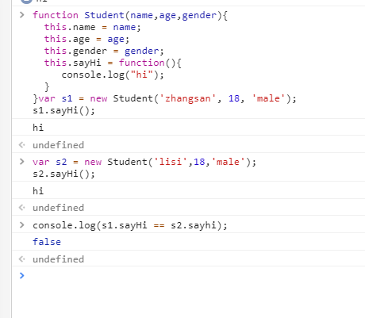
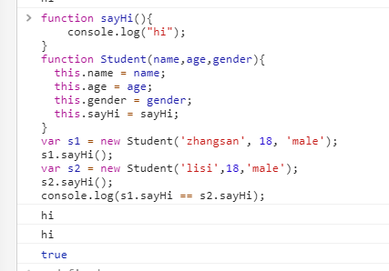
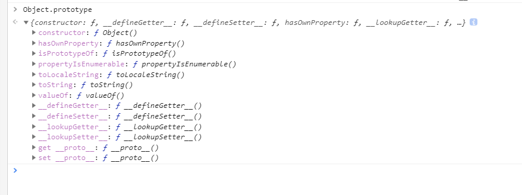

# 面向对象编程
[[TOC]]
## 概述

### 什么是对象

ECMA-262 把对象（object）定义为“属性的无序集合，每个属性存放一个原始值、对象或函数”。我们可以从以下两个层次来理解对象到底是什么：

1. 对象是单个事物的抽象。比如一支笔，一本书，一辆车都可以是一个对象。
2. 对象是一个容器，封装了属性和方法。比如：一辆车。它的颜色，大小，重量等是它的属性，而启动，加速，减速，刹车等是它的方法。

### 什么是面向对象编程

> 面向对象程序设计（英语：Object Oriented Programming，缩写：OOP）是种具有对象概念的程序编程典范，同时也是一种程序开发的抽象方针。它可能包含数据、属性、代码与方法。对象则指的是类的实例。它将对象作为程序的基本单元，将程序和数据封装其中，以提高软件的重用性、灵活性和扩展性，对象里的程序可以访问及经常修改对象相关连的数据。在面向对象程序编程里，计算机程序会被设计成彼此相关的对象。

注：定义来自维基百科。

## 面向对象编程举例

比如我们设置页面中的 div 标签 和 p 标签的背景色为 color。如果按照我们前面所需我们可能会这样写：

```html
<!DOCTYPE html>
<html>
  <head>
    <meta charset="UTF-8" />
    <title></title>
    <style type="text/css">
      div,
      p {
        width: 200px;
        height: 100px;
      }
    </style>
  </head>
  <body>
    <div>你好吗？</div>
    <p>我很好</p>
    <div>测试一下嘛</div>
    <p>好的啊</p>
    <script>
      var divs = document.getElementsByTagName("div");
      for (var i = 0; i < divs.length; i++) {
        divs[i].style.backgroundColor = "red";
      }
      var ps = document.getElementsByTagName("p");
      for (var j = 0; j < ps.length; j++) {
        ps[j].style.backgroundColor = "red";
      }
    </script>
  </body>
</html>
```

是不是觉得有点麻烦？好像有重复的？有的人可能会想到用函数来封装一下相同的代码:

```html
<!DOCTYPE html>
<html>
  <head>
    <meta charset="UTF-8" />
    <title></title>
    <style type="text/css">
      div,
      p {
        width: 200px;
        height: 100px;
      }
    </style>
  </head>
  <body>
    <div>你好吗？</div>
    <p>我很好</p>
    <div>测试一下嘛</div>
    <p>好的啊</p>
    <script>
      function getTagname(tagName) {
        return document.getElementsByTagName(tagName);
      }

      function setStyle(arr) {
        for (var i = 0; i < arr.length; i++) {
          arr[i].style.backgroundColor = "red";
        }
      }

      var divs = getTagname("div");
      setStyle(divs);
      var ps = getTagname("p");
      setStyle(ps);
    </script>
  </body>
</html>
```

我们再来看看使用面向对象的方式：

```html
<!DOCTYPE html>
<html>
  <head>
    <meta charset="UTF-8" />
    <title></title>
    <style type="text/css">
      div,
      p {
        width: 200px;
        height: 100px;
      }
    </style>
  </head>

  <body>
    <div>你好吗？</div>
    <p>我很好</p>
    <div>测试一下嘛</div>
    <p>好的啊</p>
    <script>
      var test = {
        getEle: {
          // 实际上本案例只需要写 tag，但是为了体现面向对象的思想，我们把获取节点的三种方式都写出来
          tag: function (tagName) {
            return document.getElementsByTagName(tagName);
          },
          id: function (idName) {
            return document.getElementById(idName);
          },
          class: function (className) {
            return document.getElementsByClassName(className);
          },
        },
        // 实际上本案例只需要写 setStyle，同样的为了体现面向对象编程的思想，我们可以设置添加移除修改样式的函数。
        setCss: {
          setStyle: function (arr) {
            for (var i = 0; i < arr.length; i++) {
              arr[i].style.backgroundColor = "red";
            }
          },

          updateCss: function () {},
          deleteCss: function () {},
          // ...
        },
      };

      var divs = test.getEle.tag("div");
      test.setCss.setStyle(divs);
      var ps = test.getEle.tag("p");
      test.setCss.setStyle(ps);
    </script>
  </body>
</html>
```

### 自定义对象

```html
<!DOCTYPE html>
<html lang="en">
<head>
    <meta charset="UTF-8">
    <title>Title</title>
</head>
<body>
<table border="1">
    <caption>商品列表</caption>
    <tr>
        <th>商品名</th>
        <th>价格</th>
        <th>库存</th>
    </tr>
</table>

<script>
  //定义一个空的Person对象
  function Person() {}
  //实例化一个Person对象
  let p1 = new Person();
  //动态添加属性
  p1.name = "张三";
  p1.age = 18;
  //动态添加方法
  p1.run = function () {
    console.log("我叫"+this.name+"今年"+this.age);
  }
  //调用方法
  p1.run();
  //直接实例化对象
  let p2 = {};
  p2.name = "李白";
  p2.age = 20;
  p2.run = function () {
      console.log("李白的方法执行了!");
  }
  p2.run();
  //实例化自带属性和方法的对象
  let p3 = {
      name:"刘备",
      age:30,
      run:function () {
          alert(this.name+":"+this.age);
      }
  }
  p3.run();
  // 通过自定义对象封装数据
    let arr = [{name:"小米手机",price:"3000",count:500},
        {name:"小米电视",price:"3000",count:500},
        {name:"华为手机",price:"3000",count:500},
        {name:"华为电视",price:"3000",count:500}]

    //把数组中商品信息展示到页面中
  for (let item of arr) {
      let tr = document.createElement("tr");
      let nameTd = document.createElement("td");
      let priceTd = document.createElement("td");
      let countTd = document.createElement("td");
      nameTd.innerText = item.name;
      priceTd.innerText = item.price;
      countTd.innerText = item.count;
      tr.append(nameTd,priceTd,countTd);
      let table = document.querySelector("table");
      table.append(tr);
  }


</script>
</body>
</html>
```


## 构造函数

首先，我们来复习一下创建对象的方式。

1. 通过对象字面量来创建。

```js
var student = {
  name: "zhangsan",
  age: 18,
  gender: "male",
  sayHi: function () {
    console.log("hi,my name is " + this.name);
  },
};
```

2. 通过 new Object() 创建对象。

```js
var student = new Object();
(student.name = "zhangsan"),
  (student.age = 18),
  (student.gender = "male"),
  (student.sayHi = function () {
    console.log("hi,my name is " + this.name);
  });
```

上面两种都是简单的创建对象的方式，但是如果有两个 student 实例对象呢？cv（Ctrl C + Ctrl V） 大法？分别命名一下 student1 和 student2？那如果是一个班的学生，n 个学生呢？显然如果这样做的话代码冗余率太高，是不可取的。我们也学过函数，所以简单方式的改进是：工厂函数。

3. 通过工厂函数来创建对象。

```js
function createStudent(name, age, gender) {
  var student = new Object();
  student.name = name;
  student.age = age;
  student.gender = gender;
  student.sayHi = function () {
    console.log("hi,my name is " + this.name);
  };
  return student;
}
var s1 = createStudent("zhangsan", 18, "male");
var s2 = createStudent("lisi", 19, "male");
```

这样封装代码确实解决了代码冗余的问题，但是每次调用函数 `createStudent()` 都会创建新函数 `sayHi()`，也就是说每个对象都有自己的 `sayHi()` 版本，而事实上，每个对象都共享一个函数。为了解决这个问题，我们引入面向对象编程里的一个重要概念：构造函数。

4. 通过构造函数来创建对象。

```js
function Student(name, age, gender) {
  this.name = name;
  this.age = age;
  this.gender = gender;
  this.sayHi = function () {
    console.log("hi,my name is " + this.name);
  };
}
var s1 = new Student("zhangsan", 18, "male");
```

来看看构造函数与工厂函数的区别：

- 首先在构造函数内没有创建对象，而是使用 `this` 关键字，将属性和方法赋给了 `this` 对象。
- 构造函数内没有 `return` 语句，`this` 属性默认下是构造函数的返回值。
- 函数名使用的是大写的 Student。
- 用 `new` 运算符和类名 Student 创建对象。

## 构造函数存在的问题

构造函数虽然科学，但仍然存在一些问题。

我们使用前面的构造函数例子来讲解（修改了 `sayHi()` 方法）：

```js
function Student(name, age, gender) {
  this.name = name;
  this.age = age;
  this.gender = gender;
  this.sayHi = function () {
    console.log("hi");
  };
}
```

首先我们创建两个实例化对象：

```js
var s1 = new Student("zhangsan", 18, "male");
s1.sayHi(); // 打印 hi

var s2 = new Student("lisi", 18, "male");
s2.sayHi(); // 打印 hi

console.log(s1.sayHi == s2.sayhi); // 结果为 false
```

眼见为实，来看看效果：



由于每个对象都是由 new Student 创建出来的，因此每创建一个对象，函数 `sayHi()` 都会被重新创建一次，这个时候，每个对象都拥有一个独立的，但是功能完全相同的方法，这样势必会造成内存浪费。有的人可能会想，既然是一样的那我们就单独把它提出来，写一个函数，每次调用不就可以了吗？比如：

```js
function sayHi() {
  console.log("hi");
}

function Student(name, age, gender) {
  this.name = name;
  this.age = age;
  this.gender = gender;
  this.sayHi = sayHi;
}

var s1 = new Student("zhangsan", 18, "male");
s1.sayHi(); // 打印 hi
var s2 = new Student("lisi", 18, "male");
s2.sayHi(); // 打印 hi
console.log(s1.sayHi == s2.sayHi); // 结果为 true
```



但是这样做会导致全局变量增多，可能会引起命名冲突，代码结果混乱，维护困难。通过使用原型可以很好的解决这个问题。


## 原型

### 原型：prototype

在 JavaScript 中，每一个函数都有一个 `prototype` 属性，指向另一个对象。这个对象的所有属性和方法，都会被构造函数的实例继承。我们来看看前面例子原型的写法：

```js
function Student(name, age, gender) {
  this.name = name;
  this.age = age;
  this.gender = gender;
}

Student.prototype.sayHi = function () {
  console.log("hi");
};

var s1 = new Student("zhangsan", 18, "male");
s1.sayHi(); // 打印 hi
var s2 = new Student("lisi", 18, "male");
s2.sayHi(); // 打印 hi
console.log(s1.sayHi == s2.sayHi); // 结果为 true
```


## 构造函数,实例,原型三者之间的关系

我们之前提到过：每一个函数都有一个 `prototype` 属性，指向另一个对象。让我们用代码验证一下，在编辑器中输入以下代码：

```html
<script type="text/javascript">
  function F() {}
  console.log(F.prototype);
</script>
```

上述代码在浏览器中打印结果为 Object，验证了我们所说的 `prototype` 属性，指向另一个对象。

构造函数的 `prototype` 对象默认都有一个 `constructor` 属性，指向 `prototype` 对象所在函数。在控制台中运行下面的代码：

```js
function F() {}
console.log(F.prototype.constructor === F); // 结果为 ture
```

通过构造函数得到的实例对象内部会包含一个指向构造函数的 `prototype` 对象的指针 `__proto__`。`__proto__` 属性最早是火狐浏览器引入的，用以通过实例对象来访问原型，这个属性在早期是非标准的属性。在控制台中运行下面的代码：

```js
function F() {}
var a = new F();
console.log(a.__proto__ === F.prototype); // 结果为 true
```

实例对象可以直接访问原型对象成员，所有实例都直接或间接继承了原型对象的成员。

总结：每个构造函数都有一个原型对象，原型对象包含一个指向构造函数的指针 `constructor`，而实例都包含一个指向原型对象的内部指针`__proto__`。

## 原型链

我们说过所有的对象都有原型，而原型也是对象，也就是说原型也有原型，那么如此下去，也就组成了我们的原型链。

### 属性搜索原则

属性搜索原则，也就是属性的查找顺序，在访问对象的成员的时候，会遵循以下原则：

- 首先从对象实例本身开始找，如果找到了这个属性或者方法，则返回。
- 如果对象实例本身没有找到，就从它的原型中去找，如果找到了，则返回。
- 如果对象实例的原型中也没找到，则从它的原型的原型中去找，如果找到了，则返回。
- 一直按着原型链查找下去，找到就返回，如果在原型链的末端还没有找到的话，那么如果查找的是属性则返回 undefined，如果查找的是方法则返回 `xxx is not a function`。

### 更简单的原型语法

在前面的例子中，我们是使用 `xxx.prototype.` 然后加上属性名或者方法名来写原型，但是每添加一个属性或者方法就写一次显得有点麻烦，因此我们可以用一个包含所有属性和方法的对象字面量来重写整个原型对象：

```js
function Student(name, age, gender) {
  this.name = name;
  this.age = age;
  this.gender = gender;
}
Student.prototype = {
  hobby: "study",
  sayHi: function () {
    console.log("hi");
  },
};

var s1 = new Student("wangwu", 18, "male");
console.log(Student.prototype.constructor === Student); // 结果为 false
```

但是这样写也有一个问题，那就是原型对象丢失了 `constructor` 成员。所以为了保持 constructor 成员的指向正确，建议的写法是：

```js
function Student(name, age, gender) {
  this.name = name;
  this.age = age;
  this.gender = gender;
}
Student.prototype = {
  constructor: Student, // 手动将 constructor 指向正确的构造函数
  hobby: "study",
  sayHi: function () {
    console.log("hi");
  },
};

var s1 = new Student("wangwu", 18, "male");
console.log(Student.prototype.constructor === Student); // 结果为 true
```

## 原型链继承

我们都听过这么一句话：子承父业。而在我们的 JavaScript 中也有继承，接下来我们会学习原型链继承。原型链继承的主要思想是利用原型让一个引用类型继承另外一个引用类型的属性和方法。

```js
function Student(name, age, gender) {
  this.name = name;
  this.age = age;
  this.gender = gender;
}
Student.prototype.sayHi = function () {
  console.log("hi");
};

var s1 = new Student("zhangsan", 18, "male");
s1.sayHi(); // 打印 hi
var s2 = new Student("lisi", 18, "male");
s2.sayHi(); // 打印 hi
```

上述例子中实例化对象 s1 和 s2 都继承了 `sayHi()` 方法。

## Object.prototype成员介绍

在控制台中输入以下代码：

```js
Object.prototype;
```



我们介绍常用的几个 Object.prototype 成员：


