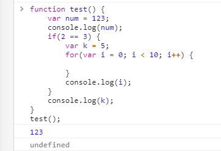
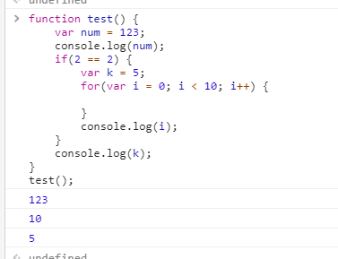
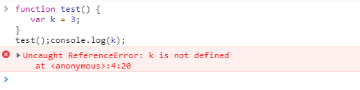
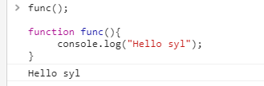
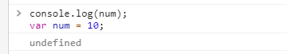
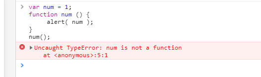
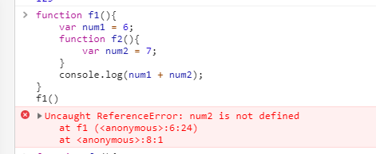
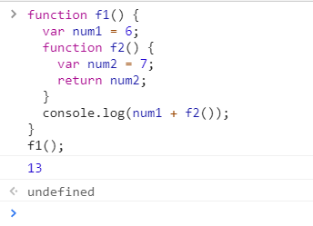
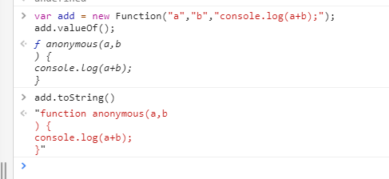
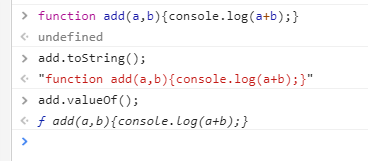

# 函数进阶
[[TOC]]
# call,apply,bind

在学习 `call()`、`apply()`、`bind()` 方法之前，我们先来复习一下 `this` 的指向问题，我们前面说过一个口诀：谁调用 `this`，它就指向谁。让我们先来看一个例子：

```js
function foods() {}
foods.prototype = {
  price: "￥15",
  say: function () {
    console.log("My price is " + this.price);
  },
};

var apple = new foods();
apple.say(); // My price is ￥15
var orange = new foods();
orange.say(); // My price is ￥15
```

也就是说上述例子调用 `say()` 方法，最后打印的结果都是一样的，但是如果我们想打印橘子的价钱是 10 元呢？又不想重新定义 `say()` 方法。JavaScript 为我们专门提供了一些函数方法用来帮我们更优雅的处理函数内部 this 指向问题。这就是接下来我们要学习的 `call()`、`apply()`、`bind()` 三个函数方法。

# 递归

在程序中，递归就是函数自己直接或者间接的调用自己。

例子：计算 1 到 10 之间的整数相加的和：

```js
function foo(n) {
  if (n == 0) {
    return 0;
  } // 临界条件
  else {
    return n + foo(n - 1);
  }
}
var a = foo(10);
a; // 55
```

注：一定要写临界条件，不然程序无法结束并且会报错。

# 作用域

作用域就是变量与函数的可访问范围，即作用域控制着变量与函数的可见性和生命周期。简单来说，作用域的值就是作用范围，也就是说一个变量或函数在什么地方可以使用，在什么地方不能使用。

#### 块级作用域

在 JavaScript 中是没有块级作用域的。比如：

```js
{
  var num = 123;
  {
    console.log(num);
  }
}
console.log(num);
```

上面的例子并不会报错，而是打印两次 123，但是在其他编程语言中（C#、C、JAVA）会报错，这是因为在 JavaScript 中是没有块级作用域。也就是说，使用 `{}` 标记出来的代码块中声明的变量 `num`，是可以被 `{}` 外面访问到的。

#### 函数作用域

JavaScript 的函数作用域是指在函数内声明的所有变量在函数体内始终是可见的，不涉及赋值。来看个例子：

```js
function test() {
  var num = 123;
  console.log(num);
  if (2 == 3) {
    var k = 5;
    for (var i = 0; i < 10; i++) {}
    console.log(i);
  }
  console.log(k); // 不会报错，而是显示 undefined
}
test();
```



我们把上面的代码 `if` 语句中的条件改为 `2 == 2` 来看看效果：



我们再来对比一下如果没有在函数体内会是什么效果：



#### 全局作用域

全局作用域也就是说什么地方都能够访问到。比如我们不用 `var` 关键字，直接声明变量的话，那这个变量就是全局变量，它的作用域就是全局作用域。使用 window 全局对象来声明，全局对象的属性也是全局变量。另外在所有的函数外部用 `var` 声明的变量也是全局变量，这是因为内层作用域可以访问外层作用域。

注：

- 内层作用域可以访问外层作用域，反之不行。
- 整个代码结构中只有函数可以限定作用域。
- 如果当前作用规则中有名字了，就不考虑外面的同名变量。
- 作用域规则首先使用提升规则分析。

#### 变量名提升

JavaScript 是解释型的语言，但是它并不是真的在运行的时候完完全全的逐句的往下解析执行。我们来看个例子：

```js
func();

function func() {
  console.log("Hello syl");
}
```

在控制台中运行效果为：



这说明了它并不是完全的逐句往下解析的，否则是会报错的。显然，在执行 `func()` 之前，引擎就已经解析到了 `function func(){}`，发生了变量名提升。那么变量名提升是在什么时候发生的呢？JavaScript 引擎在对 JavaScript 代码进行解释执行之前，会对 JavaScript 代码进行预解析，在预解析阶段，会将以关键字 `var` 和 `function` 开头的语句块提前进行处理。当变量和函数的声明处在作用域比较靠后的位置的时候，变量和函数的声明会被提升到作用域的开头。也就是说上面的代码，我们可以理解为：

```js
function func() {
  console.log("Hello syl");
}
func();
```

再来看看变量声明的例子：

```js
console.log(num);
var num = 10;
```



结果可能有些出人意料，但是我们这里说的提示，是声明的提升，也就是说上面的代码，我们可以理解为：

```js
var num; // 这里是声明
console.log(num); // 变量声明之后并未有初始化和赋值操作，所以这里是 undefined
num = 10; // 最终打印结果为 10
```

下面再来看几个复杂一点的例子。

函数同名的时候：

```js
func();
function func() {
  console.log("Hello syl");
}

func();
function func() {
  console.log("hi syl");
} // 最终结果打印了两次 hi syl
```

上面代码相当于：

```js
function func() {
  console.log("Hello syl");
}
function func() {
  console.log("hi syl");
}
func();
func();
```

函数变量同名的时候：

```js
console.log(foo);
function foo() {}
var foo = 6;
```

当出现变量声明和函数同名的时候，只会对函数声明进行提升，变量会被忽略。所以上面的代码相当于：

```js
function foo() {}
console.log(foo);
foo = 6;
```

我们再来看一种：

```js
var num = 1;
function num() {
  alert(num);
}
num();
```



上面的代码相当于：

```js
function num() {
  alert(num);
}

num = 1;
num();
```

下面我们来看一个思考题：

```js
var num = 3;
function foo() {
  console.log(num);
  var num = 4;
  console.log(num);
}
foo();
```

注：大家可以先思考一下，然后根据我们前面所学的变量名提升，试着写一下等价的代码，最后再复制上述代码到控制台中运行看看结果。

上面的代码相当于：

```js
var num = 3;
function foo() {
  var num; // 在函数顶部声明了局部变量，覆盖了函数体外同名的全局变量
  console.log(num); // 变量存在，但是它的值为 undefined
  num = 4; // 将其初始化赋值。
  console.log(num); //打印我们期望的值 4
}
```


# 闭包

闭包是指函数可以使用函数之外定义的变量。

#### 简单的闭包

在 JavaScript 中，使用全局变量是一个简单的闭包实例。比如：

```js
var num = 3;
function foo() {
  console.log(num);
}
foo(); //打印 3
```

#### 复杂的闭包

```js
function f1() {
  var num1 = 6;
  function f2() {
    var num2 = 7;
  }
  console.log(num1 + num2);
}
f1();
```



在上述代码中函数 `f2` 能够访问到它外层的变量 `num1`，但是 `f1` 是不能访问 `f2` 中的变量`num2`，因此我们可以把 `num2` 作为 `f2` 的返回值，然后通过 `f2` 的返回值就可以访问到 `sum2` 了。

```js
function f1() {
  var num1 = 6;
  function f2() {
    var num2 = 7;
    return num2;
  }
  console.log(num1 + f2());
}
f1();
```



# arguments对象

在函数代码中，使用特殊对象 `arguments`，无需明确指出参数名，我们就能访问它们。第一个参数是 `arguments[0]`，第二个参数是 `arguments[1]`，以此类推。比如：

```js
function foo() {
  console.log(arguments[0]);
  console.log(arguments[1]);
}
foo(2, 3); // 打印 2 3
```

还可以用 `arguments` 对象检测函数的参数个数，引用属性 `arguments.length` 即可。来看一个遍历参数求和的例子：

```js
function add() {
  var sum = 0;
  for (var i = 0; i < arguments.length; i++) {
    sum += arguments[i];
  }
  return sum;
}
add(); // 0
add(1); // 1
add(1, 2); // 3
add(1, 2, 3); // 6
```

# Function对象

用 `Function()` 对象创建函数的语法如下：

```js
var function_name = new Function(arg1, arg2, ..., argN, function_body)
```

注：每个参数都必须是字符串，`function_body` 是函数主体，也就是要执行的代码。

例子：

```js
var add = new Function("a", "b", "console.log(a+b);");
add(2, 5); // 打印 7
```

再看一个例子:

```js
var add = new Function("a", "b", "console.log(a+b);");
var doAdd = add;
doAdd(2, 5); // 打印 7
add(2, 5); // 打印 7
```

在上述例子中，变量 `add` 被定义为函数，然后 `doAdd` 被声明为指向同一个函数的指针。用这两个变量都可以执行该函数的代码，并输出相同的结果。因此，函数名只是指向函数的变量，那么我们可以把函数作为参数传递给另一个函数，比如下面的例子：

```js
function addF(foo, b, c) {
  foo(b, c);
}
var add = new Function("a", "b", "console.log(a+b);");
addF(add, 2, 5); // 打印 7
```

#### Function 对象的 length 属性

函数属于引用类型，所以它们也有属性和方法。`length` 属性声明了函数期望的参数个数。

例子：

```js
var add = new Function("a", "b", "console.log(a+b);");
console.log(add.length); // 打印 2
```

#### Function 对象的方法

`Function()` 对象也有与所有对象共享的 `valueOf()` 方法和 `toString()` 方法。这两个方法返回的都是函数的源代码。

例子：

```js
var add = new Function("a", "b", "console.log(a+b);");
add.valueOf();
add.toString();
```



