# Vue简介与安装使用

[[TOC]]

## 简介

#### 官网

- 中文：https://cn.vuejs.org/
- 英文：https://vuejs.org/

## Vue.js

#### Vue.js 是什么

Vue (读音 /vjuː/，类似于 **view**) 是一套用于构建用户界面的**渐进式框架**。与其它大型框架不同的是，Vue 被设计为可以自底向上逐层应用。Vue 的核心库只关注视图层，不仅易于上手，还便于与第三方库或既有项目整合。另一方面，当与现代化的工具链以及各种支持类库结合使用时，Vue 也完全能够为复杂的单页应用提供驱动。<信息来源：vue 官网>

#### 作者

尤雨溪毕业于上海复旦附中，在美国完成大学学业，本科毕业于上 Colgate University，后在 Parsons 设计学院获得 Design & Technology 艺术硕士学位，任职于纽约 Google Creative Lab。<信息来源：百度百科>

#### 作用

Vue.js 框架的作用主要注重动态的构建用户界面，前端工程化和模块化开发。

#### 特点

- 一个轻量级的mvvm框架，双向绑定，数据动态更新，gzip后大小只有20k+
- 是一个渐进式框架，其核心思想是数据驱动、组件化的前端开发
- 原生html页面是通过js 操作的是dom，而vue.js操作的是数据。
- 和传统前端开发开发的关注点完全不同，传统方式关注的是都像的document结构的api，而vue关注的是数据。
- 优点显而易见，从而屏蔽了使用复杂晦涩难记的dom结构api。

#### Vue 与其他框架的对比

| 框架    | 设计模式 | 数据绑定 | 灵活度 | 文件模式  | 复杂性 | 学习曲线           | 生态 |
| ------- | -------- | -------- | ------ | --------- | ------ | ------------------ | ---- |
| `Vue`   | `MVVM`   | 双向     | 灵活   | 单文件    | 小     | 缓                 | 完善 |
| React   | `MVC`    | 单向     | 较灵活 | all in js | 大     | 陡                 | 丰富 |
| Angular | `MVC`    | 双向     | 固定   | 多文件    | 较大   | 较陡（Typescript） | 独立 |

**更多对比细节：vue 官网：https://cn.vuejs.org/v2/guide/comparison.html**

Vue 是一个推陈出新的前端框架，吸收了很多前端框架的优点。例如，Vue 借鉴了 React 的组件化和虚拟 DOM ，借鉴了 Angular 的模块化和数据绑定。因此，我们以 Vue.js 作为入手，以后深入学习其他框架，你会发现他们的共通之处，更好地高效地学习。

选择 Vue.js 的更多原因是，就框架的 API 而言，对比之下，Vue 更加轻便简洁。Vue 自身拥有开箱即用的生态开发包（Vuex,Vue-Router）等，复杂性低、学习成本低，是一门比较好入门的前端框架。

JavaScript在1995年由Netscape公司的Brendan Eich，在网景导航者浏览器上首次设计实现而成。近年来发展非常迅速，标准也在不断完善已经达到ES6时代。

ECMAScript 6.0（简称 ES6）是JavaScript语言的下一代标准，已经在 2015 年 6 月正式发布了。它的目标是让JavaScript语言可以用来编写复杂的大型应用程序，成为企业级开发语言，洗白其一直被"鄙视"的脚本语言的前身。

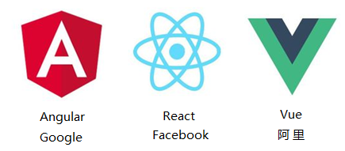

随着js的强大，三大巨头横空推出，形成鼎足之势。前端新三大框架：Angular/React/Vue，三种是目前主流js框架。国外企业多用React，国内企业多用Vue。

Vue是我们国人开发的，作者：尤雨溪，是一个基于JavaScript的渐进式前端框架，更符合中国人习惯，在中国很多大型一线企业中广泛应用。

Vue3.0使用TypeScript编写，TypeScript是JavaScript的超集，微软研发，语法更加细致严谨，改js脚本语言为向一线强语言java、c靠拢，可以构建大型项目，基于ES6标准。

#### 渐进式框架

**Vue**是一个用于构建用户界面的渐进式 **SPA** （ **Single-Page Applications** ）单一页面框架。与其它庞大而单一框架不同的是，Vue从一开始就被设计为按需搭建。

- 可以只使用核心vue.js
- 可以只使用核心vue.js + components组件
- 可以只使用核心vue.js + components组件 + router路由
- 可以只使用核心vue.js + components组件 + router路由 + vuex状态管理
- 构建大型vue项目：npm（包依赖） + webpack（打包、压缩、合并等）
  
  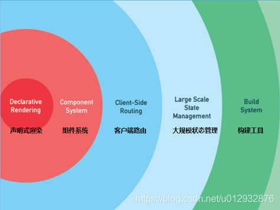

## 安装

### script 标签引入

标签引入模式，直接下载并用 script 标签引入

下载地址：https://vuejs.org/js/vue.js

```html
<script src="js/vue.min.js"></script>
```

#### `CDN`引入

不用下载到本地，即引即用，学习推荐使用这种模式：

推荐 2 个较稳定的 cdn,以下任选其一

```js
<script src="https://cdn.bootcss.com/vue/2.6.6/vue.min.js"></script>
<script src="https://cdn.jsdelivr.net/npm/vue"></script>
```

##### 引入字体图标

```js
<link href="//netdna.bootstrapcdn.com/font-awesome/4.7.0/css/font-awesome.min.css" rel="stylesheet">
```

##### 引入axios

```js
<script src="https://cdn.bootcdn.net/ajax/libs/axios/0.21.1/axios.min.js"></script>
```

##### 引入vue

```js
<script src="https://cdn.jsdelivr.net/npm/vue@2/dist/vue.js"></script>
```

##### 引入jQuery

```js
<script src="https://cdn.staticfile.org/jquery/2.1.1/jquery.min.js"></script>   
```

### 脚手架工具

1、`vue-cli`是基于`npm`的，所以应该先安装`node`环境，通过`node`官网：http://nodejs.cn/ 下载系统对应的`node`安装程序。


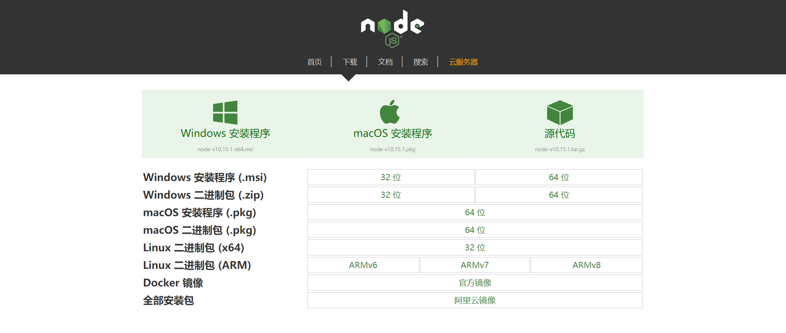

**注意：** NPM 是随同 Node.js 一起安装的包管理工具。因此当我们安装好 Node.js 的时候，也安装好了 NPM。

npm（node package manager）：nodejs的包管理器，用于node插件管理（包括安装、卸载、管理依赖等）（相似于 Java Maven ），解决 Node.js 代码上很多的部署问题。  常见的使用场景如下:

- 从 npm 服务器下载别人编写的 JavaScript 库到本地使用。

- 用户将自己编写的 JavaScript 库提交到 npm 服务器供其他人使用。

- 根据 `package.json` 下载并安装库环境。

  * `package.json` 文件详解：

    
    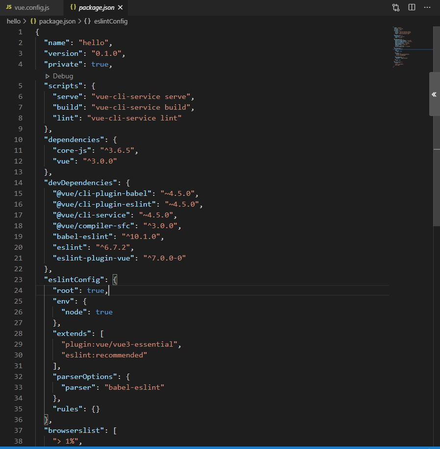

    - `name`： 项目名
    - `version`： 项目版本
    - `private`： 是否是私有项目
    - `scripts`： 脚本命令 `npm run <scripts-name>`
    - `dependencies`： 生成环境依赖
    - `devDependencies`： 开发环境依赖
    - `eslintConfig`： `eslint` 配置项

Node.js 是一个事件驱动 I/O 服务端 JavaScript 环境，基于 Google 的 V8 引擎，V8 引擎执行 Javascript 的速度非常快，性能非常好。

简单的来说 Node.js 就是运行在服务端的 JavaScript 。

npm 为你和你的团队打开了连接整个 JavaScript 世界的一扇大门。它是世界上最大的软件注册表，每星期大约有 30 亿次的下载量，包含超过 600000 个 包（package） （即，代码模块）。来自各大洲的开源软件开发者使用 npm 互相分享和借鉴。包的结构使您能够轻松跟踪依赖项和版本。

官网：

[英文官网](https://docs.npmjs.com/about-npm) 

[中文官网](https://www.npmjs.cn/ )

npm（Node Package Manager）是 node.js 的包管理器，而 cnpm 其实是 China Node Package Manager 的缩写。没错它就是中国版的 npm，主要解决的是下载速度问题。

如果本地要安装 cnpm 可以使用以下命令：

```bash
# 注意：安装完后最好查看其版本号 cnpm -v 或关闭命令提示符重新打开，安装完直接使用有可能会出现错误；
npm install -g cnpm --registry=https://registry.npmmirror.com
```


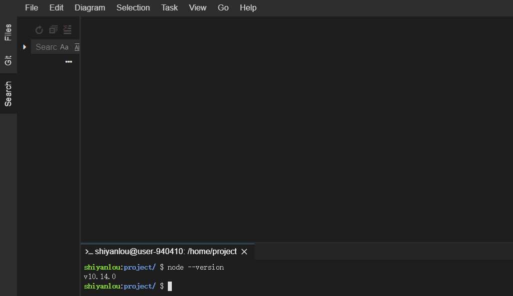


刚刚接触前端时，所有静态资源 CSS 、图片和 JS 都是手动引入 HTML 页面中，但是渐渐的引入的 JS 文件多了，维护难度便上去了，然后每次新开项目又得整一大堆文件。这时候你就需要 webpack 了。webpack 提供协以下功能：

- 模块化开发（import，require，export）

- 预处理（Less，Sass，ES6，TypeScript……）

- 主流框架脚手架（vue，React，sAngular）

- 配置管理

  2、`node`安装完毕使用，`npm`包管理工具全局安装`vue-cli`

```bash
npm install -g vue-cli
```

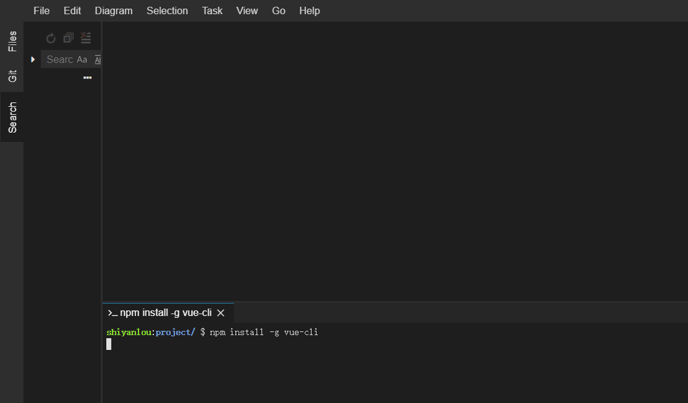

 [Vue CLI](https://cli.vuejs.org/zh/) 是 Vue 官方基于 webpack 搭建好的脚手架。

vue-cli 已经满足我们的需求了，就不过多的介绍 webpack。(虽然学习 webpack 不能提高你的开发水平， 但是可以避免工作中的一些坑，如果有空请花点时间学习下。)

vue-cli 自带有项目管理界面，我们可以通过 `vue ui` 命令启动可视化界面进行操作.

3、命令行输入`vue`，出现 Usage 表示安装成功。

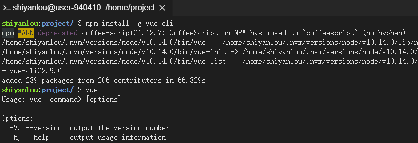

4、使用指令生成一个 vue 应用

```bash
vue init webpack sylApp  # sylApp 这里是项目名AppName
```

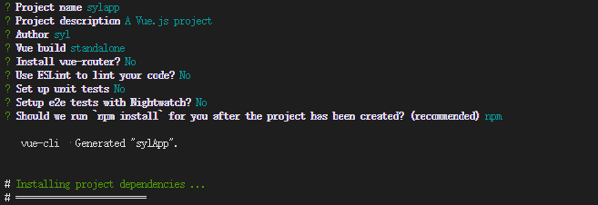

参考上图在命令行中输入对应的内容。

5、命令行进入刚刚创建的 app 的文件夹内，输入`npm run start`将 vue 应用运行起来

```bash
cd sylApp
npm run start
```

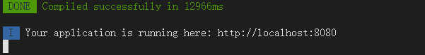

6、成功执行命令行后，我们打开浏览器输入 [http://localhost:8080，即可看到一个](http://localhost:8080，即可看到一个/) vue 应用。

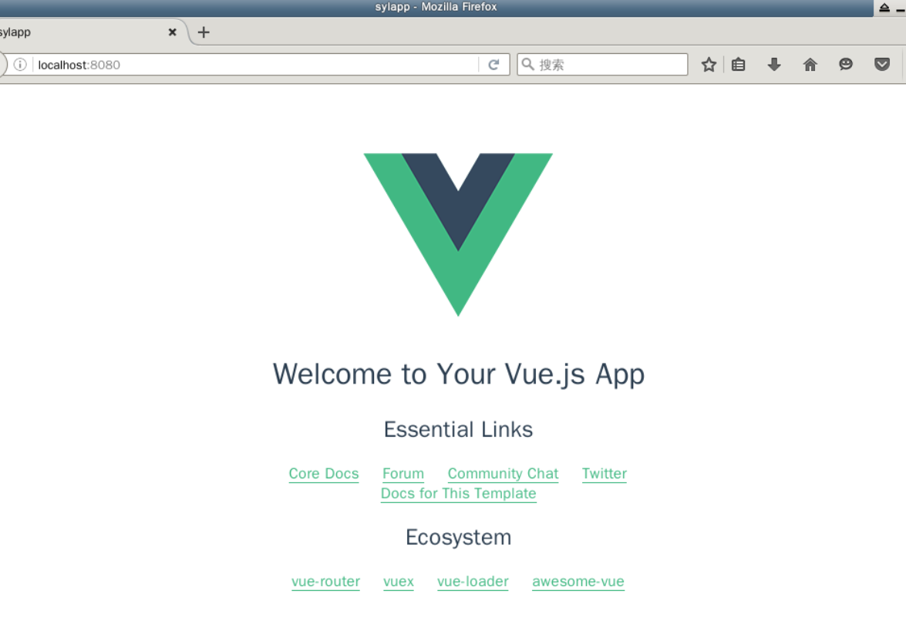


构建成功后，我们打开工具中的 Web 服务：

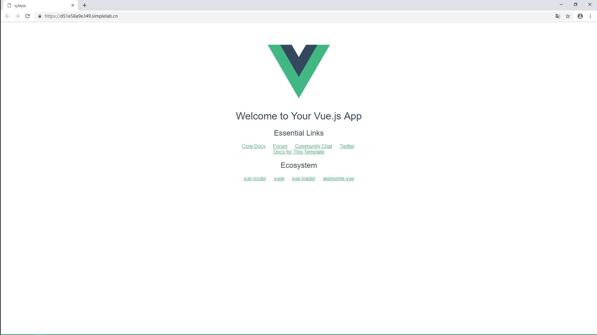

vue脚手架指的是vue-cli，它是一个专门为单页面应用快速搭建繁杂的脚手架，它可以轻松的创建新的应用程序而且可用于自动生成vue和webpack的项目模板。

vue-cli就是Vue的脚手架工具，和我们工地看到的脚手架真是那么一回事，它帮助我们搭建基本的开发环境，好比架子搭建好了，利用它可以搞定目录结构，本地调试，单元测试，热加载及代码部署等。

vue-cli是由Vue提供的一个官方cli，专门为单页面应用快速搭建繁杂的脚手架。它是用于自动生成vue.js+webpack的项目模板，是为现代前端工作流提供了 batteries-included 的构建设置。只需要几分钟的时间就可以运行起来并带有热重载，保存时 lint 校验，以及生产环境可用的构建版本.

### window安装

#### 安装nodejs并验证

安装nodejs,下一步下一步就可以,可以安装最新的15版本,win7的话可以安装14版本.使用以下dos命令提示符下执行：

```cmd
node -v     # v8.11.3，至少8以上,最新的是v15.11.0
```

#### 配置npm

Nodejs下的包管理器,Nodejs中包含了npm,无需单独安装.默认去官网下载资源,可以换成国内的镜像

```java
npm config get registry # 查看当前配置的镜像，结果是默认的国外网址https://registry.npmjs.org/

npm config set registry https://registry.npm.taobao.org #设置成淘宝镜像

npm config get registry #再获取查看,结果是修改后的https://registry.npm.taobao.org/ 

```

#### 参数说明

注意单词的大小写

```sql
-i 安装指令，全拼： install
-S 生产环境，全拼： --save
-D 开发环境，全拼： --save—dev
-O 可选依赖，全拼： --save—optional
-E 精确安装指定模块版本，全称：--save—exact
-g 全局安装，全拼： --global

```

#### 脚手架安装

vue-cli: 用户生成Vue工程模板（帮你快速构建一个vue的项目，也就是给你一套vue的结构，包含基础的依赖库）
vue-cli: 脚手架工具安装与配置（需要几分钟）

```java
npm install vue-cli -g #安装vue-cli脚手架---可能比较慢,要等几分钟

npm uninstall vue-cli -g #卸载vue-cli脚手架 --- 大可不必

vue –V #查看版本

where vue #vue安装在哪里

```

### windows创建Vue项目 npm

#### 工作空间

进入工作空间目录：D:\workspace\vue

#### 生成vue项目

基于vue.js的官方webpack模板：(乱码无需理会)
webpack: 它主要的用途是通过CommonJS的语法把所有浏览器端需要发布的静态资源做相应的准备，比如资源的合并和打包

```bash
vue init webpack jt01 #此处项目名不能使用大写---可能比较慢,要等

```

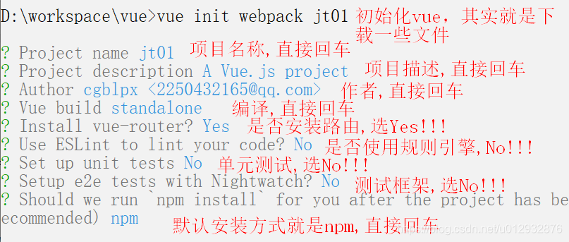

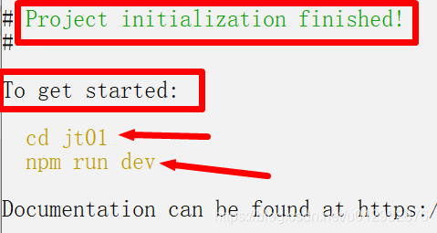

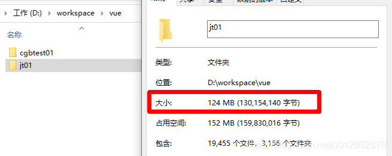


注：

- jt01 为自定义的 项目名称
- 产生项目webpack模板，目录100+m，可见内容多复杂，庞大
- 会自动生成node_modules临时目录，可以删除，每次编译、运行会自动产生

#### 启动项目 & 停止项目

```java
cd jt01 # 进入项目目录

npm run dev # 自动启动服务，ctrl+c 停止,可能要等几分钟

```

#### 测试访问

注意：端口号可能不同，默认为8080，如果发现端口占用npm很聪明，它会自动改变端口号，以其具体提示的端口信息为准。


### vue 开发者工具安装

在使用 Vue 时，我们推荐在你的浏览器上安装 [Vue Devtools](https://github.com/vuejs/vue-devtools#vue-devtools)。它允许你在一个更友好的界面中审查和调试 Vue 应用。

1、下载对应浏览器的 Vue Devtools

- [Get the Chrome Extension](https://chrome.google.com/webstore/detail/vuejs-devtools/nhdogjmejiglipccpnnnanhbledajbpd) / ([beta channel](https://chrome.google.com/webstore/detail/vuejs-devtools/ljjemllljcmogpfapbkkighbhhppjdbg))
- [Get the Firefox Addon](https://addons.mozilla.org/en-US/firefox/addon/vue-js-devtools/) / ([beta channel](https://github.com/vuejs/vue-devtools/releases))
- [Get standalone Electron app (works with any environment!)](https://github.com/vuejs/vue-devtools/blob/master/shells/electron/README.md)

2、打开浏览器，打开设置>开发工具>扩展程序，将下载好的 Vue Devtools 拖到界面中，即可完成安装(谷歌浏览器为例)。

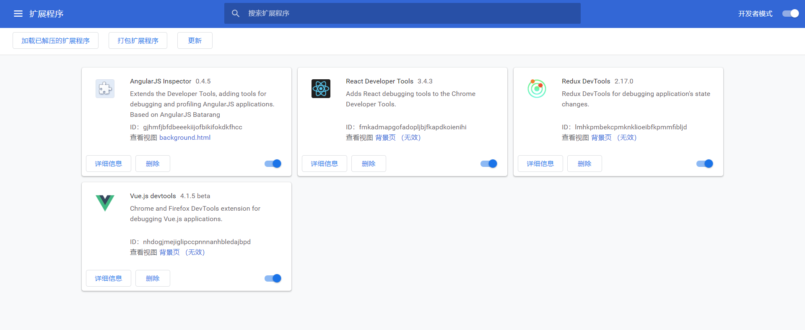

3、你就可以在浏览器中轻松调试你的 vue 应用

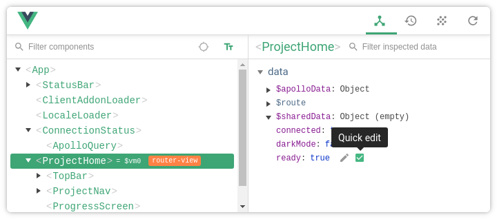

### 更多安装方式

其他安装方式请参考：[官网教程](https://cn.vuejs.org/v2/guide/installation.html)

浏览器基础的控制台难以满足 vue 的调试。

这里给大家介绍一款调试插件 [Vue-Devtools](https://github.com/vuejs/vue-devtools)。

可以通过如下命令下载：

```bash
git clone https://github.com/vuejs/vue-devtools.git
```

由于实验环境限制，我已经提前编译好：

```bash
# 编译后的版本
wget https://labfile.oss.aliyuncs.com/courses/3574/chrome-vue-devTools%20.zip
```

打开谷歌浏览器设置：

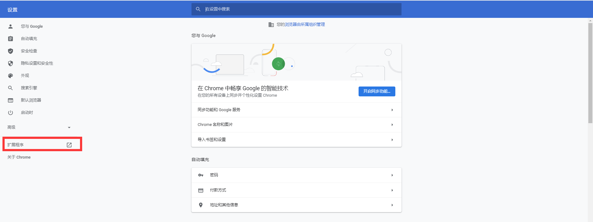

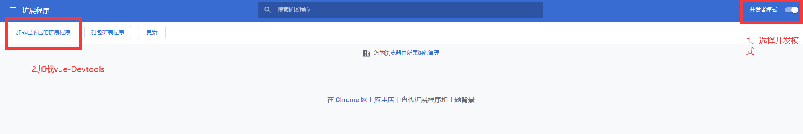

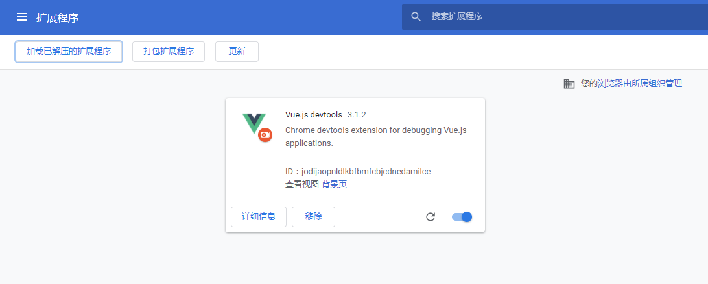

由于实验环境比较特殊，无法直接使用 vue-devtools 调试，所以请课下自己尝试：

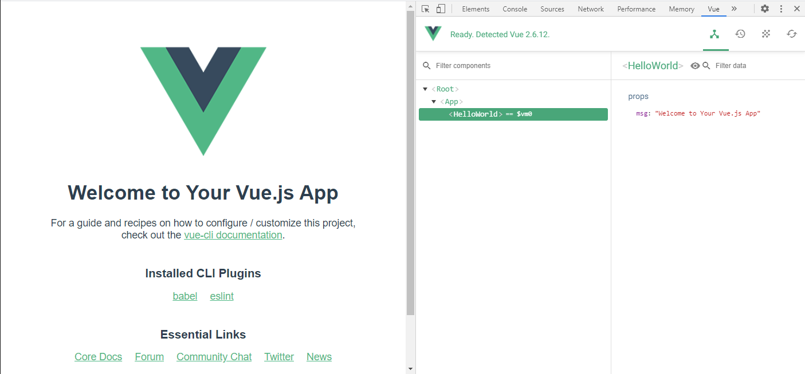

#### IDEA安装Vue插件

File->Settings->Plugins   

搜索Vue


## HBuilderX管理Vue项目

### 打开Vue项目

HBuilderX是最新前端开发利器之一，全面支持Vue的开发，具有丰富的提示，使用它打开：D:\workspace\vue\jt01目录（可自行定义自己的目录）


### 项目结构


### 目录结构

这个目录结构非常重要，大家要熟记。就如你要生孩子去妇幼保健院，你要游泳去游泳馆。规定好每个目录的作用，方式和位置就约定统一了。有了这套规则，文件就不会乱放，这样找资源时就知道到哪里找，写代码文件时就按功能放到指定的目录中。这种方式已经非常常见，如Maven构建项目目录有强制的约定，如Spring框架中约定大于配置。

- view 就是用户要访问的页面都存放在这个目录下，如Index.vue
- static中保存一些静态的资源，如jquery、css、图片等
- src 目录是一个很大的目录，包罗万象
- components 把项目中所需要的组件都放在此目录下，默认会创建一个HelloWorld.vue，我们可以自己添加，如添加Header.vue
- router 访问的路径，Vue提倡的是SPA（Single Page WebApplication）单页面设计，这是以前旧页面中如果包含其他资源，必然涉及到路径问题。Html没有很好的解决这个问题，而router它是一种解决路径的新发明，很好的解决了多模块页面刷新问题。简而言之就是给组件指明一个路径，我们怎么去访问它。不同组件是依靠配置的路径router来访问的。Router非常强大，老系统是url改变是在服务端进行刷新，而router支持在客户端刷新，就是url变化，页面内容变化，但不请求服务器端，以前的程序是做不到的。此处不好理解，后期专门章节论述，不必心急，先记录下这个特点


  

### 重要文件说明

Vue项目这么多文件，它们什么关系？写代码该从哪里下手呢？
常见操作: 1, 在components里写自定义组件 2, 在App.vue里注册自定义组件 3, 在main.js里引入第三方js

 index.html 首页，Vue是SPA单页面开发，页面入口，定义了一个div,并设置id=app
 src/main.js 公共的组件就直接配置到这个文件中，私有的就配置到view中


 src/App.vue 根组件,可以添加自定义组件

 src/router/index.js 引入子组件HellWorld.vue


### 调用关系图


简单来说项目加载的过程是：

```java
index.html->main.js->App.vue->index.js->HelloWorld.vue
```

可以看到Vue项目是自有一套规则，一套机制的，非常系统化的。有固定的文件，有自定义的文件，各自放在指定的目录下，指定的文件中，指定的地方，最终来实现用户的需求。那在开发之前，你就必须了解这套机制，写代码的时候就规则清晰，如有神助，知道该如果写代码，知道为什么这么写，代码文件该放在哪，它们是谁调用谁，互相怎么调用的了。

**为什么要花这么大篇幅讲这几个文件呢？**

很多同学写代码时，听老师讲没问题，可自己做就乱了方寸，脑袋空白甚至都是浆糊，不知道代码该写在哪里？不知道出错了该如何下手，这是为何呢？老师都教了啊？就是自己没有去把所学的知识系统的、有效的组织起来，内容还只是一个一个点，无法把这些点很好的连接起来形成线，先在形成面，面在形成体。点线面体真正组织起来，才会逐渐清晰代码的整体过程。

那如何做到呢？

思考，但复杂的事务不是马上脑袋就能跟上的，得晕好久呢。那怎么办，真正的绝招，多敲多练，反复练习中慢慢总结出其真正的规律。就像我们打游戏，游戏高手，不是天生，是反复练习，反复失败，失败就是成功之母，这句话是真的。


## 安装 element-ui

访问官网: https://element.eleme.cn/#/zh-CN/component/installation,查看组件指南

### 安装

在工程目录下,使用 npm 的方式安装，它能更好地和 webpack 打包工具配合使用。

```sql
npm i element-ui –D  # 下载资料,这可能要等几分钟
```

安装完成其文件保存在项目下的node_modules目录下：


### 修改 main.js,引入Element

你可以引入整个 Element，或是根据需要仅引入部分组件。我们先介绍如何引入完整的 Element。
你可以参考官网的【快速上手】

```html
// The Vue build version to load with the `import` command
// (runtime-only or standalone) has been set in webpack.base.conf with an alias.
import Vue from 'vue'
import App from './App'
import router from './router'
Vue.config.productionTip = false

import ElementUI from 'element-ui'; //导入element
import 'element-ui/lib/theme-chalk/index.css';//导入element的css
//以上代码便完成了 Element 的引入。需要注意的是，样式文件需要单独引入。
Vue.use(ElementUI);//使用element


/* eslint-disable no-new */
new Vue({
  el: '#app',
  router,
  components: { App },
  template: '<App/>'
})

```

### 修改 Car.vue

至此，一个基于 Vue 和 Element 的开发环境已经搭建完毕，现在就可以使用Element代码了。

```html
<template>
  <!-- 获取值 -->
  <div>
   <i class="el-icon-edit"></i>
   <i class="el-icon-share"></i>
   <i class="el-icon-delete"></i>
   <el-button type="primary" icon="el-icon-search">搜索</el-button>
    {{msg}}
  </div>
<!--  <h1>{{msg}}</h1> 报错,只能有一个根标签 -->


</template>

<script>
  // 定义导出的组件
  export default{
    name:'Item',
    data(){
      return{
        msg:'京淘电商管理系统'
      }
    }
  }
</script>

<style>
</style>

```

### idea中安装elementUI代码提示插件

- 先从得到element.jar 文件,保存到磁盘中的某个位置(容易找到的位置)

- File->Settings->Plugins---->齿轮--->install Plugin from Disk... 找到element.jar文件 最后重启idea即可 


### 基础知识

#### 布局 layout

栅格体系：把页面分成24分栏，可以形成PC端、移动端自适应。

```html
<template>
  <div>
<!-- 2.使用ele的栅格,默认24列,可以自适应屏幕的宽度 -->
<!-- el-row表示行,el-col表示列 ,:span合并列数-->
  <el-row> 
    <el-col :span="24">123</el-col>
  </el-row>
  <el-row>
    <el-col :span="12">abc</el-col>
    <el-col :span="12">123</el-col>
  </el-row>

  </div>
</template>

<script>
  // 定义导出的组件
  export default{
    name:'Item',
    data(){
      return{
        msg:'京淘电商管理系统'
      }
    }
  }
</script>

<style>
</style>

```

#### 图标 icon

https://element.eleme.cn/#/zh-CN/component/icon


```html
<template>
  <!-- 获取值 -->
  <div>
    <!-- 1.使用ele的各种图标-->
     <i class="el-icon-edit"></i>
     <i class="el-icon-share"></i>
     <i class="el-icon-delete"></i>
     <i class="el-icon-eleme"></i>
  
  </div>
</template>

<script>
  // 定义导出的组件
  export default{
    name:'Item',
    data(){
      return{
        msg:'京淘电商管理系统'
      }
    }
  }
</script>

<style>
</style>

```

#### 按钮 button

https://element.eleme.cn/#/zh-CN/component/button


```html
<template>
  <!-- 获取值 -->
  <div>
    <!-- 1.使用ele的各种按钮-->
     <el-button type="primary" icon="el-icon-search">搜索</el-button>
<el-button>默认按钮</el-button>
      <el-button type="primary">主要按钮</el-button>
      <el-button type="success">成功按钮</el-button>
      <el-button type="info">信息按钮</el-button>
      <el-button type="warning">警告按钮</el-button>
      <el-button type="danger">危险按钮</el-button>
  
  </div>
</template>

<script>
  // 定义导出的组件
  export default{
    name:'Item',
    data(){
      return{
        msg:'京淘电商管理系统'
      }
    }
  }
</script>

<style>
</style>

```

#### 输入框 input

```html
  <el-input placeholder="用户名" v-model="msg"></el-input>
  <el-input placeholder="密码" v-model="msg" show-password></el-input>


<script>
export default {
  data() {
    return {
      input: ''
    }
  }
}
</script>

```

#### 表格 table


```html
<template>
  <!-- 获取值 -->
  <div>
    
    <!-- 3.使用ele的表格,a创建表格,b准备数据,c绑定数据 -->
    <el-row >
      <el-button type="info" @click="toadd">新增</el-button>
    </el-row>
  	<el-table :data="list">
       <el-table-column label="编号" prop="id"></el-table-column>
       <el-table-column label="标题" prop="title"></el-table-column>
       <el-table-column label="卖点" prop="sell"></el-table-column>
       <el-table-column label="描述" prop="desc"></el-table-column>
       <el-table-column label="更多">
          <el-button type="primary" @click="toupdate()">编辑</el-button>
          <el-button type="success" @click="del()">删除</el-button>
       </el-table-column>
     </el-table>
  </div>
</template>

<script>
  // 定义导出的组件
  export default{
    name:'Item',
    data(){
      return{
        msg:'京淘电商管理系统',
        // b. 准备表格要的数据
         list:[
          {
            id:100,
            title:'鸿星尔克',
            sell:'为中国代言',
            desc:'to be no.1'
          },
          {
            id:101,
            title:'蜜雪冰城',
            sell:'一瓶只赚1毛钱',
            desc:'你爱我我爱你蜜雪冰城甜蜜蜜'
          },
          {
            id:102,
            title:'特步',
            sell:'有一种踩.的感觉',
            desc:'飞一样的感觉'
          }
        ]
      }
    },
   // 1,声明按钮  2,添加事件methods 3,给按钮绑定事件@click
    methods:{
        toadd:function(){
          console.log("新增业务成功")
        },
        toupdate:function(){
          console.log("修改业务成功")
        },
        del:function(){
          console.log("删除成功")
        }
      }
  }
</script>

<style>
</style>

```

#### 表单form


```html
<template>
  <!-- 获取值 -->
  <div>
	<!-- 制作表单 el-form表示表单,el-form-item表示表单项
1,数据区提供数据 2,给form指定双向绑定:model="form" 3,input双向绑定获取数据v-model="form.price"
  -->
    <el-form label-width="100px" :model="form">
    <el-form-item label="标题">
      <el-input placeholder="请输入标题" v-model="form.title"></el-input>
    </el-form-item>
    <el-form-item label="卖点">
      <el-input v-model="form.sell"></el-input>
    </el-form-item>
    <el-form-item label="价格">
      <el-input v-model="form.price"></el-input>
    </el-form-item>
    <el-form-item label="详情">
      <el-input type="textarea" v-model="form.desc"></el-input>
    </el-form-item>
    <el-form-item>
      <el-button @click="save()" type="success">保存</el-button>
    </el-form-item>
  </el-form>

    </div>
</template>

<script>
  // 定义导出的组件
  export default{
    name:'Item',
    data(){
      return{
        msg:'京淘电商管理系统',
        //给表单准备数据,数据驱动,双向绑定
        msg:'hi components',
        form:{
          title:"test",
          sell:'爆款热销',
          price:999,
          desc:"我是详情..."
        },
      }
    },
   // 1,声明按钮  2,添加事件methods 3,给按钮绑定事件@click
    methods:{
      save:function(){ //表单提交
        // console.log("submit")
        console.log(this.m) //调用上面的变量m
      }
      }
  }
</script>

<style>
</style>

```

## 常见错误

### Permission denied

权限不足，windows以管理员身份运行，mac命令前加sudo


### Unexpected end of JSON input while parsing near


清除缓存，重新安装

```html
npm cache clean --force

npm install

```

### unable to verify the first certificate


解决方法: 取消ssl验证：npm config set strict-ssl false,再次安装

### vue-cli · Failed to download repo vuejs-templates/webpack: unable to verify the first certificate


打开（如果不是默认的文件夹， 是自定义的文件夹路径的话就是在自定义文件夹的目录下）

```html
C:\Users\Administrator\AppData\Roaming\npm\node_modules\vue-cli\node_modules\download\index.js 
将下面这行注释：rejectUnauthorized: process.env.npm_config_strict_ssl !== 'false'
然后改为：  rejectUnauthorized : false    
重新运行：  vue init webpack project-name  就可以了

```


## 项目案例：商品后台管理系统

### 界面原型


## vue脚手架UI

### 检查nodejs

```bash
node -v
```

### 检查nodejs

```bash
npm config set registry https://registry.npm.taobao.org #设置成淘宝镜像

```

### 安装检查脚手架

```bash
npm install vue-cli -g #安装vue-cli脚手架---可能比较慢,要等几分钟
或者
npm install -g @vue/cli --force #效果同上,上面的执行失败的话,可以试试这个,这两个二选一就行了
vue -V  #查看vue版本
where vue  #查看安装位置

```

### 启动vue ui

```bash
vue ui

```


### 导入vue项目

在idea项目的workspace里,解压前端项目资源,然后利用UI界面导入


### 启动vue项目


### 用HB打开项目

打开目录—选中项目…

## 使用

根据上面的安装教程，初学者不推荐采用 vue-cli 的方式，因为你可能对 npm 包管理工具不太了解，推荐大家使用 `<script>` 引入或者 cdn 引入的方法，后续教程也将采用 cdn 引入这种方式，那么我们开始创建第一个 Vue 应用。

### 创建第一个实例

每个 Vue 应用都是通过用 `Vue` 函数创建一个新的 **Vue 实例** 开始的：

```js
var app = new Vue({
  // 选项
});
```


Vue.js 的核心是一个允许采用简洁的模板语法来声明式地将数据渲染进 DOM 的系统，我们新建一个.html 后缀的文件，输入以下代码，运行（右击文件 > open with > Preview 或 Mini Browser），你就会看到 {{msg}} 被渲染成 hello

```html
<!DOCTYPE html>
<html lang="en">
  <head>
    <meta charset="UTF-8" />
    <meta name="viewport" content="width=device-width, initial-scale=1.0" />
    <meta http-equiv="X-UA-Compatible" content="ie=edge" />
    <title>syl-vue-test</title>
    <!-- 通过cdn方式引入 vue.js -->
    <script src="https://labfile.oss.aliyuncs.com/courses/1262/vue.min.js"></script>
  </head>
  <body>
    <div id="app">{{msg}}</div>
    <script>
      var app = new Vue({
        el: "#app", //dom挂载点
        data: {
          //数据项
          msg: "hello syl",
        },
      });
    </script>
  </body>
</html>
```

运行效果：


**说明：** el 为实例挂载点，上面表示挂载在 id 为 app 的 dom 元素中。data 选项为数据选项，存放绑定数据。除了这两个之外还有实例选项，methods（实例方法）、computed（计算属性） 等，后面我们会学习到。

```html
<!DOCTYPE html>
<html lang="en">
<head>
    <meta charset="UTF-8">
    <title>Title</title>
</head>
<body>
<div id="app">
    <h1>{{info}}</h1>

</div>
<!--引入Vue框架文件-->
<!--<script src="https://cdn.jsdelivr.net/npm/vue@2/dist/vue.js"></script>-->
<!--引入本地Vue.js文件-->
<script src="vue.js"></script>
<script>
    let v = new Vue({
        el:"#app",/*告诉Vue对象管理哪个元素*/
        data:{
            info:"Hello Vue"
        }
    })
</script>
</body>
</html>
```


### 理解 Vue 的 MVVM 模式

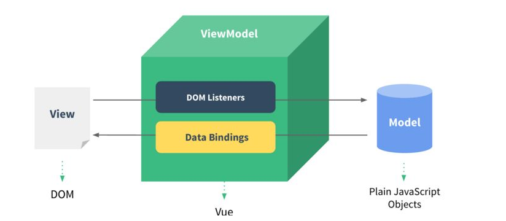

M：`Model` 即数据逻辑处理

V：`View` 即视图（用户界面）

VM：`ViewModel` 即数据视图，用于监听更新，View 与 Model 数据的双向绑定---将页面中可能发生**改变的元素和某个变量在内存中进行绑定**,当变量的值发生改变时会从内存中直接找到对应的元素让其改变.

所以，Vue 一大特点就是数据双向绑定，另一大特点就是响应式，接下来，我们来看看他的魅力。

Vue对象相当于MVVM设计模式中的VM, 负责将页面中可能发生改变的元素和变量进行绑定, 绑定完之后会不断监听变量的改变, 当变量的值发生改变时会自动找到对应的元素并改变其显示内容.

上面看似结构非常简单，其实却深藏奥秘。和传统框架不同，Vue采用了最新的MVVM框架，它最大的特点就是：传统js机制操作的是页面，如我们之前写的html+css+js案例，大家会发现页面和页面里的数据混杂在一起。

而MVVM框架体系引入后端早已深入人心的分层思想，是后端MVC框架的延伸，实现把数据和页面分离。我们可以在页面布局好后，只对数据进行操作，当数据改变，页面上的内容会自动随之改变，而无需开发者开发专门的代码去改变，如之前ajax技术实现的局部刷新。

简而言之，MVVM框架实现了页面和数据的分离，代码结构更加清晰，责任更加明确，同时实现自动化，数据变化，页面随之变化，无需写代码，非常棒的一个改进。这是javascript、jquery、bootstrap等无法做到的，也是前端为何开始推崇Vue这些框架的根本原因，也标示着jquery的终结。

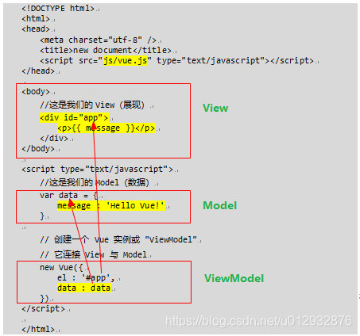

相对**MVC模式**:前端MVC设计模式弊端: 需要在Controller控制器部分频繁进行DOM(遍历查找元素的代码)操作, 会影响执行效率.

```html
<!DOCTYPE html>
<html lang="en">
<head>
    <meta charset="UTF-8">
    <title>Title</title>
</head>
<body>
<table border="1">
    <caption>个人信息</caption>
    <tr>
        <td>照片:</td>
        <td></td>
    </tr>
    <tr>
        <td>名字:</td><td id="name_td">xxx</td>
    </tr>
    <tr>
        <td>年龄:</td><td id="age_td">xxx</td>
    </tr>
    <tr>
        <td>好友:</td>
        <td>
            <ul id="friend_ul">

            </ul>
        </td>
    </tr>
</table>
<input type="button" value="请求数据" onclick="f()">
<script>
    function f() {
        //模拟一份从服务器请求回来的数据
        let p = {name:"美女",age:50,url:"../b.jpg",
            friends:["刘备","关羽","张飞"]};

        let head_img = document.getElementById("head_img");
        let name_td = document.getElementById("name_td");
        let age_td = document.getElementById("age_td");
        let friend_ul = document.getElementById("friend_ul");
        //把对象中的数据展示到页面中
        head_img.src = p.url;
        name_td.innerText = p.name;
        age_td.innerText = p.age;
        for (let name of p.friends) {
            //创建li
            let li = document.createElement("li");
            li.innerText = name;
            friend_ul.append(li);
        }
    }
</script>
</body>
</html>
```


### 数据双向绑定

在 Vue 中数据双向绑定随处可见，最常见的是表单数据中的双向绑定，例如：

```html
<!DOCTYPE html>
<html lang="en">
  <head>
    <meta charset="UTF-8" />
    <meta name="viewport" content="width=device-width, initial-scale=1.0" />
    <meta http-equiv="X-UA-Compatible" content="ie=edge" />
    <title>syl-vue</title>
    <!-- 通过cdn方式引入 vue.js -->
    <script src="https://labfile.oss.aliyuncs.com/courses/1262/vue.min.js"></script>
  </head>
  <body>
    <!-- 数据双向绑定 :value变成v-mode-->
    <div id="app">
      <input type="text" v-model="msg" />
      <p>{{msg}}</p>
    </div>
    <script>
      var app = new Vue({
        el: "#app", //el: 挂载点

        data: {
          //data:数据选项

          msg: "hello",
        },
      });
    </script>
  </body>
</html>
```

在我们对文本框输入值时，实例 data 中的 msg 值也随之变化。运行效果：

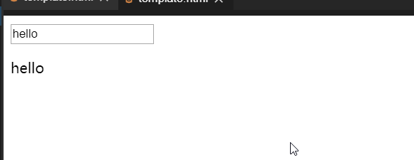

### 感受响应式

上面我们了解到 Vue 是一个 MVVM 架构的框架，成功创建了一个 Vue 应用！看起来这跟渲染一个字符串模板非常类似，但是 Vue 在背后做了大量工作。现在数据和 DOM 已经被建立了关联，所有东西都是 **响应式的**。我们可以看看他是不是响应式的，打开你的浏览器的 JavaScript 控制台 (就在这个页面打开)，并修改 `app.msg` 的值，你将看到上例相应地更新，更改数据也触发视图的相应更新。

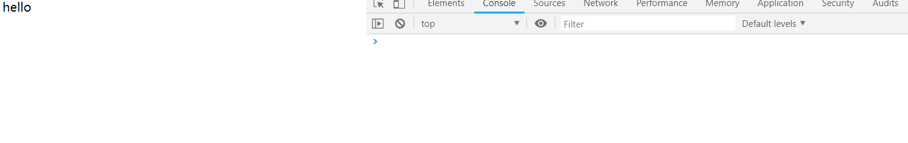