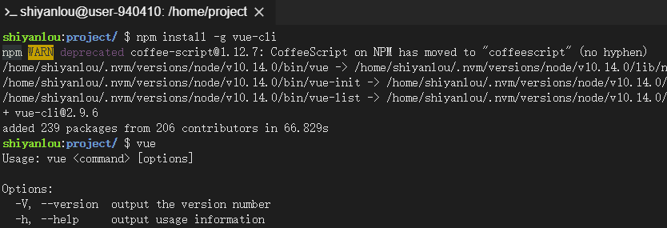
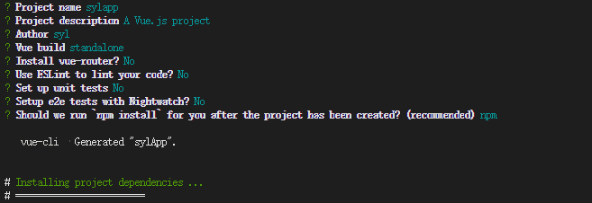
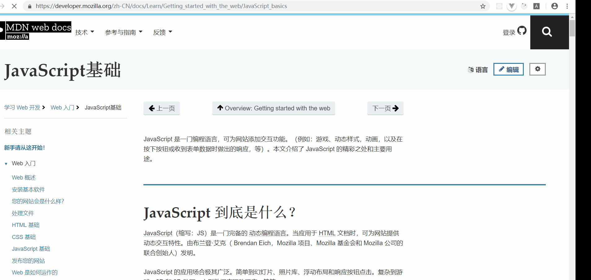
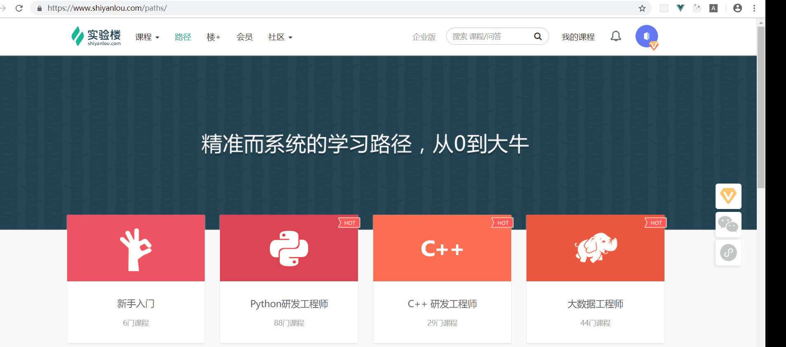

# Vue进阶引导
[[TOC]]

## 工程化与组件化开发引导

Vue 的应用场景很多，很大部分用它来开发 SPA (single page web application)，构建单页应用，与 React 和 Angular 一样都有自己的脚手架开发工具，Vue-cli 是 Vue 官方脚手架工具，使用 webpack 进行模块打包，实现工程化与组件化开发。如果你对前端模块化没有一点了解，可以去先学习一下 ES6 模块规范，在项目中会大量用到模块的引入或导出，如下图。

```js
import Vue from "vue";
import App from "./App";
import router from "./router";

new Vue({
  el: "#app",
  router,
  components: { App },
  template: "<App/>",
});
```

vue 脚手架官网与 webpack 官网：

- [vue-cli](https://cli.vuejs.org/zh/guide/cli-service.html)
- [webpack](https://www.webpackjs.com/)


1、`vue-cli`是基于`npm`的，所以应该先安装`node`环境，通过`node`官网（http://nodejs.cn/）下载系统对应的`node`安装程序。


**注意:** NPM 是随同 Node.js 一起安装的包管理工具。因此当我们安装好 Node.js 的时候，也安装好了 NPM。


2、`node`安装完毕使用，`npm`包管理工具全局安装`vue-cli`

```bash
npm install -g vue-cli
```


3、命令行输入`vue`，出现 Usage 表示安装成功。



4、使用指令生成一个 vue 应用

```bash
vue init webpack appName
```



5、得到一个 Vue 项目文件


 主要包括 Vue webpack 配置文件（config）、相关包文件(node_modules)、项目组件目录（src），想要了解项目文件目录的具体涵义的可以去 vue 脚手架官网了解。

 重点介绍一下 src 目录下的 App.vue 单文件组件，他就是 Vue 组件化开发的重点，他可以将任何页面内容独立出来成为组件。

```html
<template>
  <!--  组件中的 template html 表达式 -->
  <div class="header">
    <p>{{msg}}</p>
  </div>
</template>

<script>
  // JavaScript  组件选项
  export default {
    name: "Header",
    data() {
      return {
        msg: "hello syl",
      };
    },
    methods: {
      name() {},
    },
    computed: {
      name() {
        return this.data;
      },
    },
  };
</script>

<style>
  /* 组件css */
  .header {
    font-family: "Avenir", Helvetica, Arial, sans-serif;
    -webkit-font-smoothing: antialiased;
    -moz-osx-font-smoothing: grayscale;
    text-align: center;
    color: #2c3e50;
    margin-top: 60px;
  }
</style>
```

## 前端路由管理(vue-router）

 在这里简单说一说，前端路由与后台路由的区别。通常我们接触到是后台路由，例如：https://developer.mozilla.org/en-US/docs/Web/Web_Components，后台路由通常的业务是 api 逻辑处理和指定渲染页面。

 而在大前端时代，前后端分离趋势逐渐加强，促使服务器渲染向浏览器渲染转变，后台路由更多的专注于 API 逻辑处理，更少的处理页面渲染。由此，前端路由逐渐火热，使用前端路由来管理页面切换，地址栏的变动，处理变化 DOM，用于构建单页应用，使得用户体验提升，如图：

后台路由加服务器渲染：

**注意:** 观察两者在路由切换时的区别



前端路由加浏览器渲染：



明显的前端路由加浏览器渲染用户体验更高，后台路由加服务器渲染明显出现了较长的白屏时间和较多的页面刷新次数。

重要的是前端路由都是基于两种模式 hash 模式 和 H5 history 模式，存在兼容性问题，在 Vue 你不用担心，Vue 官方对前端路由基础模式进行了精封装，[Vue Router](https://router.vuejs.org/zh/) 是 [Vue.js](http://cn.vuejs.org/) 官方的路由管理器。它和 Vue.js 的核心深度集成，让构建 **单页面应用** 变得易如反掌。包含的功能有：

- 嵌套的路由/视图表
- 模块化的、基于组件的路由配置
- 路由参数、查询、通配符
- 基于 Vue.js 过渡系统的视图过渡效果
- 细粒度的导航控制
- 带有自动激活的 CSS class 的链接
- HTML5 历史模式或 hash 模式，在 IE9 中自动降级
- 自定义的滚动条行为

使用 Vue 开发 SPA ，Vue-Router 是必不可少的。

### 概述

说明: 用户发起一个请求,在互联网中经过多个站点的跳转.最终获取服务器端的数据. 把互联网中网络的链路称之为路由. (网络用语)
VUE中的路由: 根据用户的请求URL地址,展现特定的组件(页面)信息. (控制用户程序跳转过程)

### 使用步骤

```html
<!-- 1.引入JS 路由需要依赖vue 注意顺序-->
<script src="js/vue.js"></script>
<script src="js/vue-router.js"></script>
```

### 入门案例

```html
<!DOCTYPE html>
<html>
	<head>
		<meta charset="utf-8">
		<title>router</title>
		
		<script src="https://unpkg.com/vue/dist/vue.js"></script>
		<script src="vue-router.js"></script>
	</head>
	<body>
		<div id="app">
			<!-- 将被解析成a标签,还有href属性 -->
			<router-link to="/home">主页</router-link>
			<router-link to="/help">帮助页</router-link>
			<!-- 路由出口,匹配成功后,在这里展示 -->
			<router-view></router-view>
		</div>
		
		<script>
			//1,定义组件
			let home = {
				template:"<h3>这是主页</h3>"
			}
			let help = {
				template:"<h3>这是帮助页</h3>"
			}
			//2,创建路由的实例VueRouter,routes指定每个路由映射的一个组件
			let router=new VueRouter({
				routes:[
					{path:"/home",component:home},
					{path:"/help",component:help}
				]
			})
			//3,通过router注入路由,从而让整个应用都有路由功能
			new Vue({
				el:"#app",
				// router:router
				router
			})
		</script>
	</body>
</html>
```

## 前端数据状态管理(vuex)

我们学习了通过 props 属性实现了父子组件数据流管理，但在开发中，往往面临的不仅仅是这么单纯的数据管理，是全局的数据管理，将数据提升到应用的顶端，让所有组件都能进行在唯一数据源做数据管理。

Vue 借鉴了 redux 和 flux 两种常用的数据流解决方案，开发了一个与 Vue 高度融合的数据流管理插件 Vuex。

[Vuex](https://vuex.vuejs.org/zh/) 是一个专为 Vue.js 应用程序开发的**状态管理模式**。它采用集中式存储管理应用的所有组件的状态，并以相应的规则保证状态以一种可预测的方式发生变化。

## 服务端渲染(Nuxt.js)

使用 Vue 开发的多半是前后端分离的项目，将服务器渲染向浏览器渲染转移，浏览器渲染优点就是缓解服务器压力，促进前后端分离开发模式，万物有利有弊，它的缺点就是不利于搜索引擎优化，由于它的数据需要 ajax 进行数据交互，搜索引擎并没有太好的 js 或者 异步请求解析能力，导致网站排名等受到影响。

但是，在 Vue 中你不用担心，因为他支持服务器渲染，需要借助 Nuxt.js。

[Nuxt.js](https://zh.nuxtjs.org/guide) 是一个基于 Vue.js 的通用应用框架。Nuxt.js 预设了利用 Vue.js 开发**服务端渲染**的应用所需要的各种配置。

## 观察者设计模式

观察者模式定义了一种一对多的依赖关系，让多个观察者对象同时监听某一个目标对象，当这个目标对象的状态发生变化时，会通知所有观察者对象，使它们能够自动更新。


- 页面data中的address就是数据，get为获取当前数据，set为设置数据新值
- 观察者watcher就为那多个插值表达式和input文本框，在页面加载时这些关系进行绑定
- 当我们让数据变化时，如input文本框修改内容，其就调用数据的set的方法，把数据进行更新，其更新就被vue框架通知notify众多的观察者。如众多的插值表达式就会触发trigger，进行再次渲染re-render，修改虚拟dom树。最终vue框架局部宣传页面
- 同样，当我们利用谷歌浏览器改变数据v.address赋值时，就调用数据的setter方法进行数据更新，数据更新后，通知众多的观察者，观察者更新如上面的流程

可以看出Vue设计非常巧妙，我们页面展现的数据，必然会涉及到数据的读写，于是Vue实现了一整套机制，这套机制监控数据的获取（get），数据的更新（set），这样当数据变化，Vue就能知道。它知道有什么用呢？它就能控制当数据变化时就能重新进行页面的渲染，从而用户看到页面展现新的内容。