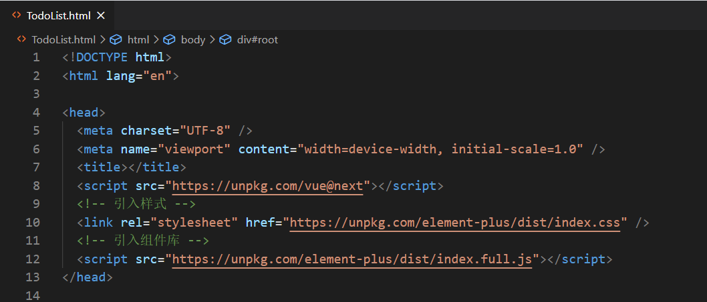
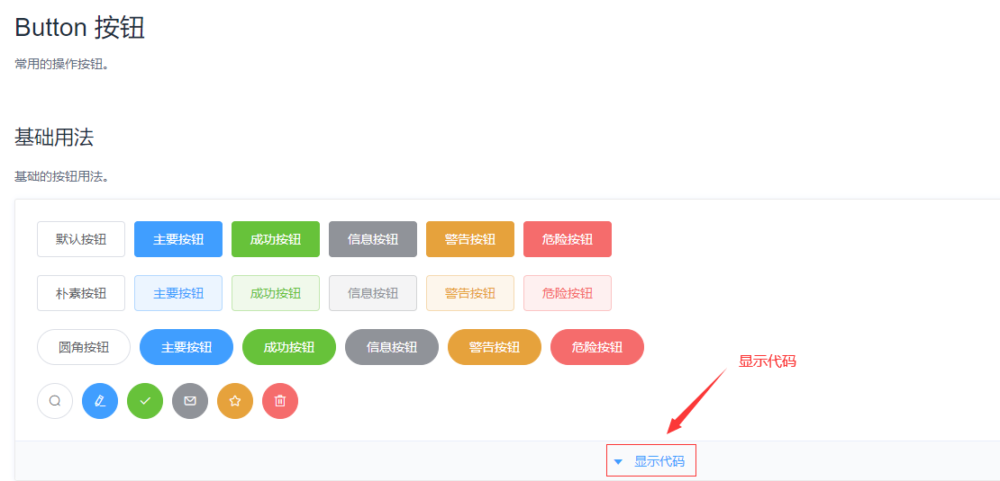
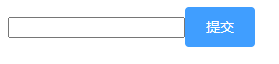
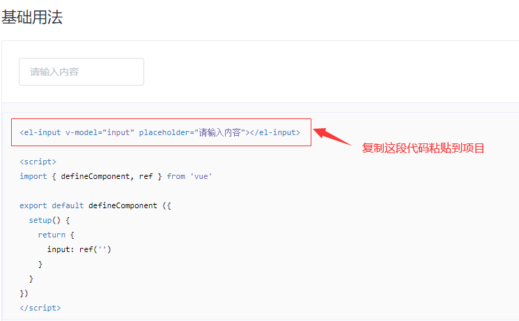
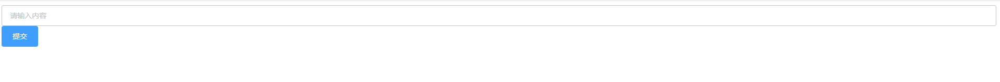
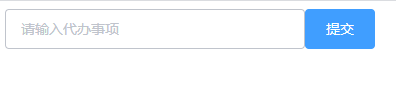

# Element
[[TOC]]

### Element UI--Vue2

官网地址: [https://element.eleme.cn](https://element.eleme.cn/)

###  如何引入 Element Plus--Vue3

#### 引入 css、js 文件

目前可以通过 [unpkg.com/element-plus](https://unpkg.com/element-plus/) 获取到最新版本的资源，在页面 head 中引入 js 和 css 文件即可开始使用。

```html
<!-- 引入样式 -->
<link rel="stylesheet" href="https://unpkg.com/element-plus/dist/index.css" />
<!-- 引入组件库 -->
<script src="https://unpkg.com/element-plus/dist/index.full.js"></script>
```

修改 `TodoList.html` 在 head 中加入上面两行代码引入 Element Plus,如下图：



#### 在 `app.mount('#root')` 前加入 `app.use(ElementPlus)`

```javascript
app.use(ElementPlus);
const vm = app.mount("#root");
```

###  使用 Element Plus 的按钮重构 TodoList

首先，点击右侧链接进入 [Element Plus 官网](https://element-plus.gitee.io/#/zh-CN/component/button)。

然后，点击下图中'显示代码'按钮来显示代码。



把展开的代码粘贴到项目中即可，可以使用 size 属性来调整按钮大小，size 取值可以是 medium / small / mini 其中之一，这里默认即可，代码如下:

```js
<el-button type="primary"  @click="handleSubmit">提交</el-button>
```

效果如下



###  使用 Element Plus 的 input 框重构 TodoList

点击链接 [Element Plus 官网 Input](https://element-plus.gitee.io/#/zh-CN/component/input) 进入 Input 使用界面。

点击“显示代码”，然后复制出 input 框的代码即可，如下图：



使用下面代码替换原有的 input。

```js
<el-input :modelValue="inputValue" placeholder="请输入内容" @input="handleInputChange"></el-input>
```

效果如下：



input 框会独占一行，这时还要给 input 加一个 style 样式，设置 `width` 为 300px，代码如下：

```js
<el-input style="width:300px" :value="inputValue" placeholder="请输入待办事项" @input="handleInputChange"></el-input>
```

修改后重新访问该页面，效果如下：


